# Nomi — UI audit

**Date:** 2026-10-02.
**Code audited:** `origin/main` at `4fa90d3` (after #196), run locally. The workspace is the demo "义乌宏发日用品厂 (demo)" with the usability seed (71 conversations, one waiting draft) and its outreach area switched on.
**Scope:** this report lists problems only. It proposes no fixes and changed no code.

**Coverage:**
- 62 pages, captured in five languages (en, zh, ar, es, fr) at two widths (phone 390×844, desktop 1280×900): 620 full-page screenshots, each checked automatically.
- Eight reviewers went through the screenshots, one per area. I walked the interactive and error states by hand in Chrome.
- The price-list files were downloaded and read.
- §11 lists what was not reached.

**Severity:**
- **S1 Critical** — blocks the owner or misleads them. Wrong or contradictory facts, hidden content, a control that does something other than its label.
- **S2 Major** — visible within ten seconds and makes the product look unfinished or untrustworthy.
- **S3 Minor** — inconsistency, or a secondary clarity issue.
- **S4 Nit** — polish.

**Counts:** 566 findings: **12 S1 · 117 S2 · 315 S3 · 122 S4**. Problems that appear only because the local instance lacks production settings (mail, payments, phone alerts, Google/Microsoft/Meta apps, a model, the legal address) are listed separately in §10 and not counted.

**How to find something:** each page section opens with what the page asks the owner to do and whether that is clear. Every finding quotes the visible text and names the locale(s) and width(s). "all locales" means en, zh, ar and es. French is reported once, in §1.

---

## Read this first — the worst problems

1. **French does not exist.** Every page, the site and the policies render in English for a French owner or visitor (§1).
2. **The calendar is unusable on a phone.** The week grid is wider than the screen, so today (Fri 2) and the rest of the week sit off the edge with no sign that it scrolls. Every card is cut to "Pedro S…", "✦ Price …". In Arabic, Latin names are cut at their start: "… Santos", "…ansoor" (§4, shots 1–2).
3. **The "Mine" tab says the business has no conversations at all.** It reads "No conversations yet… Share your WhatsApp number…" in a workspace with 71, and sends the owner to set-up (§4, shot 3).
4. **The draft reply card hides the customer's message.** The card is sticky. Open "How Lily read this" and it rises over the transcript in every language. In Arabic it already cuts through the last caption. On a phone, the reply box cuts off the draft's last line just above "Send" (§5, shots 4–5).
5. **Practice credits the owner's own reply to the assistant.** It also opens with 41 developer test-case titles; the box to type in is 3,300–4,500 px down (§5, shot 6).
6. **"Your price limits" contradicts itself.** Every product says "Up to 5% off is decided without you… Never more than 8% off". Further down: "no discount is ever offered" (§6, shot 7).
7. **"Your assistant" contradicts itself on what goes out alone.** "every reply keeps coming to you first" sits beside "Handled without you: ✓ Greeting" and "Already handling customers". None of the three levels is selected, and nothing shows they are locked (§7, shot 8).
8. **Connecting WhatsApp is a dead end.** The page says "Tell us the WhatsApp number…" and "Press Test…" but has no field, no button and no Test control (§7, shot 9).
9. **The e-mail sending form asks for the wrong things.** "The name on your signature" is really a domain-key selector. "The address you send from" wants a domain (§7, shot 10).
10. **Today misreports the month.** "Fewer customers wrote to you this month: 84 last month, 36 this month" sets two days of October against all of September, and counts messages, not customers. "Nothing in the last 24 hours yet" sits under a reply drafted 40 minutes earlier (§3, shot 11).
11. **Getting ready asks the owner to do the operator's chores.** It wants "Backup tested", "Secrets rotated" and "During the pilot". Setup lists a developer component gallery ("How it looks": Rest / Hover / Focus / Disabled) as if it were a setting (§3, §8, shots 12 and 14).
12. **Forbidden words prints 43 obscenities in full, one per row,** in larger type than the page's own explanation. Its "滚" and "liar" also stop replies that merely *contain* them ("滚筒", "familiar") (§8, shot 13).

---

## Worst offenders — screenshots

| # | Shot | What it shows | Sev |
|---|---|---|---|
| 1 | 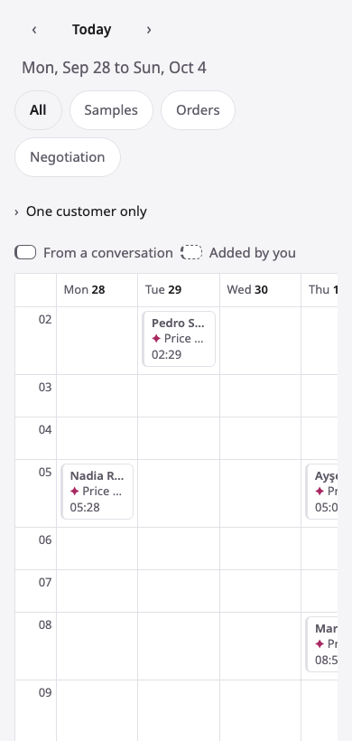 | Calendar, en, phone. Only Mon 28 to Wed 30 and a sliver of Thu 1 show; today (Fri 2) is off-screen with no scroll cue. Cards read "Pedro S…" and "✦ Price …". | S1 |
| 2 | 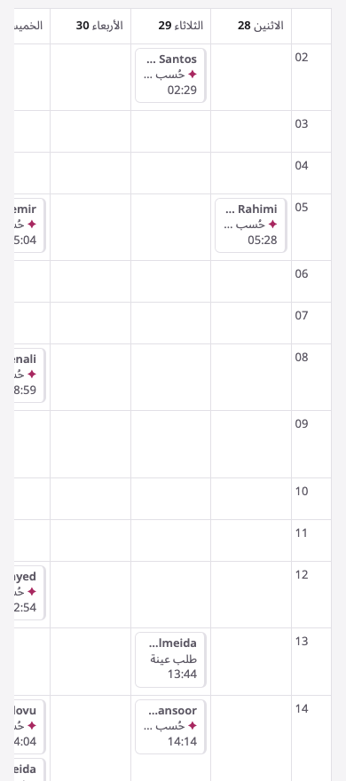 | Calendar, ar, phone. Latin names are cut at their start ("… Santos", "…ansoor"), card kinds are cut to "حُسب …", and the rest of the week is off the left edge. | S1 |
| 3 | 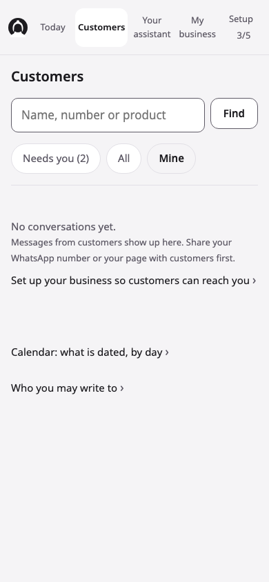 | Customers › Mine, en, phone. "No conversations yet… Share your WhatsApp number" in a workspace with 71 conversations and "Needs you (2)" beside it. | S1 |
| 4 | 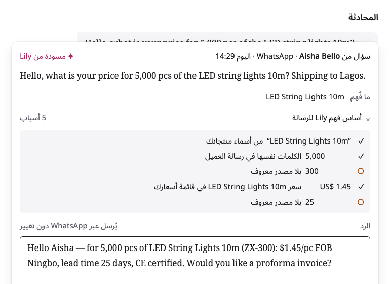 | Draft card, ar, desktop, with "How Lily read this" open. The sticky card covers the customer's message; only a sliver of it shows. | S1 |
| 5 | 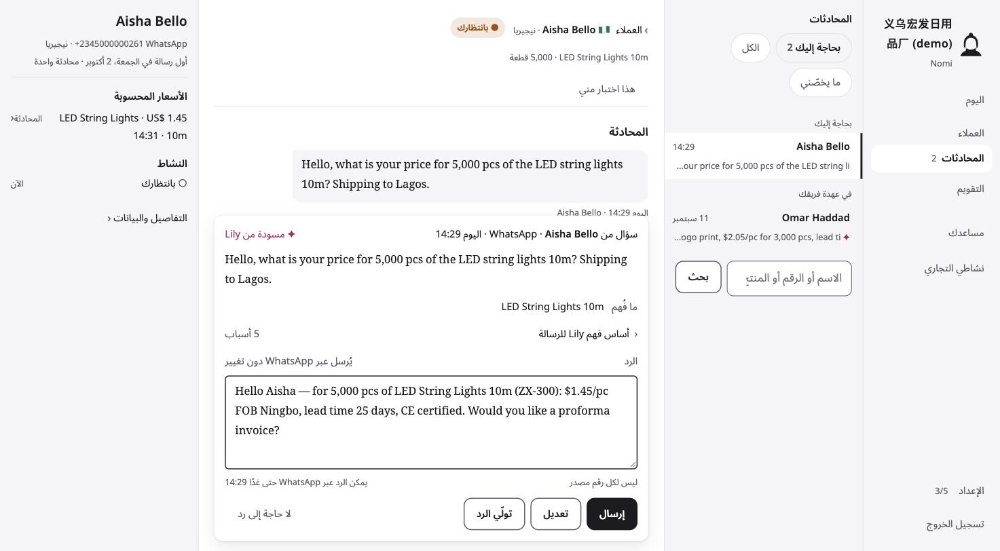 | Conversation, ar, desktop (Chrome). The right panel splits "LED String Lights · US$ 1.45" / "14:31 · 10m". The card cuts the caption "اليوم 14:29 · Aisha Bello". "Lily" appears before the name is chosen. Previews are cut at their start ("…our price for…"). | S2 |
| 6 | 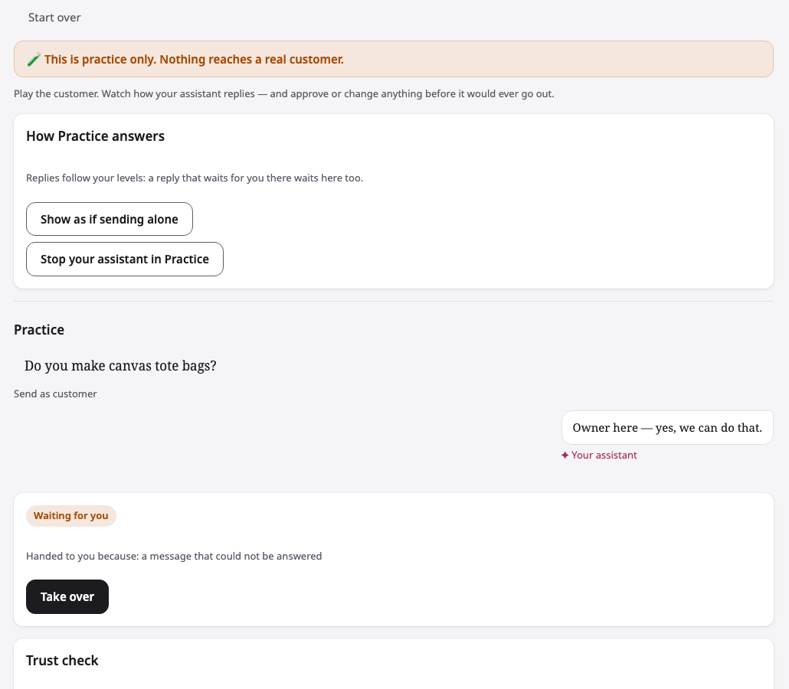 | Practice, en. "Owner here — yes, we can do that." is captioned "✦ Your assistant", and customer lines are captioned "Send as customer". | S1 |
| 7 | 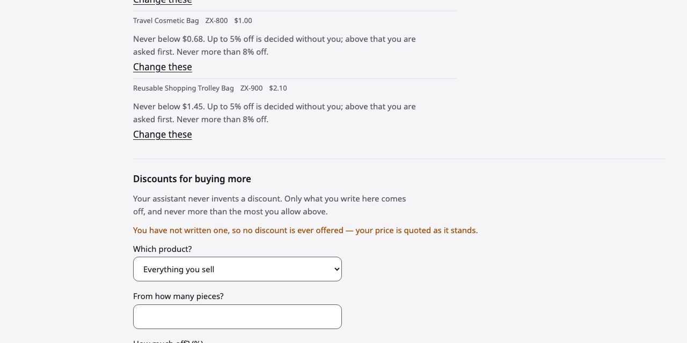 | Your price limits. "Up to 5% off is decided without you… Never more than 8% off." directly above "no discount is ever offered". | S1 |
| 8 | 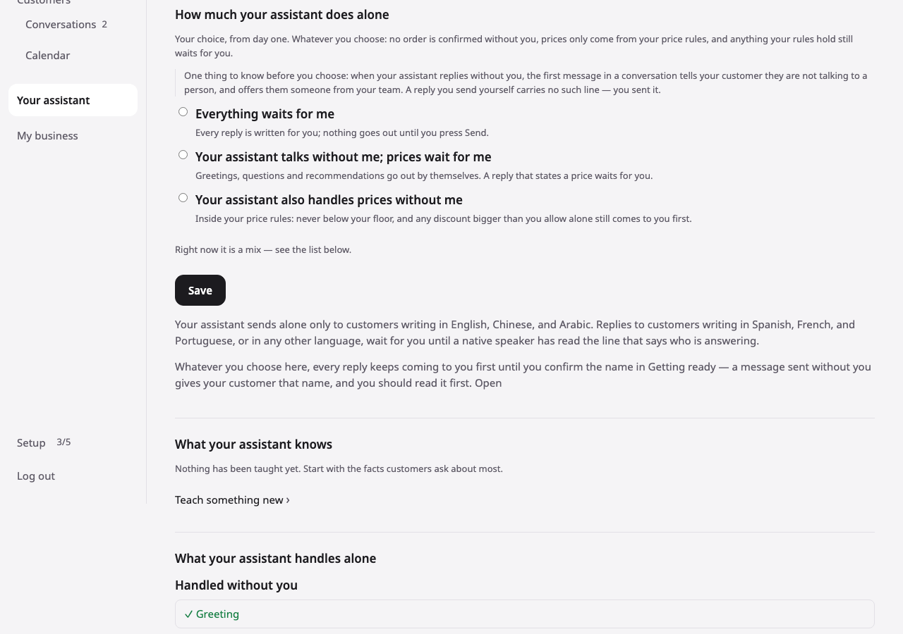 | Your assistant. No level is selected; "Right now it is a mix"; the lock is grey small print ending in a bare "Open"; "Handled without you ✓ Greeting" sits below it. | S1 |
| 9 | 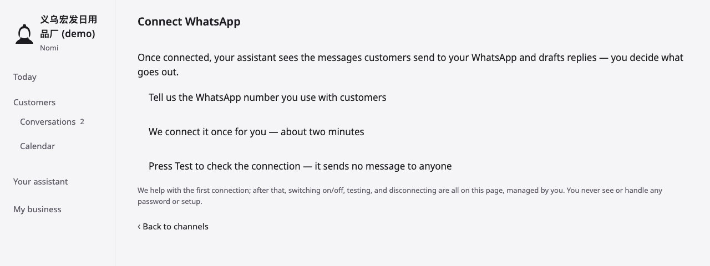 | Connect WhatsApp. "Tell us the WhatsApp number…" and "Press Test…" with nothing to type into or press except "Back to channels". | S1 |
| 10 | 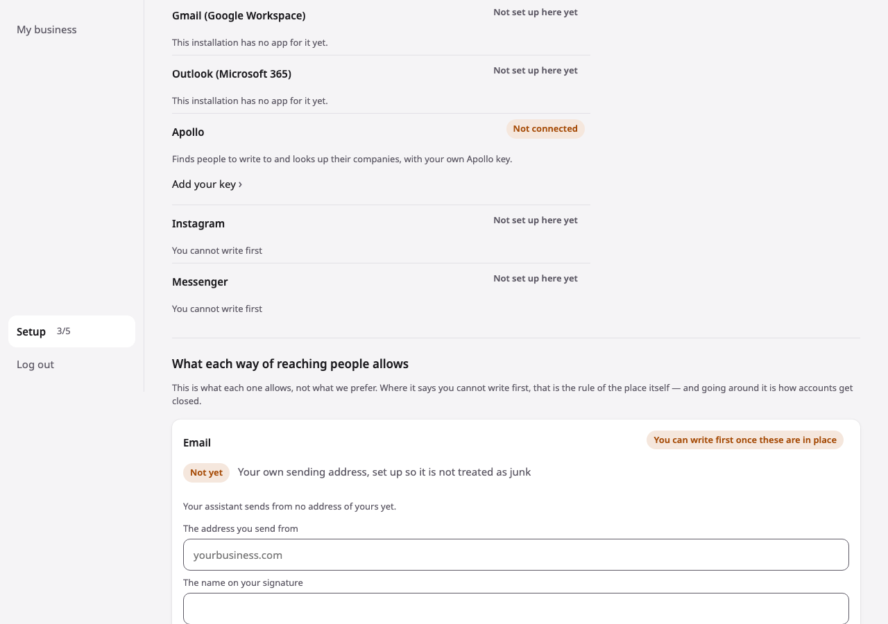 | Channels. The e-mail form's "The address you send from" has a domain placeholder; "The name on your signature" is a key selector. Apollo asks for "your key". (The Gmail / Outlook / Instagram / Messenger rows are local-only; see §10.) | S1 |
| 11 | 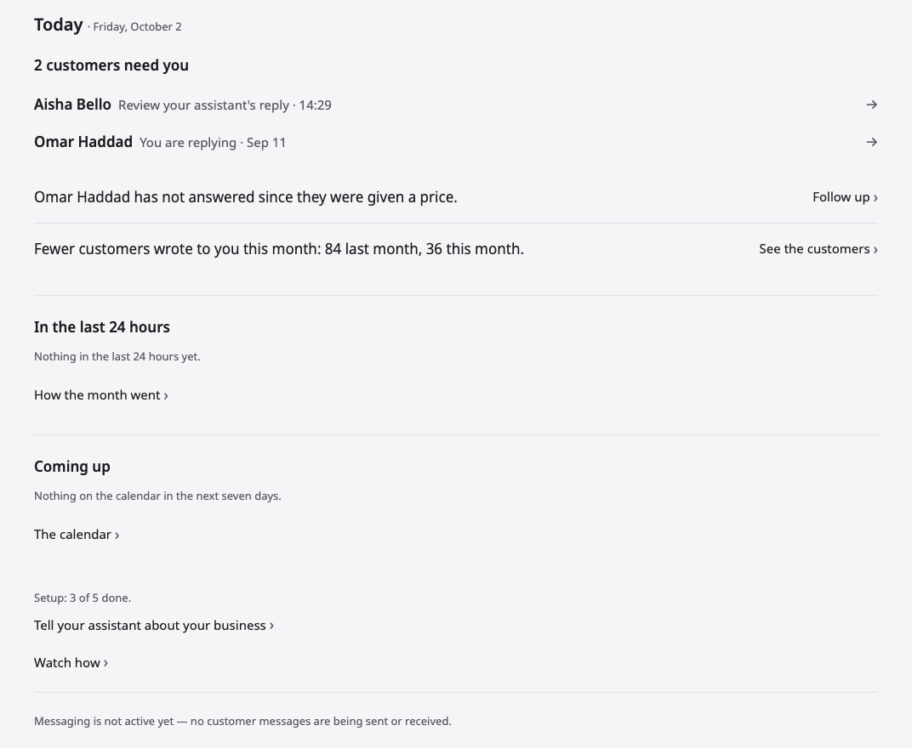 | Today. "84 last month, 36 this month" on 2 October; "Nothing in the last 24 hours yet" under a 14:29 draft; "→" next to "›". (The footer about messaging is local-only.) | S1 |
| 12 | 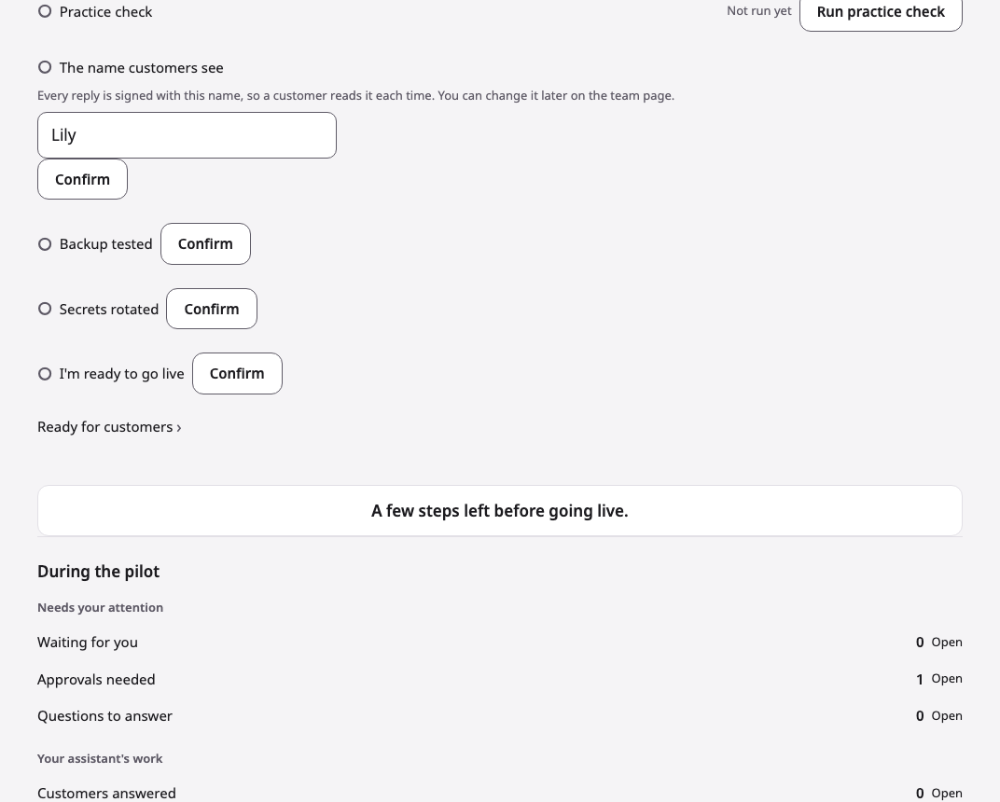 | Getting ready. "Backup tested" and "Secrets rotated" with Confirm buttons, "During the pilot", "Waiting for you 0" while Today says 2 wait, and a button-like box that does nothing. | S2 |
| 13 | 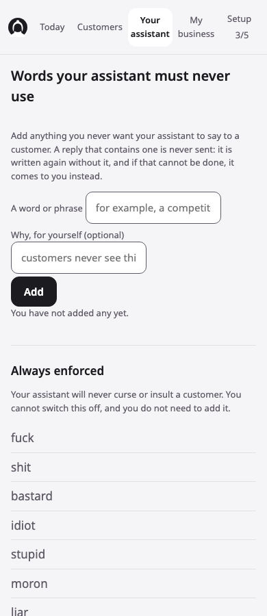 | Forbidden words, en, phone. Placeholders are cut ("for example, a competit"), and the 43-word obscenity list follows. | S2 |
| 14 | 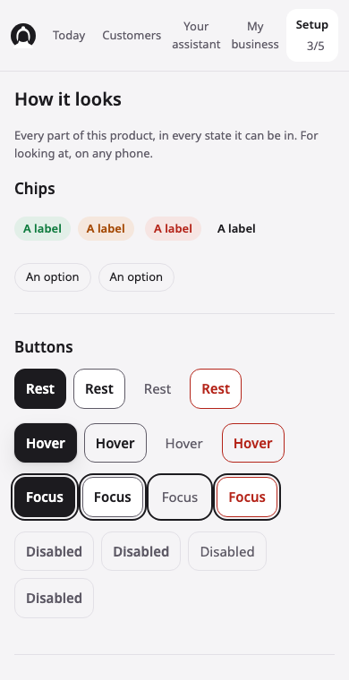 | Setup › "How it looks". A developer gallery: "Chips — A label", "Rest / Hover / Focus / Disabled". | S2 |
| 15 | 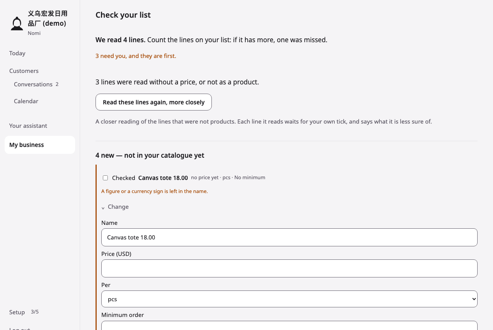 | Import review. "Canvas tote 18.00" is read as a name with "no price yet", under a tick box labelled "Checked", with the full edit form open on every row. | S2 |
| 16 | 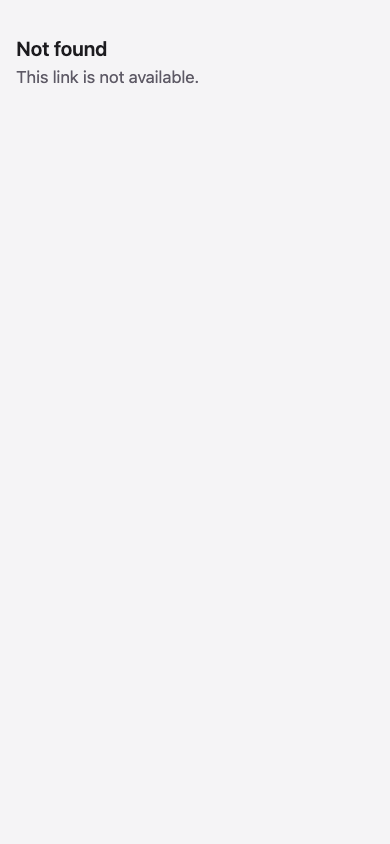 | A customer's broken unsubscribe link, in Arabic: two English lines, "Not found / This link is not available.", with no brand and no way to stop the mail. | S2 |
| 17 | 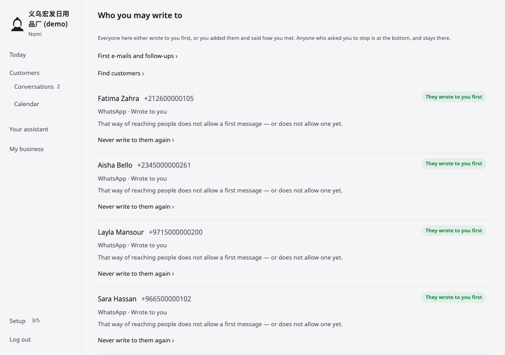 | Contacts. The heading "Who you may write to" sits over 71 rows that each say "does not allow a first message", each under a green "They wrote to you first" pill. | S2 |

---

## 1 · Problems that run through the whole product

These show up on many pages. Each page section below repeats only what is specific to that page.

- **S1** · fr · every page — **there is no French.** With the language cookie or the browser set to French, every owner page renders in English (`lang="en"`). So do sign-in, sign-up, the site and the three policy pages. The language switch offers only English, 中文, العربية and Español. All 124 French captures are English.
- **S2** · all locales — **one area, three names.** The rail groups "Customers" over an indented "Conversations 2", both opening the same list. That list is headed "Customers", its back links say "‹ Customers" and "Back to the conversation", and its empty states say "No conversations yet" and "See all conversations". The order page's browser tab says "Customers" too. The site and sign-up say "customers", the code says "buyers".
- **S2** · all locales — **browser tabs don't name the page.** Eleven Setup pages are titled "Setup · <business>": account, billing, business, closures, components, data, forbidden words, people, rate, samples and terms. "How you sell" and "Your price limits" are titled "My business". An order is titled "Customers", and a product and the import review are titled "Products". "Words your assistant must never use" is titled "Setup", but the rail lights "Your assistant".
- **S2** · all locales — **setting up has three names and five steps with fifteen names.** The rail says "Setup 3/5". Setup lists "Getting started" next to "Getting ready". Getting ready has its own "Setup" section of seven items, which are not the five steps. Each step is named differently on Today, Getting started, Getting ready, Ready and Setup (details under §3). In zh and es the progress counter reads "Settings 3/5" (设置 / Ajustes).
- **S2** · all locales — **the assistant's name is used before it is chosen.** The name step is not done (Getting started shows it "To do"). Even so, the conversation page says "Lily drafted", "How Lily read this", "Lily is handling this" and, for screen readers, "Review Lily's reply". Who works here says "goes to Lily", and Getting ready pre-fills "Lily". Products, Practice, Forbidden words and Your assistant say "your assistant". In one capture run, the hidden heading of the same card read "Review your assistant's reply" at phone width and "Review Lily's reply" at desktop width.
- **S2** · all locales — **internal and developer words reach the owner:**
  - installation: "on this installation", "This installation has no app for it yet";
  - workspace;
  - pilot: "During the pilot";
  - operator: "Nomi's operator";
  - floor;
  - handoff;
  - "Secrets rotated";
  - "Backup tested";
  - "old importer";
  - "discount authority";
  - "Callback password";
  - an "Apollo key";
  - "Doors" and "Chips";
  - "Rest / Hover / Focus / Disabled";
  - raw codes "food_grade" and "BPA_free";
  - the category value "bags";
  - the unit "pcs" in zh/ar/es fields;
  - the Incoterm codes "EXW … DDU".
- **S2** · all locales — **failure states are inconsistent, and some are silent or dead ends.**
  - Pressing "See what your assistant recognizes" with an empty box reloads the page and says nothing.
  - A bad store address leads to a separate page, "Nothing was added", in black body text. An empty "Read the page" leads to a separate page, "Nothing was read", in small red text. Both lose what was typed.
  - A missing product or conversation shows the app shell with only a heading ("Product not found", "Conversation not found") and one unexplained word-link ("Products", "Customers").
  - A wrong /app address shows the signed-out door page instead: language switch, the tagline "Your digital employee's workspace", no rail. The owner looks signed out.
- **S2** · ar — **mixed Latin and Arabic text breaks:**
  - **Latin product names are split and reordered:** "LED String Lights · US$ 1.45" / "14:31 · 10m" on the conversation panel; "Stainless Steel · Canvas Tote Bag … / … Thermos 500ml" on My business.
  - **Latin names are cut at their start:** "… Santos" and "…ansoor" on the calendar; "…our price for 5,000 pcs of the LED string li" in the list.
  - **Prefix written apart:** the prefix لـ is written as a separate word before the fallback name ("لـ مساعدك") on My business, Getting ready, price limits, Who works here and Channels. Elsewhere it shows a visible tatweel ("لـمساعدك").
  - **Browser-drawn controls ignore the page:** file pickers and date fields stay in English and left-to-right.
- **S2** · es — **numbers use English formatting everywhere:** "5,000 uds.", "$1.05", "2,000+ uds. $0.92", "importe total $525.00", "Nunca por debajo de $0.72". The price-list files are also comma-separated with "." decimals.
- **S2** · zh — **stray spaces surround the fallback name inside sentences:** "告诉 你的助手 一个样品多少钱", "你还没告诉 你的助手 哪些天休息", "你的助手 读出每一行", "你的助手 只会把…".
- **S2** · all locales — **the counts disagree from page to page:**
  - "2 customers need you" (Today);
  - "Needs you (2)" and "Conversations 2" (list, rail);
  - "1 Awaiting you" (Results);
  - "Waiting for you 0" (Getting ready);
  - "No customer has asked anything yet" (Your assistant);
  - "Nothing in the last 24 hours yet" (Today, under a reply drafted 40 minutes earlier).
- **S3** · all locales — **the page furniture is inconsistent:**
  - **Arrows:** "→" on Today's and Setup's rows, "›" everywhere else.
  - **Back links:** some Setup pages have "‹ Setup"; closures, forbidden words, rate, samples, terms, people, components and the add-products page have none.
  - **Labels:** sibling forms set them at 13 px muted (closures, forbidden words, knowledge's "Teach something new") or 15–17 px dark (Kind of business, Your data, "The page's address").
  - **Typeface:** sign-in and sign-up buttons, the selects and the certification chips render in the browser's default font.
  - **Widths:** content stops at about 850 px while some section rules run to about 1,240 px.
- **S3** · all locales — **some states are shown only by colour:**
  - **Task lists:** "Waits for you" and "Always waits for you" use the same "○" and differ in amber versus grey.
  - **Contacts:** the green "ok" pill "They wrote to you first" sits on every row that cannot be written to.
  - **Selected tabs:** "Needs you (2)", "This week" and "Mine" are marked by a pale grey fill, weaker than the unselected white pills.
  - **Two states share one colour:** the orange "Not connected" pill and the orange "Awaiting you" pill.
- **S3** · all locales — **the rail is unreliable:**
  - "Conversations 2" loses its count on the refusal pages ("Nothing was added", "Nothing was read") and in the phone nav.
  - The Chinese business name wraps mid-word ("义乌宏发日用 / 品厂 (demo)").
  - No item is lit on Contacts, Find customers, Follow-ups, an order or the Meta help page.
  - The mark differs between desktop and phone.

---

## 2 · Public site, sign-in, sign-up and policy pages

### site — `/site`
**Asks the owner to:** write an e-mail asking for an invitation (or sign in if they already have a workspace). **Clear without explanation?** Partly — the action is obvious, but it is a bare `mailto:` and the page never says who runs Nomi.

- **S2** · all locales · desktop, phone — whole page including the footer — no operator name, company, country or real contact anywhere. Promises like "No price ever goes below the lowest price you set" and "We read every new workspace" come from a sender a stranger cannot identify.
- **S3** · all locales · desktop, phone — the rules for sending alone disagree. "The first workspaces" says "Sending on its own opens only once your assistant has earned it with your own customers". The hero says "Nothing goes out on its own until you allow it", and the card "What goes out alone" says "You can let greetings and questions go out on their own". The page gives two rules for who decides, and never explains "earned it".
- **S3** · all locales · desktop, phone — "We read every new workspace" (每一个新工作台我们都会看过 / نطّلع على كل مساحة عمل جديدة / Revisamos cada espacio de trabajo nuevo) reads as "we read your workspace's contents". That contradicts the linked privacy page, which ends its "Who sees it" list with "Nobody else."
- **S3** · all locales · desktop, phone — the example card's "Change" / "Send" (修改 / 发送, تعديل / إرسال, Cambiar / Enviar) are drawn as real buttons (a filled black "Send"), but they do nothing.
- **S3** · ar, es · phone — header: "تسجيل الدخول" / "Iniciar sesión" does not fit next to the language pill. It drops onto its own line under the pill, cut off from the header. In en and zh it fits on one line.
- **S3** · all locales · desktop, phone — the "Ask for an invitation" section (申请邀请 / طلب دعوة / Pedir una invitación) is indented about 24 px from the edge every other section uses (desktop x≈176 against 152; phone 40 against 16). No visible box explains the indent.
- **S3** · all locales · desktop, phone — the site (and the policy pages it links to) are set in the system font. "Sign in" lands on login and sign-up pages set in Noto Sans, so the product changes typeface between its site and its own door.
- **S4** · all locales · desktop, phone — "How it works" step numbers "1 2 3" (ar "١ ٢ ٣") sit about 14 px further in than the step headings under them.
- **S4** · en · desktop, phone — "e-mail" breaks at its hyphen ("Messenger or e-" / "mail") in the hero paragraph and in step 2.
- **S4** · zh · desktop, phone — bad Chinese line breaks: the hero h1 "每位客户都有回复，最后说了算的是你。" leaves "你。" alone on line 2 (desktop) and splits "最/后" (phone); "…才会开放自己发" / "送。" leaves "送。" alone (desktop).
- **S4** · zh · desktop, phone — "只有助手在你自己的客户身上赢得之后，才会开放自己发送" is a literal rendering of "earned it with your own customers" and does not read as natural Chinese.
- **S4** · es · desktop — "…unos pocos negocios cada" / "vez." leaves the orphan "vez."
- **S4** · all locales · desktop, phone — "Nomi opens to a small group first, by invitation…" ("The first workspaces") is followed straight away by "Nomi opens workspaces by invitation for now" ("Ask for an invitation"): the same sentence twice in a row.
- **S4** · ar · desktop, phone — the steps use Arabic-Indic digits "١ ٢ ٣", while the policy pages linked from the footer use Western digits ("27 سبتمبر 2026"). Two numeral systems across the public pages.
- **S4** · en · phone — footer: "Sign in" wraps alone onto a second line under "Privacy · Terms of service · Delete your data".
- **S4** · es · phone — example card: "Borrador de tu asistente" and the "Esperando tu aprobación" pill stack left-aligned on two lines. In en and zh they sit right-aligned on one line.

### login — `/login`
**Asks the owner to:** sign in with e-mail and password. **Clear without explanation?** Partly — the form is plain, but no heading says "Sign in".

- **S3** · all locales · desktop, phone — "Enter workspace" / 进入工作台 / دخول / "Entrar al espacio de trabajo" renders in the browser's default font (Arial/Helvetica; a different Arabic face in ar). The labels and links around it are in Noto Sans, so the small card uses two typefaces.
- **S3** · all locales · desktop, phone — no heading names the task. The only h1 is the brand line "Nomi · Your digital employee's workspace". The tab says "Log in", the site's link says "Sign in" and the button says "Enter workspace": three names for one action.
- **S3** · all locales · desktop, phone — "New here? Set up your business" (第一次来？为你的生意开一个工作台 / أول مرة هنا؟ … / ¿Primera vez aquí? …) invites anyone to sign up. The site says workspaces are by invitation only, and the form behind this link needs an invitation code.
- **S3** · all locales · desktop, phone — "New here? Set up your business" (black) and "I have an access code" (grey) are links with no underline, styled differently from each other. Both read as plain text.
- **S3** · all locales · desktop, phone — tagline "Your digital employee's workspace" / 你的数字员工工作台 / "El espacio de trabajo de tu asistente digital" / "مساحة عمل مساعدك". It says "digital employee" in en and zh, "assistant" in es and ar, and "assistant" on the site: the product's core thing changes name between pages and languages.
- **S3** · zh · desktop, phone — "我有进入密码": the access code is called a 密码 (password) right under the 密码 field, so two different secrets share one word.
- **S4** · all locales · desktop (live browser) — pressing "Enter workspace" with both fields empty shows only the browser's own bubble; the page says nothing.
- **S4** · all locales · desktop, phone — footer "For your business and the people who work there." is filler that tells the visitor nothing; es "…las personas que trabajan allí" is unnatural ("allí" for the business).
- **S4** · all locales · desktop, phone — no link back to the site, the privacy page or the terms.
- **S4** · all locales · phone — the brand line "Nomi Your digital employee's workspace" is left-aligned, while the language pill above and the links below are centred.

### login-code — `/login?with=code` (the captured `/login?code=1` shows the e-mail form, a duplicate of `login`; reviewed from HTML plus my own capture)
**Asks the owner to:** type an access code to enter. **Clear without explanation?** No — nothing says what an access code is, who gives it, or how it differs from the password or from sign-up's "Invitation code".

- **S2** · all locales · desktop, phone — the card has only the label "Access code" / 进入密码 / رمز الدخول / "Código de acceso", one field and "Enter with the code". There is no heading and no sentence saying where the code comes from, and with sign-up's "Invitation code" the owner meets two kinds of code that are never explained.
- **S3** · en (all locales) · desktop (live browser) — a wrong code gives "Wrong code, please try again." as small red text above the label, not tied to the field, and the address drops "?with=code".
- **S3** · all locales · desktop, phone — the code field is masked (`type=password`, dots) with no way to show it, so a code read off a message cannot be checked for typos.
- **S3** · zh · desktop, phone — label "进入密码" and button "用进入密码进入": "进入…进入" repeats itself and "密码" collides with the password. It reads as machine-made.
- **S3** · all locales · desktop, phone — the button "Enter with the code" / 用进入密码进入 / الدخول بالرمز / "Entrar con el código" uses the browser's default font, unlike the label above it (as on login).
- **S4** · all locales · desktop, phone — the link back is "Sign in with your e-mail", adding a fourth name for signing in ("Log in" / "Sign in" / "Enter workspace" / "Sign in with your e-mail").

### signup — `/signup`
**Asks the owner to:** describe the business and themselves, enter an invitation code, accept the terms and create a workspace. **Clear without explanation?** Partly — the fields are clear, but the invitation code that decides everything is the last field, and nothing says how to get one.

- **S2** · all locales · desktop, phone — "Invitation code" (邀请码 / رمز الدعوة / Código de invitación) is required and comes last, after 11 other fields, with only the hint "It is in the link you were sent." A visitor who arrived from "New here? Set up your business" fills in everything before finding they cannot submit, and nothing says how to get a code (no link to ask for an invitation).
- **S3** · all locales · desktop, phone — the "What do you sell or do?" placeholder is cut off: "e.g. skincare, clothing, social media a…", "例如：护肤品、服装、社交媒体广告…", "مثال: منتجات العناية بالبشرة أو الملابس أو إعلانات…", "p. ej., cosmética, ropa, anuncios en r…". This happens on desktop too, where the card is about 356 px wide on a 1280 px screen.
- **S3** · all locales · desktop, phone — the selects ("Choose…" / 请选择… / اختيار… / Elige…), the placeholders and "Create my workspace" render in the browser's default font, larger than and different from the Noto Sans labels.
- **S3** · all locales · desktop, phone — in "I agree to the Terms of service, including what may not be sold or said through Nomi.", "Terms of service" is a link with no underline or colour. It looks like plain text, so the terms being agreed to are not visibly reachable.
- **S3** · all locales · desktop, phone — the form collects name, e-mail, business and country but links nowhere to the privacy page.
- **S4** · zh, ar, es · desktop, phone — the website placeholder stays English: "yourbusiness.com".
- **S4** · all locales · desktop, phone — "Create my workspace" sits about 8 px under the two-line terms checkbox, tighter than every other gap in the form (16–24 px).
- **S4** · all locales · desktop, phone — Country (国家或地区 / البلد / País) offers 250 entries, including uninhabited ones ("Antarctica", "Bouvet Island", "Heard & McDonald Islands", "U.S. Outlying Islands"), with nothing preselected.
- **S4** · es · desktop, phone — "Sitio web, si tienes" is missing its object ("si tienes uno").
- **S4** · zh · phone — the lead "…你用自己的邮箱和密码登" / "录。" leaves "录。" alone. The labels also switch between 你 and 你们 ("你的生意是哪一类？" then "你们卖什么，或做什么？").

### privacy — `/privacy`
**Asks the owner to:** (a customer, really) read what is kept and how to have it removed, and contact the operator. **Clear without explanation?** Partly — the text is plain, but "we" is never identified.

- **S2** · all locales · desktop, phone — "we keep the message…" — "we" is never named. The page gives no company, country or postal address for the operator.
- **S3** · all locales · desktop, phone — no logo, no link to the site and no language switch. A customer arriving from a link gets a bare document in whatever language the browser chose, with no way to change it. The same holds on terms and data-deletion.
- **S3** · all locales · desktop, phone — "Or send the business a message saying so, from the account you used." comes right after "Write to <the contact address>.", so "saying so" points at nothing.
- **S3** · ar · desktop, phone — Latin words ("Nomi", "Meta", "Anthropic", "Railway", the contact address, "2026") render visibly larger and darker than the Arabic around them, because the Arabic falls back to a small system face. The same happens on terms and data-deletion.
- **S4** · en, es · desktop, phone — "Replies here are drafted by an AI assistant" / "Las respuestas de aquí…" — "here" on a page that has no replies.
- **S4** · zh · desktop, phone — "写信到 <address>." ends in an ASCII "." instead of "。". The same happens on terms and data-deletion.

### terms — `/terms`
**Asks the owner to:** accept the rules for using Nomi. **Clear without explanation?** Partly — the rules are plain, but the contract names no counterparty and no price, and its contact section speaks to customers.

- **S2** · all locales · desktop, phone — "…the operator of Nomi, reachable at nomidoes.com" gives no legal name, address, country or governing law. A paying business cannot tell whom it is contracting with.
- **S3** · all locales · desktop, phone — under "How to reach us", "Or send the business a message saying so, from the account you used." (或者用你当时使用的账号，给商家发一条消息说明即可。 / أو إرسال رسالة بذلك إلى الشركة من الحساب نفسه المستخدَم في المراسلة. / O envía al negocio un mensaje…) is a line for customers. It sits on a page whose first paragraph says customers "are covered by the privacy page, not by these terms".
- **S3** · all locales · desktop, phone — "Fees are as agreed with you in writing." No price or plan is shown anywhere, and sign-up makes accepting these terms the last step before a workspace exists, with nothing in writing.
- **S3** · all locales · desktop, phone — no logo, no home link and no language switch (as on privacy).
- **S4** · en · desktop, phone — straight apostrophe in "operator's", while the other public pages use "’" ("business’s").
- **S4** · zh · desktop, phone — "并告诉所有者原因" uses the legal 所有者 for the workspace owner, which reads stiff and translated.
- **S4** · ar · desktop — about 300 px of empty page under "آخر تحديث: 1 أكتوبر 2026.", where the other locales end about 50 px below the date.

### data-deletion — `/data-deletion`
**Asks the owner to:** (a customer) ask the business, or the operator, to delete their data. **Clear without explanation?** Partly — the steps are clear, but the customer is never told when it is done.

- **S3** · all locales · desktop, phone — "Notes and signals about your conversations." (关于你的对话的备注和标记 / الملاحظات والإشارات المتعلقة بمحادثاتك / Las notas y señales sobre tus conversaciones) — "signals" is internal jargon a customer cannot understand.
- **S3** · all locales · desktop, phone — step 1 holds two routes in one numbered item: "…saying you want your data deleted." then, on a new line, "You can also write to us…". The alternative reads as part of step 1.
- **S3** · all locales · desktop, phone — "within 30 days of the business recording the request" together with "Nomi does not write to you about it". The customer gets no deadline counted from when they asked and no confirmation, so they cannot tell whether anything happened.
- **S3** · all locales · desktop, phone — no logo, no home link and no language switch (as on privacy).
- **S4** · en · desktop, phone — straight apostrophe in "Nomi's operator", unlike "business’s" elsewhere.

### not-found-public — `/nope`
**Asks the owner to:** nothing; it offers "Back to Today". **Clear without explanation?** No — it speaks to a signed-in owner, but the visitor is signed out.

- **S2** · all locales · desktop, phone — "The address you opened does not belong to anything in your workspace." (在你的工作台里没有对应的东西 / لا يقابله شيء في مساحة عملك / no corresponde a nada de tu espacio de trabajo) is shown to a signed-out visitor, such as someone who mistyped a nomidoes.com address, who has no workspace.
- **S2** · all locales · desktop, phone — the only link, "Back to Today" (回到「今天」 / العودة إلى «اليوم» / Volver a Hoy), names an app page a visitor does not know. Signed out, it lands on the sign-in form, and there is no link to the site's home.
- **S4** · es, ar · desktop, phone — "Esa página no está aquí" / "هذه الصفحة ليست هنا" are literal renderings of "That page is not here" and read as translated.

### set-password-bad — `/login/set-password?t=x`
**Asks the owner to:** ask whoever sent the link for a new one. **Clear without explanation?** Partly — it says the link is dead, but not who to ask or how.

- **S2** · all locales · desktop, phone — the heading "Choose your password" (设置你的密码 / اختيار كلمة المرور / Elige tu contraseña), and the tab title, sit over a card with no form. The page promises a password field that is not there.
- **S2** · all locales · desktop, phone — "Ask whoever sent it for a new one." names nobody and gives no contact. The only link, "Sign in instead" (直接登录 / تسجيل الدخول بدلًا من ذلك / Iniciar sesión), leads to a sign-in this person cannot use: they have no password yet.
- **S4** · zh · desktop, phone — "直接登录" ("sign in directly") suggests no password is needed.

### unsubscribe-bad — `/u?t=x`
**Asks the owner to:** (a customer) nothing — the link meant to stop e-mails shows "Not found". **Clear without explanation?** No — no explanation, no next step, and English only.

- **S2** · all locales · desktop, phone — "Not found / This link is not available." A customer who clicked to unsubscribe is not told whether they are still on the list, and gets no other way to stop the mail (no business name, no reply instruction, no link to /privacy or /data-deletion). The privacy page promises "Every e-mail the business sends carries a link that stops further mail".
- **S2** · zh, ar, es · desktop, phone — the page is English whatever the language: `lang="en"`, left-to-right, tab title "Not found". An Arabic or Chinese customer gets two English lines.
- **S3** · all locales · desktop, phone — a bare document with no logo or product name and text pinned top-left (on desktop, two lines on an empty 1280 px page). It looks like a server error or a phishing page, not a business's page.

### proof-bad — `/p/x`
**Asks the owner to:** (a customer) nothing — "Not found". **Clear without explanation?** No — no seller, no reason, no next step, English only.

- **S2** · zh, ar, es · desktop, phone — "Not found / This link is not available." is English in every locale (`lang="en"`, tab "Not found").
- **S2** · all locales · desktop, phone — a customer opening the seller's "where the price came from" link sees no seller name, no reason and no next step (such as asking the seller for a new link). The wording is the same as the failed unsubscribe, so nothing tells them which link broke.
- **S3** · all locales · desktop, phone — the same bare top-left layout with no brand; it looks like an error page rather than part of a seller's quote.

---

## 3 · Today, setting up, and the Setup hub

### today — `/app`
**Asks the owner to:** deal with the 2 customers waiting (review a drafted reply, finish a reply), follow up a silent quote, and finish setup. **Clear without explanation?** Partly — who is waiting is clear, but its counts contradict each other and the rest of the app.

- **S1** · all locales · both widths — "Fewer customers wrote to you this month: 84 last month, 36 this month." (zh "这个月写来的客户少了：上个月 84 个，这个月 36 个。", ar "كتب إليك عملاء أقل هذا الشهر…", es "Este mes te escribieron menos clientes…") — the figures count incoming messages, not customers, and set a whole September against the first two days of October; on 2 October, 36 in two days is announced as a fall.
- **S2** · all locales · both widths — "In the last 24 hours — Nothing in the last 24 hours yet." sits under "Aisha Bello · Review your assistant's reply · 14:29" (captured about 15:08 the same day): a customer wrote and a reply was drafted 40 minutes earlier, and the block says nothing happened.
- **S3** · all locales · both widths — Omar Haddad appears twice with opposite turn-taking: "Omar Haddad · You are replying · Sep 11" (the owner's turn, for three weeks) and "Omar Haddad has not answered since they were given a price. Follow up ›" (the customer's turn).
- **S3** · all locales · both widths — two door idioms on one page: the people rows end in "→", every other door ends in "›"; Setup's rows also use "→", every other page in this group "›" (both glyphs do mirror correctly in ar).
- **S3** · all locales · both widths — door names do not match where they land: "How the month went ›" opens a page headed "Results"; "See the customers ›" opens "Customers", while the rail entry carrying the count is "Conversations 2".
- **S3** · zh · both widths — the calendar is "日历" here ("日历 ›", "接下来七天日历上没有安排。") but "日程" in the rail and in the calendar page's own heading.
- **S3** · all locales · both widths — "Tell me in this browser when an order waits" (zh "有订单等我确认时，在这个浏览器里提醒我", ar "تنبيه في هذا المتصفح عند وجود طلب بانتظار التأكيد", es "Avisarme en este navegador cuando haya un pedido en espera") is a borderless ghost button that reads as grey text, indented about 19 px off the content edge (centred on phone), floating alone at the bottom under an unrelated note.
- **S3** · en, es, zh · phone — the right-hand doors ("Follow up ›", "See the customers ›", "Hacer seguimiento ›", "Ver tus clientes ›") squeeze the sentences into a ~200 px column: en "Fewer customers wrote / to you this month: 84 last / month, 36 this month." takes three lines; es "Omar Haddad no ha / respondido desde que / recibió un precio." three.
- **S3** · en · phone — "Aisha Bello Review your assistant's reply · 14:29" wraps and its "→" drops alone onto a second line, out of line with Omar's arrow below.
- **S3** · zh · phone — "上个月 84 / 个，这个月 36 个。" — the number 84 and its measure word 个 are split across lines.
- **S3** · all locales · desktop (shared shell) — the rail lists "Customers" and, indented under it, "Conversations 2" (zh 客户 / 对话 2, ar العملاء / المحادثات 2, es Clientes / Conversaciones 2): two entries that open the same page under two names; the page itself is headed "Customers".
- **S3** · all locales · phone (shared shell) — the phone nav drops the waiting count: "Customers" carries no "2", while "Setup 3/5" keeps its counter, so the only number in the phone nav is setup progress, not people waiting.
- **S3** · all locales · desktop (shared shell) — the business name wraps mid-word in the rail: "义乌宏发日用 / 品厂 (demo)", splitting 日用品.
- **S3** · zh, es · both widths (shared shell) — nav "设置 3/5" / "Ajustes 3/5" mean "Settings 3/5", and Today's "设置：5 步里完成了 3 步。" / "Ajustes: 3 de 5 pasos completados." read "Settings: 3 of 5 steps done" — setup progress labelled as settings.
- **S4** · ar · phone — "…84 الشهر الماضي، 36 هذا / الشهر." — "this month" split, "الشهر." alone on the last line.
- **S4** · all locales · both widths — "Setup: 3 of 5 done." then "Tell your assistant about your business ›" then "Watch how ›" on three separate lines; "Watch how ›" does not say how to do what.
- **S4** · zh · both widths — "告诉Omar Haddad价格之后" has no space between the Chinese and the Latin name, while "上个月 84 个" spaces its digits.
- **S4** · all locales · phone (shared shell) — nav labels wrap unevenly ("Your / assistant", "My / business", "Setup / 3/5"; es "Tu / asistente", "Ajustes / 3/5"; ar "نشاطي / التجاري", "الإعداد / 3/5"): items do not share a baseline and "3/5" sits under its word like a fraction.
- **S4** · all locales · phone (shared shell) — the business name shows only above Today's heading; every other phone page in this group names no workspace anywhere.
- **S4** · all locales (shared shell) — the mark differs by width: a figure/bell silhouette in the desktop rail, an arch in the phone nav.

### guide — `/app/guide`
**Asks the owner to:** work through five setup steps (watch or read each, then "Do it now ›" on the two still to do). **Clear without explanation?** Partly — the list is clear, but the videos look broken and the "Done" marks disagree with the rest of the app.

- **S2** · all locales · both widths — all five videos render as black boxes with a loading ring and "0:00": no still frame, no length; five dead-looking players dominate the page.
- **S2** · all locales · both widths — the five steps carry different names on every page: 1 "Tell your assistant about your business" (here, Today) = "Business profile" (Setup, Getting ready); 2 "Add what you sell" = "Products & prices" (Getting ready) = "Products" (this page's own instructions); 3 "Confirm your assistant's name" = "The name customers see" (Getting ready) = "The name customers will read" (Ready); 4 "Connect the account customers write to" = "Where customers reach you" (Setup, Getting ready) = "A channel is connected" (Ready); 5 "Send your assistant's first reply to a customer" has no counterpart on Setup or Getting ready. Same split in zh (告诉你的助手你的生意是做什么的 / 商家资料; 添加你卖的东西 / 产品和价格 / 产品目录), ar (تعريف مساعدك بنشاطك التجاري / ملف النشاط التجاري) and es (Cuéntale a tu asistente sobre tu negocio / Perfil del negocio).
- **S2** · all locales · both widths — step 5 "Send your assistant's first reply to a customer — Done" while Getting ready says "Customers answered 0" and "What happened so far — Nothing yet"; the step's own instructions ("Open Practice and write the way a customer would") describe a rehearsal, not a reply to a customer.
- **S3** · all locales · both widths — the nav highlights "Setup 3/5" but the page is headed "Getting started" (zh 设置 / 开始使用, ar الإعداد / البدء, es Ajustes / Primeros pasos).
- **S3** · all locales · both widths — the instructions send the owner to places the nav does not have: "Open Products, then Teach your assistant your products." (zh 「产品目录」, es «Productos»), "Open Getting ready.", "Open Where customers reach you."
- **S3** · all locales · both widths — step 3's "Do it now ›" opens Getting ready at the top of a ~3,100 px page; the name field is in the second section, between "Practice check" and "Backup tested".
- **S3** · en · both widths — "Confirm it. Nothing is sent without your OK before you do." — reads as if nothing needs an OK once the name is confirmed.
- **S3** · en, es · phone — a heading that wraps pushes its step number onto a line of its own ("1." alone, then "Tell your assistant about your / business" with ~34 px between lines), while short ones keep it inline ("2. Add what you sell"): the cards have different rhythms.
- **S3** · all locales · phone — every card is indented about 20 px from the page edge (cards start at x≈36, the heading and intro at x≈16; mirrored in ar), wasting width at 390 px.
- **S3** · all locales · both widths — "After the five steps" sits 8–20 px under the last card, tighter than the ~30 px between cards, so it reads as part of card 5.
- **S3** · es · both widths — "Leer en su lugar" is a word-for-word calque of "Read instead".
- **S4** · all locales · both widths — the intro says "Each has a short video, and the words under it say the same." but the words are hidden behind a collapsed "› Read instead".

### onboarding — `/app/onboarding`
**Asks the owner to:** confirm the assistant's name, run a practice check, attest to backups, secrets and readiness, and watch pilot counts. **Clear without explanation?** No — nine sections, three different checklists, operator chores and jargon; the one thing the owner must do (confirm the name) is buried mid-page.

- **S2** · all locales · both widths — "Before you go live" asks the owner to confirm "Backup tested" and "Secrets rotated" (zh 已测试备份 / 已轮换密钥, ar تم اختبار النسخ الاحتياطي / تم تدوير المفاتيح, es Copia de seguridad probada / Claves secretas renovadas), each with its own "Confirm" button: operator chores a shop owner cannot know or do.
- **S2** · all locales · both widths — internal vocabulary throughout: "During the pilot" (zh 试点进行中, ar أثناء التجربة, es Durante el piloto), "Trust validation passed", "Practice check", "Knowledge taught", "Hand-back practiced", "Delivery health".
- **S2** · all locales · both widths — the first section is headed "Setup" (zh 设置, ar الإعداد, es Ajustes) but lists seven items (Business profile, Products & prices, Your price limits, Knowledge taught, Certifications reviewed, Practice check, Where customers reach you) that are not the five steps the nav's "Setup 3/5" counts; the name step sits in another section.
- **S2** · all locales · both widths — contradictions with Today: "Waiting for you 0" while Today says "2 customers need you" and the rail shows "Conversations 2"; "What happened so far — Nothing yet — this fills in once customers start talking to your assistant." while Today reports 84 + 36 customer messages and two customers waiting.
- **S3** · all locales · both widths — "Practice check" is listed twice: under "Setup" ("Run the practice check below. Open ›", where "Open ›" goes to the Practice page, not below) and under "Before you go live" ("Not run yet [Run practice check]").
- **S3** · all locales · both widths — "Practice before launch · 3/5" puts a second "3/5" in view that means something other than the nav's "Setup 3/5"; its numbered list has 7 steps while the ticks under it are 5.
- **S3** · all locales · both widths — "Delivery health ✓ Every reply your assistant sent has gone out." shows a success tick while "Customers answered 0": a success state for nothing sent.
- **S3** · all locales · both widths — "Replies you corrected" and "Answers corrected" (es "Respuestas que corregiste" / "Respuestas corregidas") — two near-identical counters in adjacent groups.
- **S3** · all locales · both widths — the count column is ragged: "Answers corrected 0" has no "Open", so its 0 sits at the far edge while every other number is offset by its "Open"; "Open" itself is 13 px plain text beside 17 px bold numbers.
- **S3** · all locales · both widths — three door placements on one page: "Open ›" flush to the far edge in "Setup", a bare "Open" (no chevron) in "During the pilot", and a small "Open ›" right after the text in "After conversations happen".
- **S3** · all locales · both widths — "We have none" (zh 我们没有认证, ar ليس لدينا أي شهادة, es No tenemos ninguna) is a borderless ghost button that looks like plain text; on ar phone it floats alone on its own line.
- **S3** · all locales · both widths — "A few steps left before going live." (zh 上线前还差几步。, ar بقيت خطوات قليلة قبل الانطلاق., es Faltan unos pasos…) is a centred bold sentence in a white rounded box, styled like a button, that does nothing.
- **S3** · all locales · both widths — "Business profile — Add your business details. Open ›" opens the Setup hub, not the profile; the owner needs a second tap.
- **S3** · all locales · both widths — "You can change it later on the team page." — no page is called "team"; Setup calls it "Who works here".
- **S3** · zh, ar vs en, es · desktop — the name row lays out differently by language: en/es stack label, hint, field and "Confirm"; zh/ar put the hint beside the label and push the field and "Confirm" to the far end of the row.
- **S3** · all locales · both widths — the name field's "Confirm" drops below the field, while every other "Confirm" sits inline after its label.
- **S3** · all locales · phone — hints are pushed to the far edge under start-aligned labels ("Add your business details. Open ›", "Teach at least one fact or answer. Open ›"), so the list zigzags.
- **S3** · ar · both widths — "مراجعة ما يمكن لـ مساعدك فعله دون انتظارك" — the name prefix "لـ" stands detached before the fallback word ("لـ مساعدك").
- **S4** · all locales · both widths — the name field is pre-filled "Lily" while every other page says "your assistant"; nothing says "Lily" is only a suggestion.
- **S4** · zh · both widths — "打开你拥有的认证" renders "Turn on" as 打开 ("open"): it reads "open the certifications you hold".

### onboarding-technical — `/app/onboarding/technical`
**Asks the owner to:** nothing ("Nothing here needs you") — it lists WhatsApp credentials, safety checks and installation details. **Clear without explanation?** No — written for a developer, and it ends in a red warning addressed to "the owner".

- **S2** · all locales · both widths — developer-facing content shown to the owner: "Access key", "WhatsApp number id", "Business account id", "App secret", "Callback password", "Connection version", "Running version · Not reported", "Environment" (its value left in English in zh/ar/es), values set in a monospace code font.
- **S2** · all locales · both widths — red box "12 price rules were written by the old importer, not by the owner: floor equal to the list price, no discount authority. Nothing rewrites them — ask the owner the three questions and let those answers replace them." speaks of the reader as "the owner" in the third person, uses internal terms ("old importer", "discount authority"), never says which three questions, offers no door, and contradicts the intro's "Nothing here needs you."
- **S3** · all locales · both widths — the browser title says "Getting ready" (zh 准备上线, ar التجهيز, es Preparación) while the heading says "Technical details".
- **S3** · all locales · phone — "Approved message for re-opening a conversation": its ○ status mark sits alone on its own line, with the label and the state below it.
- **S3** · ar · both widths — values in the monospace face ("غير متوفّر", "غير مُفعّلة", "الجمعة، 2 أكتوبر") fall back to a cramped bold font smaller than their labels.
- **S3** · all locales · both widths — "Safety checks against this business's own data — All 13 checks held." says neither what was checked nor why it matters.

### ready — `/app/ready`
**Asks the owner to:** practise eight situations as a customer and check three readiness items. **Clear without explanation?** Partly — the checklist reads well, but the only door is "Practise as a customer ›"; the unchecked items give no way to do them.

- **S2** · all locales · both widths — "✓ Your assistant may send alone, at the level you choose" is ticked while "○ The name customers will read is not confirmed yet" is open in the same list; Getting started says nothing goes out without the owner's OK until the name is confirmed.
- **S3** · all locales · both widths — a third measure of the same Practice: "Seen in Practice · 1/8" here, "Practice before launch · 3/5" and "Practice check — Not run yet" on Getting ready.
- **S3** · all locales · both widths — "In place" lists a negative sentence beside an empty circle ("The name customers will read is not confirmed yet"): a double negative whose state has to be worked out.
- **S3** · en, es, ar · both widths — "Seen once is seen." (es "Lo visto una vez cuenta como visto.", ar "ما شوهد مرة يبقى مشاهدًا.") is cryptic.
- **S3** · zh · both widths — two words for customer on one page: "准备好接待客户", "扮成客户练习", "客户会看到的名字" against "用顾客常用的叫法", "要找人的顾客", "顾客收到的内容".
- **S3** · all locales · both widths — this page and Getting ready only point at each other ("Getting ready ›" here, "Ready for customers ›" there); none of the eight open items has its own door.
- **S4** · all locales · both widths — the nav lights "Setup 3/5", but the page is none of the five steps and no row on the Setup page leads to it.

### setup — `/app/settings`
**Asks the owner to:** pick a language and open any setting. **Clear without explanation?** Partly — a plain list, but "Getting started" and "Getting ready" are indistinguishable and one row is a developer gallery.

- **S2** · all locales · both widths — "How it looks" (zh 外观, ar المظهر, es Cómo se ve) opens a component gallery ("Every part of this product, in every state it can be in… A label · An option · Rest · Hover · Focus · Disabled"): a developer page listed among the owner's settings; zh/ar "外观" / "المظهر" ("Appearance") also promise a theme setting.
- **S2** · all locales · both widths — "Getting started 3 of 5 steps done" and "Getting ready" sit next to each other with near-synonymous names (zh 开始使用 / 准备上线, ar البدء / التجهيز, es Primeros pasos / Preparación) on a page and nav entry called "Setup 3/5": three names for setting up, and nothing says which row to open.
- **S3** · all locales · phone — "Log out" (zh 退出, ar تسجيل الخروج, es Cerrar sesión) is a borderless ghost button indented about 19 px from the rows above, reading as stray text.
- **S3** · all locales · both widths — "Setup 3/5" in the nav lands here, but the five counted steps are not shown: only the "Getting started" row summarises them, and nothing marks which of the twelve rows ("Business profile · Not finished"…) are steps.
- **S3** · all locales · both widths — the rows end in "→" while every other door in this group ends in "›".
- **S4** · zh · both widths — "这里有谁" ("who is here") for "Who works here"; "付款" ("payment") for "Billing".

### not-found-app — `/app/nope`
**Asks the owner to:** go back to Today. **Clear without explanation?** Yes — the message and the way back are plain.

- **S3** · all locales · both widths — signed in, but the page drops the whole shell (no rail, no phone nav, no business name) and shows the sign-in door's layout with a language switch, so the owner looks signed out.
- **S3** · all locales · both widths — "Back to Today" (zh 回到「今天」, ar العودة إلى «اليوم», es Volver a Hoy) is small plain text with no underline or chevron, unlike every other door in the app.
- **S3** · en, zh, es · both widths — the tagline "Your digital employee's workspace" (zh 你的数字员工工作台, es El espacio de trabajo de tu asistente digital) uses "digital employee", a term found nowhere else; the app says "your assistant" (ar does: "مساحة عمل مساعدك").
- **S4** · all locales · both widths — the browser title "Nomi · That page is not here" drops the business name every other page carries.
- **S4** · all locales · both widths — the footer "For your business and the people who work there." is marketing filler on an error page.

---

## 4 · Customers: the list, an order, the calendar, Results

### inbox — `/app/inbox`
**Asks the owner to:** open the customers who need them (here: review the assistant's reply to Aisha Bello). **Clear without explanation?** Partly — Aisha's row says what to do, but Omar Haddad's row in the same list says only "Held by 陈莉", with no reason or action.

- **S2** · all locales · both — Omar Haddad is counted in "Needs you (2)" and listed here with only "Held by 陈莉" / "陈莉 在管" / "في عهدة 陈莉" / "En manos de 陈莉". On the All tab the same row is filed under "Your team is handling", not "Needs you". The tab count and the grouping disagree, and nothing says what the owner must do for him.
- **S2** · all locales · both — message previews are cut mid-word with no ellipsis, so they read as finished sentences: "…lead time 20 days. Shall I send a pro". The All tab has more: "…$1.08/pc for 30,000 pcs, lead time 25" (the unit "days" is lost), "For 500 pcs the price is $1.05/pc F", "Eight hours of light on".
- **S3** · all locales · desktop — one area has three names. The heading and browser tab say "Customers" (客户 / العملاء / Clientes). The highlighted rail item under that group says "Conversations 2" (对话 / المحادثات / Conversaciones). The area's own text says "No conversations yet", "See all conversations" and "Back to the conversation".
- **S3** · all locales · both — the two links under the list are unclear. "Calendar: what is dated, by day ›" is clumsy (zh "日程：按天看已有的日期", es "Calendario: lo que tiene fecha, por día"). "Who you may write to ›" (你可以联系谁 / من يمكن مراسلته / A quién puedes escribir) gives no hint of what it opens. On desktop the calendar link repeats the rail's "Calendar".
- **S3** · zh · both — the search button says only "找". The held-by tag reads "陈莉 在管", with a stray space and clipped phrasing.
- **S3** · es · phone — search placeholder cut: "Nombre, número o product".
- **S4** · es · both — quantities use the English thousands comma ("5,000 uds.", "3,000 uds."). The all-customers tab is "Todo" ("everything").
- **S4** · all locales · both — some customers get a flag (🇳🇬 Aisha Bello, Egypt, UAE, Morocco, Russia…) and others don't (Omar Haddad · Jordan, Senegal, Kenya, Germany, Brazil…). Nothing says what a flag means.
- **S4** · all locales · both — the selected tab ("Needs you (2)") is a pale grey pill, less prominent than the white outlined, unselected "All" and "Mine". The "Find" button is shorter than the search field beside it, so their bottom edges don't line up.
- **S4** · all locales · desktop — the list stops at about 850 px and the right third of the screen is empty. The rail's "Conversations 2" count has no visible label.

### inbox-all — `/app/inbox?filter=all`
**Asks the owner to:** scan every customer and open one. **Clear without explanation?** Partly — the groups have headings, but the order inside "Your assistant is handling" jumps, and nothing says in words which rows are unanswered.

- **S3** · all locales · both — inside "Your assistant is handling" the times run from "Today 14:58" down to "Thu, Sep 17 17:28", then jump back to "Today 14:24" (Layla Mansour) and run down again to "Wed, Sep 30". It is a second ordering with no heading between the two.
- **S3** · all locales · both — rows under "Your assistant is handling" can end on the customer's own question ("Do you have colour options?" Sun, Sep 20; "Ours. Please quote FOB." Sat, Sep 26). They show no reply and no word saying they are unanswered. The only difference from answered rows is darker preview text and the missing "· Your assistant".
- **S3** · zh · both — the tab says "等你处理 (2)" but the group heading below it says "需要你处理" for the same set.
- **S3** · ar · phone — Khalid Mansoor's product line wraps, so "US$ 2.35" sits alone on a second line and the "·" separator dangles at the end of the first line ("· 5,000 قطعة · Stainless Steel Thermos 500ml").
- **S4** · all locales · phone — 50 near-identical cards make a page about 9,000 px tall. The only paging control ("1–50 of 71  Next page ›" / "第 1–50 位，共 71 位" / "1 إلى 50 من 71") is at the very bottom.

### inbox-mine — `/app/inbox?filter=mine`
**Asks the owner to:** see the customers they personally hold. **Clear without explanation?** No — nothing explains "Mine", and the empty state says the business has no conversations at all.

- **S1** · all locales · both — the workspace has 71 conversations and the tab next to this one says "Needs you (2)". Yet the Mine tab says "No conversations yet. Messages from customers show up here. Share your WhatsApp number or your page with customers first." with the link "Set up your business so customers can reach you ›" (还没有对话。/ لا محادثات بعد. / Aún no hay conversaciones.). The information is wrong, and it sends the owner to set-up.
- **S4** · all locales · desktop — the rule under the tabs runs to the far right (about 1,240 px) while everything else on the page stops at about 850 px.
- **S4** · es · phone — "Configura tu negocio para que tus clientes puedan contactarte" wraps to two lines and its "›" floats alone at the right edge.

### inbox-search — `/app/inbox?filter=all&q=Haddad`
**Asks the owner to:** find a customer by name, number or product. **Clear without explanation?** Yes — the count line ("2 found for “Haddad”") and the results are plain.

- **S3** · all locales · both — "Clear" / "清除" / "مسح" / "Limpiar" is plain grey text beside the outlined "Find" button. It reads as disabled text, not as a control.
- **S4** · all locales · both — the matched word ("Haddad") is not marked in the results.

### inbox-search-none — `/app/inbox?filter=all&q=zzzzqqq`
**Asks the owner to:** try another search or go back to the full list. **Clear without explanation?** Partly — the hint is clear, but three different controls do the same "go back".

- **S3** · all locales · both — "See all conversations ›" (看全部对话 / عرض كل المحادثات / Ver todas las conversaciones) does the same as "Clear" and as the already-selected "All" tab. That is three controls for one action, and this one says "conversations" on a page headed "Customers".

### order — `/app/orders/de300000-0000-4000-8000-00000000e53e`
**Asks the owner to:** record where the order is (stage, tracking number, private note) and copy the proforma invoice. **Clear without explanation?** Partly — the heading is a code without the word "Order", the stage menu already reads "Confirmed" while the page says nothing is recorded, and the help line is hard to follow.

- **S2** · all locales · both — the page heading is "USAB-de300000-0001", a code built from the record id. The word "Order" (订单 / الطلب / Pedido) is nowhere in the heading, and the browser tab says "Customers · …" (客户 / العملاء / Clientes).
- **S2** · ar · phone — the proforma box is right-aligned and opens scrolled to the right, so the START of each English line is cut off: "tainless Steel Thermos 500ml (ZX-200)", ": 30% deposit, balance before shipment" ("Payment" is hidden). On desktop in ar the same English lines hang ragged from the right edge.
- **S2** · en, zh, es · phone — the proforma box is cut at the right edge: "Stainless Steel Thermos 500ml (ZX-200", "Payment: 30% deposit, balance before s". Nothing shows that the box scrolls sideways.
- **S2** · zh, ar, es · both — the proforma invoice is always in English ("PROFORMA INVOICE", "Seller:", "Customer:", "Qty: 5,000 pcs", "Unit price:", "Payment: 30% deposit, balance before shipment"), under translated headings "形式发票" / "فاتورة مبدئية" / "Factura proforma".
- **S3** · all locales · both — the invoice is raw typewriter-font text in a grey, code-style box. The line above says "Copy it into your own paperwork", but there is no copy, print or download control.
- **S3** · all locales · both — "What you recorded: Nothing recorded yet." (还没记过什么。/ لم يُسجَّل شيء بعد. / Todavía no hay nada registrado.) contradicts the stage menu above, which already shows "Confirmed", and the summary's "Confirmed on Wed, Sep 30".
- **S3** · all locales · both — the help text "You set this. Your assistant tells a customer what you recorded and the day you recorded it — never a delivery date worked out from it." is hard to follow (zh "…不会拿这个去推交货日期", es "…nunca una fecha de entrega calculada a partir de ello").
- **S3** · all locales · desktop — no rail entry is highlighted on this page (neither "Conversations" nor "Calendar"). The back link says "Back to the conversation" (回到对话 / العودة إلى المحادثة / Volver a la conversación) while the area is called "Customers".
- **S3** · zh · both — stray space in "你的助手 只会把…". "上面每个数都是从这张单子上抄的" says the figures are "above", but the invoice is below. The product reads "Stainless Steel Thermos 500ml" here but "保温杯" for the same order in the zh customer list.
- **S4** · all locales · desktop — the three form fields are about 390 px wide while the invoice box below them runs about 990 px. "Confirmed on Wed, Sep 30" has no year.
- **S4** · es · both — "Pégalo de la empresa de mensajería" (placeholder) and "Cópiala a tus propios documentos" read as literal translations.

### calendar — `/app/calendar`
**Asks the owner to:** look over dated events by week (optionally by kind or for one customer) and add a date of their own. **Clear without explanation?** No — on a phone, today's column is off-screen and the cards are cut to fragments. The ✦ mark and the past-only records ("Price worked out") are unexplained.

- **S1** · all locales · phone — the week grid is wider than the screen. Only Mon 28 to Wed 30 and a sliver of "Thu 1" show. Fri 2 (today), Sat 3 and Sun 4 are off the right edge (in ar, off the left edge), along with Friday's Carlos Mendes, Layla Mansour and Aisha Bello cards. No scrollbar, arrow or fade shows that the grid scrolls sideways.
- **S1** · ar · phone and desktop — Latin customer names are cut at the START, with the ellipsis on the left: "… Santos" (Pedro Santos), "… Rahimi", "…lmeida", "…wdhury", and "…ansoor" (Khalid Mansoor, which can't be told apart from Layla Mansour). On desktop: "…im Chowdhury".
- **S2** · all locales · phone — every card is cut to fragments: "Pedro S…", "Nadia R…", "✦ Price …", "Sample …", es "✦ Preci…", zh "✦ 算出…", ar "✦ حُسب …". The owner can't tell who or what without opening each card.
- **S2** · en, es · desktop — even at full width the kind is cut on every quote card: "Price worked…", "Sample dealt w…", es "Precio calcul…", "Muestra solicit…", "Muestra atendi…". One name is cut too: "Rahim Chowd…".
- **S3** · all locales · both — the week buttons are a bare "‹" and "›" with no words ("Earlier"/"Later" exist only for screen readers). "Today" between them looks like the period's label, not a button.
- **S3** · all locales · both — a "✦" sits before the kind on most cards, and nothing on the page says what it means. The legend explains only the solid and dashed borders, and its solid swatch ("From a conversation") looks like a toggle switch.
- **S3** · all locales · both — this week's cards are all greyed records of things already done ("Price worked out 02:29", "Sample dealt with", "Order 15:04"), laid out like appointments. "Price worked out" / "算出报价" / "حُسب السعر" is internal wording for a quote. In ar the order card is labelled just "طلب", next to "طلب عينة" (sample asked), so it reads as "a request".
- **S3** · all locales · phone — two rows of identical pills (Month/Week/Day/List and All/Samples/Orders/Negotiation) stack above the grid. The second row wraps, so in en/es "Negotiation" / "Negociación" sits alone on a third row.
- **S3** · all locales · both — "Add a date" (添加日期 / إضافة موعد / Añadir una fecha) is the page's only way to add anything, yet it is a small collapsed line below the full 02–23 hour grid (about 1,900 px down on a phone).
- **S4** · all locales · both — every hour from 02 to 23 gets a row although most are empty (the phone page is about 1,970 px for 15 cards). Today's column is marked only by a thin underline under "Fri 2".

_Checked, not a defect: the two submit buttons the automated check flagged as unlabeled are "Show" and "Add", inside the collapsed "One customer only" and "Add a date" panels._

### analytics — `/app/analytics`
**Asks the owner to:** read the numbers for a period (Today / This week / This month); there is nothing to act on. **Clear without explanation?** Partly — the numbers have no definitions, and several contradict each other or other pages.

- **S2** · all locales · both — numbers on the page disagree. "36 New customers" sits next to "35 Conversations". "40 Replies that went out" sits next to "Your assistant's work: 1 Inquiries handled". "1 Awaiting you" disagrees with the rail's "Conversations 2" and the Customers list's "Needs you (2)".
- **S3** · en, es · both — the sentence is built from a label, leaving a capital mid-sentence: "This covers This week." / "Esto abarca Esta semana."
- **S3** · all locales · both — the nav highlights "Today" (phone tab and desktop rail) on a page headed "Results" (经营情况 / النتائج / Resultados). Right below sits a period chip also called "Today" / "今天" / "اليوم" / "Hoy", which is not selected.
- **S3** · all locales · both — the same counts appear twice: "12 Quotes" under Overview and "12 Quotes sent" under Quotes & orders; "1 Orders" and "1 Orders placed".
- **S4** · all locales · both — no singular forms: "1 Orders", "1 Inquiries handled", "1 Replies waiting for your OK", es "1 Te esperan", ar "1 الطلبات".
- **S4** · all locales · both — the "Sales" block breaks the number-and-label pattern: a lone green pill "Confirmed 1", then the sentence "Sales value $11,750". The order page shows the same sum as "$11,750.00".
- **S4** · all locales · desktop — the stat rows stop at about 850 px while the section rules run to about 1,240 px.
- **S4** · zh · both — "你的助手的工作总结" has a double 的, and "你改过的" reads as an unfinished stat label.

---

## 5 · A conversation, the draft reply card, the customer's file, Practice

### conversation-draft — `/app/inbox/de300000-0000-4000-8000-00000000e23d`
**Asks the owner to:** approve ("Send"), change, take over or decline the assistant's drafted price reply to Aisha Bello. **Clear without explanation?** Partly — "Send" is obvious, but "Edit", "Hand to me", "No reply needed", "Hand over" and "This is me testing" compete, and the page says both "Awaiting you" and "Lily is handling this".

- **S1** · en, zh, ar, es · desktop (1280×900) — draft card (`#approve`, sticky) — once the owner opens "How Lily read this" / "Lily 是怎么理解的" / "أساس فهم Lily للرسالة" / "Cómo lo entendió Lily", the card rises over the transcript. The customer's message "Hello, what is your price for 5,000 pcs of the LED string lights 10m? Shipping to Lagos." and its caption "Today 14:29 · Aisha Bello" end up behind it. In zh and ar almost the whole bubble is hidden: the card top is at 235/252 px, over a bubble at 225–303/233–312 px. In en/es the lower half of the bubble and the whole caption are hidden. Measured after landing at `#latest`, the way a Customers row opens the page.
- **S2** · ar · desktop (live browser, 1280×834) — the sticky draft card covers the transcript even before "How Lily read this" is opened: the top edge of the card cuts through the last caption "اليوم 14:29 · Aisha Bello". The card is 492 px tall in a 834 px window.
- **S2** · en, zh, ar, es · phone + desktop — header pill "● Awaiting you" / "等你确认" / "بانتظارك" / "Te espera" contradicts the green pill in the card below, "Lily is handling this" / "Lily正在处理" / "في عهدة Lily" / "Lily se encarga de esto". The page says the owner has it and the assistant has it at the same time.
- **S2** · en, zh, ar, es · phone + desktop — the assistant's name "Lily" appears in "✦ Lily drafted", "How Lily read this", "Lily is handling this", the hidden heading "Review Lily's reply" and the live line "A new reply from Lily is waiting for you". Yet Getting ready still shows "The name customers see ○ Confirm" (Setup 3/5). On the same page the nav says "Your assistant"; the buyer file says "Your assistant quoted" and Practice says "✦ Your assistant". The en phone capture (taken earlier) shows "✦ Your assistant drafted" / "Your assistant is handling this" on this same page.
- **S2** · en, zh, ar, es · phone + desktop — "Edit" / "修改" / "تعديل" / "Editar" looks like a button but only puts the cursor in the reply box, which is already open and editable. Pressing it changes nothing visible.
- **S2** · en, zh, ar, es · phone + desktop — two controls do the same thing: "Hand to me" / "我来回复" / "تولّي الرد" / "Respondo yo" in the draft card, and right below it the separate card "Hand to [You ▾] · Hand over" / "转给 [你] 转过去" / "إحالة إلى [أنت] إحالة" / "Pasar a [Tú] Pasar".
- **S2** · en, zh, ar, es · phone + desktop — ghost button "This is me testing" / "这是我在测试" / "هذا اختبار مني" / "Soy yo haciendo pruebas" sits under "About this customer ›" and looks like a caption or tab. It is a submit button that marks this real customer's conversation as a test, and nothing explains it.
- **S2** · en, zh, ar, es · phone + desktop — "How Lily read this · 5 reasons" list, item "○ 300 — no source found" / "找不到出处" / "بلا مصدر معروف" / "no se encontró fuente": the 300 is from the model number "ZX-300", which the buyer file shows as the product's code. "○ 25 — no source found" flags the 25-day lead time, which is on the product's own record. Each number is shown alone with no hint of which part of the reply it belongs to.
- **S2** · en, zh, ar, es · phone + desktop — the draft says "CE certified", but Getting ready shows "Certifications reviewed ○" and Practice says the assistant "will not claim a certification you have not confirmed". Nothing on the card mentions the claim; the reasons list checks only numbers.
- **S2** · en, zh, ar, es · phone + desktop — the only sign that the reply has unsourced figures is the 13 px grey caption "Not every figure has a source" / "有数字找不到出处" / "ليس لكل رقم مصدر" / "No todas las cifras tienen fuente" under the box. It has no mark and does not say which figure, and it sits next to the black "Send".
- **S2** · en, zh, ar, es · phone — the reply box shows 4 lines and the draft's last line "…Would you like a proforma invoice?" is cut off inside it (es: 148 px of text in a 122 px box; en, zh and ar are cut the same way). The owner sees an incomplete reply directly above "Send".
- **S2** · ar · desktop — list-pane previews lose their beginning: "…our price for 5,000 pcs of the LED string li" and "…ogo print, $2.05/pc for 3,000 pcs, lead ti ✦". The ellipsis is at the start and hides "Hello, what is y" and "Yes — one-colour l".
- **S2** · zh · desktop — the back link "‹ 客户" (goes to the list) and the panel door "客户 ›" (opens this customer's panel) have the same text on the same header row.
- **S2** · ar · desktop — customer panel, "الأسعار المحسوبة" (Prices worked out) row. Where the panel is a column (1440 wide) it breaks the product name as "US$ 1.45 · LED String Lights" / "14:31 · 10m", so "10m" reads as part of the time. At 1280, where the panel opens over the page, the row wraps to "LED String Lights 10m · US$ 1.45" / "14:31 ·", leaving a stray separator.
- **S3** · en, zh, ar, es · phone + desktop — the customer's message appears twice in a row: in the transcript bubble and again as the quote at the top of the draft card. The card's "Aisha Bello asked · WhatsApp · Today 14:29" repeats the caption "Today 14:29 · Aisha Bello" just above it.
- **S3** · en, ar, es · phone + desktop — units disagree: the draft says "$1.45/pc", the quote line says "$1.45/pcs" (es "$1.45/uds."; ar "US$ 1.45/قطعة" next to the draft's "$1.45/pc").
- **S3** · es · phone + desktop — figures use English number format on a Spanish page: subline "5,000 uds.", quote line "5,000 uds. · $1.45/uds. · importe total $7,250.00". Dates on the same page are localised ("11 sept").
- **S3** · es · phone + desktop — "WhatsApp acepta respuestas hasta Mañana 14:29" — "Mañana" is capitalised mid-sentence.
- **S3** · en, zh, ar, es · phone + desktop — "WhatsApp takes replies until 14:29 tomorrow" / "明天 14:29 前可在 WhatsApp 回复" does not say what happens after that time. An owner who has never heard of the 24-hour window cannot read it as a deadline.
- **S3** · en, zh, ar, es · phone + desktop — one state, many names. Header "Awaiting you", panel "Waiting for you", tab and list group "Needs you", buyer file "Awaiting confirmation". In zh: 等你确认 / 在等你 / 等你处理 / 需要你处理 / 等待确认.
- **S3** · en, zh, ar, es · desktop — tab "Needs you 2" / "等你处理 2" / "بحاجة إليك 2" / "Te necesita 2", yet the list under it has one row in "Needs you" and the other ("Omar Haddad") under "Your team is handling" / "团队在处理".
- **S3** · en, zh, ar, es · desktop — three doors to the same customer details, each with a different label: "The customer ›" (opens the panel), "About this customer ›" (buyer file), and in the panel "Their details, their data ›" (the same buyer file). The panel's "the conversation ›" links back to the page already open.
- **S3** · en, es, ar · desktop — the list pane's search placeholder is cut: "Name, number or", "Nombre, númer", "الاسم أو الرقم أو المنتِ".
- **S3** · en, zh, ar, es · phone — the customer's message in the transcript has no visible bubble (the bubble is the same colour as the page). It floats as indented serif text; at desktop the same message has a grey bubble.
- **S3** · en, zh, ar, es · phone + desktop — "No reply needed" / "不用回复" / "لا حاجة إلى رد" / "No hace falta responder" is plain text with no button outline, pushed to the far edge (on phone, alone on its own line). It acts on the draft in one tap with no confirmation.
- **S3** · en, zh, ar, es · desktop — hand-over card layout: the pill is centred vertically on the left, the "Hand to" label floats above the select, "Hand over" wraps under the select, and there is a large empty band at the top of the card.
- **S3** · en, zh, ar, es · desktop — arriving from a Customers row (`#latest`) scrolls the header half out of view: the back link, the name and the "Awaiting you" pill are cut by the top edge.
- **S3** · en, zh, ar, es · phone + desktop — the label "Understood  LED String Lights 10m" / "Se entendió así" / "ما فُهم" does not read as a sentence. "5 reasons" / "5 条依据" / "5 أسباب" / "5 motivos" labels what is really a list of figure checks.
- **S3** · en, zh, ar, es · desktop (1280) — "The customer ›" opens the panel over the draft card. It hides the right half of the customer's message and of the reply text, while "Send", "Edit" and "Hand to me" stay visible and clickable beside it.
- **S3** · ar · phone — reasons-list row "سعر LED String Lights" / "10m في قائمة أسعارك" splits the product name across two lines. The quote line "… · المجموع" / "US$ 7,250.00" separates "total" from its amount.
- **S3** · es, ar · phone + desktop — label plus option read as ungrammatical sentences: "Pasar a [Tú]" and "إحالة إلى [أنت]".
- **S3** · en, zh, ar, es · phone + desktop — "Make a link" / "做个链接" / "إنشاء رابط" / "Crear un enlace" does not say what link is made or where it goes. It submits straight away.
- **S4** · zh · phone + desktop — spacing around the Latin name varies: "Lily 起草" and "Lily 是怎么理解的" have a space, "Lily正在处理" does not.
- **S4** · zh · desktop — the search button is the single character "找".
- **S4** · zh · phone — "你可以给这个客户一个网页，让对方看到价格是怎么来的。" leaves "的。" alone on the last line.
- **S4** · es, ar · desktop — list-pane tabs wrap onto a second row ("Mías", "ما يخصّني").
- **S4** · en, zh, ar, es · phone + desktop — "✦" before "Lily drafted" and before "Yes — one-colour logo print…" in the list marks the assistant's words only by glyph and colour. Nothing explains it.

### conversation-thread — `/app/inbox/de300000-0000-4000-8000-00000000e203`
**Asks the owner to:** read Carlos Mendes's conversation; optionally take it over or hand it to a colleague. **Clear without explanation?** Partly — "Handled" vs "Lily is handling this", and two controls for the same take-over.

- **S2** · en, zh, ar, es · phone + desktop — header pill "Handled" / "已处理" / "تمّت المعالجة" / "Resuelto" (es: "Resolved") contradicts the card below it, "Lily is handling this" / "Lily正在处理" / "في عهدة Lily" / "Lily se encarga de esto", which comes with a "Take over" button. One says finished, the other ongoing.
- **S2** · en, zh, ar, es · phone + desktop — two controls in one card do the same thing: "Take over" / "我来接手" / "استلام المحادثة" / "Tomar la conversación", and "Hand to [You ▾] · Hand over".
- **S2** · en, zh, ar, es · phone + desktop — "Lily" appears on every reply caption ("Today 09:59 · ✦ Lily") and in "Lily is handling this", though the name is not confirmed (Getting ready "The name customers see ○"). The earlier en phone capture of this page says "✦ Your assistant".
- **S2** · en, zh, ar, es · phone + desktop — a sent reply shown as the assistant's says "…lead time 25 days. CE certified.", while Getting ready shows "Certifications reviewed ○".
- **S2** · ar · desktop — list-pane previews lose their beginning ("…our price for 5,000 pcs of the LED string li", "…ogo print, $2.05/pc for 3,000 pcs, lead ti ✦"), as on conversation-draft.
- **S2** · en, zh, ar, es · phone + desktop — ghost button "This is me testing" / "这是我在测试" / "هذا اختبار مني" / "Soy yo haciendo pruebas" reads as a caption, though it marks this customer's conversation as a test. Same problem as on conversation-draft.
- **S3** · en, zh, ar, es · phone + desktop — this is the longest conversation in the demo workspace, and it is 4 messages: 2 from Carlos, 2 replies, all "Today" 09:24–11:09. There are no earlier days, no "Earlier messages", and nothing that looks like a working sales thread.
- **S3** · en, zh, ar, es · desktop — the open conversation (Carlos Mendes) is not in the list pane beside it, which shows the "Needs you" tab (Aisha Bello, Omar Haddad). Nothing marks where the owner is.
- **S3** · en, ar, es · phone + desktop — the reply says "$1.65/pc", the quote line says "$1.65/pcs" (es "$1.65/uds.").
- **S3** · es · phone + desktop — English number format: subline "2,000 uds.", quote "2,000 uds. · $1.65/uds. · importe total $3,300.00". On phone "importe" / "total $3,300.00" splits across lines.
- **S3** · ar · phone — quote line "عرض السعر 2,000 قطعة · US$ 1.65/قطعة · المجموع" / "US$ 3,300.00" separates "total" from its amount.
- **S3** · en, zh, ar, es · phone — customer messages ("Looking for LED string lights 10m, 2,000 pcs, warm white.", "What plug type?") have no visible bubble, while the replies do.
- **S3** · en, zh, es · phone + desktop — the same action has two names on two pages: "Take over" / "我来接手" / "Tomar la conversación" here, "Hand to me" / "我来回复" / "Respondo yo" on the draft conversation.
- **S3** · en, zh, ar, es · desktop — hand-over card layout: the pill is centred on the left, "Take over" sits next to a floating "Hand to" label, "Hand over" wraps under the select, and there are wide empty margins. "No reply is waiting for you here." then stands alone between two dividers with about 100 px of empty space.
- **S3** · es, ar · phone + desktop — "Pasar a [Tú]" / "إحالة إلى [أنت]" read as ungrammatical sentences.
- **S4** · en, zh, ar, es · phone + desktop — no flag beside "Carlos Mendes · Brazil", while the other conversation shows "🇳🇬 Aisha Bello · Nigeria".
- **S4** · en, zh, ar, es · desktop — in the panel's "Prices worked out" row, "the conversation ›" links to the conversation already open.
- **S4** · en, zh, ar, es · phone + desktop — every caption repeats "Today" / "今天" / "اليوم" / "Hoy", with no day divider.

### buyer-file — `/app/conversations/de300000-0000-4000-8000-00000000e23d`
**Asks the owner to:** check or rename this customer and, if they asked, record a request to delete their data. **Clear without explanation?** Partly — the deletion control reads as the owner asking for deletion, and the "details" page shows no contact details.

- **S2** · en, zh, ar, es · phone + desktop — History says "Your assistant quoted: 5,000 pcs · $1.45/pcs" / "你的助手报价" / "عرض سعر من مساعدك" / "Tu asistente cotizó", and "Quotes 1" is listed. But the reply with that price has not been sent: the card at the top says "This customer has a reply waiting for your OK."
- **S2** · en, zh, ar, es · phone + desktop — the deletion control "› Ask for this customer's data to be deleted" / "要求删除这位客户的数据" / "طلب حذف بيانات هذا العميل" / "Pedir que se eliminen los datos de tu cliente", with the red "Ask for deletion" button inside, reads as the owner requesting deletion. It actually records that the customer asked.
- **S3** · en, zh, ar, es · phone + desktop — the page says "Your assistant quoted" while the conversation one click away says "✦ Lily drafted" and "Lily is handling this" about the same quote.
- **S3** · en, zh, ar, es · phone + desktop — header pill "● Awaiting confirmation" / "等待确认" / "بانتظار التأكيد" / "Esperando confirmación" names the state differently from the conversation page ("Awaiting you" / "等你确认" / "بانتظارك" / "Te espera").
- **S3** · en, zh, ar, es · phone + desktop — the page the panel calls "Their details, their data ›" shows no contact detail, only "WhatsApp" under the name. The panel shows "+2345000000261", but on phone the panel does not exist, so the number appears nowhere.
- **S3** · en, zh, ar, es · phone + desktop — "Deleting this customer's data" exposes the back office and hedges: "the request is usually noted here…", "Nomi's operator carries it out by hand within 30 days" / "Nomi 的运营方会在 30 天内由人手动执行" / "Quien opera Nomi la lleva a cabo a mano".
- **S3** · en, zh, ar, es · phone + desktop — History cuts the customer's message mid-word at a fixed length, "…of the LED string li…", even at desktop with half the row empty.
- **S3** · zh · phone — the name hint '…留空则显示为"客户"。' breaks "客户" across two lines ('显示为"客' / '户"。') and uses ASCII straight quotes in Chinese.
- **S3** · ar · phone — History rows mix directions badly: the first reads "Hello, what is your price for 5,000 :Aisha Bello", with the colon and name after the figure. The quote row breaks "US$ 1.45/" from "قطعة", and the Business quote breaks "المجموع" from "US$ 7,250.00".
- **S3** · es · phone + desktop — "5,000 uds. · $1.45/uds. · importe total $7,250.00" uses English number format and "uds." after a unit price. On phone "importe total" and "$7,250.00" wrap apart.
- **S3** · en, ar · phone + desktop — "$1.45/pcs" / "US$ 1.45/قطعة" in History and Business, while the draft says "$1.45/pc".
- **S3** · en, zh, ar, es · phone + desktop — the ways back to the conversation are named differently: "Handle it ›" and "The whole conversation ›" here, while the conversation page calls this page "About this customer ›" and "Their details, their data ›".
- **S3** · en, zh, ar, es · desktop — two key–value layouts on one page: "First contact / Products of interest / Quotes" with values pushed right in a ~530 px column, then "Business: Products / Quote" with values next to their labels.
- **S4** · en · phone + desktop — the section heading "Business" (this customer's product and quote) is vague.
- **S4** · en, es · phone + desktop — straight quotes in 'Empty shows them as "Customer".' and 'aparece como "Cliente".'.
- **S4** · en, zh, ar, es · phone + desktop — emoji 💬 and 💰 are used as History icons.
- **S4** · en, zh, ar, es · phone + desktop — "Handle it ›" / "去处理 ›" / "معالجة ‹" / "Revisarla ›" does not say what is being handled. The browser tab title "Aisha Bello · 义乌宏发日用品厂 (demo)" is identical to the conversation page's.

### practice — `/app/sandbox`
**Asks the owner to:** play a customer and send a message to see how the assistant answers. **Clear without explanation?** No — the box to type in is four to five phone screens below a 41-item list of test names, and the two mode buttons do not say what they do or whether they are on.

- **S1** · en, zh, ar, es · phone + desktop — the Practice transcript credits the owner's own line to the assistant: "Owner here — yes, we can do that." is captioned "✦ Your assistant" / "✦ 你的助手" / "✦ مساعدك" / "✦ Tu asistente".
- **S2** · en, zh, ar, es · phone + desktop — the page opens with "Practice — the safety checks · 41 / 41" and 41 developer test-case titles ("Claiming to be a person is blocked (Arabic in Latin letters)", "A bare “no” to “are you a bot?” is stopped", "During the night shift, the reply goes out"…). The "This is practice only" banner starts about 2,000 px down (desktop) or 2,200–2,960 px (phone). The box to type as the customer is about 3,300 px down on desktop and 3,700–4,540 px on phone.
- **S2** · en, zh, ar, es · phone + desktop (live app, after a practice message) — the Trust check card shows developer text, in English in every locale: "no forbidden claim in final reply (guardViolations=0, deterministic=true)", "no reply produced — n/a", "nothing held — n/a", "no unsourced price in reply". It also shows internal chips "Skill: Greeting" / "技能：接待问候" / "المهارة: الترحيب" and "Delivery: Nothing sent".
- **S2** · en, zh, ar, es · phone + desktop — "Show as if sending alone" / "按独立发送查看" / "عرض الردود كأنها تُرسَل دون موافقتك" / "Ver como si enviara por su cuenta" and "Stop your assistant in Practice" show no current state. The only explanation is "Replies follow your levels: a reply that waits for you there waits here too."
- **S3** · en, zh, ar, es · phone + desktop — every customer line in the transcript is captioned "Send as customer" / "以客户身份发送" / "إرسال كعميل" / "Enviar como cliente". That is the composer's button text, not who wrote the line or when. No practice message has a time.
- **S3** · en, zh, ar, es · phone + desktop — one practice, three progress counts: "41 / 41" safety checks, "Before customers: what you have seen here · 1/8", and Getting ready's "Practice before launch · 3/5", where take-over, owner reply and hand-back are already ticked.
- **S3** · en, zh, ar, es · phone + desktop — "Start over" / "重新开始" / "البدء من جديد" / "Empezar de nuevo" is plain text with no button outline, floating between two cards, yet it erases everything said in Practice.
- **S3** · en, zh, ar, es · phone + desktop — customer lines ("Do you make canvas tote bags?") have no visible bubble because the bubble is the page colour, while replies have a white bordered bubble.
- **S3** · zh · phone + desktop — "按独立发送查看" and "回复按你的设置：在真实对话里要等你确认的回复，这里也会等你。" read as machine-like and do not say what the button changes.
- **S3** · en, zh, ar, es · phone (live) — in "Trust check · All checks passed", the verdict renders as a large white bordered box that looks like a button and pushes the heading onto two lines.
- **S4** · en · phone + desktop — "What it does not prove: how a reply to YOUR customer is worded" shouts in capitals.
- **S4** · en, zh, ar, es · phone + desktop — "Try a situation [Choose a situation…] · Load": "Load" is unclear, and the list repeats the 41 test-case titles.
- **S4** · en, zh, ar, es · phone + desktop — "The total you expect (optional)" is a bare field with no currency or unit, and its explanation sits below it, separate from the label.
- **S4** · en, zh, ar, es · phone + desktop — the 🧪 emoji opens the banner "This is practice only. Nothing reaches a real customer.". In the live app, "No reply was sent after this line." does not say which line.

---

## 6 · Products, price limits, knowledge, the price-list export

### products — `/app/products`
**Asks the owner to:** look over the catalogue and open a product, or start adding products. **Clear without explanation?** Partly — nothing marks the rows as openable, and the only way to add products is a text link that never says "add".

- **S2** · all locales · phone + desktop — each row's price line "500 pcs: $1.05 · Min. order: 500 pcs" (zh "500个：$1.05　最低起订：500个", ar "500 قطعة: US$ 1.05 · أقل كمية: 500 قطعة", es "500 uds.: $1.05 · Pedido mín.: 500 uds.") reads as "500 pieces cost $1.05". The first number only repeats the minimum order. The same price is "500+ pcs $1.05" on the product page and "$1.05/pcs" in its Recent quotes: three different notations for one price.
- **S2** · es · phone + desktop — numbers use English formatting throughout: "1,000 uds.: $2.60", "2,000 uds.: $0.85", "$1.05" (Spanish writes 1.000 and 1,05). The same happens on product, business-prices and import-review.
- **S3** · all locales · phone + desktop — the only way to add products is the text link "Teach your assistant your products ›" (zh "教你的助手认产品 ›", ar "تعليم مساعدك المنتجات ‹", es "Enséñale a tu asistente tus productos ›"). It is not a button and does not say "add". On desktop it sits at the far right (x≈1240), well away from where the list ends (x≈850).
- **S3** · all locales · phone + desktop — every product row is a link to its page, but it has no chevron, no underline and no other sign that it opens anything.
- **S3** · all locales · phone + desktop — the list has no way through to the product's price limits ("Your price limits"), to "What your assistant knows", or to any export. A copy of the catalogue can only be had from Setup › Your data.
- **S4** · es · phone — "Enséñale a tu asistente tus productos ›" drops to its own line about 50 px below the h1 "Productos". In en, zh and ar the link stays beside the title.

### product — `/app/products/de300000-0000-4000-8000-000000000101`
**Asks the owner to:** check one product's details and prices and change them. **Clear without explanation?** Partly — the tier prices and "Product details" shown at the top cannot be changed in the form below, and nothing says where they can be changed.

- **S2** · all locales · phone + desktop — "Pricing" shows three tiers ("500+ pcs $1.05", "2,000+ pcs $0.92", "10,000+ pcs $0.85"). "Change this product" has only one field, "Price for one (USD) 1.05" (zh "一个多少钱（USD）", ar "سعر القطعة (USD)", es "Precio por unidad (USD)"). Nothing says what happens to the 2,000+ and 10,000+ prices when it is saved, or where they are edited.
- **S2** · all locales · phone + desktop — "Recent quotes" (zh "最近报过的价", ar "أحدث العروض", es "Cotizaciones recientes") shows five identical lines, "500 pcs · $1.05/pcs · total $525.00". They have no date and no customer and are not links. It looks like a row-duplication bug and tells the owner nothing.
- **S2** · es · phone + desktop — English number formats: "2,000+ uds. $0.92", "10,000+ uds.", "importe total $525.00".
- **S3** · all locales · phone + desktop — "Product details" shows "Category bags" (zh "类别 bags", ar "الفئة bags", es "Categoría bags") and "Customizable No". The category is a raw lowercase English value. Neither field appears in the "Change this product" form, so neither can be changed.
- **S3** · zh, ar, es · phone + desktop — the "What you count them in" field (zh "按什么算", ar "وحدة العدّ", es "En qué lo cuentas") holds the English code "pcs". The same page shows the unit as "个" / "قطعة" / "uds.".
- **S3** · all locales · phone + desktop — the page title "Canvas Tote Bag 38x40cm 帆布袋 ZX-100" is 15 px bold and squeezed beside the "‹ Products" link. It is smaller than the page's own section headings "Product details" and "Pricing" (17 px), while the Products list's h1 is 20 px.
- **S3** · all locales · phone + desktop — one fact has two names on the same page. "Delivery time 15 days" sits above the field "Days until it is ready to send" (zh "交付时间" vs "几天能发货", es "Plazo de entrega" vs "Días hasta que está listo para enviar"). Likewise "Min. order" sits above "Smallest order you will take".
- **S3** · all locales · phone + desktop — the only second-name field is "Name in Chinese" (ar "الاسم بالصينية", es "Nombre en chino"). Every owner sees it, a Lagos or Madrid shop included, and there is no field for any other language.
- **S3** · all locales · phone + desktop — "Add names customers use" is an empty box. The names already on record ("canvas bag", "canvs bag", "tote bag", "حقيبة قماش", "帆布包") appear only in a separate "What customers call it" section below the "Save changes" button, so the current values are outside the form that edits them, and none can be removed.
- **S3** · all locales · phone + desktop — the three Pricing rows are bordered, filled boxes that look like inputs or buttons, but none of them does anything.
- **S3** · all locales · phone + desktop — the page links neither to this product's "What your assistant knows" page nor to its price limits. It also has no way to remove the product (only the "Offer this to customers" tick).
- **S4** · en · phone + desktop — the Options help says "One a line: its name, a colon…" while the next field's help says "One per line."
- **S4** · en, es · phone + desktop — the price per unit takes a plural unit: "$1.05/pcs", "$1.05/uds.".
- **S4** · ar · phone + desktop — "مدة التسليم 15 يوم" has a number–noun agreement error ("يومًا").
- **S4** · zh · phone + desktop — "📷 可以被图片识别 — 客户发照片…" uses a Latin spaced dash inside Chinese, and its wording is literal.
- **S4** · all locales · browser tab — the tab title is "Products · 义乌宏发日用品厂 (demo)", not the product's name.

### products-add — `/app/products/add`
**Asks the owner to:** pick one of five ways to give the products (paste, photos, store address, store file, or "prices go to me"). **Clear without explanation?** Partly — five stacked sections of similar weight; the first has no heading, and the last changes a setting instead of adding anything.

- **S2** · all locales · phone + desktop — submitting the paste box empty reloads the same page with no message at all. The route redirects to `/app/products/add` with no notice (confirmed in code, not by submitting).
- **S3** · all locales · phone + desktop — a bad store address ("not a shop") leads to a separate page, "Nothing was added" (zh "什么都没加", ar "لم يُضف شيء", es "No se añadió nada"). It shows one sentence and a "try again" link, and the typed address is lost. A file that is not a table leads to the same page. Unlike the knowledge refusal page, it has no "‹ back" at the top.
- **S3** · zh, ar, es · phone + desktop — the two file pickers are browser-drawn ("Choose Files / No file chosen", "Choose File"). They follow the browser's language, not the page's, so they appear in English on the zh/ar/es captures. In ar they are also left-to-right inside a right-to-left box.
- **S3** · all locales · phone + desktop — the first way (paste) has no heading. The other four are headed "Or photograph your list", "Or read your online store", "Or add a file from your store" and "No list? Prices can go to you", so the paste box is unnamed and sits straight under the "A list you started is waiting…" block.
- **S3** · all locales · phone + desktop — equivalent choices get different button weights. "See what your assistant recognizes" and "Read the photos" are filled black; "Read my store", "Read the file" and "Prices go to me" are outlined.
- **S3** · all locales · phone + desktop — "Prices go to me" (zh "价格交给我", ar "تحويل الأسعار إليّ", es "Los precios los doy yo") reads like a statement, not an action. One tap with no confirmation sends every customer's price question to the owner, on a page that is about adding products.
- **S3** · all locales · phone + desktop — the checkbox "My store's prices are in USD" says nothing about a store that is not in USD. The refusal that follows calls the same box "Tick that its prices are in this business's currency".
- **S3** · all locales · phone + desktop — the page has no "‹ Products" back link, though the product page has one. The paste box and both file inputs have no label; the textarea has only the placeholder "Paste products and prices here…".
- **S3** · zh, es · phone + desktop — the note promises a tag the owner never sees. zh says products without a price are marked 「需要确认」, but the tag is "需要价格"; es says "Necesita un precio", but the tag is "Falta el precio".
- **S3** · zh · phone + desktop — stray spaces: "你的助手 读出每一行" and "4 行，10月2日周五 开始的。". The currency is left as a code: "我网店的价格是 USD".
- **S3** · ar · phone + desktop — "فيمكن لـمساعدك الترحيب" renders a detached "لـ" with a tatweel before the word. The same glitch appears on import-review ("لـمساعدك") and business-prices ("لـ مساعدك").
- **S3** · ar · phone — the date in "قائمة لم تكتمل مراجعتها: 4 أسطر، منذ الجمعة، 2 / أكتوبر." breaks between "2" and "أكتوبر".
- **S4** · en · phone + desktop — "Nothing is enabled until you confirm" uses software wording ("enabled").

### import-review — `/app/products/import/391d211a-8cb2-4f00-b4f8-36631388293b`
**Asks the owner to:** tick each row once checked, fix names and prices, optionally set a discount, then "Add these products". **Clear without explanation?** No — the plainest prices were not read, the tick box is labelled as a state, and four lines turn into a 3,200–3,600 px wall of open forms.

- **S2** · all locales · phone + desktop — prices written plainly were not read. "Canvas tote 18.00" and "Wool scarf 24,50 each" become product names marked "no price yet" with an empty "Price (USD)", and "Mug 8 or bowl 12" stays a single product. The add page promised "messy is fine".
- **S2** · all locales · phone + desktop — "4 new — not in your catalogue yet" (zh "4个新的", ar "4 جديدة", es "4 nuevos") counts "SPRING SALE" as a new product, though the line above says "3 lines were read without a price, or not as a product". The SPRING SALE row has no tick box and no warning, even though it also says "no price yet".
- **S2** · all locales · phone + desktop — each row's tick box is labelled "Checked" (zh "已核对", ar "تمّت المراجعة", es "Revisada") beside an empty box. It reads as a state ("already checked"), not as "tick when you have checked this row".
- **S3** · all locales · phone + desktop — every flagged row opens its full "Change" form (Name, Price, Per, Minimum order, No minimum, Names customers use, Leave this row out), so a four-line list makes a page 3,198 px tall on desktop and 3,601 px on phone.
- **S3** · all locales · phone + desktop — the empty "Minimum order" field and the ticked "No minimum" box both control the same thing.
- **S3** · all locales · phone + desktop — "Names customers use" is a one-line input whose help says "One per line, or separated by commas." (zh "每行一个", ar "اسم في كل سطر", es "Uno por línea").
- **S3** · all locales · phone + desktop — the "%" of "How much discount may your assistant give without asking you?" drops onto its own line under the input instead of sitting beside it (seen in en and ar).
- **S3** · all locales · phone + desktop — "Start again" (zh "重新开始", ar "البدء من جديد", es "Empezar de nuevo") is grey, indented text that looks disabled. Its confirmation names a different action: "Set this list aside? Nothing from it is added."
- **S3** · all locales · phone + desktop — the black primary "Add these products" is offered while all three flagged rows are unticked and have no price, and nothing says what happens to unticked rows. The discount note ("Each new product's lowest price becomes its price less this… Leave it empty to decide later: the products are added, and are offered once you set their lowest prices.") is hard to follow.
- **S3** · ar · phone + desktop — the "لكل" (Per) list shows "قطعة" twice: the options item and pcs are both translated as قطعة.
- **S3** · all locales · phone + desktop — the page has no back link to Products or to the add page, and its tab title is just "Products".
- **S4** · en, es, zh · phone + desktop — small polish:
  - the row summary "no price yet · pcs · No minimum" mixes lower and upper case;
  - the es unit list reads "Por uds." (plural after "per");
  - zh "读到 4 行。 数一数" has a stray space after the full stop;
  - es "3 te necesitan, y van primero." is literal.
- **S4** · all locales · phone + desktop — "Count the lines on your list: if it has more, one was missed." hands the owner a manual counting chore.

### business-prices — `/app/business/prices`
**Asks the owner to:** set the lowest price and how much may come off, for everything or per product, and add volume discounts. **Clear without explanation?** No — the page states two opposite things about discounts, the main list's heading is the single word "Set", and the "everything" form sits empty above 12 rows of values.

- **S1** · all locales · phone + desktop — the page contradicts itself:
  - Every product row says "Up to 5% off is decided without you; above that you are asked first. Never more than 8% off." (zh "优惠 5% 以内自己定，超过就先问你", ar "حتى 5% القرار لـ مساعدك", es "Hasta un 5% de descuento se decide sin ti").
  - Further down, "Discounts for buying more" says in orange: "You have not written one, so no discount is ever offered — your price is quoted as it stands." (zh "你还没写，所以从不优惠", ar "فلا خصم أبدًا", es "nunca se ofrece descuento").
- **S2** · all locales · phone + desktop — "no discount is ever offered" also contradicts the product page, which shows cheaper quantity prices (500+ $1.05 / 2,000+ $0.92 / 10,000+ $0.85). It contradicts the "Your price rules" export too, which lists 36 "Volume price" rows.
- **S2** · all locales · phone + desktop — the section heading over the 12 product rows is the bare word "Set" (es "Fijados", ar "محدَّدة"), which means nothing on its own.
- **S2** · es · phone + desktop — "Nunca por debajo de $0.72", "$1.05", "$2.60" use the English decimal point.
- **S3** · all locales · phone + desktop — the "For everything you sell" fields are empty while all 12 products show limits. The first question, "What is the least you would ever accept for one of these? (USD)", asks for one dollar floor covering a $0.48 cloth and a $3.50 lamp, and "one of these" refers to nothing.
- **S3** · all locales · phone + desktop — the type hierarchy is inverted:
  - "For everything you sell" (h3, 15 px) is smaller than the next heading, "Set" (h2).
  - In each row the product name and price are 13 px grey, while the link "Change these" (zh "改一下", ar "تغيير", es "Cambiar esto") is 17 px and underlined.
- **S3** · all locales · phone + desktop — "Change these" repeats 12 times as plain underlined text, where other pages use "›" links. The only back link, "‹ My business", is at the very bottom of a page 2,800–3,500 px long; on product and knowledge-product it is at the top.
- **S3** · all locales · phone + desktop — one thing, five names:
  - h1: "Your price limits";
  - browser tab: "My business";
  - the export on Setup › Your data: "Your price rules";
  - the export's rows: "Least you accept";
  - the link to it on My business: "Set your price limits".
- **S3** · all locales · phone + desktop — "From how many pieces?" (zh "从多少个起？") is hard-coded to pieces for every product, whatever it is counted in (kg, bottle, metre).
- **S3** · ar · phone + desktop — "الأرقام المتاحة لـ مساعدك", "ما أقصى خصم مسموح لـ مساعدك" and "القرار لـ مساعدك" show a detached "لـ" plus a space.
- **S4** · zh · phone + desktop — "一个最低你能接受多少钱？（USD）" is awkward and literal.

### knowledge — `/app/knowledge`
**Asks the owner to:** teach facts about the business, open a product to teach about it, or learn from a page of their site. **Clear without explanation?** Partly — the page opens on period tabs and a block of zeros; the two things to do are about 1,400 px down (desktop) or 1,900 px (phone).

- **S2** · all locales · phone + desktop — the page opens with period tabs "Today / This week / This month" and a "This period" block of zero counters ("0 Facts added / 0 Answers corrected / 0 Certifications on / 0 Archived"; zh "0 新增知识…", ar "0 حقائق مضافة…", es "0 Datos añadidos…") before anything useful.
- **S2** · all locales · phone + desktop — "Questions to answer: Nothing waiting — every question was answered from what you taught." (zh "客户的问题都能用你教的内容答上") appears while the same page says "About your business: Nothing taught yet." and every product shows 0.
- **S2** · all locales · phone + desktop — each "What you sell" row ends in a bare "0" in small grey type, with no label saying what is counted.
- **S2** · zh · phone + desktop — "你卖的东西" lists English names ("Canvas Tote Bag 38x40cm", "Stainless Steel Thermos 500ml"…) for products that the Products page shows in Chinese (帆布袋, 保温杯…), sorted by the English name.
- **S3** · all locales · phone + desktop — an empty "Read the page" lands on a separate page, "Nothing was read" (HTTP 400). Its error line is small red text, while the products-side refusal "Nothing was added" uses black body text, and the typed address or pasted text is lost (`renderPageFactsRefusal`, confirmed in code).
- **S3** · all locales · phone + desktop — the "Teach something new" labels "Type", "Title" and "The fact or answer" are 13 px and muted. The very next form's label, "The page's address", is 17 px, and the select's own text ("Specifications") is 17 px.
- **S3** · all locales · phone + desktop — "Teach something new" sits under "About your business", but its "Type" list holds product kinds: "Specifications", "Materials", "How it is made", "How it is used" (zh "规格参数 / 材质 / 制作说明", es "Especificaciones / Materiales / Cómo se fabrica").
- **S3** · all locales · desktop — "The page's address" input is about 300 px wide, while the teach fields above span the full column (about 780 px). The section's description is 13 px, against 15 px for the lede.
- **S3** · all locales · phone + desktop — the nav lights "Your assistant" here. The "My business" page links here, though, and Products' "Teach your assistant your products" lives under "My business", so two "teach your assistant" places sit under two different nav items.
- **S3** · all locales · phone + desktop — the chosen period tab ("This week") is shown only by a light grey fill and bold weight. "This period" never says which period it means, and the "Today" tab repeats the nav item "Today".
- **S3** · all locales · phone + desktop — the teach select, title input, fact textarea and the "Or paste the page's text" textarea have no attached label (the automated check flags all four).
- **S4** · zh · phone + desktop — the h1 / tab "你的助手知道的" ends on a dangling 的.
- **S4** · all locales · phone + desktop — "Certifications on" (es "Certificaciones activadas", ar "شهادات مفعّلة") is an unexplained switch term in a counter.

### knowledge-product — `/app/knowledge/de300000-0000-4000-8000-000000000101`
**Asks the owner to:** switch certifications on or off and teach facts about this product. **Clear without explanation?** Partly — the certification chips do not look like switches, and some show raw codes.

- **S2** · all locales · phone + desktop — two certification chips show raw codes with underscores, "food_grade" and "BPA_free". The confirmation repeats them: "Turn on food_grade for all 12 of your products?" (zh "给全部12个产品都打开…", ar "تشغيل … لمنتجاتك الـ12 كلها؟").
- **S2** · all locales · phone + desktop — the chips "CE FDA RoHS ISO9001 BSCI food_grade BPA_free REACH CPSIA" have no visible "off" state and nothing saying a tap switches them. They look the same as the static "What customers call it" tags on the product page.
- **S3** · all locales · phone + desktop — a setting that changes all 12 products lives on one product's page ("These apply to everything you sell — all 12 of your products, not only this one.").
- **S3** · all locales · phone + desktop — the chips render in the browser's default sans (Helvetica/Arial) rather than the page's typeface.
- **S3** · zh · phone + desktop — the h1 is "Canvas Tote Bag 38x40cm", while the same product's page h1 is "帆布袋 Canvas Tote Bag 38x40cm ZX-100": different names on the two pages, and no Chinese name here.
- **S3** · all locales · phone + desktop — this page has no link to the product's own page, and the product page has none to this one.
- **S3** · all locales · phone + desktop — the "Teach something new" labels are 13 px and muted, as on knowledge. The back link "‹ All knowledge" (zh "全部知识", es "Todo el conocimiento") names a page whose title is "What your assistant knows".
- **S4** · all locales · desktop — "‹ All knowledge" sits about 8 px lower than the baseline of the h1 "Canvas Tote Bag 38x40cm" beside it.

### price-list-export — `/app/settings/data/products.csv`, `/app/settings/data/price-rules.csv`
**Asks the owner to:** take a copy of their products and price rules. **Clear without explanation?** No — nothing in Products or price limits leads to it, and the files are English and machine-formatted whatever the language.

(Context: fetched with GET while signed in, as en/zh/ar/es. Each download is logged by the app as an export, so the local workspace now has 8 such records. Both files are UTF-8 with a BOM; Chinese names come through intact.)

- **S2** · all locales — none of the seven pages links to an export. The only route is Setup › Your data, under "Take a copy" → "Products ›", and "What you set up" → "Your price rules ›" (the price page itself is called "Your price limits").
- **S2** · zh, ar, es — byte for byte, the files are the same in every language:
  - Header rows are English: `sku,name,other name,description,category,unit,minimum order,currency,price,quantity prices,days to deliver,customizable,offered,added` and `rule,applies to,when,what,note`.
  - Values are English: "Least you accept", "Volume price", "most you will come down: 8.00% · ask you above: 5.00%".
  - File names are English: "nomi-products-2026-10-02.csv", "nomi-price-rules-2026-10-02.csv".
  - Only an empty minimum order is written in the owner's language, so rows can mix languages.
- **S3** · all locales — values are machine-formatted:
  - prices "1.0500";
  - amounts with the currency inside the cell, "0.7200 USD" (so not a number);
  - "true" / "false";
  - "added" as "2026-10-02T07:04:44.395Z";
  - category "bags" / "drinkware" and unit "pcs".
- **S3** · all locales — data is packed into text cells:
  - all quantity prices sit in one cell, "500+: 1.0500 USD | 2000+: 0.9200 USD | 10000+: 0.8500 USD";
  - the most-off and ask-above figures exist only inside the free-text "note" cell;
  - several headers are vague: "other name", "when", "what".
- **S3** · es — the files are comma-separated with "." decimals. A spreadsheet set to Spanish conventions (";" as the separator, "," for decimals) opens each row as one column, or misreads "1.0500".
- **S3** · all locales — the "What customers call it" names (including the Arabic "حقيبة قماش" and "帆布包") are in neither file. No Arabic text appears in either file, so the owner's Arabic names do not come out at all.
- **S4** · all locales — the Your data page says "Each file holds up to 20000 rows" with an unformatted number.

---

## 7 · My business, Your assistant, channels

### business — `/app/business`
**Asks the owner to:** check what the assistant knows about the business, section by section, and follow a door to fix each part (profile, products, promises, price limits, selling terms, channels, readiness). **Clear without explanation?** Partly — nine sections of doors and no single next step; "Tell your assistant about your business", "Go through the whole list" and the Setup count all compete to be the next step.

- **S2** · ar · phone, desktop — "What you sell" product line and the list under "What your assistant cannot answer yet": Latin product names are split and reordered across lines inside the RTL paragraph. On phone: "Stainless Steel · Canvas Tote Bag 38x40cm / LED · Ceramic Coffee Mug 350ml · Thermos 500ml / … String Lights 10m" ("Stainless Steel" and "Thermos 500ml" land on different lines, and so do "LED" and "String Lights 10m"). On desktop "40L" sits at the right end of line 2, away from "Foldable Storage Box", and "Straw" sits on line 3, away from "Kids Water Bottle with".
- **S2** · all locales · both — "What you promise customers": the empty-state line "You have not confirmed anything your assistant may claim about what you sell." is followed directly by three bulleted rules the assistant does follow ("never quotes below your floor… $0.30 to $2.40", "never discounts more than 8%", "Above 5% off, you are asked…"). The same block says both "nothing" and "these three things".
- **S2** · all locales · both — "Before your assistant talks to real customers" asks "Is your assistant ready?" (你的助手准备好了吗？ / هل اكتمل تجهيز مساعدك؟ / ¿tu asistente ya puede empezar?) and never answers it. There is no ready / not-ready verdict, only "Today's allowance", one sentence and two links.
- **S3** · all locales · both — "Today's allowance — No daily limit is set for this workspace." (今天的额度 / 这个工作台; رصيد اليوم / مساحة العمل; Cupo diario de hoy / Este espacio de trabajo). The page never says what the allowance is of. "Workspace" is an internal word, and ar «رصيد اليوم» reads as a money balance.
- **S3** · all locales · both — The grey sub-questions switch voice. Some speak as the business: "Who are we?", "What do we sell?", "Where can customers reach us?". Others address the owner: "What should your assistant never get wrong?", "What discounts may your assistant give?", "Is your assistant ready?".
- **S3** · all locales · both — Section "What your assistant may never go below" has the sub-question "What discounts may your assistant give?", so the heading (a price floor) and the question (discounts) name different things. The floor range already appears one section up ("never quotes below your floor"), and "floor" is never explained.
- **S3** · all locales · both — Section "How you sell": the first door is also "How you sell ›" (怎么卖 / 你怎么卖), the same words as the heading. The sub-line promises "…closed days and your exchange rate" but no door names an exchange rate. "Your payment and delivery terms" and "When your business is closed" cover the same facts as "Delivery", "How customers pay" and "Your hours, and the days you are closed" on the How you sell page: two places, two names.
- **S3** · all locales · both — Three links on this page open the same Channels page: the WhatsApp card, "Manage the connection ›" and "Where customers reach you ›". Two doors for the business's details go to different pages: "Tell your assistant about your business ›" (profile) and "Change these details ›" (Setup).
- **S3** · all locales · both — "Add your own number to be alerted when your assistant needs you." is an instruction with no field or button beside it. The nearest control is "Manage the connection ›", which says nothing about a number.
- **S3** · all locales · both — "What your assistant cannot answer yet": "You have not taught your assistant anything about these beyond the price:" and "If a customer asks whether you are certified, your assistant will not confirm anything — you have authorised nothing yet." are underlined links set larger than the h3 above them. They read as headings, not as links. "Checked all 12 of your products." is a status line that tells the owner nothing.
- **S3** · all locales · both — "Go through the whole list ›" (看完整的清单 / الاطّلاع على القائمة كاملة / Revisar toda la lista) does not say which list. It opens the Getting ready checklist, which the nav calls "Setup".
- **S3** · zh · both — The same products appear in two languages on one page: Chinese names under "你卖什么" ("帆布袋 · 保温杯 · 陶瓷杯 · LED灯串 …") and English names under "除了价格，这些你还没教过任何内容：" ("Canvas Tote Bag 38x40cm · Stainless Steel Thermos 500ml · …").
- **S3** · ar · both — «لـ مساعدك» is written with the prefix detached by a space in "ما الذي لا يُسمح لـ مساعدك بالخطأ فيه أبداً؟", "يجوز لـ مساعدك قوله", "لا يمكن لـ مساعدك استقبال…", "يمكن لـ مساعدك بدء الردّ" and the h3 "ما لا يمكن لـ مساعدك الإجابة عنه بعد". It reads as a template slot. Elsewhere on the same page it is attached ("لـمساعدك").
- **S3** · es · both — The sub-question "¿tu asistente ya puede empezar?" starts with a lowercase letter.
- **S3** · all locales · desktop, phone — The first door, "Tell your assistant about your business ›", sits directly on the "About your business" heading with no gap or rule, so it reads as part of that section. The four doors under "How you sell" are about 60 px apart, twice the spacing of every other door on the page.
- **S4** · en, es, zh · phone — Product lists wrap with the "·" separator at the start of a line ("· Foldable Storage Box 40L", "· Bamboo Cutting Board"). zh wraps the certification line so that "——你还一个都没授权。" starts with the dash.
- **S4** · zh · both — The h2 "绝不能低于的价" is a clipped phrase. The h2 "怎么卖" differs from its own door and the next page's h1, which both say "你怎么卖".
- **S4** · all locales · both — The 📱 emoji serves as the WhatsApp icon. It is the only emoji in the section and renders differently on each device.
- **S4** · es · both — Prices are written "$0.30 a $2.40", with a decimal point inside Spanish copy.

### how-you-sell — `/app/business/selling`
**Asks the owner to:** answer nine questions about how they sell, one at a time ("Start ›", or "Answer ›" on any row). **Clear without explanation?** Partly — the lede explains the purpose, but "Start" and the nine "Answer" links look the same, and several topics duplicate doors on My business.

- **S2** · en, es · phone — The "Not answered" / "Sin responder" chip breaks across two lines and its pill outline splits in two ("Not | answered"). It happens after "When a customer asks the price, does your assistant ask how many first?", "Returns, refunds and warranty" and "What you sell, and what is true of it". In es it happens after "Devoluciones, reembolsos y garantía", "Qué vendes y qué es cierto sobre ello" and "Tu horario y los días en que cierras".
- **S3** · all locales · both — The browser tab title is "My business" (我的生意 / نشاطي التجاري / Mi negocio) while the h1 is "How you sell". Its child question page is titled "How you sell", so parent and child follow different patterns.
- **S3** · all locales · both — The list mixes real questions ("Is there a minimum order?") with bare topics ("Delivery", "Words to avoid", "Certifications you hold", 配送 / التوصيل / Envíos), although the lede promises "Plain questions".
- **S3** · all locales · both — Several topics repeat settings found elsewhere under other names. "Delivery" and "How customers pay" match "Your payment and delivery terms" on My business. "Your hours, and the days you are closed" matches "When your business is closed". "Certifications you hold" matches the certification line on My business, which links to Knowledge instead. "Words to avoid" matches "Words your assistant must never use" on Your assistant.
- **S3** · all locales · both — The primary action, "Start ›" (开始 / البدء / Empezar), is a plain text link styled exactly like the nine "Answer ›" links, and it opens the same page as the first "Answer ›".
- **S4** · all locales · both — Every row shows the same grey "Not answered" chip, and the page has no overall count or progress ("0 of 9").
- **S4** · all locales · desktop — The rows and their dividers stop at about 850 px, while the sections and rules on My business (the same hub) run to 1240 px.

### how-you-sell-q — `/app/business/selling/price`
**Asks the owner to:** choose whether the assistant gives the price of one first or asks how many first, then press "Next: check what will be saved". **Clear without explanation?** Yes — one question, two options and a clear primary button. But one answer is already chosen for them.

- **S3** · all locales · both — "Ask how many first, then give the price" is already selected on a question the list page marks "Not answered". Pressing "Next" goes ahead with an answer the owner never chose.
- **S3** · all locales · both — The buttons "Next: check what will be saved" and "Leave this for later" are stacked with no gap and have different widths (下一步：看看要保存什么 / 以后再答; التالي: عرض ما سيُحفظ / التأجيل إلى وقت لاحق; Siguiente… / Dejar para más tarde).
- **S3** · all locales · both — The lede "When a customer asks how much something is." (客户问多少钱的时候。 / حين يأتي سؤال عن السعر. / Cuando tu cliente pregunta cuánto cuesta algo.) is a sentence fragment that repeats the heading.
- **S4** · all locales · both — The page gives no position in the sequence ("1 of 9"), although the previous page says the questions come "one at a time".
- **S4** · all locales · both — The radio buttons are the browser's default blue, the only blue on a monochrome page.

### employee — `/app/employee`
**Asks the owner to:** choose how much the assistant may send without them (three levels, then Save), then review what it knows and does alone, and revoke individual tasks. **Clear without explanation?** No — none of the levels is selected, the lock that overrides all of them is grey small print under Save, and the page gives three different answers to "does anything go out without me?".

- **S1** · all locales · both — The page contradicts itself about what goes out alone. The small print says "Whatever you choose here, every reply keeps coming to you first until you confirm the name in Getting ready". Yet "Handled without you: ✓ Greeting ✓ Understanding needs", "Promotion — Now Handling some without you — Already handling customers.", the card's "Handling some without you" and '"Greeting" is granted [Revoke]' all say greetings already go out alone, while "Recently" shows "0 Customers answered". The same holds in zh (自己处理 / 已经在正式接待客户了), ar (يُنجز دون انتظارك / استقبال العملاء قائم بالفعل) and es (Se resuelve sin ti / Ya atiende a tus clientes).
- **S2** · all locales · both — None of the autonomy radios is selected: "Everything waits for me", "Your assistant talks without me; prices wait for me", "Your assistant also handles prices without me". The current state appears only as "Right now it is a mix — see the list below." (目前是混合状态 / الوضع الآن مزيج / Ahora mismo es una mezcla). The control cannot show where the owner stands, and "Save" with nothing chosen has no stated effect.
- **S2** · all locales · both — Nothing on the levels shows that they are held: they look fully selectable and nothing marks them as locked. The reason sits in 13 px grey text below "Save" and ends in a bare "Open" (打开 / فتح / Abrir) link styled as plain text. On ar phone, "فتح" sits alone on its own line and looks like the end of the paragraph.
- **S2** · all locales · both — "confirm the name in Getting ready" refers to "the name", but no name appears anywhere on the page. The card's name slot shows the fallback "Your assistant" (你的助手 / مساعدك / Tu asistente) as if it were a name. "Getting ready" (准备上线 / صفحة التجهيز / Preparación) is not what the nav calls that page ("Setup" / 设置 / الإعداد / Ajustes).
- **S2** · all locales · both — Two controls for the same thing disagree. The middle level says "Greetings, questions and recommendations go out by themselves", but the task list puts "Recommending" under "Waits for you", and "Grant & revoke" only offers Revoke for Greeting and Understanding needs, with no way to grant anything.
- **S2** · all locales · both — Internal and gamified words appear with no explanation. In en: "Growth" ("⚠️ Pulled back: Quoting", "⭐ Promoted: Greeting", "✓ Spot-check passed", "⚠️ Adjusted after a spot-check"), "Promotion", "Grant & revoke", '"Greeting" is granted' and "Customer reception". In zh: "正式接待（部分） · 客户接待", "成长记录", "晋升状态", "放权与收回". In ar: «استقبال جزئي · استقبال العملاء», «سجل التطوّر», «الترقية», «منح وسحب». In es: "Ascenso", "Conceder y retirar". Nothing says what a spot-check is or who does it.
- **S2** · all locales · both — "What your assistant still needs from you: No customer has asked anything yet." contradicts "Recently: 2 Replies prepared" on the same page, "Conversations 2" in the nav, and "What your assistant cannot answer yet — Customers ask these…" on My business.
- **S3** · all locales · both — The task list items are drawn as bordered cards that look tappable but do nothing. "Waits for you" and "Always waits for you" use the same "○" mark and differ only in colour (amber vs grey) and in the group heading.
- **S3** · all locales · both — The text that sets the rules for the whole choice uses jargon: "prices only come from your price rules, and anything your rules hold still waits for you", "never below your floor". The disclosure paragraph ("the first message in a conversation tells your customer they are not talking to a person…") is smaller and greyer than the option descriptions it conditions.
- **S3** · en · both — Grammar is mixed within one list: "Confirming orders" sits next to "Promise stock", "Change payment account" and "Promise an unconfirmed delivery time". The h2 "What your assistant handles alone" is immediately followed by the sub-heading "Handled without you", which says the same thing (ar: «ما يُنجز دون انتظارك» then «يُنجز دون انتظارك»).
- **S3** · all locales · both — Three doors open the same Knowledge page: "Teach something new ›", "Teach your assistant ›" and "What your assistant knows ›".
- **S3** · en · both — This page says "Practice ›" while My business says "Practise with your assistant ›": two spellings for the same destination.
- **S3** · all locales · both — The "Recently" counts ("0 Customers answered", "2 Replies prepared", "0 Needed your help") give no time span.
- **S4** · all locales · both — The Growth list uses colour emoji (⚠️ ⭐) next to the monochrome ✓ used everywhere else.
- **S4** · all locales · both — The h1 "Your assistant" and the card title "Your assistant" repeat one directly above the other.
- **S4** · es · both — 'Se concedió "Saludar"' uses straight quotes. "0 … Necesitó tu ayuda" pairs a singular verb with a count.

### channels — `/app/channels`
**Asks the owner to:** connect WhatsApp and other accounts, decide whether the assistant may write first on each channel, set up a sending address, and enter an alert number. **Clear without explanation?** No — connecting, writing first, mail-domain setup, Meta's app review, a third-party key and alerts are mixed on one page.

- **S1** · all locales · both — In the Email card's form, the field labelled "The name on your signature" (你签名的名字 / اسم توقيعك / El nombre de tu firma) is not a signature name. It is the technical key name for the sending domain (`name="selector"`). The field labelled "The address you send from" asks for an address, but its placeholder is a domain ("yourbusiness.com"). An owner will type their name and their e-mail address into fields that expect neither.
- **S2** · all locales · both — Under "Your accounts", next to Gmail, the page lists "Apollo — Not connected — Finds people to write to and looks up their companies, with your own Apollo key. Add your key ›" (密钥 / مفتاح / clave). It presents a third-party product the owner has never heard of, and an API key, as if it were one of their own accounts.
- **S2** · all locales · both — "Nomi and Meta: ● Meta is reviewing Nomi. Until it approves, messages reach Nomi only from people added to Nomi on Meta's side." This is internal app-review status shown to the owner. "people added to Nomi on Meta's side" means nothing to them, and the product name "Nomi" appears here while the rest of the app says "your assistant".
- **S2** · all locales · both — "Let your assistant write first" (让你的助手先开口 / السماح بالمبادرة بالكتابة / Dejar que tu asistente escriba primero) is a solid primary button on both the Email and WhatsApp cards, although the same cards say "You can write first once these are in place" and every requirement is marked "Not yet".
- **S2** · all locales · both — The WhatsApp requirements, "Wording WhatsApp approved beforehand", "WhatsApp has checked your business" and "A page of your own saying how you handle what customers tell you", say neither what to do nor where. None of them is a link.
- **S3** · all locales · both — The h3 "How Instagram and Messenger work" (Instagram 和 Messenger 的规则 / قواعد إنستغرام وماسنجر / Cómo funcionan Instagram y Messenger) renders at 19.89 px. This is the off-scale size flagged in results.json (the browser default 1.17em). It makes the h3 larger than its own section heading, the h2 "Nomi and Meta" (17 px), and larger than every h2 on the page.
- **S3** · all locales · both — The page has no stable name. Its h1 is "Where customers reach you"; the nav highlights "Setup", not "My business", although My business has a section of the same name that links here; and the pages that link back call it "channels" / "Channels" ("Back to channels", "‹ Channels", "The Channels page").
- **S3** · all locales · both — The WhatsApp card says "Customers message this number; your assistant writes the reply and you decide what goes out". No number is shown (not connected), the sentence has no full stop, and "you decide what goes out" (ar «لا تُرسَل إلا بقرار منك») contradicts the levels on Your assistant that let it send alone.
- **S3** · all locales · desktop, phone — Status pills are inconsistent. "Not set up here yet" is bare bold grey text in "Your accounts" but a grey pill as "You cannot write first" in the cards below; "Not connected" is an orange pill. On desktop the "Your accounts" rows stop at about 850 px, while the cards above and below run to 1240 px.
- **S3** · all locales · both — "After someone writes, you have 24 hours to answer them freely." appears on three cards and again in the "How Instagram and Messenger work" list. That list says "Photos, shared posts, story mentions and voice clips come to you", while the Meta help page says "Shared posts and mentions in stories come to you", without photos or voice clips.
- **S3** · all locales · both — The "Coming soon" chips (TikTok, WeChat, Telegram, WeCom, RED / 企业微信, 小红书) look like buttons but do nothing. "Which do you want first? Tell us and we will prioritize it." (zh "回复告诉我们") offers no way to tell anyone.
- **S3** · all locales · both — The "Alert number" description, "a strong buying signal or a handoff" (接手 / تحويل / traspaso), uses internal terms.
- **S3** · en · both — The card heading says "Email" while the text above it says "e-mail".
- **S3** · ar · both — The WhatsApp door says «اتصال» ("call / connection") while the status says «غير مربوط». Brand names switch between Latin "WhatsApp" (first card) and «واتساب», «إنستغرام», «ماسنجر» further down. Unvowelled «تراجع Meta طلب Nomi الآن» can be read as "Meta withdrew Nomi's request" instead of "is reviewing". «لا يمكن لـ Nomi» has the detached prefix again.
- **S4** · all locales · phone — In the "Not yet" requirement lines the text wraps back under the pill ("so it is not treated as junk" / "成垃圾邮件"), with a loose gap between lines.
- **S4** · zh, ar · both — The placeholder "yourbusiness.com" stays in English (es localises it as "tunegocio.com").
- **S4** · en · both — This page writes "prioritize" (US spelling) while the app elsewhere uses UK spelling: "Practise", "authorised", "catalogue".

### channels-wa-guide — `/app/channels/whatsapp/connect`
**Asks the owner to:** "Tell us the WhatsApp number you use with customers" so that someone connects it for them, then press Test. **Clear without explanation?** No — the page has no field, no button and no contact route; it is a dead end.

- **S1** · all locales · both — The only call to action, "Tell us the WhatsApp number you use with customers" (把接待客户用的 WhatsApp 号码告诉我们 / إبلاغنا برقم واتساب المستخدم مع العملاء / Dinos el número de WhatsApp…), has no number field, no button and no contact link. The owner cannot complete step 1, and the page has nothing to press except "Back".
- **S1** · all locales · both — "Press Test to check the connection" and "switching on/off, testing, and disconnecting are all on this page, managed by you" describe controls that do not exist on the page.
- **S3** · all locales · both — The ordered steps show no numbers; the list renders as three loose indented lines.
- **S3** · all locales · both — The tab title is "Where customers reach you" while the h1 is "Connect WhatsApp". The back link "Back to channels" (回渠道页 / العودة إلى القنوات / Volver a los canales) names a page that calls itself "Where customers reach you".
- **S3** · all locales · both — "drafts replies — you decide what goes out" contradicts the autonomy levels on Your assistant, which let it send alone.
- **S4** · all locales · both — "We help with the first connection… You never see or handle any password or setup." never says who "we" is.

### help-meta — `/app/help/meta`
**Asks the owner to:** check six things when connecting a Facebook Page and Instagram (Page, linked Instagram, Meta's acceptance, permissions, subscription, a test message). **Clear without explanation?** Partly — each step says what to check and why, but much of the wording is Meta's jargon.

- **S2** · all locales · both — Meta jargon with no plain explanation: "professional account (business or creator)", "a removed Page role", "a withdrawn permission", "connecting subscribes the Page", "not subscribed", "Meta gives an app Instagram messages only for…", "It proves the whole road…". The same appears in zh (订阅, 交给应用, 主页角色), ar («إلى أي تطبيق», «سحب دور في الصفحة») and es.
- **S3** · all locales · both — Its back link reads "‹ Channels" (渠道 / القنوات / Canales) for a page whose h1 is "Where customers reach you", and no nav item is highlighted.
- **S3** · all locales · both — "Meta's help: create a Facebook Page" and the other links to facebook.com are plain-text bullets: no underline, no link colour and no external-link mark.
- **S3** · all locales · desktop — The back link "‹ Channels" sits on the same line as the h1, to its left, whereas the How you sell question page puts its back link above the heading.
- **S3** · ar · both — This page writes the brands in Latin ("Facebook", "Instagram", "Messenger"), while the Channels page it links back to writes «إنستغرام» and «ماسنجر».
- **S3** · all locales · both — "What works on Instagram and Messenger" says "Your assistant can reply…", where the same list on Channels says "Through Nomi you can reply…". The two pages also list different things passed to the owner (photos and voice clips appear only on Channels).
- **S4** · all locales · both — The h1 "Connecting a Facebook Page and Instagram" leaves out Messenger, which half the page is about.
- **S4** · all locales · both — The "Check:" lines are 17 px, the same size as the numbered step headings, so the step titles do not stand out.

---

## 8 · Setup pages: account, alerts, billing, business, closures, "How it looks", your data, forbidden words

### settings-account — `/app/settings/account`
**Asks the owner to:** nothing in the state seen (signed in with the access code, see "Local-only states"). **Clear without explanation?** Partly — it does not say what the "access code" is or where it came from.

- **S3** · zh · both widths — "你用进入密码登录，所以这里没有可改的密码。" contradicts itself: it says you sign in with a *password* (进入密码), then that there is no password. en/es/ar say "access code".
- **S3** · all locales · both widths — browser tab title is "Setup · 义乌宏发日用品厂 (demo)" ("设置 ·", "الإعداد ·", "Ajustes ·"), not the page's own name "Your sign-in".
- **S4** · ar · both widths — "الدخول برمز دخول، …" ("entering with an entering code") repeats the same word and reads as a literal translation.

### settings-alerts — `/app/settings/alerts`
**Asks the owner to:** turn on alerts on their phone (not possible in the state seen; see "Local-only states"). **Clear without explanation?** Partly — the lede mixes two unrelated facts.

- **S3** · all locales · both widths — the lede's second sentence, "Instagram, Messenger and WhatsApp let you answer only within a day of the customer's last message.", is a separate fact. Nothing ties it to alerts, so the owner has to work out why it is there.
- **S3** · all locales · both widths — the layout differs from the sibling Setup pages: the intro is a 15px dark lede (every other page in this group uses 13px grey), and the h1 sits 8px lower ("‹ Setup" is wrapped differently).

### settings-billing — `/app/settings/billing`
**Asks the owner to:** nothing in the state seen (payments are not configured on the local instance, so the real billing page could not be judged; see "Local-only states"). **Clear without explanation?** —

- **S3** · all locales · both widths — "installation" is developer wording: zh "这个安装还没有设置付款" and ar "على هذا التثبيت" read as a software install and sound machine-translated; es "esta instalación".
- **S3** · all locales · both widths — browser tab title is "Setup · …" rather than "Billing".
- **S4** · zh · both widths — the h1 and Setup row "付款" mean "pay / payment" (reads like a "Pay now" action) where en/es/ar say "Billing / Facturación / الفوترة".

### settings-business — `/app/settings/business`
**Asks the owner to:** pick a kind of business and a country, and give a website. **Clear without explanation?** Partly — the fields are plain, but nothing says why they are asked or what changes.

- **S3** · all locales · both widths — the h1 "Kind of business" ("生意类别", "نوع النشاط التجاري", "Tipo de negocio") covers one of three fields: the page also asks "Country" and "Website, if you have one".
- **S3** · all locales · both widths — no line says what the answers are used for or what changes after "Save".
- **S3** · all locales · both widths — "Country" is asked here, while Setup's separate "Business profile" page asks "Location". The owner tells Nomi where the business is in two places, on two pages.
- **S3** · zh · both widths — the "国家或地区" list (250 entries) is sorted by pinyin, so "中国" is third from the bottom, after "智利" and "中非共和国". That is the country this audience most often needs.
- **S3** · all locales · both widths — browser tab title is "Setup · …" rather than "Kind of business".

### settings-closures — `/app/settings/closures`
**Asks the owner to:** name a closure and give its first and last day. **Clear without explanation?** Partly — the form is clear; what the assistant then tells customers ("says the dates cannot be promised, and never invents a later one") is not.

- **S2** · zh · both widths — stray spaces around the fallback name: "把休息的日子告诉 你的助手。…" and "你还没告诉 你的助手 哪些天休息，…" (a gap before and after 你的助手 in the middle of a Chinese sentence).
- **S3** · all locales · both widths — no "‹ Setup" back link (every other page in this group has one; the h1 starts 44px higher). The tab title says "Setup · …" while the nav highlights "My business" ("我的生意", "نشاطي التجاري", "Mi negocio"), so three signals point to two different places.
- **S3** · all locales · both widths — field labels "What is it called", "First day closed" and "Last day closed" are 13px grey, the same style as the help line "Customers see this name, …" under the first field. Label and help cannot be told apart. On "Kind of business" and "Your data", labels are 15px dark.
- **S3** · all locales · both widths — the label "What is it called" ("叫什么", "ما اسمه", "Cómo se llama") does not say what "it" is and has no question mark.
- **S3** · all locales · both widths — the empty state "You have not told your assistant about any closure, …" sits right under "Add these days" with no gap, so it reads as the button's caption or an error.
- **S3** · all locales · both widths — the lede "No customer is promised a delivery date that runs through them — your assistant says the dates cannot be promised, and never invents a later one." does not tell the owner what a customer will actually be told.
- **S3** · ar · both widths — the date fields are not mirrored: "yyyy/mm/dd" is left-aligned and the calendar icon sits at the right edge, while every other field and label on the page is right-aligned.
- **S3** · ar · both widths — the empty state "… فالعرض بمدّتك المعتادة طوال السنة." ("so the offer is by your usual duration") never mentions delivery time. The lede is clipped noun phrases ("لا وعد لعميل … ولا اختلاق لموعد لاحق أبدًا"), and both read as machine output.
- **S4** · all locales · desktop — the lede runs the full ~990px content width while the form below it is 390px wide.

### settings-components — `/app/settings/components`
**Asks the owner to:** nothing — it is a developer gallery of the app's UI parts, linked from Setup as "How it looks". **Clear without explanation?** No — an owner cannot tell what this page is for.

- **S2** · all locales · both widths — an internal design-system page is shown to the owner. Setup lists it as "How it looks" ("外观", "المظهر", "Cómo se ve"), which reads like an appearance or theme setting. It opens on "Every part of this product, in every state it can be in. For looking at, on any phone." and then shows sections "Chips", "Buttons", "Doors", "A form", "Notices", "Speech", "Counts", "Sections and cards" and "Text".
- **S2** · all locales · both widths — placeholder and debug text everywhere: buttons labelled "Rest", "Hover", "Focus", "Disabled"; "A label"; "An option"; "A line of help under the field." shown as a red error, as a white notice, as a pink error notice and as a green "✓" success line; a heading "Nothing here yet" over the body "Nothing here yet".
- **S3** · all locales · both widths — controls that do nothing: four rows of clickable "Rest/Hover/Focus" buttons, a form whose "Rest" button does not submit, tabs "Rest/More" that reload the same page, and "Setup ›" / "‹ Setup" both going to the same place.
- **S3** · zh, ar · both widths — internal jargon translated literally: ar "الرقائق" (chips as in crisps or microchips) and "الأبواب" ("the doors"); zh "常态 / 悬停 / 聚焦" and "部件". The zh lede "…用来看的，什么手机都行。" reads as machine output.
- **S3** · es, zh · both widths — the sample price shows as "$2.10" in es (English decimal point instead of "2,10") and in zh (bare "$"), while ar shows "US$ 2.10". The same amount is written three different ways.
- **S3** · all locales · both widths — no back link at the top (the only "‹ Setup" is the sample in "Doors", partway down a 3,000px page).

### settings-data — `/app/settings/data`
**Asks the owner to:** download copies of their data, see customers' deletion requests, and optionally ask for the whole workspace to be deleted. **Clear without explanation?** Partly — the deletion parts are explained at length; the downloads look like navigation, not files.

- **S3** · all locales · both widths — the download links "Customers › Messages › Products › Orders › Prices you quoted › Your list ›" and "Your price rules › How you sell › What you taught ›" sit in one row with "›" after each, so they read as a breadcrumb trail. Nothing on them says that each one downloads a spreadsheet file.
- **S3** · all locales · both widths — the destructive "Ask for everything to be deleted" ("要求删除全部数据", "طلب حذف كل شيء", "Pedir que se borre todo") is a grey outline button whose text uses the same grey as the disabled buttons. It looks inactive rather than dangerous.
- **S3** · all locales · both widths — one list, three names: "Your list" here, "Who you may write to" on its own page, and "Contacts" in that page's tab title.
- **S3** · en, zh, ar · both widths — "Nomi's operator carries it out by hand…" ("Nomi 的运营方…", "مشغّل Nomi") is an internal role word. es says "El equipo de Nomi".
- **S3** · all locales · both widths — "If yours is longer, write to us and we will send the rest." and "Anything you want us to know" give no address and no link for "us".
- **S3** · all locales · phone — the heading "What you set up" ("你设置的东西", "إعداداتك", "Lo que configuraste") butts against the wrapped link row above it with no gap or rule, unlike every other section on the page.
- **S3** · ar · phone — "خلال 30" ends one line and "يومًا" starts the next, so the number is split from its unit ("within 30 / days").
- **S3** · all locales · both widths — browser tab title is "Setup · …" rather than "Your data".
- **S4** · all locales · both widths — "Each file holds up to 20000 rows" ("20000 行", "20000 سطرًا", "20000 filas") has no thousands separator, while the app writes "5,000 pcs" elsewhere.
- **S4** · ar · both widths — "فـNomi لا يراسل العميل" glues the Arabic prefix فـ onto the Latin brand name. The heading "إعداداتك" ("your settings") collides with "الإعداد" (Setup) for something that is a set of downloads.

### settings-forbidden — `/app/settings/forbidden`
**Asks the owner to:** add words or phrases the assistant must never say, with an optional private note. **Clear without explanation?** Partly — the purpose is clear, but the form is cramped, its hints are cut off, and an unremovable list of obscenities follows.

- **S2** · all locales · both widths — "Always enforced" ("始终生效", "مفروض دائمًا", "Siempre en vigor") prints all 43 profanities and slurs in full, one per row, in 17px text (larger than the page's own 13px explanation): "fuck", "shit", "bastard", "idiot", "stupid", "moron", "liar", "傻逼", "白痴", "蠢货", "滚", "骗子", "غبي", "كذاب", "أحمق", "mierda", "cabrón", "gilipollas", "pendejo", "merde", "putain", "connard", "caralho", "porra", "vagabunda" … The list is not grouped by language, cannot be collapsed, and runs about 1,900px, so the owner's own list (the actual task) is a small part at the top.
- **S2** · en, es · both widths — both inputs are 198px wide, even on desktop, so their hints are cut off. en: "for example, a competit…" and "customers never see thi…". es: "por ejemplo, un nombre…" (the full hint is about 300px) and "tus clientes nunca lo ve…". Measured: hint text is wider than the 168px inner width.
- **S2** · all locales · both widths — misleading: "滚" and "liar" are listed as standalone curses, but a reply is held whenever its text *contains* them (confirmed: case-insensitive substring match). So "滚筒", "滚轮" and "滚珠" (rollers and bearings, everyday products) or "familiar" stop a reply, and the page says nothing about it.
- **S3** · all locales · phone — two layouts in a two-field form: "A word or phrase" sits inline beside its input, while "Why, for yourself (optional)" is stacked above its input. On desktop both are inline but the inputs start at different x positions (357 vs 417px), so they do not line up.
- **S3** · all locales · both widths — no "‹" back link. The tab title says "Setup · …" while the nav highlights "Your assistant" ("你的助手", "مساعدك", "Tu asistente"); the page is under neither label.
- **S3** · all locales · both widths — the empty state "You have not added any yet." ("你还没加过。", "لا شيء مُضاف بعد.", "Aún no has añadido ninguna.") sits right under "Add" with no gap, so it reads as the button's caption.
- **S3** · all locales · both widths — the labels "A word or phrase" and "Why, for yourself (optional)" are 13px grey, unlike the 15px dark labels on "Kind of business" and "Your data". The second label reads awkwardly in every language: "为什么（写给自己看，可不填）", "لماذا، لنفسك (اختياري)", "Por qué, para ti (opcional)".

---

## 9 · Who works here, profile, rate, samples, terms; the outreach area

### settings-people — `/app/settings/people`
**Asks the owner to:** give themselves a name, add or remove the people who work there, and name/configure the assistants who answer customers. **Clear without explanation?** Partly — the add-a-person form has no heading and reads as part of the last person's row, and the assistant forms are hidden behind two plain-text disclosures.

- **S2** · all locales · phone + desktop — add-person form (en "Their name" / placeholder "The name customers would hear" / "Add them"; es "Su nombre" / "Añadir a esta persona"; zh "名字" / "加进来"; ar "الاسم" / "إضافة") has no heading and sits directly under 陈莉's row and her "Remove" button; on en/es phone "Remove" → "Their name" → "Add them" stack in one column, so it reads as a field to rename 陈莉. es "Añadir a esta persona" ("add this person") makes it read as re-adding her.
- **S3** · all locales · phone + desktop — the two submit buttons results.json reports as unlabeled are "Save" (inside Lily's closed "Change" disclosure) and "Add" (inside the closed "Add another one" disclosure). Both have labels, but the owner only sees "› Change" and "› Add another one": body-size plain text with a small chevron that doesn't look like a control. "Change" doesn't say what it changes, and "Add another one" doesn't say another what (an assistant). zh "› 修改" / "› 再加一位", ar "‹ تعديل" / "‹ إضافة مساعد آخر", es "› Cambiar" / "› Añadir a alguien más" ("someone else", for an assistant).
- **S3** · all locales — the assistant has two names on one page: "Any channel nobody else was given goes to Lily" and the row "Lily · Sales · Main", but the "Only you can do these" list says "Decide what your assistant may do without asking" and "Letting your assistant write to someone first" (zh "你的助手", ar "مساعدك", es "tu asistente").
- **S3** · all locales · phone + desktop — the tab title is "Setup · 义乌宏发日用品厂 (demo)" (zh "设置 · …", ar "الإعداد · …", es "Ajustes · …"), but the heading is "Who works here" and the Setup page's link is also "Who works here". The highlighted nav item is Setup. There is no "‹ Setup" back link, though its sibling Business profile has one.
- **S3** · all locales — a date with no label sits after each name and runs into the owner tag: "· You Fri, Oct 2", "陈莉 Fri, Oct 2" (zh "· 你 10月2日周五", ar "· أنت الجمعة، 2 أكتوبر", es "· Tú vie, 2 oct"). Nothing says it is the date the person was added.
- **S3** · all locales (forms opened) — two label styles on one page: the assistant forms' "Name", "Job" and "The tone to use (optional)" are 15px dark, while "Their name", "Answers on" and the owner-name prompt use the 13px muted style. In the new-assistant form, "E-mail" wraps alone onto a second checkbox row (desktop).
- **S3** · zh — one thing named two ways: the intro says "登录码", while the rows say "用进入密码登录" and the Remove confirm says "进入密码也随即失效".
- **S3** · ar — "يعمل هنا 2 من الأشخاص. المتصلون الآن: 1." is machine phrasing; Setup's own link says "شخصان". "تحديد ما يجوز لـ مساعدك فعله دون سؤال" has a detached "لـ" with a space.
- **S4** · all locales — the "Sales" / "销售" / "المبيعات" / "Ventas" role tag is drawn as bold bare text with no pill, beside the green "Main" pill.
- **S4** · all locales — the "Only you can do these" items are drawn as a ruled list like tappable rows but are inert muted text. One item breaks the pattern of the rest ("Letting your assistant write to someone first" among imperatives).
- **S4** · all locales — nothing before "Add them" says that a one-time access code will appear and must be handed to the person. Only the post-add notice says so.
- **S4** · zh · desktop — the owner-name field (≈345px) and the add-person field (≈377px) have different widths, one above the other.

### settings-profile — `/app/settings/profile`
**Asks the owner to:** fill in the business's name, description, location, hours, languages and contact details, and pick a time zone. **Clear without explanation?** Partly — the fields are plain, but nothing says who sees them, what is still "Not finished", or that the two Save buttons save different things.

- **S3** · all locales · phone + desktop — two identical "Save" buttons ("Save" under Contact phone, "Save" under Time zone; zh "保存" ×2, ar "حفظ" ×2, es "Guardar" ×2). Each saves only its own block, and nothing says that editing both and pressing one drops the other.
- **S3** · zh, ar, es — time-zone options are half translated: the city stays English ("Shanghai — 中国标准时间", "Shanghai — توقيت الصين الرسمي", "Shanghai — hora estándar de China"). The 418 options run in unlabeled continent blocks (Abidjan … then Adak … then Casey …), so a zh/ar owner has to know the English city name and the hidden ordering to find theirs.
- **S3** · all locales — Setup lists this page as "Business profile · Not finished", but nothing on the page marks which field is missing or required. My business links to the same page as "Tell your assistant about your business ›", yet it always highlights Setup and always shows "‹ Setup".
- **S3** · all locales — "Description", "Contact email" and "Contact phone" don't say who sees them (customers? the assistant?). The page never mentions that the assistant uses it.
- **S3** · all locales — the "Product categories" chips "bags", "drinkware", "home", "lighting" are outlined pills that look like buttons or filters. They are inert, with no line on where they come from or how to change them (they stay English lowercase in zh/ar/es).
- **S3** · all locales — Currency: "Your prices are in this currency, so it stays: a second currency would mean converting, and nothing here converts." reads as a developer's rationale. zh "所以不再改：换第二种货币就得换算，而这里不做换算。" reads the same way.
- **S4** · all locales · desktop — "Languages served" checkboxes wrap into three ragged rows with ~56px gaps, leaving "Русский" alone on the last row (desktop).
- **S4** · all locales — the time-zone list includes polar research stations ("Casey — Australian Western Standard Time", "Longyearbyen — Central European Standard Time").

### settings-rate — `/app/settings/rate`
**Asks the owner to:** nothing — the page says there is no rate to set. **Clear without explanation?** No — the heading promises an exchange rate, and the only sentence says there isn't one; there is no way forward or back.

- **S2** · all locales · phone + desktop — dead-end page. Heading "The exchange rate you will honour" (zh "你认的汇率", ar "سعر الصرف المعتمد لديك", es "El tipo de cambio que respetarás"), then a single line, "Your prices are in USD, and nothing here is shown in another currency, so there is no rate to set." No control, no back link, no link elsewhere. My business has no link to it, yet it highlights "My business".
- **S3** · all locales · phone + desktop — the tab title says "Setup · …" / "设置 · …" / "الإعداد · …" / "Ajustes · …", while the nav highlights "My business" / "我的生意" / "نشاطي التجاري" / "Mi negocio". The heading matches neither.
- **S4** · all locales — the currency is the raw code "USD" here but "US Dollar (USD)" / "美元 (USD)" / "دولار أمريكي (USD)" on Business profile.
- **S4** · zh, ar · phone — single-glyph/word orphans: zh "…所以不用定汇 / 率。", ar "…فلا حاجة إلى سعر / صرف."

### settings-samples — `/app/settings/samples`
**Asks the owner to:** say what a sample costs and whether it is credited against the first order. **Clear without explanation?** Yes — one price and one tick-box; only the currency is unstated.

- **S2** · zh · phone + desktop — stray spaces around the stand-in name: "告诉 你的助手 一个样品多少钱、能不能从第一单里扣" and "你还没跟 你的助手 说过样品的事".
- **S3** · all locales · phone + desktop — the tab title is "Setup · …" (zh "设置", ar "الإعداد", es "Ajustes"), while the nav highlights "My business" and the heading is "Samples". There is no back link to My business, where it is opened from.
- **S3** · all locales — the price field "What a sample costs (0 means free)" (zh "一个样品多少钱（填 0 就是免费）", ar "كم تكلّف العيّنة (صفر يعني مجانًا)", es "Cuánto cuesta una muestra (0 es gratis)") shows no currency.
- **S4** · all locales — the intro's "Until you do, nothing is said about samples." is repeated immediately by "You have not told your assistant anything about samples, so that question goes unanswered."

### settings-terms — `/app/settings/terms`
**Asks the owner to:** write how customers pay and pick a delivery term for proformas. **Clear without explanation?** Partly — the payment line is plain, but "Delivery term" is an empty, required list of unexplained trade codes.

- **S2** · all locales · phone + desktop — "Delivery term" (zh "交货条款", ar "شرط التسليم", es "Condición de entrega") is a blank, required select. Its options are bare Incoterm codes "EXW, FOB, CIF, CFR, DDP, DDU, DAP, FCA", with no meaning given, including the retired "DDU". A shop or boutique owner can't save their payment terms without picking one.
- **S3** · all locales — "proforma" (zh "形式发票", ar "الفاتورة المبدئية", es "proforma") is never explained. The intro "until you state them, no proforma is shown" is repeated by the next line, "Not stated yet. Your assistant shows no proforma until you do."
- **S3** · en, es · phone — the payment placeholder is cut off: "e.g. deposit with order, balance before shipme" and "p. ej., anticipo con el pedido, saldo antes del er".
- **S3** · ar · phone + desktop — the helper line "يُكتب في فواتيرك المبدئية، ويمكن لـمساعدك ذكره للعملاء." shows a visible tatweel joint ("لـمساعدك").
- **S3** · all locales · phone + desktop — the tab title is "Setup · …", while the nav highlights "My business" and the heading is "Your payment and delivery terms". There is no back link.
- **S4** · en · phone — "…shows no proforma until you / do." leaves an orphan word.

### contacts — `/app/contacts`
**Asks the owner to:** review who the assistant may write to first, add someone they met, or stop writing to someone. **Clear without explanation?** No — the heading says "Who you may write to", but every row says you may not; the add form is ~12,000px down.

- **S2** · all locales · phone + desktop — the heading contradicts every row. Under "Who you may write to" (zh "你可以联系谁", ar "من يمكن مراسلته", es "A quién puedes escribir"), all 71 rows say "That way of reaching people does not allow a first message — or does not allow one yet.", each under a green "They wrote to you first" pill (the "ok" colour). No row can be written to.
- **S2** · all locales · phone + desktop — 71 near-identical rows with no search, filter, grouping or paging: 12,772px tall on desktop and 17,135px on phone. "Add someone you met" (zh "添加你认识的人", ar "إضافة شخص من معارفك", es "Añadir a alguien que conociste") sits at the very bottom.
- **S3** · all locales — each row says the same thing three times: the pill "They wrote to you first", "WhatsApp · Wrote to you", and the hedge "…does not allow a first message — or does not allow one yet." The hedge never says which applies, or which channel would allow it (zh "这种联系方式不让你先发消息——至少现在还不让。", es "…— o todavía no lo permite.").
- **S3** · all locales — "Never write to them again ›" (zh "以后再也不联系对方 ›", ar "إيقاف المراسلة نهائيًا ‹", es "No escribirle nunca más ›") is a permanent action. It is drawn as a forward navigation link, identical to "Find customers ›" and "First e-mails and follow-ups ›", and repeated 71 times.
- **S3** · all locales · desktop — no nav item is highlighted (on phone, "Customers" is). The same happens on prospects, sequences and the suppress confirm.
- **S3** · all locales — three names for one page: the tab says "Contacts" (zh "联系人", ar "جهات الاتصال", es "Contactos"), the heading says "Who you may write to", and the highlighted nav item (phone) says "Customers". No nav entry is called Contacts.
- **S3** · all locales — the intro says people are here because "you added them and said how you met", but the "Add someone you met" form has no "how you met" field.
- **S3** · all locales · desktop — the add form's fields and its "Add them" button run the full ~990px content width, unlike every other form in this group (≈390px fields, button sized to its label).
- **S4** · all locales — phone numbers are shown raw, with no grouping ("+2345000000261", "+9715000000200").
- **S4** · en, ar — the channel select says "Email" where the rest of the app says "E-mail" ("First e-mails…", people page "E-mail"). ar "البريد" (post) sits next to "رقم هاتف أو بريد إلكتروني".
- **S4** · zh — "WhatsApp　·　对方先来找你" has full-width spaces around the dot. The pill "对方先来找过你" and the line "对方先来找你" say the same thing two ways.

### contacts-write — `/app/contacts/write`
**Asks the owner to:** (meant to) write a first message to one contact. **Clear without explanation?** No — the address opens the full contacts list with no message about why.

- **S3** · all locales · phone + desktop — `/app/contacts/write` renders pixel-identical to Contacts (tab "Contacts", heading "Who you may write to", 71 rows) with no notice. It does the same when opened for a real contact (`?channel=whatsapp&identity=212600000105`): the address says "write", and the page silently shows the list.
- **S3** · all locales — no row in this workspace offers a "write first" control (all 71 contacts are WhatsApp), so the write-first page can't be reached. Nothing on the list says that only e-mail contacts can be written to first.

### contacts-suppress — `/app/contacts/suppress`
**Asks the owner to:** confirm never writing to one contact again. **Clear without explanation?** Partly — the confirm page is clear, but the bare address shows the whole list with no message.

- **S3** · all locales · phone + desktop — `/app/contacts/suppress` with no contact renders pixel-identical to Contacts (tab "Contacts", 71 rows) with no notice.
- **S3** · all locales — on the confirm page reached from a row ("Never write to Fatima Zahra again?" / "This cannot be undone, and nothing here will write to them again."), nothing says whether the assistant still answers if this customer writes in again. Every row here is someone who wrote first.
- **S4** · all locales — the irreversible "Yes, never again" (zh "是，再也不联系", ar "نعم، أبدًا", es "Sí, nunca más") is the same outlined secondary button as "Remove" on Who works here, with no warning treatment. The tab title is "Contacts" while the heading is the question. ar "نعم، أبدًا" ("yes, never") reads awkwardly.

### prospects — `/app/prospects`
**Asks the owner to:** paste an "Apollo key" so customer search can work. **Clear without explanation?** No — nothing says what Apollo is, where to get a key or what it costs; the search the title promises isn't on the page.

- **S2** · all locales · phone + desktop — "Your Apollo key" (zh "你的 Apollo 密钥", ar "مفتاح Apollo الخاص بك", es "Tu clave de Apollo") is the page's only control. It is a third-party API key with no explanation of what Apollo is, how to get a key or what the credits cost, and no link out. "Find customers" can't be used without it.
- **S3** · all locales — the page is titled "Find customers", but there is no search box, preview or example. The intro "Nothing here writes to anyone: people you add join your list with nothing on file saying you may write to them, and their row says so." describes results the owner can't see.
- **S3** · zh — the intro is machine-sounding: "这里不会给任何人发东西：你加进来的人进入名单时，没有任何记录说你可以联系对方，名单里那一行会写明。"
- **S3** · all locales · desktop — no nav item is highlighted. The back link "‹ Who you may write to" names a page whose tab says "Contacts".

### sequences — `/app/sequences`
**Asks the owner to:** name and start writing a first e-mail plus follow-ups. **Clear without explanation?** Partly — "Start writing" is clear, but nothing says who it will go to or that e-mail must be connected; every contact on the list is WhatsApp.

- **S3** · all locales · phone + desktop — the tab title "Follow-ups" (zh "跟进邮件", ar "رسائل المتابعة", es "Seguimientos") doesn't match the heading or the link from Contacts, which are "First e-mails and follow-ups" / "第一封邮件和跟进" / "الرسائل الأولى والمتابعة" / "Primeros correos y seguimientos". Nav highlights "Customers" on phone and nothing on desktop.
- **S3** · all locales — the page invites "Start writing" with no word that the e-mails need e-mail contacts and a connected mailbox, and the Contacts list holds none (71 WhatsApp-only rows).
- **S3** · all locales · desktop — the "A name only you will see" field and the "Start writing" button run the full ~990px content width, unlike the other forms in this group.
- **S4** · zh, ar, es — the thing being made gets a different name in each language: en "Write a new one", zh "写一组新的", ar "كتابة مجموعة جديدة" ("a new group"), es "Escribir una secuencia nueva" ("sequence").

---

## 10 · Seen only because this was a local instance (not counted)

The local instance runs without several production settings:
- no outgoing system mail;
- messaging switched off;
- no payment keys;
- no phone-alert keys;
- no Google, Microsoft or Meta app;
- no language model;
- a placeholder legal address.

I signed in with the access code. The pages below rendered in those states. I checked the public pages against production, which differs. These items are not in the counts above. Each describes what an owner would see **if** the same setting were missing in production.

- **Sign-in has no "Forgot your password?"** locally, and `/login/forgot` and `/verify` redirect to `/login`. Production shows the link, and `/login/forgot` answers 200. The local instance sends no system mail.
- **The contact address on the site, privacy, terms and data-deletion** is `privacy@example.com` locally, set by the smoke script. Production shows a real nomidoes.com address.
- **Today's footer** says "Messaging is not active yet — no customer messages are being sent or received." Two of the same page's lines contradict it: "2 customers need you" and "84 last month, 36 this month". So do the setup pages that call the channel done. **Technical details** says "Not live yet…" and "The channel has not been connected yet." in a button-like box, against Setup's "Connected" and Ready's "✓ A channel is connected".
- **Channels:**
  - Gmail and Outlook say "Not set up here yet" and "This installation has no app for it yet."
  - Instagram and Messenger say "Not set up here yet", and the only reason given is "You cannot write first". There is no Connect door and no link to the Meta help page.
  - In es phone, the "Todavía sin configurar aquí" rows lay out unevenly.
  - The **Meta help page** then points to Channels statuses ("which steps are done", "Meta still accepts it", "not subscribed") that do not appear.
- **Your sign-in** (`/settings/account`) is a single 13 px grey sentence: "You sign in with an access code, so there is no password to change here."
- **Alerts on your phone** promises "your phone shows it, even with Nomi closed", then says "Alerts on phones are not available here yet." There is no control, and "No phone has alerts turned on yet" offers no way out.
- **Billing** is the single sentence "Payments are not set up on this installation, so nothing is charged." It shows no plan, amount, invoice, card or contact. **The real billing page could not be audited.**
- **Practice, after a message, with no model to answer:**
  - "Sent. Your assistant's reply appears here when it is ready." stays after a reload, with no progress and no end.
  - The hand-off card says "Waiting for you · Handed to you because: a message that could not be answered" with a primary "Take over", under a line the owner had already answered.
  - "Trust check · All checks passed" and "Skill: Greeting" sit over a turn that produced no reply.

---

## 11 · Coverage and method

**Pages captured** (62; each in en, zh, ar, es and fr, at phone and desktop width):
- **Public:** `/site`, `/login` (and its access-code form), `/signup`, `/privacy`, `/terms`, `/data-deletion`, a wrong address (`/nope`), and the broken-link pages `/login/set-password?t=x`, `/u?t=x` and `/p/x`.
- **Owner:**
  - **Today and setting up:** `/app`, `/app/guide`, `/app/onboarding`, `/app/onboarding/technical`, `/app/ready`.
  - **Customers:** `/app/inbox` (Needs you, All, Mine, a search, an empty search), a conversation with a draft, the longest thread, the customer's file, an order, `/app/calendar`, `/app/analytics`.
  - **Business and assistant:** `/app/business`, `/app/business/prices`, `/app/business/selling` and one of its questions, `/app/employee`.
  - **Knowledge and products:** `/app/knowledge`, one product's knowledge, `/app/products`, a product, `/app/products/add`, an import review.
  - **Channels:** `/app/channels`, the WhatsApp guide, the Meta help.
  - **Practice and Setup:** `/app/sandbox`, `/app/settings` and its pages account, alerts, billing, business, closures, components, data, forbidden, people, profile, rate, samples and terms.
  - **Outreach:** `/app/contacts`, `/app/contacts/write`, `/app/contacts/suppress`, `/app/prospects`, `/app/sequences`.
  - **Not found:** a wrong /app address.
- The route list was taken from the code (every `app.get` that renders HTML).

**Walked by hand in Chrome:**
- sign-in with an empty form and with a wrong code;
- the draft reply card (Edit, "How Lily read this", the hand-over card, the quote), in English and Arabic;
- a missing product and a missing conversation;
- the add-products page with an empty paste box and with a bad store address;
- "Read the page" left empty;
- the forbidden-words page;
- a practice message and what followed.

**Downloaded:** the products and price-rules files from Your data, in all four languages.

**Not reached:**
- the file and photo import steps (`/app/products/import/:id/columns`, `/floors`, `/photo/:n`), which need an upload;
- a follow-up sequence's own page (`/app/sequences/:id`; the demo has none);
- a page read from a site (`/app/knowledge/from-page/:id`);
- the Meta, Google and Microsoft connection windows (outside Nomi);
- sending an approved reply (nothing was sent);
- the self-service password-reset flow and `/verify` (local instance; see §10);
- the real billing page (see §10).

**Automated checks across all 620 captures:**
- every page answered as expected (570 × 200, and 50 × 404 on the bad-link pages);
- no page scrolls sideways as a whole; only the calendar's grid runs past the edge at phone width (§4);
- one `h1` on every page;
- type sizes stay on the scale (13 / 15 / 17 / 20 / 26 / 34 px) except one 19.89 px heading on Channels (§7);
- unlabeled controls or fields on seven pages, each covered in its section.

**Changes this audit made to the local instance only** (not to the repository, production or any customer):
- one import list was started;
- one practice message was sent;
- eight data exports were logged;
- one failed store read and one failed page read.

---

## Appendix · Tool prompts ignored during this session

As instructed, nothing was installed, updated or signed into. These were logged and ignored:
- **MCP servers asking for authentication:** claude.ai Figma, claude.ai Riverside, claude.ai Shopify, plugin:data:amplitude, plugin:data:amplitude-eu, plugin:data:atlassian, plugin:data:bigquery, plugin:data:hex.
- **plugin:data:definite** failed to connect (ENDPOINT_NOT_FOUND).
- **The /watch session hook** asked for a GROQ or OpenAI key to enable Whisper.
- **Earlier in the session**, `railway ssh` offered to register an SSH key. It was not done.
