# Nomi — UI audit (after the rebuild)

**Date:** 2026-10-02. **Code audited:** `main` at `6d390b8` (after #204, the last phase of the UI rebuild), run locally on the same demo workspace and usability seed as the first audit.
**What this is:** the merged defect list. The first audit (566 findings at `4fa90d3`, before the rebuild) is kept unchanged as [UI-AUDIT-V1.md](UI-AUDIT-V1.md). Every one of its findings was re-checked: it is either **still here** (restated in today's words, its V1 ID kept) or **dropped** (listed at the end with the reason). Defects the rebuild introduced are marked **NEW**; defects that were there before and the first audit missed are marked **NEW (missed)**.
**Scope:** problems only. No fixes are proposed here; phase 9 works this list, S1 first.

**Coverage:** the same method as the first audit.
- 62 pages plus three calendar views the rebuild changed (month, day, list), in five languages (en, zh, ar, es, fr) at two widths (phone 390×844, desktop 1280×900): 650 full-page captures, each checked automatically (overflow, clipping, leaked English, unlabelled controls, sizes).
- Nine reviewers: one per area, as in the first audit, and one for the whole product, who also walked the interactive and error states by hand in Chromium (forms sent back, the ask-first dialog, the draft card, Practice, Undo).
- The price-list files were downloaded and read.

**Severity:** the first audit's scale. **S1 Critical** blocks or misleads; **S2 Major** visible in ten seconds, looks unfinished or untrustworthy; **S3 Minor** inconsistency or secondary clarity; **S4 Nit** polish.

## The merge, in three counts

| | Count | |
|---|---|---|
| **Dropped** from the first audit | **31** of 566 | fixed by the rebuild 24 · the element rebuilt so it no longer applies 4 · the element removed 3 |
| **Still reproducing** | **535** | kept, restated, V1 IDs below |
| **Newly introduced** by the rebuild | **75** | marked NEW |
| Missed by the first audit | 93 | marked NEW (missed); not introduced by the rebuild |

**The merged list:** 703 findings: **8 S1** · **115 S2** · **377 S3** · **203 S4**. (The first audit: 566: **12 S1** · **117 S2** · **315 S3** · **122 S4**.)

Problems that appear only because this was a local instance (no mail, payments, phone alerts, Google/Microsoft/Meta apps or model) are not counted, as in the first audit (its §10 still describes them).

## Read this first — the worst problems

1. **S1** · V1-417 · employee — all locales · both — The page still contradicts itself about what goes out alone. The small print says "Whatever you choose here, every reply keeps coming to you first until you confirm the name in Getting ready". Yet "Handled without you: ✓ Greeting ✓ Understanding needs", "Promotion — Now Handling some without you — Already handling customers.", the card's "Handling some without you" and '"Greeting" is granted [Revoke]' all say greetings already go out alone, and "Recently" shows "0 Customers answered". The same holds in zh (自己处理 / 已经在正式接待客户了), ar (يُنجز دون انتظارك / استقبال العملاء قائم بالفعل) and es (Se resuelve sin ti / Ya atiende a tus clientes).
2. **S1** · V1-433 · channels — all locales · both — In the Email card, the field labelled "The name on your signature" (你签名的名字 / اسم توقيعك / El nombre de tu firma) is still the sending domain's technical key name (`name="selector"`). "The address you send from" still asks for an address, but its placeholder is a domain ("yourbusiness.com").
3. **S1** · V1-450 · channels-wa-guide — all locales · both — The first step, "Tell us the WhatsApp number you use with customers" (把接待客户用的 WhatsApp 号码告诉我们 / إبلاغنا برقم واتساب المستخدم مع العملاء / Dinos el número de WhatsApp que usas con tus clientes), still has no number field, no button and no contact link. The only thing to press is "‹ Back to channels".
4. **S1** · V1-451 · channels-wa-guide — all locales · both — "Press Test to check the connection — it sends no message to anyone" and "switching on/off, testing, and disconnecting are all on this page, managed by you" still describe controls the page does not have.
5. **S1** · V1-285 · practice — the Practice transcript credits the owner's own line "Owner here — yes, we can do that." to the assistant: "✦ Your assistant" / "✦ 你的助手" / "✦ مساعدك" / "✦ Tu asistente".
6. **S1** · V1-001 · (whole product) — fr · every page — there is no French. With `yf_locale=fr` or `Accept-Language: fr`, every owner page, sign-in, sign-up, the site and the policies render `<html lang="en">`; the switch offers English, 中文, العربية, Español.
7. **S1** · V1-347 · business-prices — the page still contradicts itself. Every product row says "Up to 5% off is decided without you; above that you are asked first. Never more than 8% off." (zh "优惠 5% 以内自己定", ar "حتى 5% القرار لـ مساعدك", es "Hasta un 5% de descuento se decide sin ti"). "Discounts for buying more" says "○ You have not written one, so no discount is ever offered — your price is quoted as it stands." (zh "你还没写，所以从不优惠", ar "فلا خصم أبدًا", es "nunca se ofrece descuento"), now with the amber ○.
8. **S1** · V1-087 · today — "Fewer customers wrote to you this month: 82 last month, 38 this month." (zh "这个月写来的客户少了：上个月 82 个，这个月 38 个。", ar "كتب إليك عملاء أقل هذا الشهر: 82 الشهر الماضي، 38 هذا الشهر.", es "Este mes te escribieron menos clientes: 82 el mes pasado, 38 este mes.") — on "Friday, October 2" a whole September is set against two days of October and announced as a fall; the figures are message counts, not customers.

## Worst offenders — screenshots

| # | Shot | What it shows | Sev |
|---|---|---|---|
| 1 | 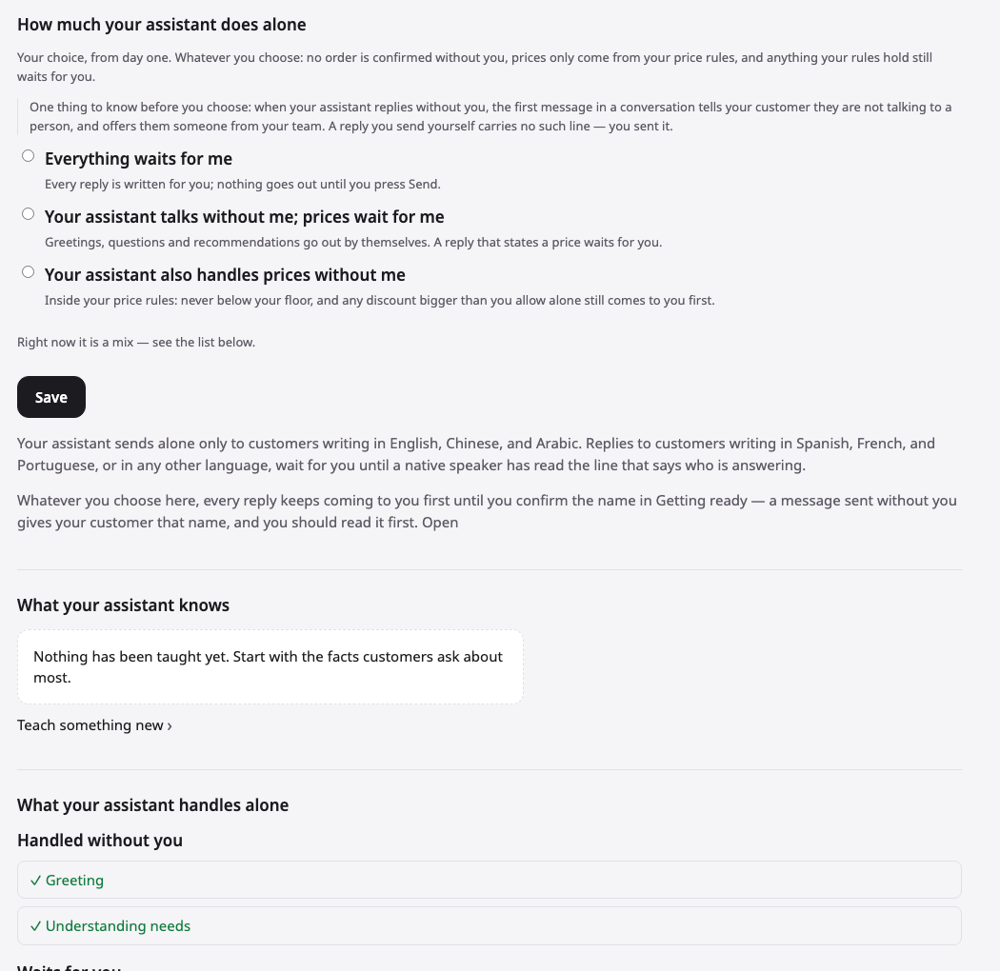 | no autonomy level selected, the "every reply keeps coming to you first until you confirm the name… Open" hold in small print under Save, and directly below it "Handled without you ✓ Greeting ✓ Understanding needs" | S1 |
| 2 | 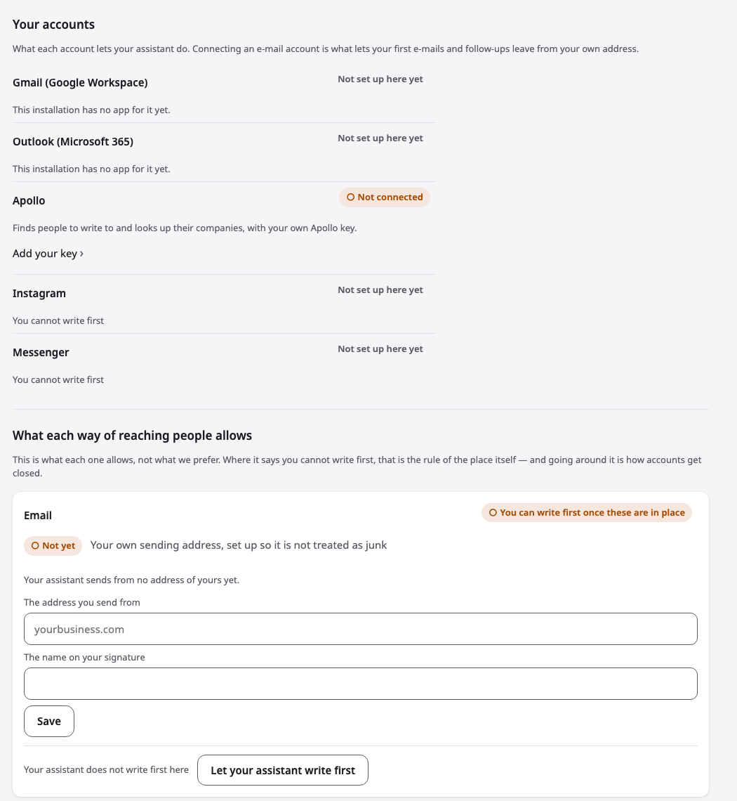 | "This installation has no app for it yet." for Gmail and Outlook, Apollo "○ Not connected", and the Email form whose "The address you send from" wants a domain and whose "The name on your signature" is the DKIM selector, with "Let your assistant write first" under "○ Not yet" | S1 |
| 3 | 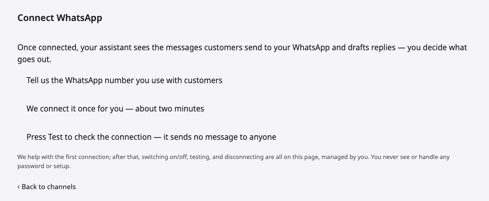 | "Connect WhatsApp": three unnumbered steps ("Tell us the WhatsApp number…", "Press Test…") and nothing to press but "‹ Back to channels" | S1 |
| 4 | 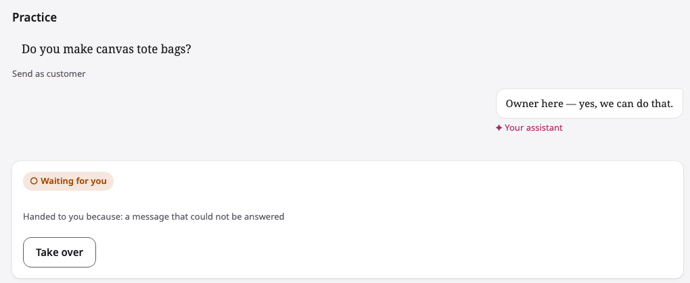 | the owner's "Owner here — yes, we can do that." captioned "✦ Your assistant", directly above "Handed to you because: a message that could not be answered" and a "Take over" button | S1 |
| 5 | 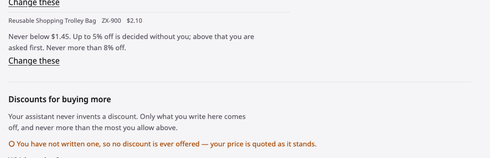 | "Never below $1.45. Up to 5% off is decided without you… Never more than 8% off." directly above "○ You have not written one, so no discount is ever offered" | S1 |
| 6 | 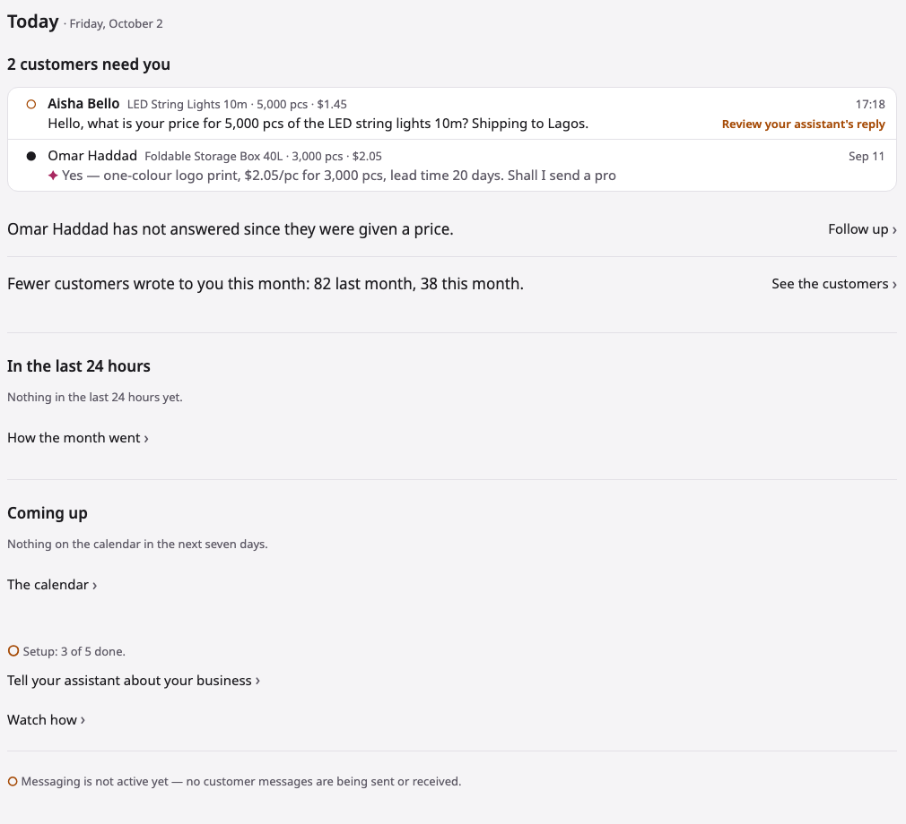 | Today: "Fewer customers wrote to you this month: 82 last month, 38 this month." on 2 October, "Nothing in the last 24 hours yet." under a 17:18 message, "Messaging is not active yet" under two waiting customers, Omar's preview cut "Shall I send a pro" | S1 |
| 7 | 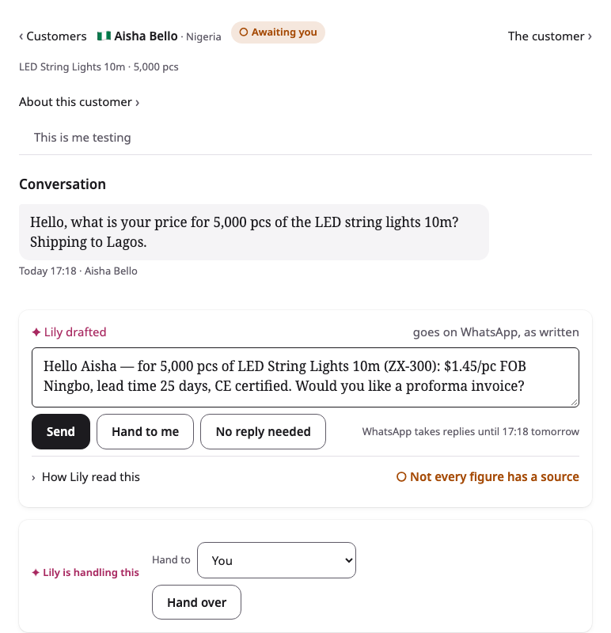 | "○ Awaiting you" over "✦ Lily is handling this"; "Lily drafted" with the name unconfirmed; "Hand to me" plus a second "Hand to [You] Hand over" card; "CE certified" in the draft | S2 |
| 8 | 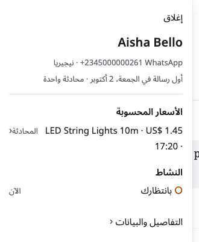 | Arabic customer panel: "2345000000261+" (plus on the wrong end) and the prices row "LED String Lights 10m · US$ 1.45" / "17:20 ·" with a stray separator | S2 |
| 9 | 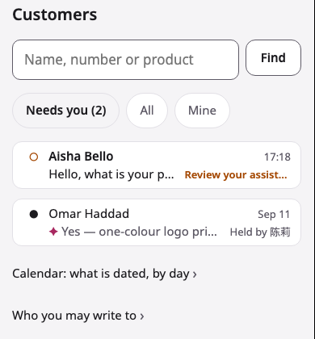 | the first screen of Customers on a phone. The only instruction is cut to "Review your assist…", the question to "Hello, what is your p…", and the second "Needs you" row says only "Held by 陈莉" | S2 |
| 10 | 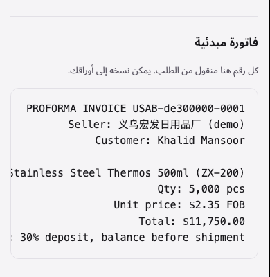 | the Arabic proforma, all in English, with line starts cut off ("tainless Steel…", ": 30% deposit, balance before shipment") | S2 |
| 11 | 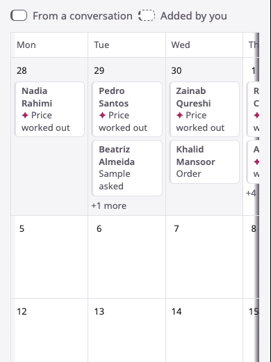 | the phone month: Thursday sliced to "R / C", "A", "+4", with today (Fri 2) and the weekend off-screen | S2 |
| 12 | 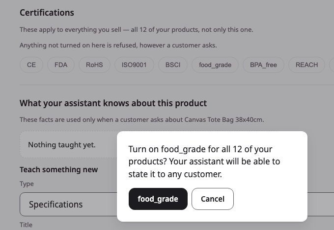 | the ask dialog "Turn on food_grade for all 12 of your products?" confirmed by a button labelled "food_grade", above chips with raw codes in Arial | S2 |
| 13 | 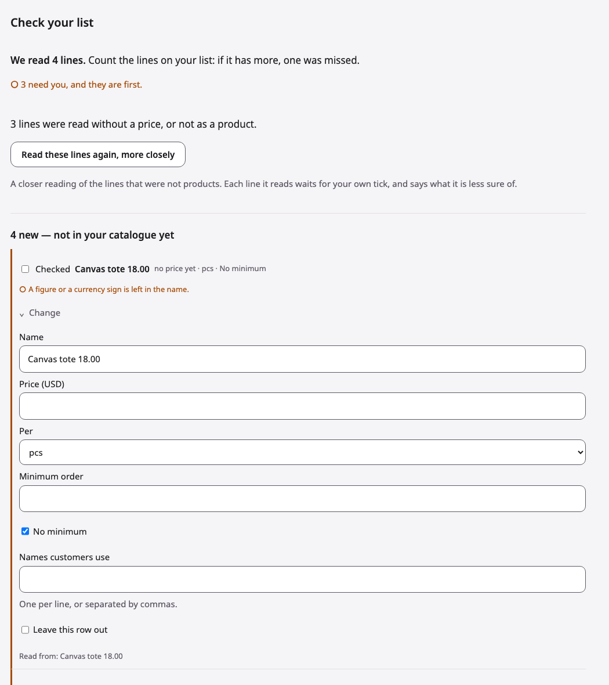 | "We read 4 lines… ○ 3 need you", "3 lines were read without a price", "4 new", and "Checked Canvas tote 18.00 · no price yet" with the price left in the name | S2 |
| 14 | 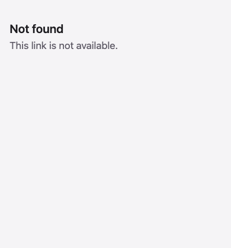 | an Arabic customer who pressed unsubscribe gets "Not found / This link is not available." in English, left to right, with no business, no list status and no other way to stop the mail (V1-081, V1-082, V1-083) | S2 |
| 15 | 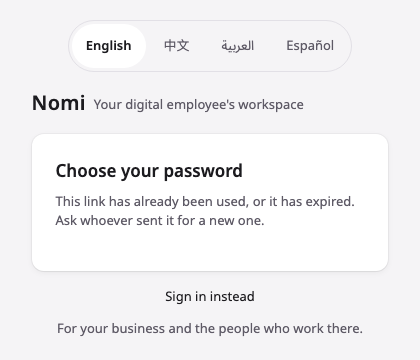 | "Choose your password" over a card with no form; "Ask whoever sent it for a new one." names nobody, and the only link, "Sign in instead", needs a password this person never set (V1-078, V1-079) | S2 |
| 16 | 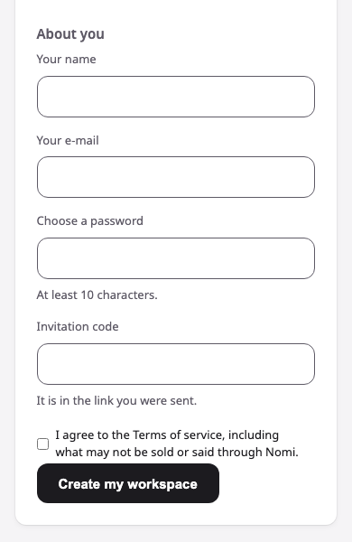 | the required "Invitation code" comes last ("It is in the link you were sent."), with no way to get one; the "Terms of service" link reads as plain text; "Create my workspace" (in Arial) sits tight under the checkbox (V1-047, V1-050, V1-049, V1-053) | S2 |
| 17 | 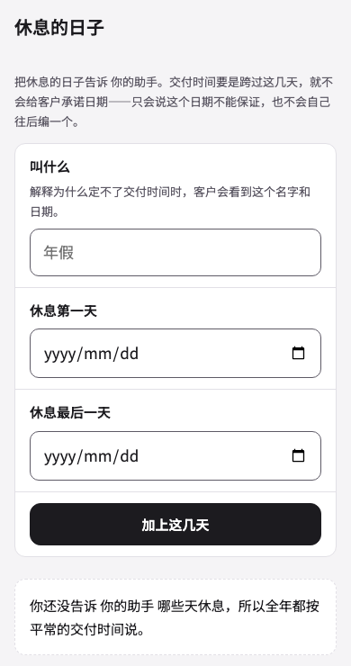 | "把休息的日子告诉 你的助手。" and "你还没告诉 你的助手 哪些天休息" with stray spaces mid-sentence, and the date fields' "yyyy/mm/dd" | S2 |
| 18 | 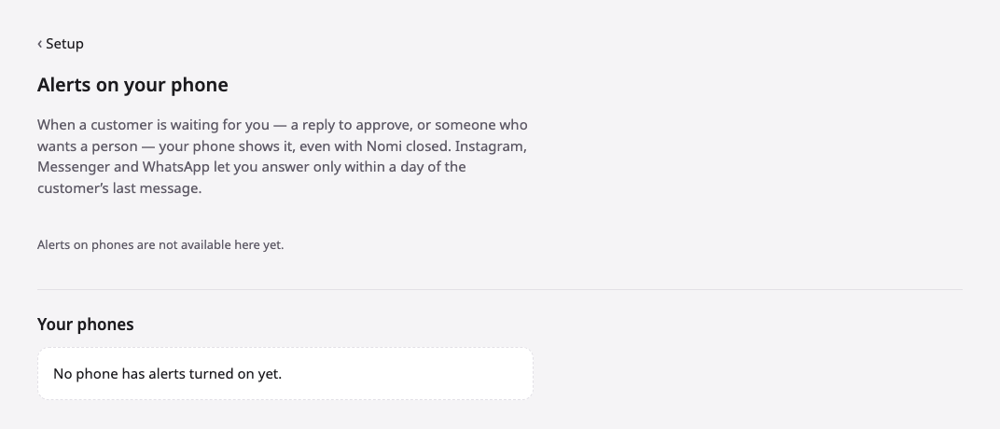 | the lede promises "your phone shows it, even with Nomi closed", then "Alerts on phones are not available here yet." over an empty "No phone has alerts turned on yet." panel | S2 |
| 19 | 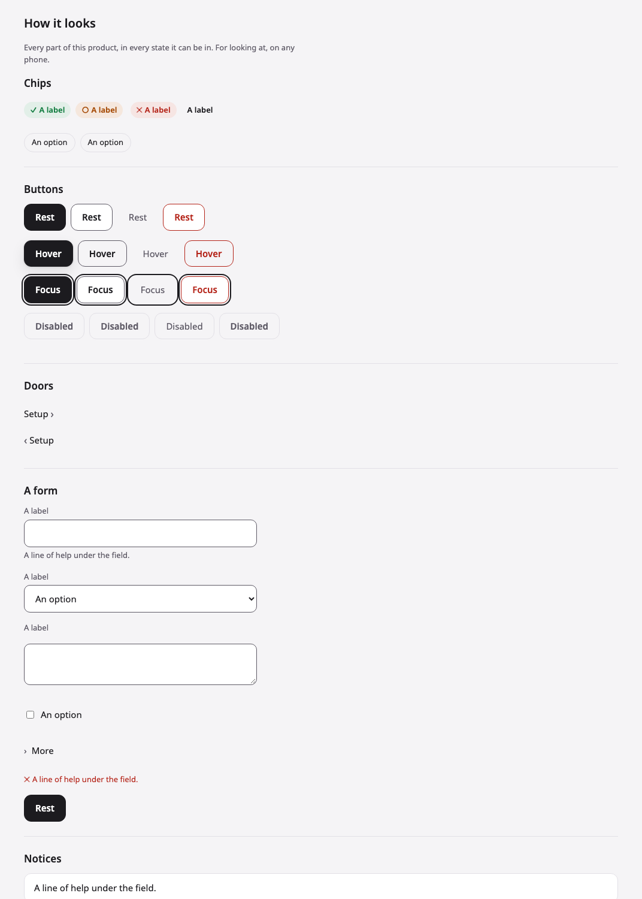 | the internal gallery still served to the owner: "Rest / Hover / Focus / Disabled", "A label", "A line of help under the field." as error and notice, a bare fourth chip, no back link | S2 |
| 20 | 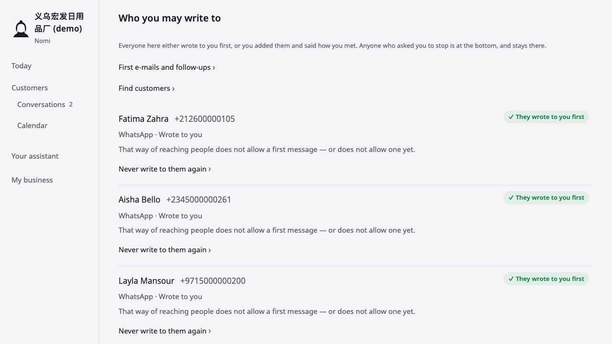 | "Who you may write to" above rows that each say "does not allow a first message", under a green "✓ They wrote to you first"; the first of 71 such rows | S2 |
| 21 | 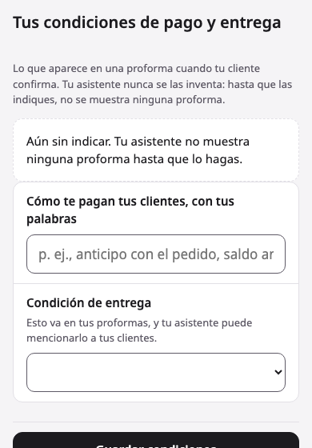 | cut placeholder "p. ej., anticipo con el pedido, saldo ar" and the blank, required "Condición de entrega" select of bare Incoterm codes; the not-set panel flush on the card | S2 |
| 22 | 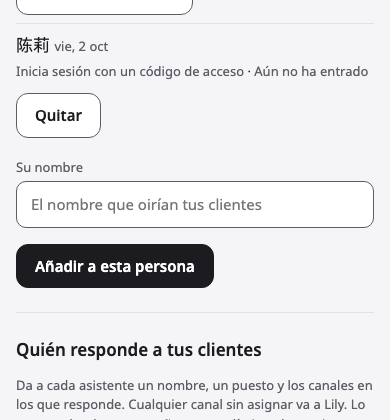 | "Quitar" → "Su nombre" → "Añadir a esta persona" stacked under 陈莉's row with no heading | S2 |
| 23 | 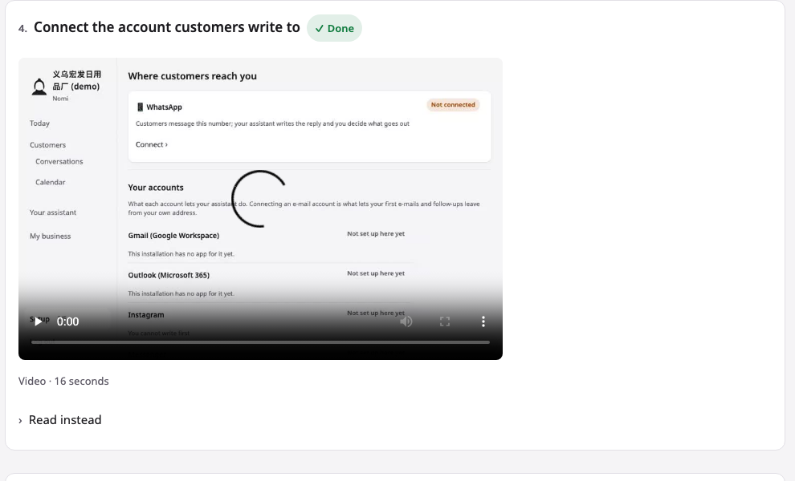 | Getting started step 4 "✓ Done" over a still of the old app saying "WhatsApp — Not connected" and "This installation has no app for it yet.", loading ring and "0:00" | S2 |
| 24 | 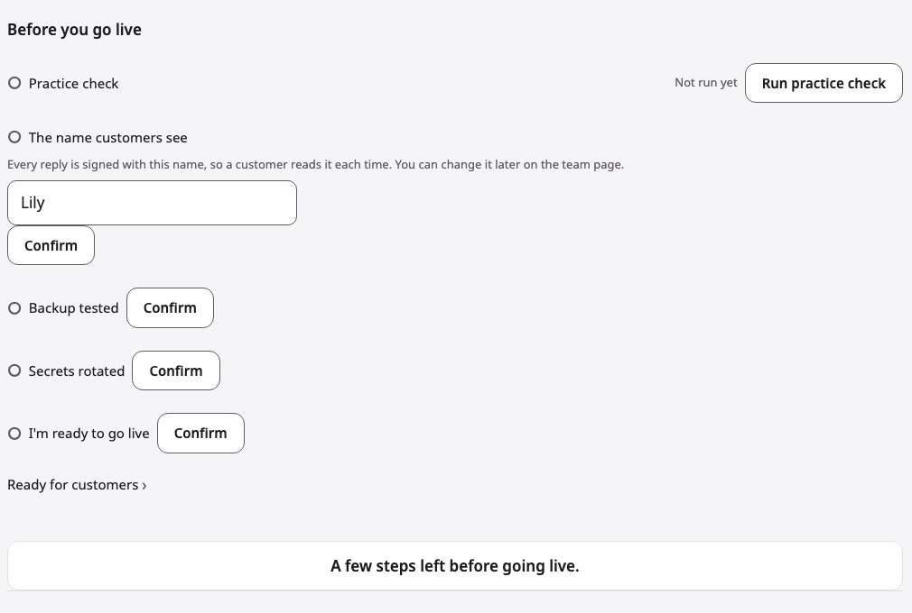 | Getting ready: "Backup tested [Confirm]", "Secrets rotated [Confirm]", "Lily" pre-filled with "Confirm" dropped below, "the team page", the button-like "A few steps left before going live." | S2 |
| 25 | 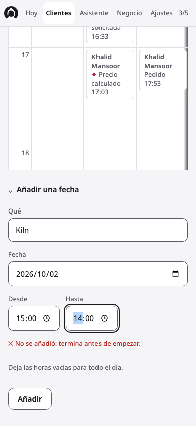 | the calendar's add form sent back: the reason is there, the wrong field is not marked | S3 |

---

## 1 · Problems that run through the whole product

### (whole product)

- **S1** · V1-001 · fr · every page — there is no French. With `yf_locale=fr` or `Accept-Language: fr`, every owner page, sign-in, sign-up, the site and the policies render `<html lang="en">`; the switch offers English, 中文, العربية, Español.
- **S2** · V1-002 · all locales — one area, three names. The desktop rail heads "Customers" over "Conversations 2" and "Calendar", both rows open the same list, headed "Customers"; the search's empty state says "See all conversations"; the conversation's back link is "‹ Customers".
- **S2** · V1-003 · all locales — browser tabs don't name the page: account, closures, forbidden words and the other Setup pages are titled "Setup · 义乌宏发日用品厂 (demo)"; "Your price limits" and "How you sell" are "My business · …"; an order is "Customers · …"; a product is "Products · …".
- **S2** · V1-004 · all locales — setting up has several names: Setup's first group lists "Getting started" next to "Getting ready"; the rail and the phone nav count "Setup 3/5" ("设置 3/5", "Ajustes 3/5").
- **S2** · V1-005 · all locales — the assistant's name is used before it is chosen: "✦ Lily drafted", "How Lily read this", "✦ Lily is handling this" and now "Lily is writing a reply" on the conversation page, while the name step is still "To do".
- **S2** · V1-006 · all locales — internal and developer words still reach the owner: "Secrets rotated", "Backup tested" and "During the pilot" (Getting ready); "This installation has no app for it yet" (channels); "Rest / Hover / Focus / Disabled" (the gallery, still reachable at its address); raw codes like "food_grade"; the category "bags"; "pcs" in zh/ar/es fields; the Incoterm codes.
- **S2** · V1-007 · all locales — failure states are still uneven, though two of the four are fixed (the store/“Read the page” refusals now come back under their field; a missing product or conversation now says why and where to go). Still: pressing "See what your assistant recognizes" with an empty box reloads the page and says nothing; a wrong /app address for a signed-in owner shows the signed-out door page ("That page is not here", the language switch, "Your digital employee's workspace", no rail).
- **S2** · V1-008 · ar — mixed Latin and Arabic text: the prefix لـ is still written as a separate word ("لـ مساعدك …" on My business, five times); browser-drawn date and file controls stay English and left-to-right. (Calendar names are no longer cut at their start; the list preview no longer starts "…our price".)
- **S2** · V1-009 · es — numbers keep English formatting: "$1.05", "$2.60", "$0.85" on the products list.
- **S2** · V1-010 · zh — stray spaces around the fallback name: "把休息的日子告诉 你的助手。", "你还没告诉 你的助手 哪些天休息".
- **S2** · V1-011 · all locales — the counts disagree: Today "2 customers need you", Results "1 Awaiting you", Getting ready "Waiting for you 0", Your assistant "No customer has asked anything yet", Today "Nothing in the last 24 hours yet".
- **S2** · NEW (missed) · all locales · both widths — five empty states are still plain grey lines, not the panel every other empty state became: Today's "Nothing in the last 24 hours yet." and "Nothing on the calendar in the next seven days.", the calendar's "Nothing this week/day/month" line and "Nothing today" in the list.
- **S3** · V1-012 · all locales — the page furniture is still inconsistent, though the settings forms now share one row layout: Today's last-24-hours and coming-up lines end in "→" while the rest of the product uses "›"; closures, forbidden words, rate, samples, terms and people still have no "‹ Setup" back link; content stops near 850 px while some section rules run wider.
- **S3** · V1-013 · all locales — some states still differ by colour alone: on Your assistant, "Waits for you" and "Always waits for you" use the same "○", one amber and one grey; selected tabs are a pale fill (the word is bolder, the fill weaker than the unselected pills). (Pills now carry ✓/○/✕; "Not connected" and "Awaiting you" are both ○ amber on purpose — both wait for the owner.)
- **S3** · V1-014 · all locales — the rail: the phone nav's "Customers" carries no count; the Chinese business name wraps mid-word in the desktop rail ("义乌宏发日用 / 品厂 (demo)"); no entry is lit on an order page.
- **S3** · NEW · all locales · phone — the same nav entry has two names by width: "Assistant" / "Business" on a phone, "Your assistant" / "My business" on a laptop (助手 / 生意 vs 你的助手 / 我的生意).
- **S3** · NEW · zh, es · phone — the calendar's "Add a date" form, sent back, focuses the field that was wrong and says why under the times ("No se añadió: termina antes de empezar."), but the field is not marked: no red edge, unlike every settings form's field.
- **S4** · NEW · en · phone — the "ask first" dialog's going-ahead button repeats the asking button's long word in full ("Let your assistant write first"), so on a phone Cancel drops to its own line under it (zh and ar fit on one row).

## 2 · Public site, sign-in, sign-up and policy pages

### site
**Asks the owner to:** write an e-mail asking for an invitation, or sign in if they already have a workspace. **Clear without explanation?** Partly — the action is obvious, but it is a bare mail link and the page never says who runs Nomi or what it costs.

- **S2** · V1-015 · all locales · desktop, phone — the site still names no operator, company or country anywhere: not in the header, not in any section, not in the footer ("Privacy  Terms of service  Delete your data  Sign in"). The only contact is a mail link, "Our address: …". Promises such as "No price ever goes below the lowest price you set" and "We read every new workspace, and help you set up where you need it" come from a sender a stranger cannot identify.
- **S3** · V1-016 · all locales · desktop, phone — the site gives two rules for sending alone. The hero says "Nothing goes out on its own until you allow it, and then only what you allowed." The card "What goes out alone" says "You can let greetings and questions go out on their own while anything with a price waits, or let prices go too." "The first workspaces" says "Sending on its own opens only once your assistant has earned it with your own customers." "earned it" is never explained.
- **S3** · V1-017 · all locales · desktop, phone — "We read every new workspace, and help you set up where you need it." (每一个新工作台我们都会看过，需要时帮你一起设置。 / نطّلع على كل مساحة عمل جديدة، ونساعد في الإعداد عند الحاجة. / Revisamos cada espacio de trabajo nuevo…) still reads as "we read what is in your workspace". The linked privacy page ends "Who sees it" with "Nobody else."
- **S3** · V1-018 · all locales · desktop, phone — the example card's "Change" / "Send" (修改 / 发送, تعديل / إرسال, Cambiar / Enviar) are drawn as an outlined and a filled black button, but they are plain text spans that do nothing.
- **S3** · V1-019 · ar, es · phone — header: "تسجيل الدخول" / "Iniciar sesión" still drops onto its own line under the language pill, cut off from the header. In en and zh, "Sign in" / "登录" sits beside the pill.
- **S3** · V1-020 · all locales · desktop, phone — "Ask for an invitation" (申请邀请 / طلب دعوة / Pedir una invitación) and its button still sit about 24 px in from the edge every other section uses: desktop x≈176 against 152 (ar 1104 against 1128), phone 40 against 16. No visible box explains the indent.
- **S3** · V1-021 · all locales · desktop, phone — the site and the three policy pages load no web font and render in the system face. "Sign in" lands on login and sign-up, which load Noto Sans, so the typeface changes at the product's own door.
- **S3** · NEW · all locales · desktop, phone — the example card, "Your assistant’s draft" with an amber pill "Waiting for you" (等你批准 / بانتظار موافقتك / Esperando tu aprobación) and the buttons "Change" / "Send" (Cambiar / Enviar), no longer matches the draft card the rebuild gives the owner. That card says "✦ … drafted", marks the wait with "○ Waiting for you" (在等你 / بانتظارك / Te espera) and offers "Edit" (Editar), "Hand to me" and "No reply needed". The site shows words, a sign and a button ("Change") that the product no longer uses.
- **S3** · NEW (missed) · all locales · desktop, phone — the page's only primary action, "Write to us for an invitation" (写信给我们，申请邀请 / مراسلتنا لطلب دعوة / Escríbenos para pedir una invitación), appears twice and is a bare `mailto:` with no subject or text. There is no form, and on a device with no mail program set up the press does nothing visible.
- **S3** · NEW (missed) · ar · desktop, phone — the Latin "Nomi" inside Arabic sentences ("يمنح Nomi عملك…", "تُفتح Nomi أولًا…", the heading "لمن Nomi", "الانضمام إلى Nomi…") is visibly larger and darker than the Arabic around it. The site loads no web font, so the Arabic falls back to a small system face. V1-060 reports the same on the policy pages; it holds on the site too.
- **S4** · V1-022 · all locales · desktop, phone — under "How it works" the step numbers "1 2 3" (ar "١ ٢ ٣") still sit about 15 px further in than the step headings below them.
- **S4** · V1-023 · en · desktop, phone — "e-mail" still breaks at its hyphen: in the hero, "…Messenger or e-" / "mail, your assistant drafts…" (both widths), and in step 2, "On WhatsApp, Instagram, Messenger or e-" / "mail." (phone).
- **S4** · V1-024 · zh · desktop, phone — the h1 breaks as "每位客户都有回复，最后说了算的是" / "你。" on desktop and "每位客户都有回复，最" / "后说了算的是你。" on phone. "…才会开放自己发" / "送。" leaves "送。" alone on desktop.
- **S4** · V1-025 · zh · desktop, phone — "只有助手在你自己的客户身上赢得之后，才会开放自己发送。" is unchanged and still a literal rendering of "earned it with your own customers".
- **S4** · V1-026 · es · desktop — "…por invitación, unos pocos negocios cada" / "vez." still leaves the orphan "vez."
- **S4** · V1-027 · all locales · desktop, phone — "Nomi opens to a small group first, by invitation, a few businesses at a time." is still followed almost at once by "Nomi opens workspaces by invitation for now." The same sentence appears twice.
- **S4** · V1-028 · ar · desktop, phone — the site's steps use "١ ٢ ٣". The pages linked from its footer use Western digits: "آخر تحديث: 27 سبتمبر 2026." and "1 أكتوبر 2026", and data-deletion's numbered steps run "1. 2. 3. 4.". The public pages use two numeral systems.
- **S4** · V1-029 · en · phone — footer: "Privacy  Terms of service  Delete your data" fills the first line and "Sign in" wraps alone onto the second. The "·" separators are gone; the orphan stays.
- **S4** · V1-030 · es · phone — in the example card, "Borrador de tu asistente" and the "Esperando tu aprobación" pill still stack left-aligned on two lines. In en, zh and ar they sit on one line at the end side.
- **S4** · NEW (missed) · all locales · desktop, phone — one page carries three filled black buttons: "Write to us for an invitation" twice and the example's "Send". The owner pages keep one filled button per page.
- **S4** · NEW (missed) · ar · desktop, phone — about 380 px (phone) and 135 px (desktop) of empty page lie under the footer's language pill. en, zh and es end about 50 px under it.
- **S4** · NEW (missed) · all locales · desktop, phone — the footer's "Delete your data" (删除你的数据 / حذف بياناتك / Borrar tus datos) sits on a page written for business owners but opens a page written for the business's customers ("If you wrote to a business that uses Nomi…"). An owner who wants their own workspace's data deleted finds nothing about it.
- **S4** · NEW (missed) · zh · phone — orphan lines: "…外贸公司和批发" / "商。" and "…阿拉伯文或西班牙" / "文。". es · desktop: "…configurarlo donde lo" / "necesites."
- **S4** · NEW (missed) · zh · desktop, phone — "我们的地址：" is followed by a space before the address, so the full-width colon and the space leave a double gap before "privacy@…".

### login
**Asks the owner to:** sign in with e-mail and password. **Clear without explanation?** Partly — the form is plain, but nothing on the page says "Sign in": the heading is the brand line and the button says "Enter workspace".

- **S3** · V1-031 · all locales · desktop, phone — "Enter workspace" / 进入工作台 / دخول / "Entrar al espacio de trabajo" and both fields still compute to Arial. The labels and links around them are in Noto Sans, so the small card uses two typefaces.
- **S3** · V1-032 · all locales · desktop, phone — no heading names the task. The only h1 is the brand line "Nomi Your digital employee's workspace". The tab says "Nomi · Log in", the site's link says "Sign in" and the button says "Enter workspace".
- **S3** · V1-033 · all locales · desktop, phone — "New here? Set up your business" (第一次来？为你的生意开一个工作台 / أول مرة هنا؟ إنشاء مساحة عمل لنشاطك التجاري / ¿Primera vez aquí? Crea el espacio de tu negocio) still invites anyone to sign up. The site says "Nomi opens workspaces by invitation for now", and the form behind the link requires an "Invitation code".
- **S3** · V1-034 · all locales · desktop, phone — "New here? Set up your business" (black) and "I have an access code" (grey) are links with no underline, each styled differently. Both read as plain text.
- **S3** · V1-035 · all locales · desktop, phone — the tagline still reads "Your digital employee's workspace" / "你的数字员工工作台" in en and zh, but "El espacio de trabajo de tu asistente digital" / "مساحة عمل مساعدك" in es and ar. The site says "assistant".
- **S3** · V1-036 · zh · desktop, phone — "我有进入密码" sits just under the "密码" field, so two different secrets share one word.
- **S4** · V1-037 · all locales · desktop — both fields are still `required` and the page has no message of its own. An empty "Enter workspace" press can only raise the browser's bubble. (Checked in the page code; nothing was submitted in this re-audit.)
- **S4** · V1-038 · all locales · desktop, phone — the footer still reads "For your business and the people who work there."; the es version is still "Para tu negocio y las personas que trabajan allí."
- **S4** · V1-039 · all locales · desktop, phone — the door offers only the language switch, "New here? Set up your business" and "I have an access code". There is no link to the site, the privacy page or the terms.
- **S4** · V1-040 · all locales · phone, desktop — the brand line "Nomi Your digital employee's workspace" is start-aligned (left; right in ar), while the language pill above it and the links below are centred. Visible at both widths.
- **S4** · NEW (missed) · all locales · desktop, phone — the language switch looks different one click apart. On the site every name in the pill is underlined like a link ("English 中文 العربية Español"). On the sign-in, sign-up and error doors the same pill shows plain grey names with no underline.
- **S4** · NEW (missed) · all locales · desktop, phone — the site's brand mark next to "Nomi" disappears here. The door's "Nomi" is plain bold text, so "Sign in" lands on a page that does not look like the site the visitor came from.
- **S4** · NEW · all locales · desktop, phone — "Enter workspace" (and "Enter with the code", "Create my workspace") shows nothing while the request runs, and nothing stops a second press. The door pages load no script, so the busy state the rebuilt owner pages give their buttons is missing here.

### login-code
**Asks the owner to:** type an access code. **Clear without explanation?** No — the card holds one label, "Access code", and nothing says what the code is or where it comes from.

- **S2** · V1-041 · all locales · desktop, phone — the code card (`/login?with=code`) still holds only the label "Access code" / 进入密码 / رمز الدخول / "Código de acceso", one field and "Enter with the code". There is no heading and no sentence saying where the code comes from. Sign-up's "Invitation code" adds a second kind of code, and neither is explained.
- **S3** · V1-042 · all locales · desktop — a wrong code gives "✕ Wrong code, please try again." (now with a red ✕) as a small line above the "Access code" label. It is not under the field and not tied to it. The form posts to `/login`, so the address loses "?with=code". (Checked against the page code; no code was submitted.)
- **S3** · V1-043 · all locales · desktop, phone — the code field is still `type=password` (dots) with no way to show it.
- **S3** · V1-044 · zh · desktop, phone — the label "进入密码" and the button "用进入密码进入" are unchanged: "进入…进入" repeats, and "密码" collides with the password.
- **S3** · V1-045 · all locales · desktop, phone — "Enter with the code" / 用进入密码进入 / الدخول بالرمز / "Entrar con el código" computes to Arial under a Noto Sans label.
- **S4** · V1-046 · all locales · desktop, phone — the link back reads "Sign in with your e-mail" / 用邮箱登录 / تسجيل الدخول بالبريد الإلكتروني / "Iniciar sesión con tu correo", one more name for signing in.

### signup
**Asks the owner to:** describe the business, give a name, an e-mail and a password, paste an invitation code and agree to the terms. **Clear without explanation?** Partly — the fields are plain, but the required invitation code comes last and nothing says how to get one.

- **S2** · V1-047 · all locales · desktop, phone — the required "Invitation code" (邀请码 / رمز الدعوة / Código de invitación) still comes after the business and personal fields, with only "It is in the link you were sent." under it. Nothing says how to get a code, and there is no link to ask for an invitation.
- **S3** · V1-048 · all locales · desktop, phone — the "What do you sell or do?" placeholder is cut at both widths: "e.g. skincare, clothing, social media a", "例如：护肤品、服装、社交媒体广告", "مثال: منتجات العناية بالبشرة أو الملابس أو إعلانات", "p. ej., cosmética, ropa, anuncios en r". On desktop the card is still about 356 px wide.
- **S3** · V1-049 · all locales · desktop, phone — the selects ("Choose…" / 请选择… / اختيار… / Elige…), the placeholders and "Create my workspace" render in Arial, larger than and different from the Noto Sans labels.
- **S3** · V1-050 · all locales · desktop, phone — in "I agree to the Terms of service, including what may not be sold or said through Nomi.", "Terms of service" has no underline or colour and reads as plain text.
- **S3** · V1-051 · all locales · desktop, phone — the form collects name, e-mail, business and country, and still links nowhere to the privacy page.
- **S3** · NEW (missed) · all locales · desktop, phone (refused state, drawn from the page code) — after a refusal the page reopens at the top with the cursor in "Business name". Refusals under "Website, if you have one" or "Choose a password" sit 600–1,200 px further down, and no line at the top says anything was refused. The typed password is gone, and nothing says so.
- **S4** · V1-052 · zh, ar, es · desktop, phone — the website placeholder is still the English "yourbusiness.com".
- **S4** · V1-053 · all locales · desktop, phone — "Create my workspace" still sits about 8 px under the two-line terms checkbox, while the form's other gaps are 16–24 px.
- **S4** · V1-054 · all locales · desktop, phone — Country still offers 250 entries, among them "Antarctica", "Bouvet Island", "Heard & McDonald Islands" and "U.S. Outlying Islands", with nothing preselected.
- **S4** · V1-055 · es · desktop, phone — "Sitio web, si tienes" still lacks its object.
- **S4** · V1-056 · zh · desktop, phone — the lead "每个生意一个工作台。你用自己的邮箱和密码登" / "录。" leaves "录。" alone, now on desktop as well as phone. The labels still switch between "你的生意是哪一类？" and "你们卖什么，或做什么？".
- **S4** · NEW (missed) · all locales · desktop, phone (refused state) — "✕ Tick this to agree to the terms." (✕ يُرجى التأشير للموافقة على الشروط.) sits about 2 px under the second line of the terms checkbox, touching it. A refused field gets no border or mark of its own; only the red line under it shows the refusal.
- **S4** · NEW (missed) · es · desktop, phone — the checkbox reads "Acepto los Términos del servicio…", but the page it opens, the site footer and the privacy page all call them "Condiciones del servicio".

### privacy
**Asks the owner to:** nothing; it tells a business's customers what is kept and how to have it removed. **Clear without explanation?** Partly — it reads plainly, but never says who "we" is.

- **S2** · V1-057 · all locales · desktop, phone — in "When you send a message to a business that uses Nomi, we keep the message…", "we" is still never named. There is no company, country or postal address.
- **S3** · V1-058 · all locales · desktop, phone — privacy, terms and data-deletion still open on a bare heading. There is no logo, no link to the site and no language switch.
- **S3** · V1-059 · all locales · desktop, phone — "Write to <address>." is still followed by "Or send the business a message saying so, from the account you used." (或者用你当时使用的账号，给商家发一条消息说明即可。 / أو إرسال رسالة بذلك إلى الشركة… / O envía al negocio un mensaje que lo diga…). "saying so" points at nothing.
- **S3** · V1-060 · ar · desktop, phone — "Nomi", "Meta", "Anthropic", "Railway", "Google", "Microsoft", the contact address and "27 … 2026" render larger and darker than the Arabic around them. The Arabic falls back to a small system face because no web font is loaded. The same happens on terms and data-deletion.
- **S4** · V1-061 · all locales · desktop, phone — "Replies here are drafted by an AI assistant" / "这里的回复由 AI 助手起草" / "الردود هنا يصوغها مساعد آلي" / "Las respuestas de aquí las redacta un asistente de IA": the page has no replies for "here" to point at. This also holds in zh and ar, not only en and es.
- **S4** · V1-062 · zh · desktop, phone — "写信到 <address>." still ends in an ASCII "." instead of "。". The same happens on terms and data-deletion.
- **S4** · NEW (missed) · all locales · desktop, phone — the deletion page goes by three names. The text twice says "the deletion page" without linking it. The link under "Your choices" reads "How to have your data removed" (怎样删除你的数据 / كيفية طلب حذف بياناتك / Cómo pedir que se borren tus datos). That page, and the site footer, call it "Delete your data".
- **S4** · NEW (missed) · all locales · desktop, phone — the page title "Privacy" is set at 20 px, barely larger than its 17 px section heads ("What is kept", "Why"), with nothing above it. The page opens on what looks like one more section heading.

### terms
**Asks the owner to:** nothing on the page; these are the terms sign-up makes them accept. **Clear without explanation?** Partly — plain, but the other party is only "the operator of Nomi".

- **S2** · V1-063 · all locales · desktop, phone — "These terms are between a business that uses Nomi and the operator of Nomi, reachable at nomidoes.com." There is still no legal name, address, country or governing law.
- **S3** · V1-064 · all locales · desktop, phone — "How to reach us" still ends with the customer line "Or send the business a message saying so, from the account you used." The first paragraph says people who write to a business "are covered by the privacy page, not by these terms."
- **S3** · V1-065 · all locales · desktop, phone — "Fees are as agreed with you in writing." No price or plan appears anywhere on the public pages, and sign-up's terms checkbox is still the last step before a workspace exists.
- **S3** · V1-066 · all locales · desktop, phone — terms has no logo, no home link and no language switch.
- **S3** · NEW (missed) · all locales · desktop, phone — the terms say "By default every reply waits for a person at your business to approve it; what may be sent without that approval is your decision, and you can take it back at any time." The site the owner came from says "Sending on its own opens only once your assistant has earned it with your own customers." The contract gives the owner a choice that the site says must be earned.
- **S4** · V1-067 · en · desktop, phone — the straight apostrophe in "the operator's total liability" remains, while the site uses "’" ("business’s").
- **S4** · V1-068 · zh · desktop, phone — "…运营方可以暂停该工作台的发送或停用该工作台，并告诉所有者原因。" still uses the stiff, legal-sounding 所有者.
- **S4** · V1-069 · ar · desktop — about 340 px of empty page lie under "آخر تحديث: 1 أكتوبر 2026.", where en ends about 70 px under its date.
- **S4** · NEW (missed) · en · desktop, phone — the terms address the business as "you", then switch to the third person: "the operator may pause its sending or suspend it, and tells the owner why."
- **S4** · NEW (missed) · all locales · desktop, phone — "Fees and leaving" says records "are removed on request as the privacy page describes". The privacy page in turn says "What a deletion removes, and what it keeps, is on the deletion page", so the reader passes through two pages to find the answer.
- **S4** · NEW (missed) · zh · desktop — list items leave a single character and its full stop on a line of their own: "…或者你无法证明的说" / "法。" and "…以及骚扰任何人的消" / "息。".

### data-deletion
**Asks the owner to:** nothing; it tells a business's customers to message the business, or write to the address, to have their data deleted. **Clear without explanation?** Partly — the steps are there, but step 1 holds two routes and nothing confirms that a request was received.

- **S3** · V1-070 · all locales · desktop, phone — "Notes and signals about your conversations." (关于你的对话的备注和标记。 / الملاحظات والإشارات المتعلقة بمحادثاتك. / Las notas y señales sobre tus conversaciones.) "signals" is still internal jargon.
- **S3** · V1-071 · all locales · desktop, phone — step 1 still holds two routes: "You ask the business. Send it a message … saying you want your data deleted." Then, on a new line inside the same item: "You can also write to us at the address below, and we pass your request on to the business."
- **S3** · V1-072 · all locales · desktop, phone — the page still says "…within 30 days of the business recording the request" and "Nomi does not write to you about it." The customer gets no deadline counted from their own request and no confirmation.
- **S3** · V1-073 · all locales · desktop, phone — data-deletion has no logo, no home link and no language switch.
- **S4** · V1-074 · en · desktop, phone — the straight apostrophe in "Nomi's operator, who runs the service for the business…" remains.
- **S4** · NEW (missed) · all locales · desktop, phone — "Copies inside backups of the whole service. A backup is not changed to remove one person; your data leaves it when that backup is deleted." gives no time, so the customer cannot tell how long a copy survives.
- **S4** · NEW (missed) · all locales · desktop, phone — under "How to reach us", "Write to <address>." is followed by "Or send the business a message saying so, from the account you used." This is the same dangling "saying so" as on privacy (V1-059), and here it repeats step 1.
- **S4** · NEW (missed) · zh · desktop — "…你的电话号码、邮箱地址和账号标" / "识。" leaves "识。" alone.

### not-found-public
**Asks the owner to:** nothing; it offers "Back to Today". **Clear without explanation?** No — it speaks of "your workspace" to a visitor who has none, and its only link names an app page.

- **S2** · V1-075 · all locales · desktop, phone — a signed-out visitor at `/nope` still reads "That page is not here / The address you opened does not belong to anything in your workspace. It may have been mistyped, or it may be an old link." (在你的工作台里没有对应的东西 / لا يقابله شيء في مساحة عملك / no corresponde a nada de tu espacio de trabajo).
- **S2** · V1-076 · all locales · desktop, phone — the only link is still "Back to Today" (回到「今天」 / العودة إلى «اليوم» / Volver a Hoy), which signed out lands on the sign-in form. There is no link to the site.
- **S4** · V1-077 · es, ar · desktop, phone — "Esa página no está aquí" / "هذه الصفحة ليست هنا" are unchanged and still read as literal translations.

### set-password-bad
**Asks the owner to:** ask whoever sent the link for a new one, or sign in. **Clear without explanation?** No — it names nobody and gives no contact, and "Sign in instead" needs a password this person never set.

- **S2** · V1-078 · all locales · desktop, phone — the heading "Choose your password" (设置你的密码 / اختيار كلمة المرور / Elige tu contraseña) and the tab "Nomi · Choose your password" still sit over a card with no form.
- **S2** · V1-079 · all locales · desktop, phone — "This link has already been used, or it has expired. Ask whoever sent it for a new one." names nobody. The only link, "Sign in instead" (直接登录 / تسجيل الدخول بدلًا من ذلك / Iniciar sesión), leads to a sign-in this person cannot use.
- **S4** · V1-080 · zh · desktop, phone — "直接登录" is unchanged.

### unsubscribe-bad
**Asks the owner to:** nothing; it offers no action. **Clear without explanation?** No — two English lines, with no business named and no way to stop the mail.

- **S2** · V1-081 · all locales · desktop, phone — `/u?t=x` still shows only "Not found / This link is not available." There is no business name, no word on whether the person is still on the list, no reply instruction and no link to /privacy or /data-deletion.
- **S2** · V1-082 · zh, ar, es · desktop, phone — the page is still `lang="en"`, left to right, with the tab "Not found", whatever the language.
- **S3** · V1-083 · all locales · desktop, phone — two lines sit at the top of an otherwise empty page, with no logo or product name (desktop: x≈324 on a 1280 px page). It looks like a server error.
- **S4** · NEW (missed) · all locales · desktop, phone — the tab title "Not found" carries no product or business name, unlike every other public page ("Privacy · Nomi", "Nomi · Log in"). The same holds on proof-bad.

### proof-bad
**Asks the owner to:** nothing; it offers no action. **Clear without explanation?** No — the same two English lines, and nothing says whose price link broke.

- **S2** · V1-084 · zh, ar, es · desktop, phone — `/p/x` shows "Not found / This link is not available." in English in every locale (`lang="en"`, tab "Not found").
- **S2** · V1-085 · all locales · desktop, phone — the broken "where the price came from" link names no seller, gives no reason and offers no next step. Its words are identical to the failed unsubscribe.
- **S3** · V1-086 · all locales · desktop, phone — the same bare two-line layout at the top of an empty page, with no brand.

## 3 · Today, setting up, and the Setup hub

### today
**Asks the owner to:** review Aisha Bello's drafted reply, follow up Omar Haddad, finish setup. **Clear without explanation?** Partly — Aisha's row says what to do, Omar's row says nothing, and the month / 24-hour / messaging lines contradict the rows above them.

- **S1** · V1-087 · "Fewer customers wrote to you this month: 82 last month, 38 this month." (zh "这个月写来的客户少了：上个月 82 个，这个月 38 个。", ar "كتب إليك عملاء أقل هذا الشهر: 82 الشهر الماضي، 38 هذا الشهر.", es "Este mes te escribieron menos clientes: 82 el mes pasado, 38 este mes.") — on "Friday, October 2" a whole September is set against two days of October and announced as a fall; the figures are message counts, not customers.
- **S2** · V1-088 · "In the last 24 hours — Nothing in the last 24 hours yet." (zh "过去 24 小时里还没有动静。", ar "لا شيء خلال آخر 24 ساعة حتى الآن.", es "Todavía nada en las últimas 24 horas.") sits under "Aisha Bello … 17:18 · Review your assistant's reply": a customer wrote and a reply was drafted the same day, and the block says nothing happened.
- **S2** · NEW (missed) · all locales · both widths — "○ Messaging is not active yet — no customer messages are being sent or received." (zh "消息通道尚未启用——暂时不会收发任何客户消息。", ar "قناة الرسائل غير مُفعّلة بعد — لا يتم إرسال أو استقبال أي رسائل من العملاء.", es "Los mensajes todavía no están activos — no se envían ni se reciben mensajes de clientes.") — on the same page Aisha Bello's message arrived at 17:18 and "38 this month" customers wrote; the line now wears the amber "○ waits for you" mark yet names no action and has no door.
- **S3** · V1-091 · "How the month went ›" opens the page headed "Results" (zh "这个月怎么样 ›" → "经营情况"); "See the customers ›" opens "Customers" while the rail entry carrying the count is "Conversations 2" (zh "看看客户 ›" → "客户" / rail "对话 2").
- **S3** · V1-092 · zh — the calendar is "日历" on Today ("接下来七天日历上没有安排。", "日历 ›") and "日程" in the rail and in the calendar page's own heading.
- **S3** · V1-093 · "Tell me in this browser when an order waits" (zh "有订单等我确认时，在这个浏览器里提醒我", ar "تنبيه في هذا المتصفح عند وجود طلب بانتظار التأكيد", es "Avisarme en este navegador cuando haya un pedido en espera") is a borderless ghost button reading as grey text, indented ~19 px off the content edge on desktop and centred on phone (es on two centred lines), alone at the bottom under the messaging note.
- **S3** · V1-094 · en, es, zh · phone — the right-hand doors squeeze the sentences into a ~200 px column: en "Fewer customers wrote / to you this month: 82 last / month, 38 this month." (3 lines), es "Omar Haddad no ha / respondido desde que / recibió un precio." (3 lines), "Este mes te escribieron / menos clientes: 82 el mes / pasado, 38 este mes." (3 lines).
- **S3** · V1-096 · zh · phone — "这个月写来的客户少了：上个月 82 / 个，这个月 38 个。": 82 and its measure word 个 split across lines.
- **S3** · V1-097 · all locales · desktop (shared shell) — the rail heads a group "Customers" over "Conversations 2" (zh 客户 / 对话 2, ar العملاء / المحادثات 2, es Clientes / Conversaciones 2); "Conversations" opens the page headed "Customers", and the phone nav's "Customers" opens the same page: one page, two names.
- **S3** · V1-098 · all locales · phone (shared shell) — the phone nav reads "Today Customers Assistant Business Setup 3/5": "Customers" carries no "2", the only number in the bar is setup progress (zh "客户" / "设置 3/5", ar "العملاء" / "الإعداد 3/5", es "Clientes" / "Ajustes 3/5").
- **S3** · V1-099 · all locales · desktop (shared shell) — the rail breaks the business name mid-word: "义乌宏发日用 / 品厂 (demo)".
- **S3** · V1-100 · zh, es — nav "设置 3/5" / "Ajustes 3/5" and Today's "○ 设置：5 步里完成了 3 步。" / "○ Ajustes: 3 de 5 pasos completados." read "Settings 3/5", "Settings: 3 of 5 steps done".
- **S3** · NEW · en, es · phone — Aisha's row: the only action label is cut, "Review your assist…" / "Revisar la respuest…", and the customer's question is cut to "Hello, what is your p…": two ellipses in the first row of the first page.
- **S3** · NEW · all locales · desktop — Omar's preview stops mid-word with no ellipsis: "✦ Yes — one-colour logo print, $2.05/pc for 3,000 pcs, lead time 20 days. Shall I send a pro", with ~300 px of the row empty to its right.
- **S3** · NEW · all locales · both widths — Omar's row states nothing: no words, only "●" (its meaning, "You are handling", exists only for screen readers); nothing on Today explains ○ / ● / ✦, yet the row is counted in "2 customers need you".
- **S3** · NEW · ar · desktop — in both rows the English message line is left-aligned inside the RTL row: "Yes — one-colour logo print…" ends ~245 px short of the name column, detached from its "✦" at the right edge; Aisha's message hugs "مراجعة ردّ مساعدك" instead of sitting under her name.
- **S4** · V1-101 · ar · phone — "…82 الشهر الماضي، 38 هذا / الشهر." — "this month" split, "الشهر." alone on the last line.
- **S4** · V1-102 · all locales · both widths — "○ Setup: 3 of 5 done." then "Tell your assistant about your business ›" then "Watch how ›" on three separate lines; "Watch how ›" (zh "看看怎么做 ›", es "Ver cómo ›") does not say how to do what.
- **S4** · V1-103 · zh — "告诉Omar Haddad价格之后，对方就没再回话了。" has no space between the Chinese and the Latin name, while "上个月 82 个" spaces its digits.
- **S4** · V1-105 · all locales · phone (shared shell) — the business name "义乌宏发日用品厂 (demo)" appears only above Today's heading; Setup, Getting started, Getting ready, Technical details and Ready name no workspace at phone width.
- **S4** · V1-106 · all locales (shared shell) — the mark is a figure silhouette in the desktop rail and a black disc with a white arch in the phone nav.
- **S4** · NEW · all locales · phone (shared shell) — the phone nav says "Assistant" / "Business" (zh 助手 / 生意, ar تجارتي, es Asistente / Negocio) while the rail and the page headings say "Your assistant" / "My business" (zh 你的助手 / 我的生意, ar نشاطي التجاري).
- **S4** · NEW · ar · both widths — the "ask first" dialog behind "تنبيه في هذا المتصفح…" confirms with "متابعة", the same word as Omar's door "متابعة ›" (Follow up) on the same page: one word, two different acts.

### guide
**Asks the owner to:** do the two unfinished steps (business profile, the assistant's name), with a video and words for each. **Clear without explanation?** Partly — "Do it now ›" exists only on steps 1 and 3, but the step names do not match the pages they lead to and the videos show a different app.

- **S2** · V1-108 · all locales · both widths — the steps carry different names on every page: 1 "Tell your assistant about your business" (here and Today) = "Business profile" (Setup, Getting ready); 2 "Add what you sell" = "Products & prices" (Getting ready) = "Products" (this page's instructions); 3 "Confirm your assistant's name" = "The name customers see" (Getting ready) = "The name customers will read" (Ready); 4 "Connect the account customers write to" = "Where customers reach you" (Setup, Getting ready) = "A channel is connected" (Ready); 5 "Send your assistant's first reply to a customer" has no counterpart on Setup or Getting ready. Same split in zh (告诉你的助手你的生意是做什么的 / 商家资料; 添加你卖的东西 / 产品和价格 / 产品目录), ar (تعريف مساعدك بنشاطك التجاري / ملف النشاط التجاري) and es (Cuéntale a tu asistente sobre tu negocio / Perfil del negocio).
- **S2** · V1-109 · all locales · both widths — "5. Send your assistant's first reply to a customer ✓ Done" while Getting ready says "Customers answered 0" and "What happened so far — Nothing yet"; its own words ("Open Practice and write the way a customer would.") describe a rehearsal, not a reply to a customer.
- **S2** · NEW · all locales · both widths — the new stills show the app before the rebuild: step 1's still shows Setup as a flat list with "Getting started 2 of 5 steps done", rows ending in "→" and "Who works here 1 person" (the live page says 3 of 5, "›", "2 people", grouped cards); step 4's still shows "WhatsApp — Not connected" under the heading "✓ Done", and developer text "This installation has no app for it yet." (zh/ar/es stills the same, in their language).
- **S3** · V1-107 · (stills and lengths now shown) all locales · both widths — each of the five videos now has a still and "Video · 20 seconds", but every still is overlaid by a loading ring and a "0:00" control bar, so all five look stuck loading.
- **S3** · V1-110 · all locales · both widths — the nav lights "Setup 3/5" but the page is headed "Getting started" (zh 设置 / 开始使用, ar الإعداد / البدء, es Ajustes / Primeros pasos).
- **S3** · V1-111 · all locales · both widths — the instructions send the owner to places the nav does not have: "Open Products, then Teach your assistant your products." (zh 「产品目录」, es «Productos»), "Open Getting ready.", "Open Where customers reach you."
- **S3** · V1-112 · all locales · both widths — step 3's "Do it now ›" opens Getting ready at its top (/app/onboarding, no anchor); the name field is in the second section, ~800 px down a ~3,150 px page.
- **S3** · V1-113 · en — "Confirm it. Nothing is sent without your OK before you do." reads as if nothing needs an OK once the name is confirmed.
- **S3** · V1-114 · en, es · phone — a wrapping heading pushes its number onto a line of its own ("1." then "Tell your assistant about your / business", "4." then "Connect the account customers / write to", "5." then "Send your assistant's first reply to a / customer"; es "5." then "Envía la primera respuesta de tu / asistente a quien te escriba"), while short ones stay inline ("2. Add what you sell ✓ Done").
- **S3** · V1-115 · all locales · phone — every card starts at x≈36 while the heading and intro start at x≈16 (mirrored in ar): ~20 px of a 390 px screen lost on each side.
- **S3** · V1-116 · all locales · both widths — "After the five steps" sits ~13–20 px under card 5, tighter than the ~30 px between cards, so it reads as part of card 5.
- **S3** · V1-117 · es — "Leer en su lugar" is a word-for-word calque of "Read instead".
- **S3** · NEW · all locales · phone — the stills are the 1280 px desktop screen shrunk into a ~300 px frame: every word in them is unreadable, and they show the desktop rail a phone owner never sees.
- **S4** · V1-118 · all locales · both widths — the intro says "Each has a short video, and the words under it say the same." but the words are folded behind "› Read instead".
- **S4** · NEW · es · both widths — "Vídeo · 20 segundos" under an intro that says "un video corto": two spellings of video on one page.

### onboarding
**Asks the owner to:** confirm the assistant's name, run the practice check, teach a fact, review certifications, then confirm backups, secrets and readiness. **Clear without explanation?** No — owner tasks are mixed with operator chores and internal terms, under three different progress counts.

- **S2** · V1-119 · all locales · both widths — "Before you go live" asks the owner to confirm "○ Backup tested [Confirm]" and "○ Secrets rotated [Confirm]" (zh 已测试备份 / 已轮换密钥, ar تم اختبار النسخ الاحتياطي / تم تدوير المفاتيح, es Copia de seguridad probada / Claves secretas renovadas): operator chores a shop owner cannot know or do.
- **S2** · V1-120 · all locales · both widths — internal vocabulary throughout: "During the pilot" (zh 试点进行中, ar أثناء التجربة, es Durante el piloto), "Trust validation passed", "Practice check", "Knowledge taught", "Hand-back practiced", "Delivery health".
- **S2** · V1-121 · all locales · both widths — the first section is headed "Setup" (zh 设置, ar الإعداد, es Ajustes) but lists seven items (Business profile, Products & prices, Your price limits, Knowledge taught, Certifications reviewed, Practice check, Where customers reach you) that are not the five steps the nav's "Setup 3/5" counts; the name sits in another section.
- **S2** · V1-122 · all locales · both widths — "Waiting for you 0" (zh 等你接手 0) while Today says "2 customers need you" and the rail "Conversations 2"; "What happened so far — Nothing yet — this fills in once customers start talking to your assistant." while Today reports 82 + 38 customers writing and two waiting.
- **S3** · V1-123 · all locales · both widths — "Practice check" is listed twice: under "Setup" ("Run the practice check below. Open ›", where "Open ›" goes to the Practice page, not below) and under "Before you go live" ("Not run yet [Run practice check]").
- **S3** · V1-124 · all locales · both widths — "Practice before launch · 3/5" puts a second "3/5" in view that means something other than the nav's "Setup 3/5"; its numbered list has 7 steps while the marks under it are 5.
- **S3** · V1-125 · all locales · both widths — "Delivery health ✓ Every reply your assistant sent has gone out." shows a success tick while "Customers answered 0": a success state for nothing sent.
- **S3** · V1-126 · all locales · both widths — "Replies you corrected" and "Answers corrected" (es "Respuestas que corregiste" / "Respuestas corregidas", zh 你修改的回复 / 修正回答) — two near-identical counters in adjacent groups.
- **S3** · V1-127 · all locales · both widths — the count column is ragged: "Answers corrected 0" has no "Open", so its 0 sits at the far edge while every other number is offset by its "Open"; "Open" is 13 px plain text beside 17 px bold numbers.
- **S3** · V1-128 · all locales · both widths — three door placements on one page: "Open ›" at the far edge in "Setup", a bare "Open" (no chevron) in "During the pilot", and a small "Open ›" right after the text in "After conversations happen".
- **S3** · V1-129 · all locales · both widths — "We have none" (zh 我们没有认证, ar ليس لدينا أي شهادة, es No tenemos ninguna) is a borderless ghost button that looks like plain text; on ar phone it floats alone on its own line.
- **S3** · V1-130 · all locales · both widths — "A few steps left before going live." (zh 上线前还差几步。, ar بقيت خطوات قليلة قبل الانطلاق., es Faltan unos pasos antes de empezar con clientes reales.) is a centred bold sentence in a white rounded box, styled like a button, that does nothing.
- **S3** · V1-131 · all locales · both widths — "Business profile — Add your business details. Open ›" opens the Setup hub (/app/settings), not the profile; a second tap is needed.
- **S3** · V1-132 · all locales · both widths — "You can change it later on the team page." (zh 团队页面, ar صفحة الفريق, es la página del equipo) — no page is called "team"; Setup calls it "Who works here", and Setup's search finds nothing for "team".
- **S3** · V1-133 · zh, ar vs en, es · desktop — the name row lays out differently by language: en/es stack label, hint, field and "Confirm"; zh/ar put the hint beside the label and push the field and "确认" / "تأكيد" to the far end of the row.
- **S3** · V1-134 · all locales · both widths — the name field's "Confirm" drops below the field, while every other "Confirm" sits inline after its label.
- **S3** · V1-135 · all locales · phone — hints are pushed to the far edge under start-aligned labels ("Add your business details. Open ›", "Teach at least one fact or answer. Open ›", "Run the practice check below. Open ›"), while "Certifications reviewed" puts its hint start-aligned: the list zigzags.
- **S3** · V1-136 · ar — "مراجعة ما يمكن لـ مساعدك فعله دون انتظارك" — the prefix "لـ" stands detached before "مساعدك".
- **S3** · NEW · all locales · both widths — the open mark is graphite here ("○ Business profile", "○ Backup tested", "○ Knowledge correction practiced") and on Ready and Technical details, while Setup and Today draw the same "not done" state amber ("○ Not finished", "○ Setup: 3 of 5 done."): one state, two colours.
- **S3** · NEW (missed) · es · both widths — "Estado de las entregas" (Delivery health) reads as the state of shipments to customers; "Haz la comprobación en Práctica de abajo." is a word-for-word calque.
- **S4** · V1-137 · all locales · both widths — the name field is pre-filled "Lily" while every other page says "your assistant"; nothing says "Lily" is only a suggestion.
- **S4** · V1-138 · zh — "打开你拥有的认证——或确认你没有认证。" renders "Turn on" as 打开 ("open").
- **S4** · NEW (missed) · en · both widths — "Practise with your assistant ›" (and Ready's "Practise as a customer ›") beside "Take-over practiced", "Hand-back practiced", "Practice check": British and American spelling on one page.
- **S4** · NEW (missed) · ar · both widths — Practice has three names on one page ("فحص التدريب", "التدرّب قبل الإطلاق", "التمرّن مع مساعدك") and launch two ("الإطلاق", "الانطلاق").
- **S4** · NEW (missed) · zh · both widths — ticked rows start their text ~5 px left of open rows ("✓ 产品和价格" against "○ 商家资料"; Ready "✓ 已连接一个渠道" against "○ 客户会看到的名字还没确认"): the list's text edge is ragged.

### onboarding-technical
**Asks the owner to:** nothing ("Nothing here needs you"), yet the red box asks to "ask the owner the three questions". **Clear without explanation?** No — the page contradicts itself and speaks in installation terms.

- **S2** · V1-139 · all locales · both widths — developer-facing content shown to the owner: "Access key", "WhatsApp number id", "Business account id", "App secret", "Callback password", "Connection version", "Messaging is switched off in this installation.", "This installation — Running version Not reported · Environment local · Running since Fri, Oct 2", values in a monospace code font, "local" left in English in zh/ar/es.
- **S2** · V1-140 · all locales · both widths — red box "✕ 12 price rules were written by the old importer, not by the owner: floor equal to the list price, no discount authority. Nothing rewrites them — ask the owner the three questions and let those answers replace them." speaks of the reader as "the owner" in the third person (es "a quien dirige el negocio"), uses internal terms ("old importer", "discount authority"), never says which three questions, offers no door, and contradicts the intro's "Nothing here needs you."
- **S2** · NEW · all locales · both widths — "The channel has not been connected yet." and "Not live yet — no customer messages are sent or received." (zh 渠道还没有连接。, ar لم يتم ربط القناة بعد., es El canal todavía no está conectado.) while Setup says "Where customers reach you ✓ Connected", Getting ready "✓ Where customers reach you — Checked for you", Ready "✓ A channel is connected" and Getting started "4. Connect the account customers write to ✓ Done": four pages say connected, one says not.
- **S3** · V1-141 · all locales · both widths — the browser title says "Getting ready" (zh 准备上线, ar التجهيز, es Preparación) while the heading says "Technical details".
- **S3** · V1-142 · en, es · phone — "Approved message for re-opening a conversation" (es "Mensaje aprobado para reabrir una conversación"): its ○ sits alone on its own line, with the label and the state below it.
- **S3** · V1-143 · ar · both widths — values in the monospace face ("غير متوفّر", "غير مُفعّلة", "الجمعة، 2 أكتوبر") fall back to a cramped bold font smaller than their labels.
- **S3** · V1-144 · all locales · both widths — "Safety checks against this business's own data — All 13 checks held." says neither what was checked nor why it matters.
- **S3** · NEW (missed) · all locales · both widths — "Not live yet — no customer messages are sent or received." is a centred bold sentence in a white rounded box, styled like a button, that does nothing.
- **S3** · NEW (missed) · all locales · both widths — "○ Approved message for re-opening a conversation — Not approved yet — conversations older than a day cannot be re-opened" (zh 还没批下来——超过一天的对话现在联系不上): an alarming limit stated in WhatsApp-template terms, with no door and nothing the owner can do.
- **S4** · NEW (missed) · en, ar · phone — headings leave one word alone: "Safety checks against this business's own / data", "فحوص السلامة على بيانات هذا النشاط التجاري / نفسه".

### ready
**Asks the owner to:** see eight behaviours in Practice and confirm the name before customers write. **Clear without explanation?** Partly — the list is readable, but no item has a door and "✓ may send alone" contradicts "○ name not confirmed".

- **S2** · V1-145 · all locales · both widths — "✓ Your assistant may send alone, at the level you choose" is ticked while "○ The name customers will read is not confirmed yet" is open in the same list; Getting started says nothing goes out without the owner's OK until the name is confirmed.
- **S3** · V1-146 · all locales · both widths — a third measure of the same Practice: "Seen in Practice · 1/8" here, "Practice before launch · 3/5" and "Practice check — Not run yet" on Getting ready.
- **S3** · V1-147 · all locales · both widths — "In place" lists a negative sentence beside an empty circle ("○ The name customers will read is not confirmed yet"): a double negative whose state has to be worked out.
- **S3** · V1-148 · en, es, ar · both widths — "Seen once is seen." (es "Lo visto una vez cuenta como visto.", ar "ما شوهد مرة يبقى مشاهدًا.") is cryptic.
- **S3** · V1-149 · zh — two words for customer on one page: "准备好接待客户", "扮成客户练习", "客户会看到的名字" against "用顾客常用的叫法", "要找人的顾客", "顾客收到的内容".
- **S3** · V1-150 · all locales · both widths — this page and Getting ready only point at each other ("Getting ready ›" here, "Ready for customers ›" there); none of the eight open items has its own door.
- **S3** · NEW (missed) · es · both widths — calques: "Una pregunta que tu asistente no pudo responder, pasada a ti", "Un descuento por encima de tu límite, retenido para ti", "Práctica detenida, y el siguiente mensaje pasado a ti".
- **S4** · V1-151 · all locales · both widths — the nav lights "Setup 3/5", but the page is none of the five steps and no row on the Setup page leads to it.
- **S4** · NEW (missed) · en, es · phone — single words wrap alone: "…is not confirmed / yet", "…your customers / use", "…handed to / you", "Seen once is / seen.", "…at the level you / choose".

### setup
**Asks the owner to:** pick a setting to change, or continue setting up from "Getting started" / "Getting ready". **Clear without explanation?** Partly — the groups and values read well, but which of the two setting-up rows to open is unclear and "✓ Connected" contradicts other pages.

- **S2** · V1-153 · all locales · both widths — under "Setting up" on the page "Setup", "Getting started — Five steps to your first reply" and "Getting ready — What is checked before customers are answered" sit next to each other (zh 准备工作: 开始使用 / 准备上线, ar خطوات البدء: البدء / التجهيز, es Puesta en marcha: Primeros pasos / Preparación): four names for setting up, and both rows point at the name ("3 of 5 steps done" / "Name not confirmed yet").
- **S3** · V1-154 · all locales · phone — "Log out" (zh 退出, ar تسجيل الخروج, es Cerrar sesión) is a borderless ghost button at the bottom, indented ~19 px from the cards above, reading as stray text.
- **S3** · V1-155 · all locales · both widths — "Setup 3/5" in the nav lands here, but the five counted steps are not shown: only the "Getting started" row summarises them, and nothing marks which of the eleven rows ("Business profile ○ Not finished", "Where customers reach you ✓ Connected"…) are steps.
- **S3** · NEW · all locales · both widths — "Kind of business — Kind of business, country and website" (zh 生意类别 — 生意类别、国家和网站, es Tipo de negocio — Tipo de negocio, país y sitio web): the description repeats its own label.
- **S3** · NEW · all locales · both widths — unfinished rows are marked unevenly: "○ Not finished" (Business profile) and "○ Name not confirmed yet" are amber with ○, while "Not answered yet" (Kind of business) and "0 of 9 answered" (How you sell) are plain grey with no mark.
- **S3** · NEW · all locales · both widths — "Alerts on your phone — Not available here" (zh 这里暂不可用, ar غير متاحة هنا, es No disponibles aquí): "here" is unexplained (this browser? this phone? this plan?) and the row still opens like an available setting.
- **S3** · NEW · en (live app) · both widths — the setting search answers "Nothing in Setup matches “password”." and "Nothing in Setup matches “team”." (the word Getting ready uses) with no door, although "Your sign-in" and "Who works here" are on the page.
- **S4** · V1-157 · zh — "这里有谁" ("who is here") for "Who works here"; "付款" ("payment") for "Billing", now also in the group heading "付款与数据".
- **S4** · NEW · all locales · both widths — the search field (~50 px tall) and its "Find" button (~45 px) are different heights, top-aligned, so their bottoms do not line up.
- **S4** · NEW · zh · both widths — the search button reads "找" alone, a one-character colloquial verb, beside the placeholder "找一项设置".

### not-found-app
**Asks the owner to:** go back to Today. **Clear without explanation?** Partly — the message is clear, but the page looks signed out and its only way back is plain small text.

- **S3** · V1-158 · all locales · both widths — signed in, but /app/nope drops the whole shell (no rail, no phone nav, no business name) and shows the sign-in door's layout with a language switch on top, so the owner looks signed out.
- **S3** · V1-159 · all locales · both widths — "Back to Today" (zh 回到「今天」, ar العودة إلى «اليوم», es Volver a Hoy) is small plain text with no underline or chevron, unlike every other door in the app.
- **S3** · V1-160 · en, zh, es · both widths — the tagline "Your digital employee's workspace" (zh 你的数字员工工作台, es El espacio de trabajo de tu asistente digital) uses "digital employee", a term found nowhere else (ar says "مساحة عمل مساعدك").
- **S4** · V1-161 · all locales · both widths — the browser title "Nomi · That page is not here" drops the business name every other page carries.
- **S4** · V1-162 · all locales · both widths — the footer "For your business and the people who work there." (es "Para tu negocio y las personas que trabajan allí.") is marketing filler on an error page.

## 4 · Customers: the list, an order, the calendar, Results

### inbox
**Asks the owner to:** open the customers who need a reply or a review. **Clear without explanation?** Partly. On a phone Aisha's reason is cut to "Review your assist…", and Omar's row asks for nothing beyond "Held by 陈莉".

- **S2** · V1-163 · Omar Haddad is counted in "Needs you (2)" / "等你处理 (2)" / "بحاجة إليك (2)" / "Te necesita (2)" and listed there with the ● mark ("a person has it"), not the ○ "waits for you" mark Aisha Bello gets, and only "Held by 陈莉" / "陈莉 在管" / "في عهدة 陈莉" / "En manos de 陈莉" (last message Sep 11). On the All tab and in the "Haddad" search the same row is filed under "Your team is handling" / "团队在处理" / "في عهدة فريقك" / "Atiende tu equipo", not "Needs you". The tab count, the row mark and the grouping disagree, and nothing says what the owner must do for him. All locales, both widths.
- **S2** · V1-164 · previews are still cut mid-word by the server at 90 characters. On desktop no ellipsis is shown, so they read as finished sentences: "…lead time 20 days. Shall I send a pro", "…$1.08/pc for 30,000 pcs, lead time 25" (the unit "days" is lost), "For 500 pcs the price is $1.05/pc F", "Eight hours of light on". All locales, desktop. On a phone a "…" now follows the cut.
- **S2** · NEW · en, es · phone — line 2 of a waiting row carries both the preview and the reason, and both are cut: "Hello, what is your p…" next to "Review your assist…", es "Revisar la respuest…". The automated check finds the reason running to 412 px (es 454 px) on a 390 px screen. The one instruction the row exists to give cannot be read. (zh "看看这条回复" and ar "مراجعة ردّ مساعدك" fit.)
- **S3** · V1-165 · one area still has three names. The heading and browser tab say "Customers" / "客户" / "العملاء" / "Clientes". The highlighted rail item under it says "Conversations 2" / "对话 2" / "المحادثات 2" / "Conversaciones". The area's own text says "See all conversations ›" (no-result search), "Back to the conversation" (order) and "You are not holding any conversation." (Mine). All locales, desktop.
- **S3** · V1-166 · the two links under the list are unchanged: "Calendar: what is dated, by day ›" (zh "日程：按天看已有的日期 ›", es "Calendario: lo que tiene fecha, por día ›", ar "التقويم: التواريخ المسجلة يومًا بيوم") and "Who you may write to ›" (你可以联系谁 / من يمكن مراسلته / A quién puedes escribir), which gives no hint of what it opens. On desktop the calendar link repeats the rail's "Calendar" just to its left. All locales, both widths.
- **S3** · V1-167 · zh: the search button still says only "找". The held-by tag still reads "陈莉 在管", with a stray space. Both widths.
- **S3** · V1-168 · es phone: the search placeholder is cut to "Nombre, número o produc". It is the same on the Needs-you, All, Mine and search pages.
- **S3** · NEW · all locales · phone — the phone row drops the product, quantity and price that desktop shows ("LED String Lights 10m · 5,000 pcs · $1.45"), and the preview keeps about 20 characters ("Yes — one-colour logo pri…", es "Yes — one-colour log…"). Neither what the customer wants nor what was answered can be read without opening the row.
- **S3** · NEW · all locales · both — the three row marks ○ (amber), ● (black) and ✦ (magenta) are explained nowhere on the page; only screen readers get words. ✦ also has two meanings in one list. As a row mark it means "the assistant has it". Before Omar Haddad's preview ("✦ Yes — one-colour logo print…") it means "the assistant wrote this", in a row whose own mark is ●.
- **S4** · V1-169 · es: quantities still use the English thousands comma: "5,000 uds.", "3,000 uds." in the rows and on the order page; "cantidad 2,000", "cantidad 5,000" in the calendar's day list. The all-customers tab is still "Todo". Both widths.
- **S4** · V1-171 · the selected tab ("Needs you (2)", "All", "Mine") is a pale grey pill, less prominent than the white outlined unselected tabs beside it. "Find" (phone about 44 px tall, desktop about 44 px) is still shorter than the search field (about 49 px), so their bottom edges don't line up. All locales, both widths.
- **S4** · V1-172 · the list now runs the full width, but the rail's "Conversations 2" / "对话 2" / "المحادثات 2" count still has no visible label. Only a screen reader hears "2 customers need you". All locales, desktop.

### inbox-all
**Asks the owner to:** scan every customer, grouped by who is handling them, and open one. **Clear without explanation?** Partly. The marks are unexplained, unanswered rows differ only by boldness, and the list has a second ordering with no heading.

- **S2** · NEW · ar · desktop — in the rebuilt row, English previews do not sit under the name. The name and mark are at the right; the preview hugs the left, under the time. Examples: "EU, UK or US plug, same price." sits more than 550 px from "Carlos Mendes" and "Rahim Chowdhury"; "Hello, what is your price … Lagos." ends about 220 px short of "Aisha Bello". Line starts also vary row to row (about 93 px vs 115 px from the card edge, depending on the time's width). Omar Haddad's "✦" stands alone at the right of line 2, about 230 px from the words it marks. Also on Needs you and in search, ar desktop.
- **S3** · V1-173 · inside "Your assistant is handling" the times run from "17:47" (Fatima Zahra) down to "Sep 17" (Camila Rocha), then jump back to "17:13" (Layla Mansour) and run down again to "Sep 30" (Lucia Ferreira). It is a second ordering with no heading between the two. All locales, both widths.
- **S3** · V1-174 · rows under "Your assistant is handling" that end on the customer's own words ("Do you have colour options?", "Ours. Please quote FOB.", "Can you do 3 colours per set?") show no reply and no word saying they are unanswered. They are told apart from the assistant's answered rows ("Yes — Canvas Tote Bag … $1.05/pc F") only by black, bold text against grey, regular text. The answered rows no longer carry any speaker label either. All locales, both widths.
- **S3** · V1-175 · zh: the tab still says "等你处理 (2)" while the group heading below it says "需要你处理" for the same set. Both widths.
- **S4** · V1-177 · the page is shorter now (about 3,450 px on a phone, 3,850 px in ar), but it is still 50 near-identical rows. The only paging control, "1–50 of 71  Next page ›" / "第 1–50 位，共 71 位  下一页 ›" / "1 إلى 50 من 71  الصفحة التالية", is at the very bottom. All locales, phone.

### inbox-mine
**Asks the owner to:** see the conversations they personally hold (none here). **Clear without explanation?** Yes. The panel says why it is empty and where to go.

- **S4** · V1-179 · on the empty Mine tab (and the no-result search) a rule under the tabs runs to about 1,240 px. The empty panel below it stops at about 780 px, and the two doors stop at about 480 px. All locales, desktop.
- **S4** · NEW · all locales · both — the empty panel's "See who needs you ›" / "看看谁在等你 ›" / "عرض ما ينتظرك" / "Ver quién te necesita ›" does exactly what the "Needs you (2)" tab directly above it does: two controls for one action.

### inbox-search
**Asks the owner to:** find a customer by name, number or product. **Clear without explanation?** Yes. "2 found for “Haddad”" and the grouped rows answer it, though "Clear" looks disabled.

- **S3** · V1-181 · "Clear" / "清除" / "مسح" / "Limpiar" is still plain grey text beside the outlined "Find" / "找" / "بحث" / "Buscar" button. It reads as disabled text, not as a control. All locales, both widths.
- **S4** · V1-182 · in "2 found for “Haddad”", neither "Omar Haddad" nor "Leila Haddad" has the matched word marked. All locales, both widths.
- **S4** · NEW (missed) · all locales · both — when "Clear" appears after a search, the search field shrinks (desktop about 339 px → 294 px; phone about 281 px → 236 px), so the field and the "Find" button move between the plain and the searched page.

### inbox-search-none
**Asks the owner to:** try another search or go back to everyone. **Clear without explanation?** Partly. "Nobody found for “zzzzqqq”." is clear, but three controls (Clear, All, "See all conversations ›") do the same thing.

- **S3** · V1-183 · "See all conversations ›" / "看全部对话 ›" / "عرض كل المحادثات" / "Ver todas las conversaciones ›" in the no-result panel does the same as "Clear" and as the already-selected "All" tab. That is three controls for one action, and this one says "conversations" on a page headed "Customers". All locales, both widths.

### order
**Asks the owner to:** record where the order is (stage, tracking, note) and copy the proforma. **Clear without explanation?** Partly. The heading is a code, "Nothing recorded yet." contradicts "Confirmed", and there is no way to copy the invoice.

- **S2** · V1-184 · the order page heading is still "USAB-de300000-0001", a code built from the record id. "Order" / "订单" / "الطلب" / "Pedido" is nowhere in the heading, and the browser tab says "Customers · 义乌宏发日用品厂 (demo)" (客户 / العملاء / Clientes). All locales, both widths.
- **S2** · V1-185 · ar phone: the proforma box is right-aligned and opens scrolled, so the START of the English lines is cut off. "Stainless Steel Thermos 500ml (ZX-200)" is cut through its first letter ("tainless…"); the last line shows only ": 30% deposit, balance before shipment", with "Payment" hidden. On ar desktop the same English lines hang ragged from the right edge ("Payment: 30% deposit…" sticks out left of "Total: $11,750.00").
- **S2** · V1-186 · en, zh, es phone: the proforma box is cut at the right edge: "Stainless Steel Thermos 500ml (ZX-200", "Payment: 30% deposit, balance before s". Nothing shows that the box scrolls sideways.
- **S2** · V1-187 · zh, ar, es: the proforma invoice is still all English ("PROFORMA INVOICE", "Seller:", "Customer:", "Qty: 5,000 pcs", "Unit price: $2.35 FOB", "Payment: 30% deposit, balance before shipment") under translated headings "形式发票" / "فاتورة مبدئية" / "Factura proforma". So the same figures appear twice in two formats: zh "5000个" above and "Qty: 5,000 pcs" below; ar "US$ 11,750.00" above and "Total: $11,750.00" below. Both widths.
- **S3** · V1-188 · the invoice is still raw typewriter-font text in a bordered box (now white instead of grey). The line above says "Copy it into your own paperwork." / "你可以复制到自己的单据里。" / "يمكن نسخه إلى أوراقك.", but there is no copy, print or download control. All locales, both widths.
- **S3** · V1-189 · "What you recorded: Nothing recorded yet." (你记过的：还没记过什么。/ ما سُجِّل: لم يُسجَّل شيء بعد. / Lo que registraste: Todavía no hay nada registrado.) contradicts the stage menu above it, which shows "Confirmed", and the summary's "Confirmed on Wed, Sep 30". All locales, both widths.
- **S3** · V1-190 · the help text is unchanged and hard to follow: "You set this. Your assistant tells a customer what you recorded and the day you recorded it — never a delivery date worked out from it." (zh "…不会拿这个去推交货日期。", es "…nunca una fecha de entrega calculada a partir de ello"). All locales, both widths.
- **S3** · V1-191 · desktop: no rail entry is highlighted on the order page (neither "Conversations 2" nor "Calendar"; ar "المحادثات 2" is plain too). The back link says "‹ Back to the conversation" (回到对话 / العودة إلى المحادثة / Volver a la conversación) while the area is called "Customers". All locales.
- **S3** · V1-192 · zh: the stray space is still in "你的助手 只会把你记的这一步…". "上面每个数都是从这张单子上抄的" still says the figures are "above", but the invoice is below. The product still reads "Stainless Steel Thermos 500ml" here but "保温杯" for the same customer's row in the zh Customers list. Both widths.
- **S4** · V1-193 · desktop: the three form fields are about 390 px wide while the invoice box below them runs about 990 px. "Confirmed on Wed, Sep 30" (es "mié, 30 sept", ar "الأربعاء، 30 سبتمبر") has no year. All locales.
- **S4** · V1-194 · es: "Pégalo de la empresa de mensajería" (placeholder) and "Cópiala a tus propios documentos" still read as literal translations. Both widths.
- **S4** · NEW (missed) · all locales · both — the section heading and the field label ask the same question twice: "Where it is now" / "Where the order is" (zh "现在到哪一步" / "订单到哪一步", es "Dónde está ahora" / "En qué punto está el pedido", ar "أين الطلب الآن" / "أين وصل الطلب"). "Record this" / "记下来" / "Registrar" does not say what it records when the menu already shows "Confirmed".

### calendar
**Asks the owner to:** see what is dated this week and add a date. **Clear without explanation?** Partly. On a phone today is off-screen. "✦" and "Price worked out" are unexplained. "Add a date" is buried under the grid.

- **S2** · V1-195 · (was S1: an edge shade now shows scrolling) phone: the week grid still opens on Mon 28 to Wed 30 only. Thu 1, Fri 2 (today), Sat 3 and Sun 4 are off the right edge (ar: off the left edge, "الأربعاء 30" is the last column visible), and so are all of today's cards (Carlos Mendes, Layla Mansour, Aisha Bello). The only cue is a dark shade at the grid's edge. All locales.
- **S3** · V1-199 · the move buttons are still a bare "‹" and "›" with no words ("Earlier"/"Later" exist only for screen readers). The bold "Today" between them looks like the period's label, not a button. Same on Month and Day. All locales, both widths.
- **S3** · V1-200 · "✦" sits before "Price worked out" / "算出报价" / "حُسب السعر" / "Precio calculado" on most cards, and nothing on the page says what it means. The legend explains only "From a conversation" / "Added by you", and its solid swatch still looks like a toggle switch. All locales, both widths.
- **S3** · V1-201 · this week's cards are still records of things already done ("✦ Price worked out 02:19", "Sample dealt with 17:43", "Order 17:53"), drawn in grey and laid out like appointments. "Price worked out" / "算出报价" / "حُسب السعر" is still internal wording for a quote. In ar the order card is still labelled just "طلب", next to "طلب عينة" (sample asked), so it reads as "a request". All locales, both widths.
- **S3** · V1-202 · phone: two rows of identical pills (Month/Week/Day/List, then All/Samples/Orders/Negotiation) still stack above the grid. In en/es the second row wraps, so "Negotiation" / "Negociación" sits alone on a third row. The Month and Day views do the same.
- **S3** · V1-203 · "› Add a date" / "添加日期" / "إضافة موعد" / "Añadir una fecha" is still the page's only way to add anything, yet it is a small collapsed line below the whole 02–18 hour grid (about 1,946 px down on a phone, 1,676 px on desktop). All locales, both widths.
- **S3** · NEW · en, es · both — the cards now wrap instead of cutting, and the kind breaks with one orphan word. On desktop "Price worked / out" leaves "out" alone on 12 of 15 cards, and "Sample dealt / with" does the same. On phone: "✦ Price / worked out"; es "✦ Precio / calculado", "Muestra / atendida". Each card is 4–5 lines for a name, a kind and a time. The Month view does the same ("Price worked / out").
- **S4** · V1-204 · every hour from 02 to 18 gets a row although most are empty. The phone page is about 2,046 px for the six cards it shows. Today is marked only by a thin underline under "Fri 2" (Month view: under "2"). All locales, both widths.

### analytics
**Asks the owner to:** read how the business did over a period (today / this week / this month). **Clear without explanation?** No. The figures contradict each other and the rest of the app, and the nav says "Today".

- **S2** · V1-205 · numbers on the page still disagree. "41 Replies that went out" and "58 Customer messages" sit above "Your assistant's work: 1 Inquiries handled". "1 Awaiting you" / "1 等待确认" / "1 بانتظارك" / "1 Te esperan" disagrees with the rail's "Conversations 2" and the Customers tab's "Needs you (2)". All locales, both widths.
- **S3** · V1-206 · en, es: the closing sentence still capitalises mid-sentence: "This covers This week." / "Esto abarca Esta semana." Both widths.
- **S3** · V1-207 · the nav still highlights "Today" / "今天" / "اليوم" / "Hoy" (phone tab and desktop rail) on a page headed "Results" / "经营情况" / "النتائج" / "Resultados". Right below sits an unselected period chip also called "Today". All locales, both widths.
- **S3** · V1-208 · the same counts still appear twice: "12 Quotes" under Overview and "12 Quotes sent" under Quotes & orders; "1 Orders" and "1 Orders placed" (zh "12 报价"/"12 报价数量", "1 订单"/"1 订单数量"). All locales, both widths.
- **S4** · V1-209 · there are still no singular forms: "1 Orders", "1 Inquiries handled", "1 Replies waiting for your OK", es "1 Pedidos", "1 Te esperan", "1 Consultas atendidas", ar "1 الطلبات". Both widths.
- **S4** · V1-210 · the "Sales" block still breaks the number-and-label pattern: a lone pill "Confirmed 1" (now neutral, shaped like the period chips above, so it reads as a filter), then the sentence "Sales value $11,750" (ar "قيمة المبيعات US$ 11,750"). The order page shows the same sum as "$11,750.00". All locales, both widths.
- **S4** · V1-211 · desktop: the stat rows and their dividers stop at about 850 px while the section rules run to about 1,240 px. All locales.
- **S4** · V1-212 · zh: "你的助手的工作总结" still has a double 的, and "0 你改过的" still reads as an unfinished stat label. Both widths.
- **S4** · NEW (missed) · all locales · both — "Awaiting you" / "等待确认" / "بانتظارك" / "Te esperan" names the same state the Customers tab calls "Needs you" / "等你处理" / "بحاجة إليك" / "Te necesita". zh "等待确认" ("awaiting confirmation") also says something different.

### calendar-month
**Asks the owner to:** see the month at a glance and open a busy day. **Clear without explanation?** Partly. On a phone today and the busiest days are off-screen or sliced.

- **S2** · NEW · all locales · phone — the month opens on Mon–Wed plus a sliver of Thursday. Thursday's header shows "Th" and its cards are sliced to "R / C", "A" and "+4" (ar: "m", "y", "ir", "4+" at the left edge). Fri 2 (today), Sat 3 and Sun 4 are off-screen. A shade at the edge is the only cue. The phase-7 promise "names never cut" fails on first paint.
- **S4** · NEW · all locales · both — today ("2") is marked only by a short underline under the number. No fill, word or shape sets the cell apart.

### calendar-day
**Asks the owner to:** read one day's dated items in time order and open one. **Clear without explanation?** Partly. Every row repeats its kind, and the legend above it explains nothing in this view.

- **S3** · NEW · all locales · both — each row says its kind twice: "✦ Price worked out · Price worked out: $1.95 each, quantity 2,000", "Sample asked · Asked for a sample"; zh "✦ 算出报价 · 算出报价：单价 $1.95…", "要样品 · 要了样品"; es "✦ Precio calculado · Precio calculado: $1.95 por unidad…"; ar "✦ حُسب السعر · تم حساب السعر: …".
- **S3** · NEW · en · desktop — the list stops at about 850 px, so "…$1.95 each, quantity" ends a line and "2,000" drops alone to the next ("…$2.35 each, quantity / 5,000"). The label is split from its number while the right third of the screen is empty. On ar phone, "US$ 1.95 للوحدة، الكمية 2,000" is split from "تم حساب السعر:".
- **S3** · NEW · all locales · both — "done" is shown only by grey text. Every row here is done, yet "Done:" exists only for screen readers, and no mark or word is visible. Past cards in Week and Month are likewise only greyed. This breaks phase 4's rule that every signal is a colour and a shape.
- **S3** · NEW · all locales · both — the legend "From a conversation" (solid swatch) / "Added by you" (dashed swatch) sits above a list whose rows have no solid or dashed edge, so on this view it explains nothing.
- **S4** · NEW · all locales · both — the category tabs change with the view. Day shows "All · Samples · Negotiation"; Week and Month show "All · Samples · Orders · Negotiation". "Orders" vanishes whenever the visible range holds none.

### calendar-list
**Asks the owner to:** read three weeks of dated items, day by day. **Clear without explanation?** Partly. It pages differently from the other three views, shows a record code, and names each kind differently from the cards.

- **S3** · NEW (missed) · all locales · both — this view moves differently from the other three. Here it is "‹ Three weeks earlier   Three weeks later ›" at the bottom (zh/ar/es likewise); Month, Week and Day use "‹ Today ›" at the top. Only this view has the line "Dates already on record for your customers — … Nothing here is estimated.", and only this view has no legend.
- **S3** · NEW (missed) · all locales · both — "Orders · Order USAB-de300000-0001: Confirmed" puts the record code on the owner's agenda.
- **S4** · NEW (missed) · all locales · both — the same entry has different names per view. The list uses the plural tab names as a row label, without ✦: "Negotiation · Price worked out: $1.95 each…", "Samples · Asked for a sample", "Orders · Order …". The week cards say "✦ Price worked out", "Sample asked", "Order".
- **S4** · NEW (missed) · all locales · both — only some customers get a flag: "🇦🇪 Nadia Rahimi · UAE", "🇳🇬 Aisha Bello · Nigeria", "🇹🇷 Ayşe Demir · Turkey" vs "Anna Kowalska · Poland", "Pedro Santos · Brazil", "Carlos Mendes · Brazil". Nothing says what a flag means. The "One customer only" select on every calendar view mixes them the same way ("🇳🇬 Aisha Bello · Nigeria" next to "Beatriz Almeida · Portugal").
- **S4** · NEW (missed) · all locales · desktop — the rows and their chevrons stop at about 850 px while the Month/Week/Day/List pills sit at the right edge (about 1,240 px).

## 5 · A conversation, the draft reply card, the customer's file, Practice

### conversation-draft
**Asks the owner to:** send, take or dismiss the reply the assistant drafted for Aisha Bello. **Clear without explanation?** Partly — "Send" is the one filled button, but the pill says "Awaiting you", the card below says "Lily is handling this", and two different controls hand the conversation over.

- **S2** · V1-215 · the header pill "○ Awaiting you" / "等你确认" / "بانتظارك" / "Te espera" sits above the hand-over card's "✦ Lily is handling this" / "Lily正在处理" / "في عهدة Lily" / "Lily se encarga de esto". The page says both that the owner has it and that the assistant has it.
- **S2** · V1-216 · "✦ Lily drafted" / "Lily 起草" / "مسودة من Lily" / "Borrador de Lily", "How Lily read this", "Lily is handling this" and the hidden heading "Review Lily's reply" all use the name. Getting ready still shows "○ The name customers see · Confirm", and /app/ready says "The name customers will read is not confirmed yet". On the same page the nav says "Your assistant". The buyer file says "Your assistant quoted" and Practice says "✦ Your assistant".
- **S2** · V1-218 · "Hand to me" / "我来回复" / "تولّي الرد" / "Respondo yo" in the draft card, and directly below it a separate card "Hand to [You ▾] · Hand over" / "转给 [你] 转过去" / "إحالة إلى [أنت] إحالة" / "Pasar a [Tú] Pasar".
- **S2** · V1-219 · the ghost button "This is me testing" / "这是我在测试" / "هذا اختبار مني" / "Soy yo haciendo pruebas" under "About this customer ›" reads as a caption. It is a one-tap submit that marks this real customer's conversation as a test. It has no confirmation and no explanation.
- **S2** · V1-220 · the "How Lily read this" fold lists "○ 300  no source found" / "找不到出处" / "بلا مصدر معروف" / "no se encontró fuente". The 300 comes from the model code "ZX-300". "○ 25  no source found" is the 25-day lead time. Each number stands alone with no pointer to the words of the reply it comes from.
- **S2** · V1-221 · the draft says "CE certified" while Getting ready shows "○ Certifications reviewed". Nothing on the card mentions the claim. The fold checks only figures and the product name.
- **S2** · V1-225 · zh desktop: the back link "‹ 客户" and the panel door "客户 ›" are on the same header row.
- **S2** · V1-226 · panel "الأسعار المحسوبة": at 1280 the row is "LED String Lights 10m · US$ 1.45" / "17:20 ·" with a stray separator. At 1440 it is "LED String Lights · US$ 1.45" / "17:20 · 10m", so "10m" reads as part of the time. The same break shows in en: "$1.45 · LED String Lights" / "10m · 17:20" at 1280, and on the thread "$1.65 · LED String" / "Lights 10m · 12:48" at 1440.
- **S2** · NEW (missed) · ar · desktop (1280 overlay and 1440 column) — customer panel, contact line "WhatsApp +2345000000261 · نيجيريا" — renders as "2345000000261+": the plus sign lands on the wrong end of the phone number.
- **S3** · V1-222 · (now marked, amber, own line) "○ Not every figure has a source" / "○ 有数字找不到出处" / "ليس لكل رقم مصدر ○" / "○ No todas las cifras tienen fuente" now has a mark and sits on the fold's line, away from "Send". The line still does not say which figure; the owner finds out only by opening the fold.
- **S3** · V1-228 · the draft says "$1.45/pc" but the quote line says "$1.45/pcs" (es "$1.45/uds."). In ar the line reads "US$ 1.45/قطعة" and the fold says "US$ 1.45", next to the draft's "$1.45/pc".
- **S3** · V1-229 · es: the subline "5,000 uds." and the quote "5,000 uds. · $1.45/uds. · importe total $7,250.00" use English number format, while the list pane's date is localised ("11 sept").
- **S3** · V1-230 · es: "WhatsApp acepta respuestas hasta Mañana 17:18".
- **S3** · V1-231 · "WhatsApp takes replies until 17:18 tomorrow" / "明天 17:18 前可在 WhatsApp 回复" / "يمكن الرد عبر WhatsApp حتى غدًا 17:18" / "WhatsApp acepta respuestas hasta Mañana 17:18". Nothing says what happens after that time.
- **S3** · V1-232 · one state, five names: header "Awaiting you", panel "Waiting for you", tab and list group "Needs you", buyer file "Awaiting confirmation". In zh: 等你确认 / 在等你 / 等你处理 / 需要你处理 / 等待确认.
- **S3** · V1-233 · the tab says "Needs you 2" / "等你处理 2" / "بحاجة إليك 2" / "Te necesita 2". Under it, one row is in "Needs you" and "Omar Haddad" is under "Your team is handling" / "团队在处理" / "في عهدة فريقك" / "Atiende tu equipo".
- **S3** · V1-234 · three doors with three labels lead to the customer: "The customer ›" (opens the panel), "About this customer ›" (buyer file) and, in the panel, "Their details, their data ›" / "联系方式与数据 ›" / "التفاصيل والبيانات ‹" (the same buyer file). The panel's "the conversation›" / "那段对话›" links to the page already open.
- **S3** · V1-235 · the list pane's search placeholder is cut: "Name, number or", "Nombre, númer", "الاسم أو الرقم أو المنتِ".
- **S3** · V1-236 · phone: "Hello, what is your price for 5,000 pcs of the LED string lights 10m?…" floats as indented serif text with no visible bubble. On desktop the same message has a grey bubble.
- **S3** · V1-237 · "No reply needed" / "不用回复" / "لا حاجة إلى رد" / "No hace falta responder" is now outlined. On phone (en, es) it still sits alone on a second line. It still throws away the draft in one tap, with no confirmation.
- **S3** · V1-238 · desktop hand-over card: "✦ Lily is handling this" is centred vertically on the left, the "Hand to" label floats beside the select, "Hand over" sits under the select, and an empty band runs across the top of the card.
- **S3** · V1-239 · landing at `#latest` scrolls the page 33–43 px. The top edge cuts through the "○ Awaiting you" pill and the "‹ Customers  Aisha Bello · Nigeria" line (en/zh/ar/es, 1280).
- **S3** · V1-240 · "Understood  LED String Lights 10m" / "理解为 LED灯串" / "ما فُهم  LED String Lights 10m" / "Se entendió así  LED String Lights 10m" does not read as a sentence. The "5 reasons" count now appears only when every figure has a source.
- **S3** · V1-241 · at 1280, "The customer ›" opens the panel over the right half of the customer's bubble, the reply box and "goes on WhatsApp, as written". "Send", "Hand to me" and "No reply needed" stay visible and clickable beside it.
- **S3** · V1-242 · ar phone: the fold's row "سعر LED String Lights" / "10m في قائمة أسعارك" splits the product name. The quote line "… · المجموع" / "US$ 7,250.00" separates "total" from its amount.
- **S3** · V1-243 · "Pasar a [Tú]" and "إحالة إلى [أنت]" read as ungrammatical sentences.
- **S3** · V1-244 · "Make a link" / "做个链接" / "إنشاء رابط" / "Crear un enlace" submits at once. Nothing says whether the link is sent to the customer, where it is shown, or what happens next.
- **S3** · NEW (missed) · en, zh, ar, es · phone + desktop — back link "‹ Customers" / "‹ 客户" / "العملاء ›" / "‹ Clientes" — it leads to /app/inbox, which the rail entry and the list-pane heading beside it call "Conversations" / "对话" / "المحادثات" / "Conversaciones" (and whose own title is "Customers"). This page's section is then "Conversation" / "对话记录". One list carries two names on one screen.
- **S3** · NEW (missed) · es, ar · phone — the "How Lily read this" fold's rows are squeezed into a narrow second column: es '“LED String Lights 10m”  uno de los / nombres de / tus productos' (three lines) and "tu precio para LED String / Lights 10m"; ar "من أسماء / منتجاتك" and "الكلمات نفسها في رسالة / العميل".
- **S4** · V1-245 · zh: "Lily 起草" and "Lily 是怎么理解的" have a space before the Chinese; "Lily正在处理" does not.
- **S4** · V1-246 · zh desktop: the search button is the single character "找". The automated check also flags it as unlabelled.
- **S4** · V1-247 · zh phone: "你可以给这个客户一个网页，让对方看到价格是怎么来" / "的。" leaves "的。" alone on the last line, on both conversation-draft and conversation-thread.
- **S4** · V1-248 · es and ar desktop: the list-pane tabs wrap; "Mías" and "ما يخصّني" go to a second row.
- **S4** · V1-249 · "✦ Lily drafted" and "✦ Yes — one-colour logo…" mark the assistant only by glyph and colour. Nothing on the page explains the ✦.
- **S4** · NEW · en, es · phone — the warning "○ Not every figure has a source" / "○ No todas las cifras tienen fuente" drops to its own right-aligned line under "› How Lily read this", cut off from the fold it belongs to. zh and ar keep the two on one line.
- **S4** · NEW (missed) · en, zh, ar, es · desktop — panel link "the conversation›" / "那段对话›" / "المحادثة‹" is 13 px grey text pressed against the panel's edge, with no space before its chevron.

### conversation-thread
**Asks the owner to:** nothing is waiting; optionally take the conversation over or hand it to someone. **Clear without explanation?** No — "✓ Handled" and "✦ Lily is handling this" disagree, and nothing says whether any act is needed.

- **S2** · V1-250 · the header pill "✓ Handled" / "✓ 已处理" / "تمّت المعالجة ✓" / "✓ Resuelto" contradicts the card below it, "✦ Lily is handling this" / "Lily正在处理" / "في عهدة Lily" / "Lily se encarga de esto", which comes with a "Take over" button.
- **S2** · V1-251 · one card has two controls that do the same thing: "Take over" / "我来接手" / "استلام المحادثة" / "Tomar la conversación", and "Hand to [You ▾] · Hand over".
- **S2** · V1-252 · every reply caption says "Today 12:48 · ✦ Lily" / "Today 13:58 · ✦ Lily", and the card says "Lily is handling this", though the name is not confirmed.
- **S2** · V1-253 · a reply shown as the assistant's, already sent, says "…lead time 25 days. CE certified." while Getting ready shows "○ Certifications reviewed".
- **S2** · V1-255 · the ghost "This is me testing" / "这是我在测试" / "هذا اختبار مني" / "Soy yo haciendo pruebas" reads as a caption, yet it marks this customer's conversation as a test with one tap.
- **S3** · V1-256 · the longest demo conversation is still 4 messages, all "Today" 12:13–13:58. There are no earlier days and no "Earlier messages".
- **S3** · V1-257 · the open conversation (Carlos Mendes) is not in the list pane beside it, which shows "Needs you" (Aisha Bello, Omar Haddad). Nothing marks where the owner is.
- **S3** · V1-258 · the reply says "$1.65/pc" and the quote line says "$1.65/pcs" (es "$1.65/uds.").
- **S3** · V1-259 · es: subline "2,000 uds.", quote "2,000 uds. · $1.65/uds. · importe total $3,300.00". On phone the line breaks between "importe" and "total $3,300.00".
- **S3** · V1-260 · ar phone: "عرض السعر 2,000 قطعة · US$ 1.65/قطعة · المجموع" / "US$ 3,300.00" separates "total" from its amount.
- **S3** · V1-261 · phone: the customer's "Looking for LED string lights 10m, 2,000 pcs, warm white." and "What plug type?" have no visible bubble, while the replies do.
- **S3** · V1-262 · the same act has two names on two pages: "Take over" / "我来接手" / "استلام المحادثة" / "Tomar la conversación" here, and "Hand to me" / "我来回复" / "تولّي الرد" / "Respondo yo" on the draft conversation. This now includes ar.
- **S3** · V1-263 · desktop hand-over card: the pill is centred on the left, "Take over" sits beside a floating "Hand to" label, "Hand over" sits under the select, and the right third is empty. "No reply is waiting for you here." now sits in a dashed box between a divider and the quote card.
- **S3** · V1-264 · "Pasar a [Tú]" and "إحالة إلى [أنت]" read as ungrammatical sentences.
- **S4** · V1-265 · "Carlos Mendes · Brazil" has no flag, while the other conversation shows "🇳🇬 Aisha Bello · Nigeria".
- **S4** · V1-266 · in the panel's "Prices worked out" row, "the conversation›" links to the conversation already open.
- **S4** · V1-267 · every caption repeats "Today" / "今天" / "اليوم" / "Hoy" ("Today 12:13", "Today 12:48"…), with no day divider.
- **S4** · NEW · en, zh, ar, es · phone + desktop — empty state "No reply is waiting for you here." / "这个对话目前没有需要你确认的回复。" / "لا يوجد رد بانتظارك هنا." / "Aquí no hay ninguna respuesta esperándote." — a dashed-outline box that reads as an empty drop zone. At desktop it is narrower (~530 px) than the full-width cards above and below it.

### buyer-file
**Asks the owner to:** check or rename the customer, see their history, and record a deletion request. **Clear without explanation?** Partly — "Handle it ›" points at the waiting reply, but the deletion control reads as the owner asking for deletion.

- **S2** · V1-268 · History says "Your assistant quoted: 5,000 pcs · $1.45/pcs" / "你的助手报价：5000个 · $1.45/个" / "عرض سعر من مساعدك" / "Tu asistente cotizó", and "Quotes 1" is listed. The card at the top says "This customer has a reply waiting for your OK.", so that price has not been sent.
- **S2** · V1-269 · "› Ask for this customer's data to be deleted" / "要求删除这位客户的数据" / "طلب حذف بيانات هذا العميل" / "Pedir que se eliminen los datos de tu cliente", with the red "Ask for deletion" button inside, reads as the owner asking for deletion. It records that the customer asked.
- **S3** · V1-270 · this page says "Your assistant quoted", while the conversation one click away says "✦ Lily drafted" and "Lily is handling this" about the same quote.
- **S3** · V1-271 · the header pill "○ Awaiting confirmation" / "等待确认" / "بانتظار التأكيد" / "Esperando confirmación" names the state differently from the conversation page ("Awaiting you" / "等你确认" / "بانتظارك" / "Te espera").
- **S3** · V1-272 · the page the panel calls "Their details, their data ›" shows no contact detail, only "WhatsApp" under the name. The number appears only in the desktop panel; on phone it appears nowhere.
- **S3** · V1-273 · "Deleting this customer's data" hedges and exposes the back office: "the request is usually noted here as it arrives…" and "Nomi's operator carries it out by hand within 30 days" / "Nomi 的运营方会在 30 天内由人手动执行" / "يُنفّذ مشغّل Nomi الحذف يدويًا خلال 30 يومًا" / "Quien opera Nomi la lleva a cabo a mano".
- **S3** · V1-274 · History cuts the message mid-word, "Aisha Bello: Hello, what is your price for 5,000 pcs of the LED string li…", even at desktop with half the row empty.
- **S3** · V1-275 · zh phone: '…留空则显示为"客' / '户"。' breaks "客户" across two lines and uses ASCII straight quotes.
- **S3** · V1-276 · ar phone: the first History row reads "Hello, what is your price for 5,000 :Aisha Bello" / "pcs of the LED string li…". The quote row breaks "US$ 1.45/" from "قطعة". The Business quote breaks "… · المجموع" from "US$ 7,250.00".
- **S3** · V1-277 · es: "5,000 uds. · $1.45/uds. · importe total $7,250.00" uses English number format and puts "uds." after a unit price. On phone, "importe total" and "$7,250.00" wrap apart.
- **S3** · V1-278 · "$1.45/pcs" / "US$ 1.45/قطعة" in History and Business, while the draft says "$1.45/pc".
- **S3** · V1-279 · the ways back are named "Handle it ›" and "The whole conversation ›" here, while the conversation page calls this page "About this customer ›" and "Their details, their data ›".
- **S3** · V1-280 · desktop: two key–value layouts on one page. "First contact / Products of interest / Quotes" have values pushed right in a ~530 px column; "Business: Products / Quote" have values next to their labels.
- **S4** · V1-281 · en: the heading "Business" (this customer's product and quote) is vague.
- **S4** · V1-282 · straight quotes: 'Empty shows them as "Customer".' and 'aparece como "Cliente".'.
- **S4** · V1-284 · "Handle it ›" / "去处理 ›" / "معالجة ‹" / "Revisarla ›" does not say what is being handled. The tab title "Aisha Bello · 义乌宏发日用品厂 (demo)" is identical to the conversation page's.
- **S4** · NEW (missed) · en, zh, ar, es · phone + desktop — the same day appears in two formats: "First contact Fri, Oct 2" / "首次联系 10月2日周五" / "أول تواصل الجمعة، 2 أكتوبر" / "Primer contacto vie, 2 oct", while History just below says "Today 17:18" / "今天 17:18" / "اليوم 17:18" / "Hoy 17:18".
- **S4** · NEW · en, zh, ar, es · phone + desktop — History markers: the customer's message is marked by a dot about 3 px wide, the assistant's quote by a magenta ✦. The customer's marker is barely visible, and the two kinds of entry differ only by glyph and colour.
- **S4** · NEW (missed) · en, zh, ar, es · phone + desktop — the deletion fold: "When it is done, it shows here and on Your data." names another page ("Your data") with no link to it.

### practice
**Asks the owner to:** play a customer and watch how the assistant answers before going live. **Clear without explanation?** No — the box to type in is 3,100–4,240 px down, below 41 test titles, and the transcript credits the owner's line to the assistant.

- **S1** · V1-285 · the Practice transcript credits the owner's own line "Owner here — yes, we can do that." to the assistant: "✦ Your assistant" / "✦ 你的助手" / "✦ مساعدك" / "✦ Tu asistente".
- **S2** · V1-286 · the page still opens with "Practice — the safety checks · 41 / 41" and 41 test-case titles ("Claiming to be a person is blocked (Arabic in Latin letters)", "A bare “no” to “are you a bot?” is stopped"…). The "🧪 This is practice only" banner starts about 2,000 px down on desktop and 2,240–2,980 px on phone. The box to type as the customer is about 3,100 px down on desktop and 3,480–4,240 px on phone.
- **S2** · V1-287 · seen in the code (no message was sent): the Trust check still prints each check's internal detail from `src/trust/invariants.ts` in English in every locale, e.g. "no forbidden claim in final reply (guardViolations=…, deterministic=…)", "nothing held — n/a", "no unsourced price in reply". It also still shows the chips "Skill: …" / "技能：…" and "Delivery: Nothing sent" / "发送方式：未发送".
- **S2** · V1-288 · "Show as if sending alone" / "按独立发送查看" / "عرض الردود كأنها تُرسَل دون موافقتك" / "Ver como si enviara por su cuenta" and "Stop your assistant in Practice" show no current state. The only explanation is "Replies follow your levels: a reply that waits for you there waits here too."
- **S3** · V1-289 · the customer's line "Do you make canvas tote bags?" is captioned "Send as customer" / "以客户身份发送" / "إرسال كعميل" / "Enviar como cliente", the composer's button text. No practice message has a time.
- **S3** · V1-290 · one practice, four progress readings: "41 / 41" on the safety checks; "Before customers: what you have seen here · 1/8"; Getting ready's "Practice before launch · 3/5"; and, on the same Getting ready, "○ Practice check · Not run yet" next to the 41/41 shown here.
- **S3** · V1-292 · the customer's line "Do you make canvas tote bags?" has no visible bubble, while the reply has a white bordered bubble.
- **S3** · V1-293 · zh: "按独立发送查看" and "回复按你的设置：在真实对话里要等你确认的回复，这里也会等你。" read as machine-like and do not say what the button changes.
- **S3** · V1-294 · seen in the code, not in the shots: the general `.verdict` box styles (14 px padding, border, 12 px radius, 16 px top margin, centred) still apply to the verdict inside "Trust check · All checks passed". Only weight and case are overridden for `.sbx-trust .verdict`.
- **S3** · NEW (missed) · en, zh, ar, es · phone + desktop — the hand-off card under the transcript says "○ Waiting for you · Handed to you because: a message that could not be answered" / "转给你的原因：一条没能回复的消息" / "حُوّلت إليك بسبب: رسالة تعذّر الردّ عليها" / "Te llegó porque: un mensaje que no se pudo responder". It sits directly under a reply to that message ("Owner here — yes, we can do that."). Its button, after "Handed to you", is "Take over" / "我来接手" / "استلام المحادثة" / "Tomar la conversación".
- **S4** · V1-291 · (now asks before erasing) "Start over" / "重新开始" / "البدء من جديد" / "Empezar de nuevo" is still plain text with no button outline, floating between the checks card and the banner.
- **S4** · V1-295 · "What it does not prove: how a reply to YOUR customer is worded" shouts in capitals; es repeats it: "una respuesta a TU cliente".
- **S4** · V1-296 · "Try a situation [Choose a situation…] · Load" / "加载" / "تحميل" / "Cargar": "Load" is unclear, and the options are the same 41 test-case titles.
- **S4** · V1-297 · "The total you expect (optional)" is a bare field with no currency or unit. Its explanation "Type it before the answer comes, and Practice compares the two." sits below it, apart from the label.
- **S4** · V1-298 · the 🧪 emoji still opens "This is practice only. Nothing reaches a real customer.". The catalogue still carries "No reply was sent after this line.", which does not say which line (not reached in these shots).
- **S4** · NEW (missed) · en, zh, ar, es · phone + desktop — three headings share one name: the page title "Practice", the card "Practice — the safety checks" and the transcript section "Practice" (练习 / 练习——安全检查 / 练习; تدريب / التدريب — فحوص السلامة / تدريب; Práctica ×3).
- **S4** · NEW (missed) · zh · phone + desktop — the checklist says "接待顾客前：你在这里看过的 · 1/8", "用顾客常用的叫法找到了产品" and "要找人的顾客" with 顾客, while the rest of the page and the app use 客户 ("以客户身份发送", "给你的客户回复时").
- **S4** · NEW (missed) · es · phone + desktop — "Antes de tus clientes: lo que ya viste aquí · 1/8" reads as a word-for-word rendering and does not say it is a checklist to complete before going live.
- **S4** · NEW · en, zh, ar, es · desktop — the Trust check empty state "Send a message to see the trust check." / "发一条消息，查看可信检查结果。" sits in a dashed box about half the card's width; the rest of the card is empty.
- **S4** · NEW (missed) · en, zh, ar, es · phone + desktop — the "How Practice answers" / "练习怎么回复" / "طريقة الرد في التدريب" / "Cómo responde Práctica" card has an empty band of about 35 px between the heading and its single explanatory line, unlike the other cards on the page.
- **S4** · NEW (missed) · ar · phone + desktop — the case title 'رد “لا” وحده على السؤال يُوقَف' uses English curly quotes, while the buyer file uses «عميل». It also drops the question itself ("are you a bot?"), so "a bare 'no' to the question" names no question.

## 6 · Products, price limits, knowledge, the price-list export

### products
**Asks the owner to:** look over the catalogue, open a product, or go and add products. **Clear without explanation?** Partly — nothing marks the rows as openable, and the way to add is a far-right text link that never says "add".

- **S2** · V1-299 · every Products row still reads "500 pcs: $1.05 · Min. order: 500 pcs" (zh "500个：$1.05　最低起订：500个", ar "500 قطعة: US$ 1.05 · أقل كمية: 500 قطعة", es "500 uds.: $1.05 · Pedido mín.: 500 uds."), which says "500 pieces cost $1.05". The first figure only repeats the minimum. The product page shows the same price as "500+ pcs $1.05" and its Recent quotes as "$1.05/pcs": three notations for one price.
- **S2** · V1-300 · es still uses English number formats: "1,000 uds.: $2.60", "2,000 uds.: $0.85", "$1.05" on Products, and the same on product ("2,000+ uds. $0.92"), business-prices ("Nunca por debajo de $0.72") and import-review. The add page's examples are the same ("Bolsa tote de lona $1.05", "Sérum facial de rosa 50 ml $34.90").
- **S3** · V1-301 · the only way to add is still the text link "Teach your assistant your products ›" (zh "教你的助手认产品 ›", ar "تعليم مساعدك المنتجات ‹", es "Enséñale a tu asistente tus productos ›"). It is not a button and never says "add". On desktop it starts at x≈985, while the list ends at x≈851.
- **S3** · V1-302 · the product rows are still links with no chevron, no underline and nothing else that says they open.
- **S3** · V1-303 · the list still has no way to "Your price limits", to "What your assistant knows" or to an export. A copy can only be had from Setup › Your data.
- **S3** · NEW (missed) · all locales · both (empty catalogue, confirmed in code) — the empty state "No products yet." ends in the door "Upload your catalog to start ›". It names a third thing ("upload", "catalog") for the page headed "Teach your assistant your products", whose first way is pasting text.
- **S4** · V1-304 · es phone: "Enséñale a tu asistente tus productos ›" still drops to its own line about 50 px below the h1 "Productos". In en, zh and ar it stays beside the title.

### product
**Asks the owner to:** check one product's details and prices and change them. **Clear without explanation?** Partly — the tier prices and "Product details" at the top cannot be changed in the form below, and nothing says where they can.

- **S2** · V1-305 · "Pricing" still lists "500+ pcs $1.05", "2,000+ pcs $0.92" and "10,000+ pcs $0.85", while "Change this product" has the single field "Price for one (USD) 1.05" (zh "一个多少钱（USD）", ar "سعر القطعة (USD)", es "Precio por unidad (USD)"). Nothing says what happens to the 2,000+ and 10,000+ prices on save, or where they are changed.
- **S2** · V1-306 · "Recent quotes" (zh "最近报过的价", ar "أحدث العروض", es "Cotizaciones recientes") still shows five identical lines, "500 pcs · $1.05/pcs · total $525.00", with no date, no customer and no link.
- **S2** · V1-307 · es product page: "2,000+ uds. $0.92", "10,000+ uds.", "importe total $525.00" are still in English number format.
- **S3** · V1-308 · "Product details" still shows "Category bags" (zh "类别 bags", ar "الفئة bags", es "Categoría bags") and "Customizable No" (zh "可定制 否"). The category is a raw lowercase English value, and neither field is in the "Change this product" form.
- **S3** · V1-309 · the "What you count them in" field (zh "按什么算", ar "وحدة العدّ", es "En qué lo cuentas") still holds "pcs", while the same page shows the unit as "个" / "قطعة" / "uds.".
- **S3** · V1-310 · the title "Canvas Tote Bag 38x40cm 帆布袋 ZX-100" is still a 15 px h1 squeezed beside "‹ Products". It is smaller than the page's own h2s "Product details" and "Pricing" (17 px), while the h1s of Products and of this product's knowledge page are 20 px.
- **S3** · V1-311 · the same fact still has two names on one page: "Delivery time 15 days" over the field "Days until it is ready to send" (zh "交付时间" / "几天能发货", es "Plazo de entrega" / "Días hasta que está listo para enviar"), and "Min. order 500 pcs" over "Smallest order you will take".
- **S3** · V1-312 · the only second-name field is still "Name in Chinese" (ar "الاسم بالصينية", es "Nombre en chino"), shown to every owner, with no field for any other language.
- **S3** · V1-313 · "Add names customers use" is still an empty box. The names on record ("canvas bag", "canvs bag", "cotton shopping bag", "tote bag", "حقيبة قماش", "帆布包") sit in "What customers call it" below "Save changes", and none can be removed.
- **S3** · V1-314 · the three "Pricing" rows are still bordered, filled, full-width boxes that look like inputs or buttons and do nothing.
- **S3** · V1-315 · the product page still links neither to this product's knowledge page nor to its price limits, and still has no way to remove the product (only the "Offer this to customers" tick).
- **S3** · NEW (missed) · ar · phone + desktop — the Pricing tiers render "+500 قطعة", "+2,000 قطعة", "+10,000 قطعة". The plus lands on the left of the figure, so it reads "plus 500", not "500 and up".
- **S3** · NEW (missed) · all locales · both — a product address that is one character short, as when a link is cut off in a message (`/app/products/de300000-0000-4000-8000-00000000010`), gives HTTP 500. It shows the full-screen "Something went wrong on our side / Nothing you did caused this… / Reference: 8dd35905" outside the app shell, not the new "Product not found" page. `/app/knowledge/<bad id>` does the same.
- **S4** · V1-316 · en: the Options help still says "One a line: its name, a colon, then the choices." while the next help says "One per line."
- **S4** · V1-317 · en/es: the unit price is still plural, "$1.05/pcs" and "$1.05/uds.".
- **S4** · V1-318 · ar: "مدة التسليم 15 يوم" still has the number–noun agreement error ("يومًا").
- **S4** · V1-319 · zh: the 📷 became a ✓, but "✓ 可以被图片识别 — 客户发照片，你的助手能认出这个产品" still uses a spaced Latin dash inside Chinese, and "可以被图片识别" still reads literally.
- **S4** · V1-320 · the product page's browser tab is still "Products · 义乌宏发日用品厂 (demo)" (zh "产品目录 · …"), not the product's name.
- **S4** · NEW · all locales · phone + desktop — "✓ Recognizable by photo — your assistant identifies this when customers send a picture" (zh "✓ 可以被图片识别…", ar "✓ يُميَّز بالصورة…", es "✓ Se reconoce por foto…") is green 15 px text with a ✓. That is the same size as the title above it and the only coloured line in the header, so a feature note outranks the product's name.

### products-add
**Asks the owner to:** pick one of five ways to give the products: paste, photos, store address, store file, or "prices go to me". **Clear without explanation?** Partly — five stacked sections, the first unheaded, and the last changes a setting instead of adding anything.

- **S2** · V1-321 · the paste box has no `required`, and an empty or whitespace-only submit still redirects to `/app/products/add` with no notice. The same silent redirect happens when nothing is recognised (confirmed in code, `app.post('/app/products/add/review')`; not submitted).
- **S3** · V1-323 · zh/ar/es: both file pickers are still browser-drawn and English, "Choose Files  No file chosen" / "Choose File  No file chosen". In ar they are now laid out right-to-left, but the words are still English.
- **S3** · V1-324 · the paste way still has no heading. It opens with the body sentence "Paste your products and their prices — one per line, messy is fine." while the other four are headed "Or photograph your list", "Or read your online store", "Or add a file from your store" and "No list? Prices can go to you".
- **S3** · V1-326 · "Prices go to me" (zh "价格交给我", ar "تحويل الأسعار إليّ", es "Los precios los doy yo") still reads as a statement, and one tap with no ask-first dialog sends every price question to the owner (the form has no `data-confirm`).
- **S3** · V1-327 · the tick still says "My store's prices are in USD" (zh "我网店的价格是 USD", ar "أسعار متجري بعملة USD", es "Los precios de mi tienda están en USD"), with nothing for a store in another currency. Its refusal calls the same box "Tick that its prices are in this business's currency".
- **S3** · V1-328 · the add page still has no "‹ Products" back link. The paste textarea and both file inputs still have no label (automated check), only the placeholder "Paste products and prices here…".
- **S3** · V1-329 · the note still promises a tag the owner never sees: zh says 「需要确认」 where the tag is "需要价格", and es says "Necesita un precio" where the tag is "Falta el precio".
- **S3** · V1-330 · zh: the stray spaces remain in "你的助手 读出每一行" and "4 行，10月2日周五 开始的。", and the currency is still a code in "我网店的价格是 USD".
- **S3** · V1-331 · ar: "فيمكن لـمساعدك الترحيب" still renders a detached "لـ" with a tatweel. So do import-review ("مسموح به لـمساعدك") and business-prices ("لـ مساعدك").
- **S3** · V1-332 · ar phone: "قائمة لم تكتمل مراجعتها: 4 أسطر، منذ الجمعة، 2 أكتوبر." The "/" is gone, but the line still breaks between "2" and "أكتوبر".
- **S3** · NEW (missed) · ar · phone + desktop — "بصيغة CSV أو Excel (.xlsx، الورقة الأولى)" renders as "Excel (.xlsx" with the dot after the letters and the bracket turned. The file type reads "xlsx." and the bracket faces the wrong way.
- **S3** · NEW (missed) · all locales · phone + desktop — the paste box opens already focused (`autofocus`, the thick black double ring in every capture). On a phone that raises the keyboard on arrival and pushes "A list you started is waiting to be checked… Continue checking it ›" out of view.
- **S4** · V1-333 · en: "Nothing is enabled until you confirm" still uses software wording.
- **S4** · NEW · all locales · both (code) — after a store address is refused, the page comes back with the address kept, but the tick "My store's prices are in USD" is cleared. After a photo refusal, the "Printed / Handwritten" choice is cleared. The rebuild promised the typed values would be kept.
- **S4** · NEW (missed) · all locales · phone + desktop — "A list you started is waiting to be checked: 4 lines, from Fri, Oct 2." (zh "10月2日周五 开始的", es "del vie, 2 oct.", ar "منذ الجمعة، 2 أكتوبر" = "since Friday") names today as a weekday and date.
- **S4** · NEW (missed) · all locales · browser tab — the tab reads "Products · 义乌宏发日用品厂 (demo)" (zh "产品目录") while the h1 is "Teach your assistant your products" (zh "教你的助手认产品").

### import-review
**Asks the owner to:** tick each row once checked, fix names and prices, optionally set a discount, then press "Add these products". **Clear without explanation?** No — the plainest prices were not read, the tick box is labelled as a state, and four lines become a wall of open forms over 3,000 px tall.

- **S2** · V1-334 · plainly written prices are still not read. "Canvas tote 18.00" and "Wool scarf 24,50 each" are names marked "no price yet" with an empty "Price (USD)", and "Mug 8 or bowl 12" is one product. The add page still promises "messy is fine".
- **S2** · V1-335 · "4 new — not in your catalogue yet" (zh "4个新的，产品目录里还没有", ar "4 جديدة", es "4 nuevos") still counts "SPRING SALE". The line above says "3 lines were read without a price, or not as a product" and "○ 3 need you, and they are first." The SPRING SALE row still has no tick box and no warning, though it too says "no price yet".
- **S2** · V1-336 · each row's box is still labelled "Checked" (zh "已核对", ar "تمّت المراجعة", es "Revisada") beside an empty box, and the label runs straight into the product name ("Checked Canvas tote 18.00"). It reads as a state.
- **S3** · V1-337 · every flagged row still opens its full "Change" form, so four lines make a page 3,198 px tall on desktop and about 3,600 px on phone (en).
- **S3** · V1-338 · the empty "Minimum order" field and the ticked "No minimum" box still control the same thing.
- **S3** · V1-339 · "Names customers use" is still a one-line input whose help says "One per line, or separated by commas." (zh "每行一个", ar "اسم في كل سطر", es "Uno por línea").
- **S3** · V1-340 · the "%" of "How much discount may your assistant give without asking you?" still drops onto its own line under the input (seen in en on desktop and phone, and in ar on desktop under the input's left edge).
- **S3** · V1-341 · "Start again" (zh "重新开始", ar "البدء من جديد", es "Empezar de nuevo") is still grey, indented text that looks disabled. The product's own dialog now asks "Set this list aside? Nothing from it is added." with the buttons "Start again" / "Cancel", so the question still names a different action.
- **S3** · V1-342 · the filled "Add these products" is still offered while three flagged rows are unticked and unpriced. Nothing says what happens to unticked rows, and the note "Each new product's lowest price becomes its price less this… Leave it empty to decide later: the products are added, and are offered once you set their lowest prices." is still hard to follow.
- **S3** · V1-343 · ar: the "لكل" list still shows "قطعة" twice (the first two options).
- **S3** · V1-344 · import-review still has no back link to Products or to the add page, and its tab is "Products · 义乌宏发日用品厂 (demo)".
- **S3** · NEW (missed) · all locales · phone + desktop — "3 lines were read without a price, or not as a product. [Read these lines again, more closely]" sits above the rows, before the owner has seen which three. All four rows below say "no price yet", not three. The note "A closer reading of the lines that were not products. Each line it reads waits for your own tick, and says what it is less sure of." uses an "it" that names nothing (zh "仔细再读一遍…", ar "قراءة أدق…", es "Una lectura más detallada…").
- **S3** · NEW (missed) · all locales · phone + desktop — each flagged row warns "○ A figure or a currency sign is left in the name." (zh "名称里还留着数字或货币符号。", ar "بقي رقم أو رمز عملة في الاسم.", es "Quedó una cifra o un símbolo de moneda en el nombre."). For "Canvas tote 18.00" and "Wool scarf 24,50 each" the figure is the unread price, so the warning blames the name.
- **S4** · V1-345 · the polish items all remain: "no price yet · pcs · No minimum" mixes case; es "Por" + "uds."; zh "读到 4 行。 数一数" has a space after the full stop; es "3 te necesitan, y van primero." is literal.
- **S4** · V1-346 · "Count the lines on your list: if it has more, one was missed." still hands the owner a counting chore.
- **S4** · NEW · all locales · phone + desktop — the product's own ask dialog for "Start again" turns the page's quietest, greyed control into a filled black "Start again" beside an outlined "Cancel" (zh "重新开始 / 取消"). The choice that throws the list away is the dialog's loudest button, styled like "Add these products" behind it.

### business-prices
**Asks the owner to:** set the lowest price and how much may come off, for everything or per product, and add discounts for buying more. **Clear without explanation?** No — the page states two opposite things about discounts, the main list is headed "Set", and the "everything" form sits empty above 12 rows of values.

- **S1** · V1-347 · the page still contradicts itself. Every product row says "Up to 5% off is decided without you; above that you are asked first. Never more than 8% off." (zh "优惠 5% 以内自己定", ar "حتى 5% القرار لـ مساعدك", es "Hasta un 5% de descuento se decide sin ti"). "Discounts for buying more" says "○ You have not written one, so no discount is ever offered — your price is quoted as it stands." (zh "你还没写，所以从不优惠", ar "فلا خصم أبدًا", es "nunca se ofrece descuento"), now with the amber ○.
- **S2** · V1-348 · "no discount is ever offered" still contradicts the product page tiers (500+ $1.05 / 2,000+ $0.92 / 10,000+ $0.85) and the "Your price rules" export, which still has 36 "Volume price" rows.
- **S2** · V1-349 · the heading over the 12 product rows is still the bare "Set" (es "Fijados", ar "محدَّدة"; zh "已经定好的").
- **S2** · V1-350 · es: "Nunca por debajo de $0.72", "$1.05", "$2.60" still use the English decimal point.
- **S3** · V1-351 · the "For everything you sell" fields are still empty while all 12 products show limits. The first question is still "What is the least you would ever accept for one of these? (USD)", where "one of these" points at nothing, and it asks for one dollar floor covering a $0.48 cloth and a $3.50 lamp.
- **S3** · V1-352 · the hierarchy is still inverted. "For everything you sell" (h3, 15 px) is smaller than "Set" (h2, 17 px). Each row's product name and price are 13 px grey, while "Change these" (zh "改一下", ar "تغيير", es "Cambiar esto") is 17 px and underlined.
- **S3** · V1-353 · "Change these" still repeats 12 times as underlined text where other pages use "›" doors. The only back link, "‹ My business", is still at the very bottom of a 2,600–3,600 px page (y≈2,748 on desktop).
- **S3** · V1-354 · one thing still has five names: h1 "Your price limits", tab and phone nav "My business" / "Business", the export "Your price rules", the export rows "Least you accept", the door on My business "Set your price limits".
- **S3** · V1-355 · "From how many pieces?" (zh "从多少个起？", ar "ابتداءً من كم قطعة؟") is still hard-coded to pieces for every product.
- **S3** · V1-356 · ar: "الأرقام المتاحة لـ مساعدك", "ما أقصى خصم مسموح لـ مساعدك" and "القرار لـ مساعدك" still show a detached "لـ" plus a space.
- **S3** · NEW (missed) · all locales · phone + desktop — "Change these" reloads the page at the top (`?product=…`, no anchor). The owner lands on the empty "For everything you sell" form. Of the opened form, only the heading "Just for Canvas Tote Bag 38x40cm" shows, at the bottom edge of the desktop screen (y≈860 of 900); its fields are below the fold. Nothing on the page closes it again.
- **S3** · NEW · all locales · phone + desktop — with one product opened, the page has two filled black "Save" buttons with the same word, one per form. This breaks the rebuild's one-fill-per-page rule.
- **S4** · V1-357 · zh: "一个最低你能接受多少钱？（USD）" is still awkward and literal.
- **S4** · NEW · all locales · phone + desktop — the amber ○ "waits for you" mark now heads "You have not written one, so no discount is ever offered — your price is quoted as it stands." (zh/ar/es the same). Choosing no volume discount is valid, but the mark presents it as a to-do.
- **S4** · NEW (missed) · all locales · desktop — the product rows' dividers stop at about x≈851, while the section rules above and below run to x≈1240.

### knowledge
**Asks the owner to:** teach facts about the business, open a product to teach about it, or learn from a page of their site. **Clear without explanation?** Partly — the page opens on period tabs, zero counters and two empty panels, and the things to do start about 1,700 px down.

- **S2** · V1-358 · knowledge still opens with the period tabs "Today / This week / This month" and "This period" with four zero counters ("0 Facts added / 0 Answers corrected / 0 Certifications on / 0 Archived"), then two more empty panels, before anything to do. "Teach something new" starts about 1,700 px down on desktop.
- **S2** · V1-359 · "Questions to answer" still says "Nothing waiting — every question was answered from what you taught." (zh "客户的问题都能用你教的内容答上", ar "كل سؤال أُجيب عنه مما أُضيف") on a page that says "About your business: Nothing taught yet." and "0" for every product.
- **S2** · V1-360 · each "What you sell" row still ends in a bare small grey "0" with no label.
- **S2** · V1-361 · zh: "你卖的东西" still lists English names ("Bamboo Cutting Board", "Canvas Tote Bag 38x40cm"…), sorted by the English name, for products the Products page shows as 竹砧板, 帆布袋….
- **S3** · V1-363 · the "Teach something new" labels "Type", "Title" and "The fact or answer" are still 13 px and muted, while "The page's address" is 17 px and the select's text "Specifications" is 17 px.
- **S3** · V1-364 · "Teach something new" under "About your business" still offers product kinds: "Specifications", "Materials", "How it is made", "How it is used" (zh "规格参数 / 材质 / 制作说明", ar "المواصفات / المواد / طريقة الصنع", es "Especificaciones / Materiales / Cómo se fabrica").
- **S3** · V1-365 · desktop: "The page's address" input is still 389 px wide against 992 px for the teach fields, and the section's description is still 13 px against the 15 px lede.
- **S3** · V1-366 · knowledge still lights "Your assistant" (phone "Assistant" / "助手" / "مساعدك"), while "Teach your assistant your products" lives under "My business".
- **S3** · V1-367 · the chosen tab "This week" is still shown only by a light fill and bold weight inside the same pill outline. "This period" still never names the period, and "Today" still repeats the nav item.
- **S3** · V1-368 · the teach select, title input, fact textarea and the "Or paste the page's text" textarea still have no attached label (automated check).
- **S4** · V1-369 · zh: the h1 and tab "你的助手知道的" still end on a dangling 的.
- **S4** · V1-370 · "0 Certifications on" (zh "已开启认证", ar "شهادات مفعّلة", es "Certificaciones activadas") is still an unexplained switch term in a counter.
- **S4** · NEW · all locales · desktop — the new empty-state panels ("Nothing waiting — every question was answered from what you taught.", "No changes in this period.", "Nothing taught yet.") are 532 px wide boxes, set between lists and fields that run 992 px.

### knowledge-product
**Asks the owner to:** switch certifications on or off for the whole catalogue and teach facts about this product. **Clear without explanation?** Partly — the chips do not look like switches, some show raw codes, and the confirming button repeats the code.

- **S2** · V1-371 · the chips still show the raw codes "food_grade" and "BPA_free", and the question repeats them: "Turn on food_grade for all 12 of your products?" (zh "给全部12个产品都打开food_grade？", ar "تشغيل food_grade لمنتجاتك الـ12 كلها؟", es "¿Activar food_grade para tus 12 productos?").
- **S2** · V1-372 · the chips "CE FDA RoHS ISO9001 BSCI food_grade BPA_free REACH CPSIA" still have no visible "off" state and nothing saying a tap switches them. They still look like the static "What customers call it" tags on the product page.
- **S2** · NEW · all locales · phone + desktop — tapping a certification opens the product's own ask dialog, and its go-ahead button carries the chip's raw code. "Turn on food_grade for all 12 of your products? Your assistant will be able to state it to any customer." comes with the buttons "food_grade" and "Cancel" (ar "BPA_free" / "إلغاء", zh "food_grade" / "取消"). The button that confirms never says "turn on".
- **S3** · V1-373 · a setting for all 12 products still lives on one product's page ("These apply to everything you sell — all 12 of your products, not only this one.").
- **S3** · V1-374 · the chips still render in Arial (computed `font-family: Arial`), not the page's Noto Sans.
- **S3** · V1-375 · zh: the h1 is still "Canvas Tote Bag 38x40cm", and the scope line says "只有客户问到「Canvas Tote Bag 38x40cm」时…", while the product page's h1 is "帆布袋 Canvas Tote Bag 38x40cm ZX-100".
- **S3** · V1-376 · the knowledge-product page still has no link to the product's own page, and the product page has none back.
- **S3** · V1-377 · the "Teach something new" labels are still 13 px and muted. The back link "‹ All knowledge" (zh "全部知识", ar "كل المعرفة", es "Todo el conocimiento") still names a page titled "What your assistant knows".
- **S3** · NEW (missed) · all locales · both (code; no chip is on in the demo) — a certification's "on" state (`.cert.on`) is a green wash and green text only, with no ✓. Which certifications are on vanishes in greyscale, unlike the rebuild's other ok signals.
- **S4** · V1-378 · desktop: "‹ All knowledge" (centre y≈47) still sits about 8 px below the centre of the 20 px h1 "Canvas Tote Bag 38x40cm" (y≈39).
- **S4** · NEW (missed) · zh · phone + desktop — the h2 "关于这个产品，你的助手知道的" ends on a dangling 的. On phone, "…不只是这一 / 个。" and "…才会用这些内 / 容。" each leave one character on its own line.

### price-list-export

- **S2** · V1-379 · none of the seven pages links to an export. The only route is still Setup › Your data: "Take a copy" → "Products ›", and "What you set up" → "Your price rules ›".
- **S2** · V1-380 · the files are still byte-identical in en/zh/ar/es (same MD5 per file). The headers are English (`sku,name,other name,…,offered,added`; `rule,applies to,when,what,note`), the values are English ("Least you accept", "Volume price", "most you will come down: 8.00% · ask you above: 5.00%"), and so are the file names ("nomi-products-2026-10-02.csv", "nomi-price-rules-2026-10-02.csv").
- **S3** · V1-381 · values are still machine-formatted: "1.0500", "0.7200 USD", "false" / "true", "2026-10-02T09:53:15.273Z", "bags" / "drinkware", "pcs".
- **S3** · V1-382 · data is still packed into text cells: "500+: 1.0500 USD | 2000+: 0.9200 USD | 10000+: 0.8500 USD" in one cell; the most-off and ask-above figures only inside "note"; vague headers "other name", "when", "what".
- **S3** · V1-383 · es: the files are still comma-separated with "." decimals ("1.0500"), which a Spanish-locale spreadsheet misreads.
- **S3** · V1-384 · the "What customers call it" names ("canvas bag", "حقيبة قماش", "帆布包"…) are still in neither file. No Arabic text appears in either file.
- **S4** · V1-385 · Your data still says "Each file holds up to 20000 rows" (zh "最多 20000 行", es "hasta 20000 filas", ar "⁨20000⁩ سطرًا") with an unformatted number.

## 7 · My business, Your assistant, channels

### business
**Asks the owner to:** check what the assistant knows about the business, and follow doors to fill the gaps (products, promises, price limits, how you sell, channels). **Clear without explanation?** Partly — every section is a door, nothing says which one comes first, and "Is your assistant ready?" is never answered.

- **S2** · V1-386 · ar · phone, desktop — Latin product names are still split and reordered inside the RTL lines. Phone, "What you sell" («ما يبيعه نشاطك التجاري»): "Stainless Steel · Canvas Tote Bag 38x40cm / LED · Ceramic Coffee Mug 350ml · Thermos 500ml / … String Lights 10m". Phone, under «لا معلومات عن هذه غير السعر:», the list falls apart line by line: "Silicone · LED String Lights 10m · Thermos 500ml / Foldable Storage Box 40L · Kitchen Utensil Set 5pc / Reusable Shopping · Bamboo Cutting Board · / Ceramic Coffee · Travel Cosmetic Bag · Trolley Bag / Solar · Kids Water Bottle with Straw · Mug 350ml / Microfiber Cleaning Cloth Set · Garden Lamp". Desktop: "40L" sits at the right end of line 2, away from "Foldable Storage Box", and "Straw" opens line 3, away from "Kids Water Bottle with".
- **S2** · V1-387 · all locales · both — "What you promise customers": "You have not confirmed anything your assistant may claim about what you sell." is directly followed by three bullets of rules the assistant does follow: "Your assistant never quotes below your floor for a product — $0.30 to $2.40 across your catalogue.", "Your assistant never discounts more than 8%.", "Above 5% off, you are asked before the price goes out." (zh 你还没有确认你的助手可以说的东西。 / ar «لا تأكيد منك بعد…» / es "No has confirmado nada…").
- **S2** · V1-388 · all locales · both — "Before your assistant talks to real customers" still asks "Is your assistant ready?" (你的助手准备好了吗？ / هل اكتمل تجهيز مساعدك؟ / ¿tu asistente ya puede empezar?) and never answers it. All that follows is "Today's allowance", "No daily limit is set for this workspace.", one sentence and two doors.
- **S3** · V1-389 · all locales · both — "Today's allowance — No daily limit is set for this workspace." (今天的额度 / 这个工作台没有设每日上限; رصيد اليوم / لا حدّ يوميًا لمساحة العمل هذه; Cupo diario de hoy / Este espacio de trabajo no tiene límite diario). It never says what the allowance is of. "Workspace" is an internal word, and «رصيد اليوم» reads as a money balance.
- **S3** · V1-390 · all locales · both — The grey sub-questions still switch voice. Some speak as the business: "Who are we?", "What do we sell?", "Where can customers reach us?". Others address the owner: "What should your assistant never get wrong?", "What discounts may your assistant give?", "Is your assistant ready?".
- **S3** · V1-391 · all locales · both — Under the heading "What your assistant may never go below", the sub-question is "What discounts may your assistant give?". The heading names a floor and the question names discounts. "Floor" is already used one section up ("never quotes below your floor") and is never explained.
- **S3** · V1-392 · all locales · both — Under the heading "How you sell", the first door is again "How you sell ›" (zh h2 怎么卖, door 你怎么卖). The sub-line "Payment terms, samples, closed days and your exchange rate" names an exchange rate that no door offers. "Your payment and delivery terms ›" and "When your business is closed ›" repeat "Delivery", "How customers pay" and "Your hours, and the days you are closed" from the How you sell page.
- **S3** · V1-393 · all locales · both — Three doors open the same Channels page: the WhatsApp card, "Manage the connection ›" and "Where customers reach you ›". Two doors to the business's details lead to different pages: "Tell your assistant about your business ›" (/app/settings/profile) and "Change these details ›" (/app/settings).
- **S3** · V1-394 · all locales · both — "Add your own number to be alerted when your assistant needs you." is an instruction with no field or button. The only control after it is "Manage the connection ›", which says nothing about a number.
- **S3** · V1-395 · all locales · both — Under the h3 "What your assistant cannot answer yet", the links "You have not taught your assistant anything about these beyond the price:" and "If a customer asks whether you are certified, your assistant will not confirm anything — you have authorised nothing yet." are underlined and set larger than the h3, so they read as headings. "Checked all 12 of your products." is still a status line that tells the owner nothing.
- **S3** · V1-396 · all locales · both — "Go through the whole list ›" (看完整的清单 / الاطّلاع على القائمة كاملة / Revisar toda la lista) still names no list. It opens the page titled "Getting ready", which the nav calls "Setup".
- **S3** · V1-397 · zh · both — The same products appear in two languages on one page: "帆布袋 · 保温杯 · 陶瓷杯 · LED灯串 …" under 你卖什么, and "Canvas Tote Bag 38x40cm · Stainless Steel Thermos 500ml · …" under 除了价格，这些你还没教过任何内容：.
- **S3** · V1-398 · ar · both — The detached prefix «لـ مساعدك» still appears in «ما الذي لا يُسمح لـ مساعدك بالخطأ فيه أبداً؟», «يجوز لـ مساعدك قوله», «لا يمكن لـ مساعدك استقبال…», «يمكن لـ مساعدك بدء الردّ» and the h3 «ما لا يمكن لـ مساعدك الإجابة عنه بعد». The same page also writes it attached: «ما الخصم المسموح لـمساعدك؟».
- **S3** · V1-399 · es · both — The sub-question "¿tu asistente ya puede empezar?" still starts with a lowercase letter.
- **S3** · V1-400 · all locales · both — "Tell your assistant about your business ›" still sits right on the "About your business" heading, with no gap or rule. The four "How you sell" doors are still about 60 px apart, wider than the doors elsewhere on the page.
- **S3** · NEW · all locales · both — WhatsApp card, "📱 WhatsApp ○ Not connected — Your assistant cannot receive or answer a customer." (未连接 / غير مربوط / Sin conectar) on an amber wash — a channel that was never set up gets the amber ○ "waits for you" signal. On this page nothing else uses ✓ or ✕, so the one signal shown means "not done" rather than "waiting".
- **S3** · NEW (missed) · all locales · both — "Your assistant cannot receive or answer a customer." and "Connect a place customers write to, and your assistant can start answering them." sit on the same screen as the nav's "Conversations 2", while Your assistant shows "2 Replies prepared" and "✓ Promoted: Greeting". The owner is told no customer can reach the assistant while customers already have.
- **S3** · NEW (missed) · ar · both — "⁨12⁩ منتجات" pairs 12 with the plural that only 3–10 take (the catalogue has one fixed word, «منتجات», for every count). It reads as an error to an Arabic reader.
- **S4** · V1-401 · en, es, zh · phone — Product lists still wrap with "·" at the start of a line: en and es "· Bamboo Cutting Board". In zh the certification link wraps so that "——你还一个都没授权。" starts the second line with the dash.
- **S4** · V1-402 · zh · both — The h2 is still the clipped "绝不能低于的价". The h2 "怎么卖" differs from its own door and the next page's h1, which both say "你怎么卖".
- **S4** · V1-403 · all locales · both — The 📱 emoji is still the WhatsApp icon, on the My business card and on the Channels card.
- **S4** · V1-404 · es · both — "de $0.30 a $2.40 en tu catálogo" still puts a decimal point in Spanish copy.
- **S4** · NEW (missed) · ar · both — The h2 «الحد الذي لا نزول تحته أبدًا» ("the limit WE never go below") speaks as the business, while its own question «ما الخصم المسموح لـمساعدك؟» and en "What your assistant may never go below" are about the assistant.

### how-you-sell
**Asks the owner to:** answer nine questions about how they sell, one at a time. **Clear without explanation?** Partly — the questions are plain, but "Start ›" and the first "Answer ›" do the same thing and there is no progress.

- **S2** · V1-405 · en, es · phone — The chip still breaks in two with its pill outline split ("Not | answered" / "Sin | responder"). In en it happens after "When a customer asks the price, does your assistant ask how many first?", "Returns, refunds and warranty" and "What you sell, and what is true of it". In es it happens after "Devoluciones, reembolsos y garantía", "Qué vendes y qué es cierto sobre ello" and "Tu horario y los días en que cierras".
- **S3** · V1-406 · all locales · both — The tab title is "My business · …" (我的生意 / نشاطي التجاري / Mi negocio) while the h1 is "How you sell". The child question page's tab title is "How you sell".
- **S3** · V1-407 · all locales · both — Real questions ("Is there a minimum order?") are still mixed with bare topics ("Delivery", "Words to avoid", "Certifications you hold"; 配送 / التوصيل / Envíos), although the lede promises "Plain questions".
- **S3** · V1-408 · all locales · both — Topics still repeat settings found elsewhere under other names. "Delivery" and "How customers pay" match "Your payment and delivery terms" (My business). "Your hours, and the days you are closed" matches "When your business is closed". "Certifications you hold" matches My business's certification line, which links to Knowledge. "Words to avoid" matches "Words your assistant must never use" (Your assistant).
- **S3** · V1-409 · all locales · both — The primary action "Start ›" (开始 / البدء / Empezar) is still a plain text door that looks exactly like the nine "Answer ›" doors, and it opens the same page as the first "Answer ›".
- **S3** · NEW · all locales · both — "Not answered" (未回答 / لم يُجَب عنه / Sin responder) is a grey chip with no mark, while the same "you have not done this yet" state is an amber "○ Not yet" on Channels and an amber "○ Not connected" on My business. The rebuilt four-signal system is applied on one page and not the next.
- **S4** · V1-410 · all locales · both — Every row shows the same grey "Not answered" chip (未回答 / لم يُجَب عنه / Sin responder), and there is no overall count ("0 of 9").
- **S4** · V1-411 · all locales · desktop — The question rows and their dividers stop at about 850 px, while My business's sections run to 1240 px.
- **S4** · NEW (missed) · all locales · both — "‹ Back to My business" sits at the bottom of the list, after nine rows. The question page puts "‹ Back to How you sell" at the top, and the help page puts its back link beside the h1. Three pages, three places.

### how-you-sell-q
**Asks the owner to:** choose whether the assistant gives the price of one or asks the quantity first, then go on to check what will be saved. **Clear without explanation?** Partly — the choice is plain, but an answer is already selected for the owner.

- **S3** · V1-412 · all locales · both — "Ask how many first, then give the price — usual for makers and wholesale" is pre-selected on a question the list marks "Not answered". "Next: check what will be saved" goes ahead with an answer the owner never chose.
- **S3** · V1-413 · all locales · both — "Next: check what will be saved" (filled) and "Leave this for later" (outlined) are still stacked with no gap and at different widths (下一步：看看要保存什么 / 以后再答; التالي: عرض ما سيُحفظ / التأجيل إلى وقت لاحق; Siguiente: revisar lo que se guardará / Dejar para más tarde).
- **S3** · V1-414 · all locales · both — The lede "When a customer asks how much something is." (客户问多少钱的时候。 / حين يأتي سؤال عن السعر. / Cuando tu cliente pregunta cuánto cuesta algo.) is still a sentence fragment that repeats the heading.
- **S4** · V1-415 · all locales · both — The page still gives no position ("1 of 9"), although the list page promises the questions come "one at a time".
- **S4** · V1-416 · all locales · both — The selected radio is still the browser's default blue, the only blue on the page.
- **S4** · NEW (missed) · zh · phone — Single characters wrap alone onto a line: "先问要多少，再给价格 ——生产商和批发通常这 / 样" and "生产商和批发通常按数量报 / 价。".
- **S4** · NEW (missed) · ar · both — The h1 «عند السؤال عن السعر، هل يُسأل عن الكمية أولًا في ردود مساعدك؟» ("is the quantity asked first in your assistant's replies?") is a stiff passive that reads machine-made, beside the lede «حين يأتي سؤال عن السعر.».

### employee
**Asks the owner to:** choose how much the assistant sends without them, and grant or revoke individual tasks. **Clear without explanation?** No — no level is selected, the levels are silently held, and the page says both "everything comes to you first" and "already handling customers".

- **S1** · V1-417 · all locales · both — The page still contradicts itself about what goes out alone. The small print says "Whatever you choose here, every reply keeps coming to you first until you confirm the name in Getting ready". Yet "Handled without you: ✓ Greeting ✓ Understanding needs", "Promotion — Now Handling some without you — Already handling customers.", the card's "Handling some without you" and '"Greeting" is granted [Revoke]' all say greetings already go out alone, and "Recently" shows "0 Customers answered". The same holds in zh (自己处理 / 已经在正式接待客户了), ar (يُنجز دون انتظارك / استقبال العملاء قائم بالفعل) and es (Se resuelve sin ti / Ya atiende a tus clientes).
- **S2** · V1-418 · all locales · both — None of the three levels is selected ("Everything waits for me", "Your assistant talks without me; prices wait for me", "Your assistant also handles prices without me"). The state appears only as "Right now it is a mix — see the list below." (目前是混合状态 / الوضع الآن مزيج / Ahora mismo es una mezcla), and "Save" with nothing chosen has no stated effect.
- **S2** · V1-419 · all locales · both — Nothing on the levels shows they are held. The reason is in grey small print under "Save" and ends in a bare "Open" (打开 / فتح / Abrir) styled as plain text. On ar phone «فتح» sits alone on its own line and looks like the end of the paragraph.
- **S2** · V1-420 · all locales · both — "confirm the name in Getting ready" refers to a name the page never shows. The card's name slot shows the fallback "Your assistant" (你的助手 / مساعدك / Tu asistente) as if it were a name. "Getting ready" (准备上线 / صفحة التجهيز / Preparación) is not what the nav calls it ("Setup" / 设置 / الإعداد / Ajustes).
- **S2** · V1-421 · all locales · both — The middle level says "Greetings, questions and recommendations go out by themselves", but the task list puts "○ Recommending" under "Waits for you". "Grant & revoke" offers only "Revoke", for "Greeting" and "Understanding needs", and has no way to grant anything.
- **S2** · V1-422 · all locales · both — Internal, gamified words with no explanation. In en: "Growth" ("✕ Pulled back: Quoting", "✓ Promoted: Greeting", "✓ Spot-check passed", "○ Adjusted after a spot-check"), "Promotion", "Grant & revoke", '"Greeting" is granted' and "Customer reception". In zh: 正式接待（部分） · 客户接待, 成长记录, 晋升状态, 放权与收回. In ar: «استقبال جزئي · استقبال العملاء», «سجل التطوّر», «الترقية», «منح وسحب». In es: "Progreso", "Ascenso", "Conceder y retirar". Nothing says what a spot-check is or who does it.
- **S2** · V1-423 · all locales · both — "What your assistant still needs from you — No customer has asked anything yet." contradicts "Recently: 2 Replies prepared" on the same page, "Conversations 2" in the nav, and My business's "What your assistant cannot answer yet — Customers ask these…".
- **S3** · V1-424 · all locales · both — The task list items are still bordered cards that look tappable but do nothing. "Waits for you" and "Always waits for you" use the same "○" and differ only in colour (amber vs grey) and their group heading.
- **S3** · V1-425 · all locales · both — The rules for the whole choice still use jargon: "prices only come from your price rules, and anything your rules hold still waits for you", "never below your floor". The rules and the disclosure paragraph are grey caption text, smaller than the language note under "Save".
- **S3** · V1-426 · en · both — Grammar is still mixed in one list: "Confirming orders" beside "Promise stock", "Change payment account" and "Promise an unconfirmed delivery time". The h2 "What your assistant handles alone" is directly followed by "Handled without you" (ar «ما يُنجز دون انتظارك» then «يُنجز دون انتظارك»).
- **S3** · V1-427 · all locales · both — Three doors still open Knowledge: "Teach something new ›", "Teach your assistant ›" and "What your assistant knows ›".
- **S3** · V1-428 · en · both — This page says "Practice ›", while My business says "Practise with your assistant ›" for the same place.
- **S3** · V1-429 · all locales · both — The "Recently" counts ("0 Customers answered", "2 Replies prepared", "0 Needed your help") still give no time span.
- **S3** · NEW · all locales · both — The Growth list (成长记录 / سجل التطوّر / Progreso) uses the state marks for history events: "✕ Pulled back: Quoting" takes the "failed" mark, and "○ Adjusted after a spot-check" takes the "waits for you" mark for something finished on Tue, Sep 29. The marks are plain ink here, while the task list on the same page draws ✓ in green and ○ in amber. On one page, one shape means two things and the colour comes and goes.
- **S3** · NEW · all locales · both — Two dashed empty panels give the same advice, each followed by its own door to Knowledge. "What your assistant knows: Nothing has been taught yet. Start with the facts customers ask about most." and "What your assistant still needs from you: No customer has asked anything yet. Teach your assistant what they ask about most." (zh 先教客户最常问的那些 twice; ar «البداية الأنسب: ما يسأل عنه العملاء أكثر» twice). On desktop the panels stop at about 780 px, while the task cards between them run to 1240 px.
- **S3** · NEW (missed) · all locales (most visible in es) · both — "Your assistant sends alone only to customers writing in English, Chinese, and Arabic. Replies to customers writing in Spanish, French, and Portuguese… wait for you" sits under "Save", not on the levels. A Spanish-UI owner who picks "Tu asistente conversa sin mí; los precios me esperan" still has every reply to Spanish-writing customers held, and the level gives no sign of it.
- **S3** · NEW (missed) · ar · both — The "Recently" (مؤخراً) counts use one fixed plural for every number: "⁨2⁩ ردود جاهزة" (2 takes the dual) and "0 عملاء تمّ الردّ عليهم". They read as errors in Arabic.
- **S4** · V1-431 · all locales · both — The h1 "Your assistant" and the card title "Your assistant" still sit one above the other (你的助手 / مساعدك / Tu asistente).
- **S4** · V1-432 · es · both — 'Se concedió "Saludar"' still uses straight quotes, and "0 Necesitó tu ayuda" still pairs a singular verb with a count.
- **S4** · NEW · all locales · both — "Revoke" (收回 / سحب / Retirar) is a red outlined button. Red is now the "failed / went wrong" signal, and here it marks an ordinary choice the owner can undo.
- **S4** · NEW (missed) · en, es · both — "Now Handling some without you" / "Ahora Atiende algunas cosas sin ti" capitalises the stage name in the middle of a sentence. In en the row '"Greeting" is granted' uses straight quotes, while its own Revoke question says “Greeting” with curly ones.

### channels
**Asks the owner to:** connect WhatsApp, set up an e-mail sending address, decide on writing first, and set an alert number. **Clear without explanation?** No — the e-mail fields are mislabelled, every requirement is "Not yet" with no path, and accounts show developer status.

- **S1** · V1-433 · all locales · both — In the Email card, the field labelled "The name on your signature" (你签名的名字 / اسم توقيعك / El nombre de tu firma) is still the sending domain's technical key name (`name="selector"`). "The address you send from" still asks for an address, but its placeholder is a domain ("yourbusiness.com").
- **S2** · V1-434 · all locales · both — "Your accounts" still lists "Apollo — ○ Not connected — Finds people to write to and looks up their companies, with your own Apollo key. Add your key ›" (密钥 / مفتاح / clave) next to Gmail, as if it were one of the owner's own accounts.
- **S2** · V1-435 · all locales · both — "Nomi and Meta: ○ Meta is reviewing Nomi. Until it approves, messages reach Nomi only from people added to Nomi on Meta's side." is internal app-review status shown to the owner, under the product name "Nomi" where the rest of the app says "your assistant".
- **S2** · V1-437 · all locales · both — The WhatsApp requirements "Wording WhatsApp approved beforehand", "WhatsApp has checked your business" and "A page of your own saying how you handle what customers tell you" still say neither what to do nor where. None of them is a link.
- **S2** · NEW (missed) · all locales · both — "Your accounts": "Gmail (Google Workspace) — Not set up here yet — This installation has no app for it yet." Outlook says the same (这个安装还没有对应的应用。 / «هذا التثبيت لا يملك تطبيقًا له بعد.» / "Esta instalación todavía no tiene una aplicación para esto."). This is deployment status written for a developer, and it leaves the owner no way to connect Gmail or Outlook, although the lede says "Connecting an e-mail account is what lets your first e-mails and follow-ups leave from your own address."
- **S3** · V1-436 · (now outlined, no longer primary) all locales · both — "Let your assistant write first" (让你的助手先开口 / السماح بالمبادرة بالكتابة / Dejar que tu asistente escriba primero) is still an active button on the Email and WhatsApp cards, under "You can write first once these are in place" and requirements all marked "○ Not yet".
- **S3** · V1-438 · all locales · both — The h3 "How Instagram and Messenger work" still renders at 19.89 px (the off-scale size in results.json). It is larger than its section's h2 "Nomi and Meta" (17 px) and larger than every h2 on the page.
- **S3** · V1-439 · all locales · both — The page still has no stable name. Its h1 is "Where customers reach you", the nav highlights "Setup", and the pages that link back call it "Back to channels" / "‹ Channels" / "The Channels page".
- **S3** · V1-440 · all locales · both — "Customers message this number; your assistant writes the reply and you decide what goes out" still shows no number (not connected) and has no full stop. "You decide what goes out" (ar «لا تُرسَل إلا بقرار منك») contradicts the levels on Your assistant.
- **S3** · V1-441 · all locales · desktop, phone — Status marks are still inconsistent. "Not set up here yet" is bare bold grey text in "Your accounts" but a grey pill as "You cannot write first" in the cards. "○ Not connected" is an amber pill. On desktop the "Your accounts" rows still stop at about 850 px, while the cards run to 1240 px.
- **S3** · V1-442 · all locales · both — "After someone writes, you have 24 hours to answer them freely." still appears on three cards and again in the "How Instagram and Messenger work" list. That list says "Photos, shared posts, story mentions and voice clips come to you", while the Meta help page says "Shared posts and mentions in stories come to you, named, and are not answered."
- **S3** · V1-443 · all locales · both — The "Coming soon" chips (TikTok, WeChat, Telegram, WeCom, RED / 企业微信, 小红书) look like buttons but do nothing. "Which do you want first? Tell us and we will prioritize it." (zh 回复告诉我们) still offers no way to tell anyone.
- **S3** · V1-444 · all locales · both — "Alert number — Where your assistant messages you — a strong buying signal or a handoff." still uses internal terms (接手 / تحويل / traspaso).
- **S3** · V1-445 · en · both — The card heading says "Email" while the text above it says "e-mail".
- **S3** · V1-446 · ar · both — The WhatsApp door is «اتصال» while the status is «غير مربوط». The brand name is Latin "WhatsApp" on the first card but «واتساب», «إنستغرام», «ماسنجر» below. «تراجع Meta طلب Nomi الآن» can still be read as "Meta withdrew Nomi's request". «لا يمكن لـ Nomi» has the detached prefix.
- **S3** · NEW · all locales · both — The amber ○ "waits for you" mark now sits on statuses where nothing waits for the owner. "○ Meta is reviewing Nomi… nothing needs doing again when Meta approves." "○ Not connected" on Apollo, an optional third-party key. "○ You can write first once these are in place" (这几样齐了，你就可以先开口 / «المبادرة متاحة متى توافرت هذه»).
- **S3** · NEW · all locales · both — The page has no main action. The WhatsApp card's "Connect ›" (连接 / اتصال / Conectar) is a plain text door, while "Save", "Let your assistant write first" (twice) and "Save" are four identical outlined buttons. The most visible button on the page is the one for the riskiest act.
- **S3** · NEW (missed) · zh · both — The "即将支持" chips read "TikTok · WeChat · Telegram · 企业微信 · 小红书": "WeChat" stays in English beside its own translated sibling 企业微信.
- **S3** · NEW (missed) · all locales · both — The alert number has two names and two places on one screen: the "Alert number" form with its own "Save", then the door "Alerts on your phone ›" (zh 通知号码 / 手机提醒›; ar «رقم التنبيهات» / «التنبيهات على الهاتف›»; es "Número para avisos" / "Avisos en tu teléfono›").
- **S3** · NEW (missed) · all locales · both — The Instagram and Messenger rows in "Your accounts" read "Not set up here yet — You cannot write first" (这里还没开通 / 你不能先开口; «غير متاح هنا بعد» / «المبادرة بالكتابة غير متاحة»). The sub-line states an outreach rule, not the account's state. There is no door to connect either account, and nothing on the page leads to the Facebook/Instagram help page.
- **S4** · V1-447 · all locales · phone — The "○ Not yet" requirement lines still wrap back under the pill with a loose gap: "set / up so it is not treated as junk", "Wording WhatsApp approved / beforehand", "WhatsApp has checked your / business".
- **S4** · V1-448 · zh, ar · both — The placeholder is still "yourbusiness.com" in English (es localises it as "tunegocio.com").
- **S4** · V1-449 · en · both — "Tell us and we will prioritize it." still uses US spelling, while the app elsewhere writes "Practise", "authorised", "catalogue".

### channels-wa-guide
**Asks the owner to:** give their WhatsApp number so it can be connected for them. **Clear without explanation?** No — the page has no field, button or contact to give the number with.

- **S1** · V1-450 · all locales · both — The first step, "Tell us the WhatsApp number you use with customers" (把接待客户用的 WhatsApp 号码告诉我们 / إبلاغنا برقم واتساب المستخدم مع العملاء / Dinos el número de WhatsApp que usas con tus clientes), still has no number field, no button and no contact link. The only thing to press is "‹ Back to channels".
- **S1** · V1-451 · all locales · both — "Press Test to check the connection — it sends no message to anyone" and "switching on/off, testing, and disconnecting are all on this page, managed by you" still describe controls the page does not have.
- **S3** · V1-452 · all locales · both — The three ordered steps still show no numbers and render as three loose indented lines.
- **S3** · V1-453 · all locales · both — The tab title is still "Where customers reach you" while the h1 is "Connect WhatsApp". The back link "‹ Back to channels" (回渠道页 / العودة إلى القنوات / Volver a los canales) names a page that calls itself "Where customers reach you".
- **S3** · V1-454 · all locales · both — "drafts replies — you decide what goes out" still contradicts the levels on Your assistant, which let it send alone.
- **S3** · NEW (missed) · all locales · both — The lede ("Once connected, your assistant sees the messages…" / 连接后… / «بعد الربط…» / "Con WhatsApp conectado…") is 17 px dark ink, while every other page in the group sets its lede in 15 px grey. The three steps are the same size as the lede, so the page has no hierarchy between explanation and steps.
- **S4** · V1-455 · all locales · both — "We help with the first connection… You never see or handle any password or setup." still never says who "we" is.

### help-meta
**Asks the owner to:** check six things on Facebook and Instagram so customers' messages arrive. **Clear without explanation?** Partly — numbered, with a reason for each step, but in Meta's jargon, and it points at statuses the owner cannot find.

- **S2** · V1-456 · all locales · both — Meta jargon still has no plain explanation: "professional account (business or creator)", "a removed Page role or a withdrawn permission", "connecting subscribes the Page", "not subscribed", "Meta gives an app Instagram messages only for…", "It proves the whole road…" (zh 订阅 / 主页角色; ar «إلى أي تطبيق», «سحب دور في الصفحة»; es the same).
- **S3** · V1-457 · all locales · both — The back link still reads "‹ Channels" (渠道 / القنوات / Canales) for a page whose h1 is "Where customers reach you", and no nav item is highlighted.
- **S3** · V1-458 · all locales · both — "Meta's help: create a Facebook Page" and the other facebook.com links are still plain bullets: no underline, no link colour, no external-link mark.
- **S3** · V1-459 · all locales · desktop — The back link "‹ Channels" still sits on the same line as the h1, before it, while the How you sell question page puts its back link above the heading.
- **S3** · V1-460 · ar · both — This page still writes "Facebook", "Instagram", "Messenger" in Latin («ربط صفحة Facebook وحساب Instagram»), while the Channels page it returns to writes «إنستغرام» and «ماسنجر».
- **S3** · V1-461 · all locales · both — "What works on Instagram and Messenger" still says "Your assistant can reply for 24 hours…", where Channels says "Through Nomi you can reply for 24 hours…". Photos and voice clips are still listed only on Channels.
- **S3** · NEW (missed) · all locales · both — The page sends the owner to statuses that are not there. The lede says "The Channels page shows which steps are done". Step 3 says "Check: The Channels page says Meta still accepts it." Step 5 says "If the Channels page says it is not subscribed, connect again." (渠道页面会显示哪些步骤已完成 / «تُظهر صفحة القنوات الخطوات المكتملة»). The Channels page shows none of this: Instagram and Messenger read only "Not set up here yet — You cannot write first", and nothing on Channels links back to this page.
- **S4** · V1-462 · all locales · both — The h1 "Connecting a Facebook Page and Instagram" still leaves out Messenger.
- **S4** · V1-463 · all locales · both — The "Check:" lines are still 17 px, the same size as the step headings ("1. A Facebook Page you manage"), so the step titles do not stand out. On phone the "Check:" lines look bigger than the headings.
- **S4** · NEW (missed) · all locales · both — Every business is called a shop: "The shop has a Facebook Page", "send the shop a message" (店铺 / «للمتجر» / la tienda), though the demo is a factory and the app says "your business" everywhere else.

## 8 · Setup pages: account, alerts, billing, business, closures, the component gallery, your data, forbidden words

### settings-account
**Asks the owner to:** nothing; it only says they sign in with an access code. **Clear without explanation?** Partly — it says there is no password, but not where the code comes from or what to do if it is lost.

- **S3** · V1-464 · zh · both widths — "你用进入密码登录，所以这里没有可改的密码。" says you sign in with a password (进入密码), then that there is no password. en/es/ar say "access code" / "código de acceso" / "رمز دخول".
- **S3** · V1-465 · all locales · both widths — the browser tab title is "Setup · 义乌宏发日用品厂 (demo)" ("设置 ·", "الإعداد ·", "Ajustes ·"), not the page's h1 "Your sign-in".
- **S4** · V1-466 · ar · both widths — "الدخول برمز دخول، لذلك لا توجد كلمة مرور لتغييرها هنا." repeats دخول ("entering with an entering code").
- **S4** · NEW · all locales · both widths — the card's only row is labelled "Your sign-in" ("你的登录方式", "طريقة دخولك", "Tu acceso"), the same words as the h1 right above it.
- **S4** · NEW · zh · phone — the 17px row value wraps "…所以这里没有可改的密 / 码。", splitting 密码 across two lines. On en desktop "here." sits alone on the second line.

### settings-alerts
**Asks the owner to:** turn on phone alerts, which the page then says "are not available here yet". **Clear without explanation?** No — the lede promises a feature the next line withdraws, and nothing says why or what to do.

- **S2** · NEW (missed) · all locales · both widths — the page contradicts itself. The lede says "When a customer is waiting for you … your phone shows it, even with Nomi closed." Directly under it, in 13px grey: "Alerts on phones are not available here yet." ("这里还不能用手机提醒。", "تنبيهات الهاتف غير متاحة هنا بعد.", "Los avisos en el teléfono todavía no están disponibles aquí."). "here" is unexplained installation wording, with no reason and no date.
- **S3** · V1-467 · all locales · both widths — the lede still ends "Instagram, Messenger and WhatsApp let you answer only within a day of the customer's last message." Nothing connects that sentence to phone alerts.
- **S3** · V1-468 · all locales · both widths — "‹ Setup" sits in its own header block, so the h1 "Alerts on your phone" is at y=76 instead of y=68 as on Your sign-in, Billing, Kind of business and Your data. The intro is a 15px lede, while Billing and Your data open with 13px grey lines.
- **S3** · NEW · all locales · both widths — under "Your phones" a dashed empty panel says "No phone has alerts turned on yet." ("还没有手机打开提醒。", "لا يوجد هاتف مفعّل عليه التنبيهات بعد.", "Todavía ningún teléfono tiene los avisos activados."). It implies a phone could be turned on, but the page has no control to do it.

### settings-billing
**Asks the owner to:** nothing; it only says payments are not set up. **Clear without explanation?** Partly — it says nothing is charged, but shows no plan, price or status.

- **S3** · V1-469 · all locales · both widths — "Payments are not set up on this installation, so nothing is charged." Each translation keeps the software-install word: "这个安装还没有设置付款…", "لم يُعَدّ الدفع على هذا التثبيت بعد…", "…en esta instalación…".
- **S3** · V1-470 · all locales · both widths — the tab title is "Setup · …" ("设置 ·", "الإعداد ·", "Ajustes ·"), not "Billing".
- **S3** · NEW · all locales · both widths — the whole page is one 13px grey line under the h1 on an otherwise empty screen. Setup's row for this page promises "Your plan and what is charged", and neither appears.
- **S3** · NEW · all locales · both widths — Billing and Alerts on your phone keep the old bare layout: grey text lines, section rules, no white cards. Your sign-in, Kind of business, the closures page and the forbidden-words page are label/control rows in cards. Pages one tap apart in the same Setup look like two different products.
- **S4** · V1-471 · zh · both widths — the h1 is "付款" ("pay / payment"), where en/es/ar say "Billing" / "Facturación" / "الفوترة".

### settings-business
**Asks the owner to:** choose a kind of business and a country, optionally type a website, then press "Save". **Clear without explanation?** Partly — each field is plain, but nothing says why it is asked.

- **S3** · V1-472 · all locales · both widths — the h1 "Kind of business" ("生意类别", "نوع النشاط التجاري", "Tipo de negocio") sits over three rows: "What kind of business is it?", "Country" and "Website, if you have one". Setup's own row for this page reads "Kind of business, country and website".
- **S3** · V1-473 · all locales · both widths — nothing on the page says what the three answers are used for or what changes after "Save" ("保存", "حفظ", "Guardar").
- **S3** · V1-474 · all locales · both widths — this page asks "Country" ("国家或地区", "البلد", "País"), while Setup's "Business profile" page still asks "Location". Where the business is gets asked twice, on two pages, under two names.
- **S3** · V1-475 · zh · both widths — the "国家或地区" list (250 entries) is in pinyin order, so "中国" is entry 248, after "智利" and "中非共和国".
- **S3** · V1-476 · all locales · both widths — the tab title is "Setup · …", not "Kind of business".
- **S4** · NEW · all locales · both widths — the first row's label "What kind of business is it?" ("你的生意是哪一类？", "ما نوع نشاطك التجاري؟", "¿Qué tipo de negocio es?") restates the h1 "Kind of business" right above it.
- **S4** · NEW · all locales · both widths — the one action sits in two different places on sibling pages. Here "Save" ("保存", "حفظ", "Guardar") is outside the card, in a bar under a rule, at the far right on desktop (far left in ar). On the closures and forbidden-words pages, "Add these days" and "Add" sit inside the card.

### settings-closures
**Asks the owner to:** name a closure, give its first and last day, then press "Add these days". **Clear without explanation?** Partly — the date fields are plain, but "What is it called" and the lede leave unclear what customers will be told.

- **S2** · V1-477 · zh · both widths — there are still stray spaces around the fallback name: "把休息的日子告诉 你的助手。…" and "你还没告诉 你的助手 哪些天休息，所以全年都按平常的交付时间说。"
- **S3** · V1-478 · all locales · both widths — there is no back link (the h1 starts at y=24, not 68). The tab title says "Setup · …" while the nav highlights "My business" ("我的生意" / "生意", "نشاطي التجاري" / "تجارتي", "Mi negocio" / "Negocio").
- **S3** · V1-480 · all locales · both widths — the label "What is it called" ("叫什么", "ما اسمه", "Cómo se llama") still does not say what "it" is and has no question mark.
- **S3** · V1-482 · all locales · both widths — "No customer is promised a delivery date that runs through them — your assistant says the dates cannot be promised, and never invents a later one." The page never shows the words a customer will actually be sent.
- **S3** · V1-483 · ar · both widths — both date fields show "yyyy/mm/dd" left-aligned with the calendar icon at the right edge. Every label, the placeholder "العطلة السنوية" and the text around them are right-aligned.
- **S3** · V1-484 · ar · both widths — the empty state "لم يُسجَّل أي إغلاق لدى مساعدك، فالعرض بمدّتك المعتادة طوال السنة." never names delivery time. The lede is still a run of clipped noun phrases: "لا وعد لعميل بموعد تسليم يمرّ خلالها — بل توضيح أن الموعد لا يمكن ضمانه، ولا اختلاق لموعد لاحق أبدًا."
- **S3** · NEW · all locales · both widths — the intro is a 13px grey paragraph running the full 992px desktop width (about 170 characters a line). The intros on the forbidden-words and Alerts pages are 15px and 532px wide, so this group has three intro styles: 13px full width, 15px half width, or none.
- **S4** · NEW · all locales · desktop — the empty panel "You have not told your assistant about any closure, so your usual delivery time is given all year." is 532px wide under a 992px card, so its end edge lines up with nothing. The same happens on the forbidden-words and Alerts pages.

### settings-components
**Asks the owner to:** nothing; it is a component gallery with no task. **Clear without explanation?** No — "Every part of this product, in every state it can be in. For looking at, on any phone." says nothing an owner needs.

- **S2** · V1-487 · all locales · both widths — placeholder text throughout: buttons "Rest", "Hover", "Focus", "Disabled"; "A label"; "An option". "A line of help under the field." appears as a red "✕" error, as a white notice, as a pink "✕" notice and as a green "✓" line. The heading "Nothing here yet" sits over the body "Nothing here yet", and both chat samples carry the timestamp "Rest" ("常态", "الحالة العادية", "En reposo").
- **S3** · V1-486 · (was S2; no longer listed on Setup) all locales · both widths — /app/settings/components is still served to the signed-in owner and lights "Setup" in the nav. It still shows the h1 "How it looks" ("外观", "المظهر", "Cómo se ve"), the lede "Every part of this product, in every state it can be in. For looking at, on any phone." and the sections "Chips", "Buttons", "Doors", "A form", "Notices", "Nothing here yet", "Tabs", "Speech", "Counts", "Sections and cards" and "Text".
- **S3** · V1-488 · all locales · both widths — controls that do nothing: four rows of clickable "Rest / Hover / Focus" buttons, a form whose "Rest" button is not a submit, tabs "Rest / More" that both reload the same page, and "Setup ›" and "‹ Setup" both going to /app/settings.
- **S3** · V1-489 · zh, ar · both widths — internal jargon translated word for word: ar "الرقائق" (chips) and "الأبواب" (doors); zh "常态 / 悬停 / 聚焦" and "部件". The zh lede still ends "…用来看的，什么手机都行。"
- **S3** · V1-490 · es, zh · both widths — the sample price reads "$2.10" in es (English decimal point) and in zh (bare "$"), but "US$ 2.10" in ar.
- **S3** · V1-491 · all locales · both widths — there is no back link at the top. The only "‹ Setup" is the sample in "Doors", 690px down on desktop and 834px down on phone.
- **S4** · NEW · all locales · both widths — in "Chips", the fourth sample ("A label", "一个标签", "عنوان", "Una etiqueta") renders as bare bold text with no pill (paper on paper). The ✦ assistant mark is missing from the four state samples.
- **S4** · NEW · all locales · both widths — the page shows at least five graphite filled buttons ("Rest", "Hover", "Focus" and the form's "Rest"), against the one-fill-per-page rule the rest of the app now follows.

### settings-data
**Asks the owner to:** download copies of their data, see customers' deletion requests, or ask for the whole workspace to be deleted by typing its name. **Clear without explanation?** Partly — the downloads read as a breadcrumb trail and the delete button looks disabled.

- **S3** · V1-492 · all locales · both widths — the download links "Customers › Messages › Products › Orders › Prices you quoted › Your list ›" and "Your price rules › How you sell › What you taught ›" still run in a row with a chevron after each, like a breadcrumb trail. In ar the chevrons point left between items ("العملاء ‹ الرسائل ‹ المنتجات ‹ …"). Nothing says each one downloads a spreadsheet file.
- **S3** · V1-493 · all locales · both widths — "Ask for everything to be deleted" ("要求删除全部数据", "طلب حذف كل شيء", "Pedir que se borre todo") is a white outline button. Its text is rgb(94,90,102), the same grey as disabled buttons, so it looks inactive, not dangerous.
- **S3** · V1-494 · all locales · both widths — one list, three names: "Your list" ("你的名单", "قائمتك", "Tu lista") here, the h1 "Who you may write to" on its own page, and "Contacts · …" in that page's tab title.
- **S3** · V1-495 · en, zh, ar · both widths — "Nomi's operator carries it out by hand within 30 days…" ("Nomi 的运营方…", "يُنفّذه مشغّل Nomi يدويًا") uses an internal role word. es says "El equipo de Nomi".
- **S3** · V1-496 · all locales · both widths — "If yours is longer, write to us and we will send the rest." and the field "Anything you want us to know (optional)" give no address or link for "us".
- **S3** · V1-497 · all locales · both widths (was phone only) — the heading "What you set up" ("你设置的东西", "إعداداتك", "Lo que configuraste") starts at exactly the bottom edge of the link row above it (0px gap at both widths), unlike every other section on the page.
- **S3** · V1-498 · ar · phone — "…يُنفّذه مشغّل Nomi يدويًا خلال 30" ends a line and "يومًا من تسجيله" starts the next, splitting the number from its unit.
- **S3** · V1-499 · all locales · both widths — the tab title is "Setup · …", not "Your data".
- **S3** · NEW · all locales · both widths — the page was not rebuilt. It is seven 13px grey paragraphs. The delete form's labels "Type 义乌宏发日用品厂 (demo) to confirm" and "Anything you want us to know (optional)" are 15px regular weight above 390px inputs, with no card, while sibling forms use 15px semibold labels in label/control cards.
- **S3** · NEW · all locales · both widths — the empty state "No customer has asked yet." ("还没有客户提出过。", "لا طلبات من العملاء حتى الآن.", "Nadie lo ha pedido todavía.") is a third grey line under two grey paragraphs. It is not the dashed empty panel used on Alerts, closures and forbidden words, so it reads as more explanation, not as state.
- **S4** · V1-500 · all locales · both widths — "Each file holds up to 20000 rows" ("20000 行", "20000 سطرًا", "20000 filas") has no thousands separator.
- **S4** · V1-501 · ar · both widths — "…يُرجى إبلاغ العميل، فـNomi لا يراسل العميل…" still glues فـ onto the Latin brand. The heading "إعداداتك" ("your settings") still collides with "الإعداد" (Setup) for a set of downloads.
- **S4** · NEW (missed) · all locales · both widths — "This is not a button that erases." ("这不是一个按下去就清空的按钮。", "هذا ليس زرًّا يمحو.", "Esto no es un botón que borra.") sits right above a button. "Nothing here can delete anything on its own." sits under the heading "Have everything deleted". The section argues with its own title.
- **S4** · NEW (missed) · all locales · both widths — "A request made in a message is usually listed here as it arrives". "usually" is left unexplained: nothing says when a request is not listed.
- **S4** · NEW (missed) · es · phone — the heading "Clientes que pidieron que se borren sus datos" wraps with "datos" alone on the second line.

### settings-forbidden
**Asks the owner to:** add a word or phrase the assistant must never use, with an optional note, then press "Add". **Clear without explanation?** Yes — the form is plain. The fold under it is not (below).

- **S2** · V1-504 · all locales · both widths — "滚" and "liar" are still listed as standalone words, but matching is still a case-insensitive substring test. A reply containing "滚筒", "滚轮", "滚珠" or "familiar" is caught, and per the lede "it is written again without it, and if that cannot be done, it comes to you instead". The page says nothing about this.
- **S3** · V1-502 · (was S2; folded closed by default) all locales · both widths — the list now sits in a fold, "› Always enforced · 43". Opened, it still prints all 43 profanities and slurs in full, one per 17px row, ungrouped by language: "fuck", "shit", "bastard", "liar", "傻逼", "滚", "غبي", "كذاب", "mierda", "gilipollas", "putain", "caralho", "vagabunda"… The list is about 1,830px tall (page 2,430px on desktop).
- **S3** · V1-503 · (was S2; es phone only now) es · phone — the first field's placeholder is cut to "por ejemplo, un nombre de la compe" (text 345px in a 294px inner width). Desktop and the other locales now show their hints in full.
- **S3** · V1-506 · all locales · both widths — there is no back link (the h1 starts at y=24). The tab title says "Setup · …" while the nav highlights "Your assistant" ("你的助手" / "助手", "مساعدك", "Tu asistente" / "Asistente").
- **S3** · NEW · all locales · both widths — the fold "› Always enforced · 43" ("始终生效 · 43", "مفروض دائمًا · 43", "Siempre en vigor · 43") does not say what is enforced or what the 43 counts. The explanation ("Your assistant will never curse or insult a customer…") is hidden inside the fold.
- **S4** · V1-508 · (was S3; label style fixed) all locales · both widths — the label is now 15px semibold, but it still reads awkwardly: "Why, for yourself (optional)", "为什么（写给自己看，可不填）", "لماذا، لنفسك (اختياري)", "Por qué, para ti (opcional)".
- **S4** · NEW · en · phone — the h1 wraps "Words your assistant must never / use", leaving "use" alone on the second line.

## 9 · Who works here, profile, rate, samples, terms; the outreach area

### settings-people
**Asks the owner to:** give their own display name, add or remove a teammate, and rename or add an assistant. **Clear without explanation?** Partly. The headingless add form under 陈莉's row and the text-like "› Change" / "› Add another one" hide two of the four acts.

- **S2** · V1-509 · all locales · phone + desktop — the add-person form still has no heading and sits right under 陈莉's row and her "Remove" button: "Their name" / placeholder "The name customers would hear" / filled "Add them" (es "Su nombre" / "Añadir a esta persona", zh "名字" / "加进来", ar "الاسم" / "إضافة"). On phone, "Remove" → "Their name" → "Add them" stack in one column (es "Quitar" → "Su nombre" → "Añadir a esta persona"), so it reads as renaming or re-adding 陈莉.
- **S3** · V1-510 · all locales · phone + desktop — the assistant's controls are still body-size text with a small chevron: "› Change" and "› Add another one" (zh "› 修改" / "› 再加一位", ar "‹ تعديل" / "‹ إضافة مساعد آخر", es "› Cambiar" / "› Añadir a alguien más"). They do not look like controls, "Change" does not say what it changes, and "Add another one" / "alguien más" does not say another what.
- **S3** · V1-511 · all locales — the assistant still has two names on one page: "Any channel nobody else was given goes to Lily" and the row "Lily  Sales  Main", but the "Only you can do these" list says "Decide what your assistant may do without asking" and "Letting your assistant write to someone first" (zh "你的助手", ar "مساعدك", es "tu asistente").
- **S3** · V1-512 · all locales · phone + desktop — the tab still says "Setup · 义乌宏发日用品厂 (demo)" (zh "设置", ar "الإعداد", es "Ajustes"), the heading says "Who works here", the Setup row says "Who works here", and the nav highlights "Setup 3/5". There is still no "‹ Setup" back link, though Business profile has one.
- **S3** · V1-513 · all locales — an unlabelled date still follows each name: "· You Fri, Oct 2", "陈莉 Fri, Oct 2" (zh "· 你 10月2日周五", ar "· أنت الجمعة، 2 أكتوبر", es "· Tú vie, 2 oct"). Nothing says it is the day the person was added.
- **S3** · V1-514 · all locales (forms opened) — two label styles still sit on one page. "Name", "Job" and "The tone to use (optional)" are 15px dark, and the owner-name prompt "Your name here is your business's name. What should the people here call you?" is large and dark. "Their name" and "Answers on" are 13px muted. In "Add another one", "E-mail" still wraps alone onto a second checkbox row, about 48px below "WhatsApp  Instagram  Messenger" (en desktop).
- **S3** · V1-515 · zh — one thing still has two names. The intro says "每个人都有自己的登录码", the rows say "用进入密码登录", and the Remove question says "移除陈莉？对方会立刻被登出，进入密码也随即失效。".
- **S3** · V1-516 · ar — the note still reads "يعمل هنا 2 من الأشخاص. المتصلون الآن: 1." while Setup's row says "شخصان". The list item "تحديد ما يجوز لـ مساعدك فعله دون سؤال" still has a detached "لـ " followed by a space.
- **S3** · NEW (missed) · ar · phone + desktop — the people rows use masculine third-person verbs about 陈莉 and about the owner's own row ("أنت"): "يدخل برمز دخول" and "لم يظهر هنا بعد". This genders both people.
- **S3** · NEW (missed) · all locales · phone + desktop — the same or nearly the same word labels different acts. ar uses "إضافة" for both the filled button (adds a teammate) and the outlined button in "إضافة مساعد آخر" (adds an assistant). en has "Add them" / "Add", zh "加进来" / "添加", es "Añadir a esta persona" / "Añadir". Contacts' "Add them" / "加进来" / "إضافة" adds a customer.
- **S4** · V1-517 · all locales — the role tag is still bold bare text with no pill: "Lily  Sales      Main" (zh "销售  主要", ar "المبيعات  الرئيسي", es "Ventas  Principal"). "Main" has also lost its pill, as has "Online now" / "现在在线" / "متصل الآن". All three are bold words with wide empty gaps around them (the pill's padding with no fill), so they read as stray words.
- **S4** · V1-518 · all locales — "Only you can do these" is still a ruled list that looks like tappable rows but is inert muted text. In en, "Letting your assistant write to someone first" still breaks the run of imperatives ("Decide…", "Change…", "Record…", "See the plan…").
- **S4** · V1-519 · all locales — nothing before "Add them" (es "Añadir a esta persona", zh "加进来", ar "إضافة") says a one-time access code will appear that must be handed to the person. The form is only "Their name".
- **S4** · V1-520 · zh · phone + desktop — the owner-name field and the add-person field, one above the other, have different widths: ≈345px vs ≈377px on desktop, and on phone the owner field ends about 13px short of the add field.
- **S4** · NEW (missed) · ar — the assistants heading "فريق الرد على عميلك" says "your customer", singular, where en says "Who answers your customers".

### settings-profile
**Asks the owner to:** fill in name, description, location, hours, languages, contact e-mail/phone and time zone, then press the one Save. **Clear without explanation?** Partly. Setup calls it "Not finished" but no field is marked, and nothing says who sees which field.

- **S3** · V1-522 · zh, ar, es — the time-zone options are still half translated ("Shanghai — 中国标准时间", "Shanghai — توقيت الصين الرسمي", "Shanghai — hora estándar de China"). All 418 options still run in unlabelled continent blocks (Abidjan… Windhoek, then Adak…), with no groups.
- **S3** · V1-523 · all locales — Setup still lists "Business profile … Not finished" (zh "还没填完", ar "غير مكتمل", es "Sin terminar"), and nothing on the page marks a missing or required field. My business still opens the page as "Tell your assistant about your business ›", yet the page highlights "Setup" and shows "‹ Setup".
- **S3** · V1-524 · all locales — "Description", "Contact email" and "Contact phone" still have no line saying who sees them (customers? the assistant?). Nothing on the page says the assistant uses any of it.
- **S3** · V1-526 · all locales — "The currency you sell in" still explains itself like a developer: "Your prices are in this currency, so it stays: a second currency would mean converting, and nothing here converts." (zh "你的价格都是用这种货币定的，所以不再改：换第二种货币就得换算，而这里不做换算。", es "…así que se queda: una segunda moneda supondría convertir, y aquí no se convierte nada.").
- **S3** · NEW · all locales · phone + desktop — the sticky Save bar sits across the form at the foot of the first screen. On en/es desktop it lands right under "Contact phone", cutting off the Contact details card's bottom edge and hiding the "Time zone and currency" heading, so the one "Save" reads as the contact block's own. On zh/ar desktop it hides the whole "联系电话" / "هاتف التواصل" row (only the top edge of its field shows). On en/zh phone it cuts through the "Languages served" / "服务语言" checkboxes ("English 中文 العربية Español" sliced mid-glyph).
- **S4** · V1-525 · (no longer look like buttons) all locales — "Product categories" now reads as plain text, "bags · drinkware · home · lighting". It is still inert, with no line on where it comes from or how to change it, and it stays English lowercase in zh/ar/es.
- **S4** · V1-527 · all locales · phone + desktop — the "Languages served" checkboxes still wrap into ragged rows about 56px apart. On desktop, "English … Português" is followed by "Deutsch  Türkçe  Русский". On zh phone, "Français  Português  Deutsch" is followed by "Türkçe  Русский".
- **S4** · V1-528 · all locales — the time-zone list still includes polar research stations: "Casey — Australian Western Standard Time", "Longyearbyen — Central European Standard Time", "McMurdo — …", "Troll — …", "Vostok — Vostok Time".
- **S4** · NEW (missed) · en, es — straight ASCII quotes in the time-zone line, "what counts as "today"" / "lo que cuenta como "hoy"", while zh uses “今天” and ar «اليوم».

### settings-rate
**Asks the owner to:** nothing; it only states there is no rate to set. **Clear without explanation?** No. A heading promising a rate, one grey line and no way on or back.

- **S2** · V1-529 · all locales · phone + desktop — still a dead end. "The exchange rate you will honour" (zh "你认的汇率", ar "سعر الصرف المعتمد لديك", es "El tipo de cambio que respetarás") is followed by one line, "Your prices are in USD, and nothing here is shown in another currency, so there is no rate to set.", with no control, no back link and no link elsewhere. Neither My business nor Setup links here, yet the nav highlights "My business".
- **S3** · V1-530 · all locales · phone + desktop — the tab still says "Setup · …" / "设置 · …" / "الإعداد · …" / "Ajustes · …", the nav highlights "My business" / "我的生意" (phone "生意") / "نشاطي التجاري" (phone "تجارتي") / "Mi negocio", and the heading matches neither.
- **S4** · V1-531 · all locales — the currency is still the raw code here ("Your prices are in USD", zh "你的价格都是 USD", ar "الأسعار بعملة USD") but "US Dollar (USD)" / "美元 (USD)" / "دولار أمريكي (USD)" / "dólar estadounidense (USD)" on Business profile.
- **S4** · V1-532 · zh, ar · phone — the last word still breaks alone: zh "…所以不用定汇 / 率。", ar "…فلا حاجة إلى سعر / صرف.".
- **S4** · NEW · all locales · phone + desktop — the page's whole content is one 13px muted caption ("Your prices are in USD, and nothing here is shown in another currency, so there is no rate to set.") under a 20px heading, above ~750px of empty page. Samples and Terms show their not-set state as a panel.

### settings-samples
**Asks the owner to:** set what a sample costs and whether it comes off the first order, then Save. **Clear without explanation?** Partly. The price has no currency, and the checkbox floats away from its label.

- **S2** · V1-533 · zh · phone + desktop — stray spaces still surround the stand-in name: "告诉 你的助手 一个样品多少钱、能不能从第一单里扣" and, in the new panel, "你还没跟 你的助手 说过样品的事，所以这个问题不会回答。".
- **S3** · V1-534 · all locales · phone + desktop — the tab is still "Setup · …" (zh "设置", ar "الإعداد", es "Ajustes"), the nav highlights "My business" and the heading is "Samples". There is still no back link to My business, where the page is opened from ("Samples ›").
- **S3** · V1-535 · all locales — the price field "What a sample costs (0 means free)" (zh "一个样品多少钱（填 0 就是免费）", ar "كم تكلّف العيّنة (صفر يعني مجانًا)", es "Cuánto cuesta una muestra (0 es gratis)") still shows no currency.
- **S3** · NEW · all locales · phone + desktop — the new not-set panel ("You have not told your assistant anything about samples, so that question goes unanswered.") sits flush on the form card below it, with its dashed edge touching the card's top edge and no gap. On desktop it is also narrower (≈530px) than the card (≈990px). The same happens on Terms ("Not stated yet. Your assistant shows no proforma until you do." / "还没写。…" / "لم تُحدَّد بعد…").
- **S3** · NEW · all locales · phone + desktop — the "It comes off the first order" checkbox (zh "可以从第一单里扣", ar "تُخصم من الطلب الأول", es "Se descuenta del primer pedido") floats in the middle of the control column. On desktop it is ≈480px from its label and sits above the label's baseline. On phone it is centred alone under its label.
- **S3** · NEW · all locales · desktop — the group's primary act sits in three places. On Samples, Terms and Business profile it is at the far right end of a ruled bar. On Who works here ("Add them") and Find customers ("Save the key") it is at the start, under the field. On Contacts and Follow-ups it is a full-width bar. Its words also vary: "Save" / "Save terms" / "Save" (zh "保存" / "保存条款").
- **S4** · V1-536 · all locales — the intro's "Until you do, nothing is said about samples." is repeated straight away by the new panel, "You have not told your assistant anything about samples, so that question goes unanswered."

### settings-terms
**Asks the owner to:** write how customers pay and pick a delivery term, then "Save terms". **Clear without explanation?** No. A required select of bare Incoterm codes, and "proforma" is never explained.

- **S2** · V1-537 · all locales · phone + desktop — "Delivery term" (zh "交货条款", ar "شرط التسليم", es "Condición de entrega") is still a blank, required select of bare codes, "EXW, FOB, CIF, CFR, DDP, DDU, DAP, FCA", with no meaning given and the retired "DDU" included. "Save terms" cannot go through without one.
- **S3** · V1-538 · all locales — "proforma" (zh "形式发票", ar "الفاتورة المبدئية", es "proforma") is still never explained. The intro "until you state them, no proforma is shown" is repeated by the panel "Not stated yet. Your assistant shows no proforma until you do."
- **S3** · V1-539 · en, es · phone — the payment placeholder is still cut off: "e.g. deposit with order, balance befor" and "p. ej., anticipo con el pedido, saldo ar".
- **S3** · V1-540 · ar · phone + desktop — the helper under "شرط التسليم" still shows a visible tatweel joint: "يُكتب في فواتيرك المبدئية، ويمكن لـمساعدك ذكره للعملاء.".
- **S3** · V1-541 · all locales · phone + desktop — the tab is still "Setup · …", the nav highlights "My business" and the heading is "Your payment and delivery terms". There is still no back link.
- **S4** · V1-542 · ar · phone — en now wraps cleanly ("…shows no / proforma until you do."), but the ar panel leaves "تحديدها." alone on its last line ("لم تُحدَّد بعد. لا فاتورة مبدئية في ردود مساعدك قبل / تحديدها.").
- **S4** · NEW (missed) · zh — two words for delivery: the heading (and the My business link) says "你的付款和**交付**条款", and the field says "**交货**条款".

### contacts
**Asks the owner to:** see who may be written to, block a person for good, or add someone they met. **Clear without explanation?** No. The heading promises people you may write to, and every row says you cannot.

- **S2** · V1-543 · all locales · phone + desktop — the heading still contradicts every row. Under "Who you may write to" (zh "你可以联系谁", ar "من يمكن مراسلته", es "A quién puedes escribir"), all 71 rows say "That way of reaching people does not allow a first message — or does not allow one yet.". Each sits under a green pill that now also carries the ✓ "ok" mark: "✓ They wrote to you first" / "✓ 对方先来找过你" / "✓ المبادرة بالمراسلة من الطرف الآخر" / "✓ Te escribió primero".
- **S2** · V1-544 · all locales · phone + desktop — still 71 near-identical rows with no search, filter, grouping or paging: 12,772px tall on desktop and 17,132px on phone (en). "Add someone you met" (zh "添加你认识的人", ar "إضافة شخص من معارفك", es "Añadir a alguien que conociste") is still at the very bottom.
- **S3** · V1-545 · all locales — each row still says one thing three times: "✓ They wrote to you first", "WhatsApp · Wrote to you", and the hedge "…does not allow a first message — or does not allow one yet." (zh "这种联系方式不让你先发消息——至少现在还不让。", es "…— o todavía no lo permite."). The hedge never says which applies, or which channel would allow it.
- **S3** · V1-546 · all locales — "Never write to them again ›" (zh "以后再也不联系对方 ›", ar "إيقاف المراسلة نهائيًا ‹", es "No escribirle nunca más ›") is still drawn as a forward link identical to "First e-mails and follow-ups ›" and "Find customers ›", 71 times.
- **S3** · V1-547 · all locales · desktop — "Customers" carries the current-page state but is drawn unhighlighted on desktop, so no nav item looks selected. On phone, "Customers" / "客户" / "العملاء" / "Clientes" is. The same happens on Find customers, First e-mails and follow-ups, and the "Never write to … again?" confirm.
- **S3** · V1-548 · all locales — the page still has three names: tab "Contacts" (zh "联系人", ar "جهات الاتصال", es "Contactos"), heading "Who you may write to", and highlighted nav (phone) "Customers". No nav entry says Contacts. The entry point on Buyers says "Who you may write to".
- **S3** · V1-549 · all locales — the intro still says people are here because "you added them and said how you met" (es "indicando dónde se conocieron"), but "Add someone you met" asks only "How you reach them", "Phone number or email address", "Their name" and "Their company (if any)".
- **S3** · V1-550 · all locales · desktop — the add form's four fields still run the full ~990px content width, and "Add them" is now a full-width graphite bar. On Who works here and Find customers, fields are ≈390px and the button is sized to its label.
- **S4** · V1-551 · all locales — phone numbers are still shown raw, with no grouping: "+212600000105", "+2345000000261", "+9715000000200".
- **S4** · V1-552 · en, ar — the channel select still says "Email" where the rest of the app says "E-mail". In ar, "البريد" (post) still sits above "رقم هاتف أو بريد إلكتروني".
- **S4** · V1-553 · zh — "WhatsApp　·　对方先来找你" still has full-width spaces around the dot. The pill "对方先来找过你" and the line "对方先来找你" still say the same thing two ways.
- **S4** · NEW (missed) · es — the intro says people were added "indicando dónde se conocieron" ("saying where you met"), where en says "how you met". Neither is asked for in the form.

### contacts-write
**Asks the owner to:** write a first message to a contact. **Clear without explanation?** No. The address silently shows the Contacts list, even for a named contact, and no row can reach the real page.

- **S3** · V1-554 · all locales · phone + desktop — `/app/contacts/write` still renders byte-identical to Contacts (tab "Contacts", heading "Who you may write to", 71 rows) with no notice. It does the same for a real contact (`?channel=whatsapp&identity=212600000105`).
- **S3** · V1-555 · all locales — no row offers a write-first control (all 71 are WhatsApp), so the write-first page cannot be reached. Nothing on the list says only e-mail contacts can be written to first.

### contacts-suppress
**Asks the owner to:** confirm never writing to one customer again. **Clear without explanation?** Partly. The question is plain, but the effect on the assistant's replies is unstated, the only button looks disabled, and the bare address shows the list.

- **S3** · V1-556 · all locales · phone + desktop — `/app/contacts/suppress` with no contact still renders identical to Contacts (tab "Contacts", 71 rows) with no notice.
- **S3** · V1-557 · all locales — the confirm page ("Never write to Fatima Zahra again?" / "This cannot be undone, and nothing here will write to them again.", zh "这一步不能撤销，之后这里不会再给对方发任何东西。") still does not say whether the assistant keeps answering if this customer writes in. Every row is someone who wrote first.
- **S3** · V1-558 · (raised: grey label now reads disabled) all locales — the irreversible "Yes, never again" (zh "是，再也不联系", ar "نعم، أبدًا", es "Sí, nunca más") is an outlined button with a grey label. It now looks quieter than "Remove" on Who works here, and reads as disabled, with no warning treatment. The tab still says "Contacts" / "Contactos" while the heading is the question. ar "نعم، أبدًا" still reads awkwardly.
- **S4** · NEW · all locales · phone + desktop — two ways of asking first for an irreversible act. "Remove" on Who works here asks in the product's own dialog. "Never write to them again" opens a whole page with "‹ No, go back" (zh "‹ 不，返回", ar "› لا، عودة") and an outlined grey "Yes, never again".

### prospects
**Asks the owner to:** paste an Apollo key. **Clear without explanation?** No. It assumes the owner knows what Apollo is and has an account.

- **S2** · V1-559 · all locales · phone + desktop — "Your Apollo key" (zh "Apollo 密钥", ar "مفتاح Apollo", es "Tu clave de Apollo") is still the page's only control. The line "No key yet. Searching uses your own Apollo account, and each work address or company you look up uses one of its credits." still does not say what Apollo is, how to get a key or what a credit costs, and there is no link out.
- **S3** · V1-560 · all locales — the page is still titled "Find customers" with no search box, preview or example. The intro "Nothing here writes to anyone: people you add join your list with nothing on file saying you may write to them, and their row says so." describes results the owner cannot see.
- **S3** · V1-561 · zh — the intro is unchanged and still machine-sounding: "这里不会给任何人发东西：你加进来的人进入名单时，没有任何记录说你可以联系对方，名单里那一行会写明。".
- **S3** · V1-562 · all locales · desktop — no nav item looks highlighted, and the back link "‹ Who you may write to" (zh "‹ 你可以联系谁") names a page whose tab says "Contacts" / "联系人".
- **S4** · NEW (missed) · en, es · phone + desktop — the section heading and the field label are the same words, stacked: "Your Apollo key" / "Your Apollo key" (es "Tu clave de Apollo" ×2).

### sequences
**Asks the owner to:** name a new first e-mail and follow-ups, and "Start writing". **Clear without explanation?** Partly. It never says it needs e-mail contacts and a connected mailbox, and the thing being made has no name.

- **S3** · V1-563 · all locales · phone + desktop — the tab still says "Follow-ups" (zh "跟进邮件", ar "رسائل المتابعة", es "Seguimientos"), while the heading and the Contacts link say "First e-mails and follow-ups" / "第一封邮件和跟进" / "الرسائل الأولى والمتابعة" / "Primeros correos y seguimientos". The nav highlights "Customers" on phone and looks unhighlighted on desktop.
- **S3** · V1-564 · all locales — the page still invites "Start writing" (zh "开始写", ar "بدء الكتابة", es "Empezar a escribir") with no word that the e-mails need e-mail contacts and a connected mailbox. Contacts holds none (71 WhatsApp-only rows).
- **S3** · V1-565 · all locales · desktop — the "A name only you will see" field and "Start writing" still run the full ~990px content width. The button is now a full-width graphite bar.
- **S3** · NEW · all locales · phone + desktop — the new empty-state panel says only "None written yet." (zh "还没有写。", ar "لم يُكتب شيء بعد.", es "Todavía no has escrito ninguna."). It names neither what will be listed there nor why there is none, and it gives no next step.
- **S4** · V1-566 · zh, ar, es — the thing being made still has a different name in each language: en "Write a new one", zh "写一组新的", ar "كتابة مجموعة جديدة" ("a new group"), es "Escribir una secuencia nueva".

---

## Dropped from the first audit (31)

Each row: the first audit's ID and severity, its page, why it no longer applies, and what is on screen now.

| ID | Was | Page | Why | Now |
|---|---|---|---|---|
| V1-089 | S3 | today | rebuilt | Omar's row no longer says "You are replying"; it shows the assistant's last message "✦ Yes — one-colour logo print…", which agrees with "Omar Haddad has not answered since they were given a price." (the row's new unlabeled "●" is reported in Part B). |
| V1-090 | S3 | today | fixed | the customer rows carry no glyph any more and every door on Today, Setup and the other pages in this group ends in "›"; no "→" is left. |
| V1-095 | S3 | today | rebuilt | the row was rebuilt as a two-line row with no arrow; nothing drops onto its own line (its new truncation is reported in Part B). |
| V1-104 | S4 | today | fixed | the phone nav is one line in every locale ("Today Customers Assistant Business Setup 3/5"; ar/zh/es likewise) and "3/5" sits beside its word. |
| V1-152 | S2 | setup | removed | "How it looks" is no longer a row on Setup; the eleven rows are owner settings only. |
| V1-156 | S3 | setup | fixed | Setup's rows now end in "›" like every other door. |
| V1-170 | S4 | inbox | rebuilt | the rebuilt row shows no country and no flag, so on the Customers list no customer has a flag and nobody lacks one. The calendar still mixes flags; see Part B, calendar-list. |
| V1-176 | S3 | inbox-all | rebuilt | the phone row no longer carries a product, quantity or price line. On ar desktop that line now fits on one line: "US$ 2.35 · 5,000 قطعة · Stainless Steel Thermos 500ml". |
| V1-178 | S1 | inbox-mine | fixed | Mine now says "You are not holding any conversation. A conversation is yours when you take it over, or when your assistant hands it to you." with "See who needs you ›" (es "No tienes ninguna conversación ahora."). |
| V1-180 | S4 | inbox-mine | removed | the "Configura tu negocio…" link is gone. The Mine empty panel's only link is "Ver quién te necesita ›", on one line. |
| V1-196 | S1 | calendar | fixed | ar names now wrap whole, with no ellipsis: "Pedro Santos", "Nadia Rahimi", "Rahim / Chowdhury", "Khalid Mansoor" on both widths. |
| V1-197 | S2 | calendar | fixed | phone cards now wrap in full: "Pedro / Santos / ✦ Price / worked out / 05:18", es "✦ Precio / calculado", zh "✦ 算出报价", ar "✦ حُسب / السعر". |
| V1-198 | S2 | calendar | fixed | desktop cards show the kind and name whole: "Price worked out", "Sample dealt with", "Rahim Chowdhury", es "Precio calculado", "Muestra solicitada", "Muestra atendida". |
| V1-213 | S1 | conversation-draft | fixed | the draft card is no longer sticky. With "How Lily read this" / "Lily 是怎么理解的" / "أساس فهم Lily للرسالة" / "Cómo lo entendió Lily" open, the card starts below the bubble and its caption "Today 17:18 · Aisha Bello" at 1280 and 1440 in en/zh/ar/es (landing at `#latest`: card top 360–379 px, bubble bottom 320–339 px). |
| V1-214 | S2 | conversation-draft | fixed | ar desktop: the card sits below "اليوم 17:18 · Aisha Bello" and covers nothing. |
| V1-217 | S2 | conversation-draft | removed | the card's buttons are now "Send", "Hand to me" and "No reply needed". There is no "Edit" button. |
| V1-223 | S2 | conversation-draft | fixed | the reply box grows to fit the draft. "…Would you like a proforma invoice?" is fully visible above "Send" on phone in en/zh/ar/es. |
| V1-224 | S2 | conversation-draft | fixed | ar list-pane previews now start at the beginning: "Hello, what is your price f…" and "Yes — one-colour lo…". |
| V1-227 | S3 | conversation-draft | fixed | the card opens straight with "✦ Lily drafted" and the reply. The customer's message and the "asked · WhatsApp · Today" line are no longer repeated. |
| V1-254 | S2 | conversation-thread | fixed | ar list-pane previews start at the beginning ("Hello, what is your price f…"). |
| V1-283 | S4 | buyer-file | fixed | History now marks items with a small dot and a ✦; there are no 💬 / 💰 emoji. |
| V1-322 | S3 | products-add | fixed | a bad store address or a file that is not a table now re-renders the add page with the reason under its own field (`perr`, ✕) and the address as typed. There is no separate "Nothing was added" page any more (code, phase 6). |
| V1-325 | S3 | products-add | fixed | only "See what your assistant recognizes" is filled now. "Read the photos", "Read my store", "Read the file" and "Prices go to me" are all outlined. |
| V1-362 | S3 | knowledge | fixed | an empty or unreadable "Read the page" now returns the knowledge page with the reason under the address field (`perr`, ✕), the typed address or text kept, and the paste box open when text was pasted (code, phase 6). The separate "Nothing was read" page is gone. |
| V1-430 | S4 | employee | fixed | The Growth list now uses the monochrome marks ✕ ✓ ○ in place of ⚠️ ⭐. |
| V1-479 | S3 | settings-closures | fixed | the labels "What is it called", "First day closed" and "Last day closed" are now 15px semibold dark, and the help line under the first is 13px grey. |
| V1-481 | S3 | settings-closures | fixed | the empty state is now its own dashed panel, 24px below the card that holds "Add these days". |
| V1-485 | S4 | settings-closures | fixed | the form is now a 992px card, the same width as the intro above it. |
| V1-505 | S3 | settings-forbidden | fixed | both fields now stack label-over-input on phone, and on desktop both inputs start at x=658. |
| V1-507 | S3 | settings-forbidden | fixed | "You have not added any yet." is now a separate dashed panel 24px below the card that holds "Add". |
| V1-521 | S3 | settings-profile | fixed | Business profile now has one "Save" (zh "保存", ar "حفظ", es "Guardar") for the whole form. |

