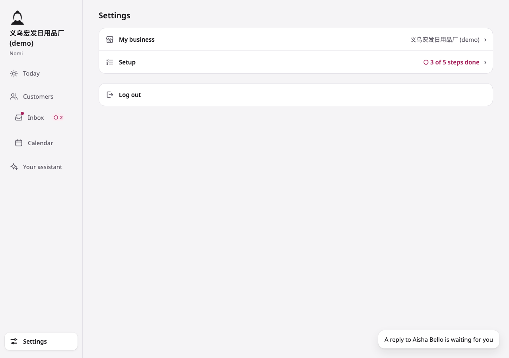
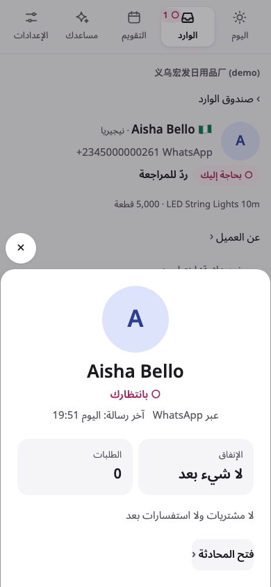
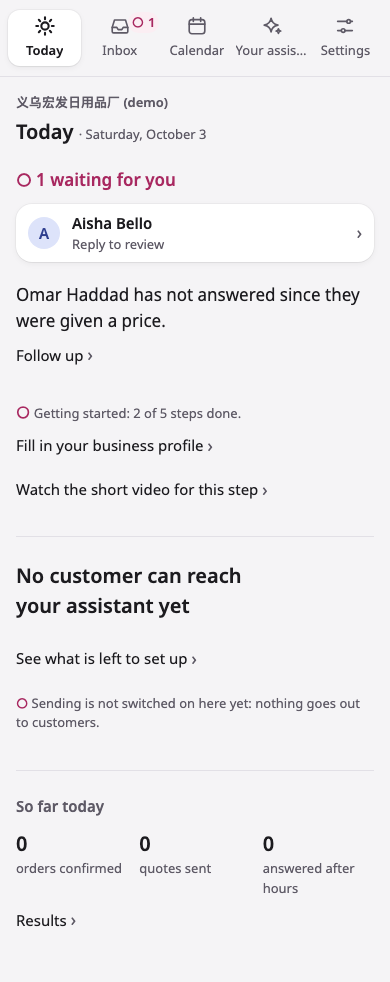
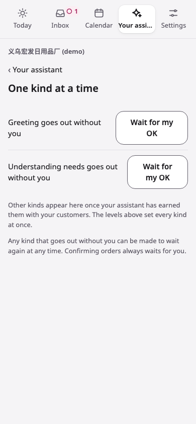
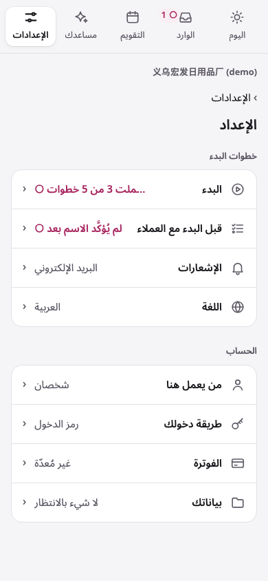
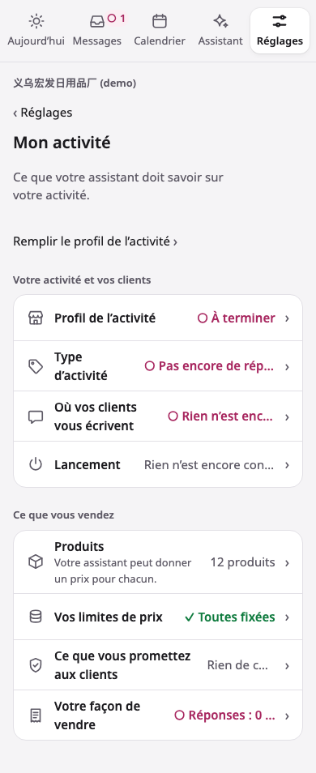
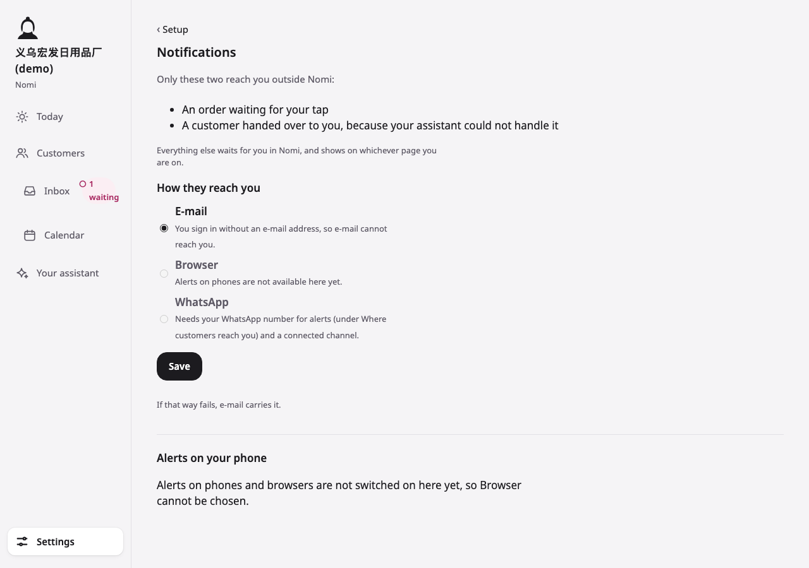
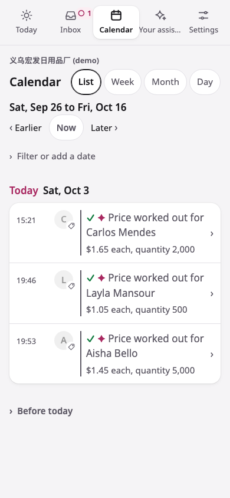

# Nomi — UI audit (after the warmth run)

**Date:** 2026-10-03. **Code audited:** `main` at `8482b10` (after #216 and #217, the warmth run's phases 1–8), run locally on the demo workspace with the usability seed and the outreach area on, as before.

**What this is:** the merged defect list. The previous list (703 findings at `6d390b8`, worked by the rebuild run's phase 9) is kept unchanged as [UI-AUDIT-V2.md](UI-AUDIT-V2.md); the first audit is [UI-AUDIT-V1.md](UI-AUDIT-V1.md). Every one of the previous findings was checked again:
- **still here** — restated in today's words, its ID kept;
- **dropped** — with its reason.

Defects found now are marked **NEW**, with an ID `w4-<area>-NN`. "NEW (missed)" marks one that was there before this run and the previous audit missed.

**Scope:** problems only. No fixes are proposed here; the warmth run's phase 9 works this list, S1 first.

**Coverage:** the method of the previous audits.
- **Pages:** 83 pages (the 62 of the last audit and the run's new screens: Settings, Setup's new address, the language screen, My business's five screens, the assistant's nine screens, the Inbox's lenses and narrowings, the calendar's four views, the profile card).
- **Languages and widths:** five languages (en, zh, ar, es, fr) at two widths (phone 390×844, desktop 1280×900): 830 full-page captures, each checked automatically for overflow, clipping, leaked English, unlabelled controls, alt text, font sizes, headings and console errors.
- **Interactive states,** walked in Chromium in en, ar and zh: the profile card opened from Today, the Inbox and a conversation; the draft card's edit box; the calendar's fold; the ask dialog; a form sent back; the toast and the rail's marker when a customer newly waits.
- **Reviewers:** nine, one per area and one for the whole product. Each also walked its pages by hand on the local instance, read-only. Practice was used by the conversation reviewer, the draft card opened, and the price-list export read.

**Severity:** the same scale. **S1 Critical** blocks or misleads; **S2 Major** visible in ten seconds, looks unfinished or untrustworthy; **S3 Minor** inconsistency or secondary clarity; **S4 Nit** polish.

## The merge, in three counts

| | Count | |
|---|---|---|
| **Dropped** from the previous list | **636** of 703 | fixed and re-checked 569 · the element rebuilt by this run, so it no longer applies 43 · the element removed 24 |
| **Still reproducing** | **67** | 11 of them the owner's decisions (left as they are); 3 decided not to change last run |
| **New** | **214** | 1 S1 · 28 S2 · 80 S3 · 105 S4 — most introduced by this run; the rest missed before |

**The merged list:** 281 findings: **2 S1** · **38 S2** · **113 S3** · **128 S4**. (The previous list: 703: 8 S1 · 115 S2 · 377 S3 · 203 S4.)

| Area | Still | Dropped (a · b · c) | New |
|---|---|---|---|
| Problems that run through the whole product | 4 | 14 (12 · 2 · 0) | 23 |
| Public site, sign-in, sign-up and policy pages | 12 | 84 (82 · 0 · 2) | 14 |
| Today, setting up, Settings and Setup | 10 | 87 (64 · 14 · 9) | 30 |
| Customers: the Inbox, an order, the calendar, Results, the profile card | 7 | 57 (43 · 10 · 4) | 26 |
| A conversation, the draft reply card, the customer's file, Practice | 8 | 86 (80 · 2 · 4) | 25 |
| Products, price limits, knowledge, the price-list export | 8 | 96 (94 · 0 · 2) | 17 |
| My business, the assistant's page, channels | 4 | 96 (80 · 13 · 3) | 33 |
| Setup pages: account, notifications, billing, business, closures, the component gallery, your data, forbidden words | 7 | 52 (51 · 1 · 0) | 24 |
| Who works here, profile, rate, samples, terms; the outreach area | 7 | 64 (63 · 1 · 0) | 22 |

As before, problems that appear only because this is a local instance (no mail, payments, phone alerts, Meta apps or model) are not counted.

## Read this first — the worst problems

1. **S1** · w4-public-01 · privacy — the privacy page does not say that customers' profile photos are kept. Since 0123 the app downloads Instagram and Messenger customers' photos and stores them. "What is kept" lists only the message, attachments, the account name, the identifier and the time; "Delete your data" does not list the photos either (w4-public-02), though `erase-buyer` erases them.
2. **S1** · V1-417 · employee-one-kind — a new workspace's "One kind at a time" says "Greeting goes out without you [Wait for my OK]". The assistant's landing and "Each kind of reply" say that every reply waits until the name is confirmed.
3. **S2** · w4-whole-03, -04 — the toast names the wrong customer. A different customer newly waits (the count goes 1 → 2), and the toast says "A reply to Aisha Bello is waiting for you", the one who was already waiting. It also fires right after the owner answers that customer from the phone.
4. **S2** · w4-today-setup (Today) — in the demo workspace Today does not show what Nomi did. There is no hero, the scoreboard reads 0 · 0 · 0, and the page's biggest line is "No customer can reach your assistant yet", while 9 replies and 3 quotes went out that day. Today counts only sent rows the seed never writes.
5. **S2** · w4-customers-25 / w4-conversation-12 — the profile card says "Nothing bought or asked about yet" (还没买过，也没问过产品 / لا مشتريات ولا استفسارات بعد) for a customer who was given a price, over their own conversation's header.
6. **S2** · w4-whole-10 — the guide's videos and stills show the app from before this run, and its captions name rows that do not exist any more.
7. **S2** · w4-business-assistant-12 — while the assistant answers, its Stop (rule 13) exists only at Settings › My business › Going live; the assistant's own page has neither the control nor a door to it.
8. **S2** · w4-settings-a-02, -01 — Notifications ticks E-mail for an owner who signs in without an e-mail address ("e-mail cannot reach you"), and nowhere says that WhatsApp is the intended way and becomes the default when Meta approves.
9. **S2** · w4-today-setup-24, -23; w4-business-assistant-01 — menu values break on a phone: Arabic values run left to right with the ○ on the wrong side and the first word cut ("…ملت 3 من 5 خطوات"); es/fr/en values are cut ("Todos fijad…", "○ Réponses : 0 …").
10. **S2** · w4-whole-01 — the rail's Inbox count wraps the desktop rail in every language; 收件箱 breaks inside the word.

## Worst offenders — screenshots

| # | Shot | What it shows | Sev |
|---|---|---|---|
| 1 |  | the toast "A reply to Aisha Bello is waiting for you" when another customer newly waits | S2 |
| 2 |  | the Arabic card «لا مشتريات ولا استفسارات بعد» over a conversation about LED String Lights with a price | S2 |
| 3 |  | Today in the demo: no hero, "No customer can reach your assistant yet" | S2 |
| 4 |  | "Greeting goes out without you" while the name is unconfirmed | S1 |
| 5 |  | Setup in Arabic: values left to right, the ○ trailing, the first word cut | S2 |
| 6 |  | My business in French on a phone, values cut | S2 |
| 7 |  | Notifications: E-mail ticked while "e-mail cannot reach you" | S2 |
| 8 |  | the calendar marks a price "✓ done" while its reply waits for review | S3 |

---

## 1 · Problems that run through the whole product

### Still reproducing (4)

#### (whole product)

- **S3** · V1-006 · all locales · both — Narrower now, but developer words still reach the owner:
  - The component gallery is still served at `/app/settings/components` ("How it looks"), with "Rest Rest Rest Rest Hover Hover … Focus … Disabled".
  - "Technical details" (`/app/onboarding/technical`) says "For whoever set up this installation", "This installation · Running version · Not reported · Environment" (es: "esta instalación"). Both are reachable by address, and no page links to them.
  - Business profile lists the product categories as raw lowercase English codes in every language: "bags · drinkware · home · lighting" (zh 产品类别, ar, es, fr unchanged).
    - It then says "To change one, open that product", but the product page no longer shows a category (`products.ts:685-688`).
  - Incoterm codes now carry words, and no "pcs" was found in a zh/ar/es field: fixed.
  - Evidence: `settings-components.en.phone.png`, `onboarding-technical.es.phone.png`, `settings-profile.zh.phone.png`.
- **S3** · V1-008 · ar · both — Browser-drawn date controls still show "yyyy/mm/dd" in Latin, left to right, on an Arabic page: closures' "أول يوم إغلاق" and "آخر يوم إغلاق" (`settings-closures.ar.phone.png`, `states/form-sent-back.ar.phone.png`). The detached prefix is fixed: "لـ مساعدك" no longer renders anywhere (the h1 reads "ما يمكن لمساعدك الحديث عنه").
- **S2** · V1-011 · all locales · both — The counts still disagree:
  - Results ("This covers this week") says "45 replies that went out" and "13 prices worked out".
  - The assistant's "This month" says "0 customers answered · 2 replies prepared", and Before going live says "Customers answered 0".
  - Today's scoreboard says "0 quotes sent", but:
    - the calendar ticks three prices worked out today (15:21 Carlos Mendes, 19:46 Layla Mansour, 19:53 Aisha Bello);
    - Carlos Mendes's thread shows the assistant's priced reply going out at 15:21 today ("LED String Lights 10m, warm white, 2,000 pcs: $1.65/pc FOB Ningbo …", "✦ Your assistant").
  - Evidence: `analytics.en.phone.png`, `employee-month.en.phone.png`, `today.en.phone.png`, `calendar.en.phone.png`, `conversation-thread.en.phone.png`.

#### the rail and the phone nav

- **S3** · cross-new-02 · ar, es, fr · both — One nav entry still has two names by width. en and zh are fixed (the same word at both widths).
  - fr: "Messages" on a phone, "Boîte de réception" on a laptop and as the page's h1; "Assistant" vs "Votre assistant".
  - es: "Bandeja" vs "Bandeja de entrada".
  - ar: "الوارد" vs "صندوق الوارد".
  - Evidence: `inbox.fr.phone.png` vs `today.fr.desktop.png`, `today.es.phone.png`, `today.ar.phone.png`.

---

### New (23)

`NEW` = introduced by the warmth run; `NEW (missed)` = there before, missed by the last audit.

#### the rail and the phone nav

- **S2** · NEW · w4-whole-01 · all locales · desktop — The rail's one number breaks its own entry:
  - en: "Inbox ○ 1 / waiting" wraps to two lines. The round magenta wash sits behind the figure only, and the word hangs below it.
  - zh: the entry's own word breaks mid-word, "收件 / 箱", beside "○ 1位 / 在等".
  - es: "Bandeja / de / entrada" on three lines, beside "○ 1 / esperando".
  - fr: "Boîte de / réception", beside "○ 1 en / attente".
  - ar: "صندوق / الوارد", beside "1 ○ / بالانتظار".
  - The Inbox entry is about twice the height of the others, so Calendar sits far below it. This shows on every signed-in page.
  - Evidence: `today.en.desktop.png`, `today.zh.desktop.png`, `today.es.desktop.png`, `today.fr.desktop.png`, `today.ar.desktop.png`, `inbox.ar.desktop.png`.
- **S2** · NEW · w4-whole-02 · en, es, fr · phone — The five tiles don't fit their words:
  - en: "Your assis…" on every page. The phone form `nav.short.employee` is "Your assistant", the same as the long label, so nothing gets shorter (72 clipped captures in `results.json`).
  - es: "Tu asiste…" whenever the assistant is the active (bold) tile.
  - fr: "Aujourd'h…" when Today is active, i.e. on the landing page.
  - Evidence: `today.en.phone.png`, `employee.es.phone.png`, `today.fr.phone.png`.
- **S3** · NEW · w4-whole-05 · all locales · desktop — After a live update, the rail's count loses its word. "○ 1 waiting" becomes "○ 2", because the script writes the bare figure over both forms (`liveScript.ts` `tally`: `badge.textContent = said.shown`). So the rail reads differently before and after a reload. Evidence: `states/toast-and-marker.en.desktop.png` vs `today.en.desktop.png`.
- **S3** · NEW · w4-whole-18 · all locales · desktop — "Customers" (客户 · العملاء · Clientes · Clients) is drawn exactly like an entry: an icon, the word, the same grey. It is a `` (`layout.ts:2385`), so pressing it does nothing, while every other icon-and-word in the rail is a door. Evidence: `today.en.desktop.png`.
- **S4** · NEW (missed) · w4-whole-19 · all locales · both — A mistyped address inside the workspace ("That page is not here") lights Today as the current page, with `aria-current="page"`. Evidence: `not-found-app.en.phone.png`, `not-found-app.ar.phone.png`.

#### notifications: the toast and the marker

- **S2** · NEW · w4-whole-03 · en (all locales by code) · both — The toast does not reliably name the customer who newly waits.
  - What the state walk shows: a different conversation was handed over and the count went 1 → 2. The toast said "A reply to Aisha Bello is waiting for you" and its door opened Aisha's conversation. Aisha was already the one waiting before (`today.en.desktop.png`), and both the who and the why ("A reply to …") were wrong.
  - Why: `newestWaiting` (`live.ts`) does not pick the conversation that joined. It picks whichever waiting conversation has the latest of five timestamps, including any inbound message or pending draft.
  - A turn's own hand-over does not stamp `assigned_at`: `saveState` writes `assigned_to` alone (`repos.ts:130-134`), and only `assign()` stamps (`repos.ts:203`).
  - So an already-waiting customer who writes again in the same 20-second window takes the toast.
  - Detection is by count. If one customer is dealt with elsewhere while another arrives, the count stays the same and the newcomer gets no toast and no marker.
  - Evidence: `states/toast-and-marker.en.desktop.png`, `states/toast-and-marker.en.phone.png`.
- **S2** · NEW · w4-whole-04 · all locales · both — The toast and the marker fire when no customer waits (not negotiable: no notification that does not match a customer genuinely waiting).
  - When the owner answers from the phone (Meta's echo), the conversation becomes the owner's (`echo.ts:85`, `assign(… owner)`).
  - A conversation the reader holds counts as "Needs you" (`buyersList.ts` `needsOwnerFor` → `heldBy`). The rail's count rises in any open Nomi tab, the Inbox gets its magenta dot, and the toast says "{who} is waiting for you" (`live.toast.person`) about the customer the owner has just answered.
  - The same happens in a second tab or device when the owner presses "I'll reply".
- **S4** · NEW · w4-whole-23 · all locales · both — The toast is the only door to who arrived, and it vanishes after 6 s (`SHOWN = 6000`). Hover or focus doesn't pause it, and there is no way to keep it. A reader who looked away finds only the dot.

#### magenta (rounded for warmth, magenta for meaning)

- **S2** · NEW · w4-whole-06 · all locales · both — The waiting signal (magenta ○, the same mark and colour as a customer waiting) now marks setup chores and warnings. A ○ no longer tells the owner "a customer waits".
  - On one screen, Today puts "○ 1 waiting for you" (a customer) above "○ Getting started: 3 of 5 steps done" and "○ Sending is not switched on here yet".
  - Settings shows "Setup ○ 3 of 5 steps done" in bold magenta. That is the very count the run took out of the rail because "it is a badge that is not a customer waiting".
  - Setup shows "○ Name not confirmed yet".
  - My business shows "○ Not finished", "○ Not answered yet", "○ Nothing connected yet" and "○ 0 of 9 answered".
  - Every unticked line of Before going live and Ready for customers carries a ○ (eight on Ready). The guide has "○ To do", and the reply kinds on "Each kind of reply" carry a ○.
  - Whole sentences are set in magenta:
    - the assistant's landing: "○ Until you confirm the name customers will read, every reply waits for you …";
    - import review: "○ No currency sign on this line: check that this is its price, in USD.";
    - the draft card: "○ No source for 300 and 25".
  - zh/ar/es/fr are the same (zh "○ 开始使用：5 步里完成了 3 步。", ar "○ البدء: اكتملت 3 من 5 خطوات.").
  - Evidence: `today.en.phone.png`, `states/toast-and-marker.en.phone.png`, `setup.en.phone.png`, `business.en.phone.png`, `employee.en.phone.png`, `ready.en.phone.png`, `import-review.en.phone.png`.
- **S3** · NEW · w4-whole-07 · all locales · both — Magenta borders remain (the principle: never a border).
  - The import review's rows that need the owner keep a 3 px pink-magenta bar (`.imp-row.need`, `--color-waiting-line` #EBC3D3, `layout.ts:1345`). PROGRESS says this border "came off".
  - The site's "Needs you" tag has a 1 px magenta-tint border (`site.ts:254-255`).
  - `.chip.draft` (Practice) and the refused card's `.rf` rules draw `--color-waiting-line` / `--color-waiting-wash` edges.
  - Evidence: `import-review.en.phone.png`, `site.en.phone.png`.

#### the profile card

- **S2** · NEW · w4-whole-09 · all locales · both — The card contradicts the page it springs up over.
  - Opened from Aisha Bello's conversation, it says "Nothing bought or asked about yet" (zh "还没买过，也没问过产品", ar "لا مشتريات ولا استفسارات بعد"). Directly behind it, the catch-up strip says "LED String Lights 10m · 5,000 pcs", and her file says "Products of interest: LED String Lights 10m · Prices worked out 1".
  - Opened from the Inbox, Nadia Rahimi's card says the same, under the band's "Price sent Sep 29, no word since".
  - The card reads "asked about" only from turns' analysis (`db/customerCard.ts:63-70`); the strip and the file read the conversation's own record.
  - Evidence: `states/card-from-conversation.en.desktop.png`, `states/card-from-conversation.zh.phone.png`, `states/card-from-inbox.en.phone.png`, `buyer-file.en.phone.png`.
- **S3** · NEW · w4-whole-13 · all locales · both — One customer, three views, three names and three different contents, all on the conversation page:
  - the face opens the card;
  - "The customer ›" (desktop) opens the side panel;
  - "About this customer ›" opens the file page (zh 客户资料 › and 关于这位客户 ›).
  - An order's back link "‹ Back to the customer" opens the conversation, not any of the three.
  - Evidence: `conversation-draft.en.desktop.png`, `conversation-draft.zh.phone.png`, `order.en.phone.png`.
- **S4** · NEW · w4-whole-22 · all locales · both — Two gaps around the card:
  - Between the tap and the sheet nothing happens. The script fetches the card page first and shows no state meanwhile (`liveScript.ts` `cards()`), so on a slow phone network a tapped face seems dead.
  - Opened from a conversation, the card's one door, "Open the conversation ›", opens the page already open (`states/card-from-conversation.en.phone.png`).

#### faces

- **S4** · NEW · w4-whole-20 · ar · both — An Arabic name that starts with the article gets a bare alef as its initial: "الشركة المتحدة" → "ا". In a 24–96 px circle it reads as a vertical bar or a Latin "l". A name starting with a hamza seat gets "ئ" on its own (`faces.ts` `initialOf`, first letter of the string).
  - This was rendered with the app's own stylesheet in the scratchpad (`w4-whole/faces.ar.png`); the demo has no Arabic-script customer, so no capture shows it.
  - Tints are the same for one customer on every page (checked for Aisha Bello, Carlos Mendes and Nadia Rahimi across Today, the Inbox, the conversation, the calendar and the card).

#### one word per thing

- **S3** · NEW · w4-whole-12 · zh, ar, es, fr (waiting also en) · both — The warmth run's two new words already have two forms each.
  - **Regular:**
    - zh: 老客户 on the card and the catch-up strip, 常客 on the Inbox row, its key and the attention band;
    - ar: عميل دائم vs طلبات متكرّرة ("repeated orders");
    - es: Habitual vs Cliente habitual;
    - fr: Fidèle vs Client fidèle.
  - **Waiting:**
    - on one screen, the strip says "○ Needs you" and the card over it says "○ Waiting for you";
    - elsewhere it is "Needs you" (Inbox group), "Waiting now" (lens), "1 waiting" (rail) and "1 waiting for you" (Today);
    - zh: 等你处理 / 在等你 / 等待中;
    - ar: بحاجة إليك / بانتظارك. The rail's spoken count says "محادثة واحدة بانتظارك" (a conversation) where Today says "عميل واحد بانتظارك" (a customer).
  - Evidence: `states/card-from-conversation.en.phone.png`, `inbox.zh.phone.png`.
- **S3** · NEW · w4-whole-14 · all locales · both — A menu row's name is not the name of the page it opens (the page's h1 is also the tab title):
  - "Going live" → "Before your assistant talks to real customers". It sits one menu away from Setup's "Before going live", which opens a different page: ar "البدء مع العملاء" vs "قبل البدء مع العملاء"; fr "Lancement" vs "Avant le lancement".
  - "Kind of business" → "What you do, your country and your website".
  - "Payment and delivery" → "Your payment and delivery terms".
  - "Days closed" → "When your business is closed" (zh 休息日 → 休息的日子).
  - Evidence: `business.en.phone.png`, `business-ready.en.phone.png`, `onboarding.en.phone.png`.

#### back links and doors

- **S3** · NEW · w4-whole-15 · all locales · both — Back links are inconsistent:
  - The nine question pages say "‹ Back to How you sell" but open "The questions" (`/app/business/selling`). Every other back link is "‹ <page name>".
  - `/app/channels` says "‹ Where customers reach you" and leads to `/app/business/channels`, another page with the same h1. Two pages are called "Where customers reach you": one says only "WhatsApp · Not connected", the other carries the accounts, the e-mail set-up and "Connect WhatsApp". That undercuts "channels' one home".
  - Evidence: `how-you-sell-q.en.phone.png`, `channels.en.phone.png`, `business-channels.en.phone.png`.

#### contradictions across pages

- **S2** · NEW (missed) · w4-whole-11 · all locales · both — Is anything connected? The app answers both ways.
  - **Yes:**
    - Setup › Before going live: "✓ Where customers reach you — Checked for you";
    - Ready for customers: "✓ Where customers reach you — Connected";
    - the guide: step 4 "Done";
    - Getting started counts it ("3 of 5").
  - **No:**
    - My business › Where customers reach you: "WhatsApp · Not connected";
    - My business: "Going live · Nothing connected yet", and its page: "Not yet: nothing is connected for customers to write to";
    - Today: "No customer can reach your assistant yet".
  - Evidence: `onboarding.en.phone.png`, `ready.en.phone.png`, `business-channels.en.phone.png`, `business-ready.en.phone.png`, `today.en.phone.png`.

#### the guide (`/app/guide`)

- **S2** · NEW · w4-whole-10 · all locales · both — The guide misleads.
  - Its posters and videos were recorded before this run (commit `c1ff5ae`, 08:13 that day). They show:
    - the old text-only nav: "Today · Customers · Your assistant · My business · Setup 2/5";
    - "Customer list" and the setup badge in the rail;
    - the old Setup page with its search and language switch.
  - The captions (also burned into the VTT tracks) send the owner where nothing is:
    - step 1: "Open Settings, then Setup, then Business profile." Business profile is under My business, and Setup has no such row.
    - step 2: "…open My business, then See your products, then Teach your assistant your products." The rows are "Products" and "Add your products".
    - step 5: "send a reply to a real customer, in Customers." The place is the Inbox.
  - Evidence: `guide.en.phone.png`, `/assets/guide/profile.en.phone.jpg`, `name.en.phone.jpg`, `first_success.en.phone.jpg`, `profile.ar.phone.jpg`, `profile.en.jpg`, `channels.en.jpg`, `assets/guide/profile.en.vtt`.

#### settings menus (cross-cutting rows)

- **S2** · NEW · w4-whole-08 · ar · both — In Arabic, a menu row's value puts its state mark after the words and cuts the beginning:
  - Settings and Setup read "…ملت 3 من 5 خطوات ○". The first word, اكتملت, is cut to "ملت" and the ellipsis stands at the start.
  - My business reads "غير مكتمل ○", "لم يُحدَّد بعد ○" and "كلها محددة ✓", with the mark trailing, while Today, the card and the Inbox put ○ before the words.
  - Cause: the value is `<bdi>…</bdi>`, and `dir=auto` ignores text inside `<bdi>`, so the cell resolves left-to-right.
  - Evidence: `settings.ar.phone.png`, `setup.ar.phone.png`, `business.ar.phone.png`, `business.ar.desktop.png`.
- **S3** · NEW · w4-whole-16 · all locales · both — Keyboard focus on a menu row is nearly invisible. The row's 2 px outline is clipped by the card's `overflow:hidden` (`.scard`, `layout.ts:657-658`), so a focused row shows only a dark line under it, which reads as a divider. This affects Settings, Setup, My business, How you sell and the assistant's menu. Evidence: `w4-whole/focus-srow.390.png`, `w4-whole/focus-srow.1280.png` (scratchpad).

#### corners and motion

- **S3** · NEW · w4-whole-17 · all locales · both — Corners are not one rule:
  - Buttons are 16 px (the card radius) while fields are 12 (control), so the Inbox's "Find" sits beside a squarer search field. The token says a control (a field, a button, a row) is 12.
  - Grouped menus (`ul.scard`) are 16, though the token names a grouped menu a panel (20).
  - The Inbox's "Needs attention" band is 20, directly above the 16 px list. Today's waiting band is 16.
  - The door and sign-in pages draw their fields and buttons at 16 (`layout.ts:2496-2504`).
  - Evidence: `inbox.en.phone.png`; computed radii in `w4-whole/radii.mjs`.
- **S4** · NEW · w4-whole-21 · all locales · both — Two motion lapses:
  - When Today redraws itself in place for a new arrival, its band and hero rise in again (8 px, 200 ms, `.tw`/`.td`) every time.
  - `--motion-max` is 300 ms (the assistant's three dots, the busy button), outside the brief's 100–250 ms.
  - Under reduced motion nothing moves (`layout.ts:297-300`): verified.

---

## 2 · Public site, sign-in, sign-up and policy pages

### Still reproducing (12)

#### site
- **S2** · V1-015 · all locales · desktop, phone — STILL (owner's), confirmed open: the site still names no operator, company or country anywhere: not in the header, not in any section, not in the footer ("Privacy  Terms of service  For customers: delete your data"). The only contact is a mail link, "Our address: …". Promises such as "No price ever goes below the lowest price you set" and "We are told when a new workspace opens, and help you set it up where you need it" come from a sender a stranger cannot identify. (`w4/shots/site.en.desktop.png`)
- **S3** · V1-021 · all locales · desktop, phone — STILL (decided last run: public pages arrive with nothing to fetch).
  - The site, the three policy pages and the dead-link pages fetch no web font. Their stack names "Noto Sans" first, but they render in the device's own face.
  - Sign-in, sign-up and the error doors link the Noto sheets.
  - So pressing "Sign in" (登录 / تسجيل الدخول / Iniciar sesión / Se connecter) changes the typeface on the product's own doorstep: compare the "Nomi" beside the mark in `w4/shots/site.en.desktop.png` and in `w4/shots/login.en.desktop.png`.

#### login
- **S4** · public-new-11 · all locales · desktop, phone — STILL (decided last run: the door runs no script).
  - The door pages link no script; `/login?with=code` has no `<script>`.
  - So "Sign in" (登录 / تسجيل الدخول / Iniciar sesión / Se connecter) and "Create my workspace" show nothing while the request runs, and nothing stops a second press.
  - The owner pages give their buttons a busy state and, since this run, press motion.

#### privacy
- **S2** · V1-057 · all locales · desktop, phone — STILL (owner's), confirmed open: in "When you send a message to a business that uses Nomi, we keep the message…", "we" is now said to be "Nomi’s operator, who runs the service for the business", but no company, country or postal address is named. (`w4/shots/privacy.en.desktop.png`)

#### terms
- **S2** · V1-063 · all locales · desktop, phone — STILL (owner's), confirmed open: "These terms are between a business that uses Nomi and the operator of Nomi, reachable at nomidoes.com." No legal name, address, country or governing law. (`w4/shots/terms.en.desktop.png`)
- **S3** · V1-065 · all locales · desktop, phone — STILL (owner's), confirmed open: "Fees are as agreed with you in writing." No price or plan appears anywhere on the public pages, and sign-up's terms checkbox is still the last step before a workspace exists.
- **S4** · V1-067 · en · desktop, phone — STILL (owner's), confirmed open: the straight apostrophe in "the operator's total liability" remains, while the site uses "’" ("business’s").
- **S4** · V1-068 · zh · desktop, phone — STILL (owner's), confirmed open: "…运营方可以暂停该工作台的发送或停用该工作台，并告诉所有者原因。" still uses 所有者.
- **S4** · public-missed-18 · en · desktop, phone — STILL (owner's), confirmed open: the terms address the business as "you", then switch to the third person: "the operator may pause its sending or suspend it, and tells the owner why."
- **S4** · public-missed-19 · all locales · desktop, phone — STILL (owner's), confirmed open: "Fees and leaving" says records "are removed on request as the privacy page describes"; the privacy page in turn sends the reader to "Delete your data". The reader passes through two pages to find the answer.

#### data-deletion
- **S3** · V1-072 · all locales · desktop, phone — STILL (decided last run, rule 18). The page still says "…within 30 days of the business recording the request" (在商家登记该要求后 30 天内 / خلال ⁨30⁩ يومًا من تسجيل الشركة للطلب) and "Nomi does not write to you about it." The customer gets no deadline counted from their own request, and no confirmation.
- **S4** · public-missed-21 · all locales · desktop, phone — STILL (owner's), confirmed open: "Copies inside backups of the whole service. A backup is not changed to remove one person; your data leaves it when that backup is deleted." (整个服务的备份里的副本… / النسخ الموجودة داخل النسخ الاحتياطية…) gives no time.

### New (14)

#### privacy
- **S1** · NEW · w4-public-01 · all locales · desktop, phone — introduced by the warmth run (0123 `client_faces`). The page now understates what is kept about the customers it addresses.
  - Since this run, an Instagram or Messenger customer's profile photo is asked of Meta, downloaded and stored, then refreshed every 30 days.
  - "What is kept" still lists only "the message, any picture or file you attach, the name shown on your account, the identifier the platform gives us for your account, and the time it arrived". The zh, ar, es and fr versions list the same: 消息、附件、账号上显示的名字… / الرسالة، وأي صورة أو ملف مرفق بها، والاسم الظاهر على حسابك… / el mensaje, cualquier imagen o archivo… / le message, toute image ou tout fichier…
  - "Last updated 3 October 2026" predates nothing: the photos are kept from the same day.
  - The profile photo is not something the customer attached, so no line covers it.
  - Shots: `w4/shots/privacy.en.desktop.png`, `w4/pub-tmp/out/privacy.ar.desktop.0.png`.

#### data-deletion
- **S3** · NEW · w4-public-02 · all locales · desktop, phone — introduced by the warmth run.
  - "What is deleted" names "Who you are on every channel: the name the business saw, your phone number, your e-mail address and your account identifiers." (你在每个渠道上的身份… / هويتك على كل قناة… / Tu identidad en cada canal… / Votre identité sur chaque canal…).
  - It does not name the profile photo. `tools/erase-buyer.mjs` now erases it (`client_faces: { do: 'erase' }`).
  - The page says it "says how that works, what is deleted, and what is kept", yet it leaves out the one item this run started keeping.
  - Shot: `w4/pub-tmp/out/data-deletion.en.phone.1.png`.

#### site
- **S3** · NEW · w4-public-03 · all locales · desktop, phone — introduced by the warmth run (the product changed and the site did not).
  - The run's principle was "applied everywhere": rounded for warmth, faces carry the colour.
  - The site shows no face at all. The example's customer is the caption "A customer, on Instagram" (一位客户，来自 Instagram / عميل، عبر إنستغرام / Cliente, por Instagram / Un client, sur Instagram) above a grey bubble.
  - The only colour on the page is the two small magenta words of the example.
  - A visitor who signs in moves from a graphite-on-grey page to Today's faces, "Today {name} handled N conversations for you" and the scoreboard. The site describes none of these.
  - Shots: `w4/shots/site.en.desktop.png`, `w4/pub-tmp/out/site.ar.desktop.0.png`.
- **S4** · NEW (missed) · w4-public-05 · zh · desktop, phone — "已经有工作台？ 登录" (the hero's member line) has a space after the full-width "？", so the gap before 登录 is doubled. This is the same fault public-missed-08 fixed after "我们的地址：". Shot: `w4/pub-tmp/out/site.zh.phone.0.png`.
- **S4** · NEW (missed) · w4-public-07 · es, fr · phone — the lower "Write to us for an invitation" is an outlined box as wide as the invitation card, but its label breaks into two start-aligned lines, leaving the box's end side empty.
  - es at 390 px: "Escríbenos para pedir / una invitación" (308×77 px).
  - At 360 px the es hero button also wraps (328×75), and so does the fr lower button "Écrivez-nous pour une invitation" (278×77).
  - `.site-go` sets no centring.
  - Shot: `w4/pub-tmp/out/site.es.phone.6.png`.
- **S4** · NEW (missed) · w4-public-08 · all locales · desktop — "Where your customers already write" lays out four cards in one row (WhatsApp / Instagram / Messenger / E-mail). Each is about 235 px wide, with its text in three or four short lines. That is a four-column layout, which the not-negotiables rule out. Shot: `w4/pub-tmp/out/site.en.desktop.2.png`.
- **S4** · NEW (missed, since #211) · w4-public-09 · all locales · desktop, phone — "What goes out alone" is one 60-word sentence inside a card.
  - The sentence: "Once you have named your assistant and done the checks in Practice, and most of your assistant’s recent replies to your own customers, across several customers and days, went out unchanged, you may let greetings and questions go alone while anything with a price waits."
  - On desktop it runs to 11 lines and stretches its two sibling cards ("Your prices", "Taking it back") to the same height, leaving them half empty.
  - The ar card ("ما يخرج دون مراجعة") runs to 9 lines.
  - Shots: `w4/shots/site.en.desktop.png`, `w4/pub-tmp/out/site.ar.desktop.1.png`.

#### login
- **S4** · NEW · w4-public-04 · all locales · desktop, phone — introduced by the warmth run's token change: `--radius-card` went from 12 to 16, and a control's 12 became `--radius-control`.
  - The door draws its fields, selects and buttons with `--radius-card`: 16 px on "E-mail", "Password", "Sign in", every sign-up field and "Create my workspace".
  - So a field is as round as the card it sits in, and rounder than the same field inside the app (12 px).
  - The site's two "Write to us for an invitation" buttons are also 16 px.
  - Pages: login, login-code, signup, set-password-bad, site.
  - Shot: `w4/shots/login.en.desktop.png`.

#### login-code
- **S4** · NEW (missed, since #211) · w4-public-10 · es, fr · desktop, phone — the card's heading leaves one word on its own line. es: "Iniciar sesión con un código de / acceso"; fr: "Connexion avec un code / d’accès". Shot: `w4/pub-tmp/out/st-login-code-wrong.es.phone.0.png`.
- **S4** · NEW (missed, since #211) · w4-public-11 · ar · desktop, phone — the heading "تسجيل الدخول برمز الدخول" says الدخول twice ("sign in with the sign-in code"). It is the Arabic twin of the zh "进入…进入" that V1-044 fixed; the label under it repeats "رمز الدخول". Shot: `w4/pub-tmp/out/login-code.ar.phone.0.png`.

#### signup
- **S4** · NEW (missed, since #211) · w4-public-06 · zh · desktop, phone — the invitation hint reads "在发给你的邀请链接里。 还没有邀请？写信到 … 申请。", with a space after the full-width "。". Shot: `w4/pub-tmp/out/signup.zh.phone.0.png`.
- **S4** · NEW (missed) · w4-public-13 · all locales · desktop, phone — two ways to ask for an invitation, prepared differently.
  - Sign-up's "No invitation yet? Write to privacy@… and ask for one." (还没有邀请？写信到… / Pas encore d’invitation ? Écrivez à…) is a bare `mailto:` that opens a blank message.
  - The site's "Write to us for an invitation" opens one with the subject "An invitation to Nomi" and the three questions to answer.
  - Shot: `w4/pub-tmp/out/signup.en.phone.0.png`.

#### not-found-public
- **S4** · NEW (missed, since #211) · w4-public-12 · ar · desktop, phone — "الانتقال إلى الصفحة الرئيسية لـ Nomi" leaves «لـ» detached before the Latin name. The channel pages removed that construction last run (V1-398 family). Shot: `w4/pub-tmp/out/not-found-public.ar.phone.0.png`.

#### (all public pages)
- **S4** · NEW (missed) · w4-public-14 · all locales · desktop, phone — tab titles come in three orders:
  - the doors: "Nomi · Sign in", "Nomi · That page is not here", "Nomi · This link no longer works";
  - the policies and dead links: "Privacy · Nomi", "Delete your data · Nomi", "This link does not work · Nomi", "This price link does not work · Nomi";
  - the site: "Nomi — an assistant that answers your customers".

  The same holds in every locale: "Nomi · 登录" against "隐私说明 · Nomi". (`w4/results.json`, titles)

## 3 · Today, setting up, Settings and Setup

### Still reproducing (10)

#### today
- **S2** · today-onboarding-missed-01 · all locales · both — the line that once said "Messaging is not active yet" is now the hero zone's headline, at display size, the largest text on the page:
  - the headline reads "No customer can reach your assistant yet" (zh 客户现在还找不到你的助手, ar لا يستطيع أي عميل الوصول إلى مساعدك بعد, es Todavía nadie puede escribir a tu asistente, fr Aucun client ne peut encore écrire à votre assistant);
  - it sits directly under "○ 1 waiting for you — Aisha Bello — Reply to review", a customer who wrote today at 20:26;
  - beneath it, "○ Sending is not switched on here yet: nothing goes out to customers." still wears the waiting mark.

  `today.en.desktop.png`, `today.ar.phone.png`.
- **S4** · V1-106 · STILL (owner's) — still open. The desktop rail draws the figure silhouette (`settings.en.desktop.png`). The phone's five tiles now show no mark at all.

#### guide
- **S2** · today-onboarding-new-08 · all locales · both — the stills now show the app as it was before this run:
  - the old phone nav "Today Customers Your assistant My business Setup 2/5" (es "Hoy Clientes Tu asistente Mi negocio Ajustes 2/5", where "Ajustes" is now the name of Settings);
  - Setup with its removed search "Find a setting / Find", the language switch, and "Getting started ○ 2 of 5 steps done" in amber;
  - the desktop rail "Customer list / My business";
  - step 4's still showing "WhatsApp — Not connected · Connect WhatsApp" and "Not available here yet: Gmail…, Outlook…" under the heading "4. Connect where customers reach you ✓ Done".

  PROGRESS defers re-recording to phase 9. `guide.en.desktop.png`, `w4/ts/crop/guide-en-p1.png`.
- **S2** · V1-109 · all locales · both — the step-5 count does not match what was sent:
  - Getting started marks "5. Send your assistant's first reply to a customer ✓ Done" (zh 已完成, ar تم, es Hecho, fr Fait), and its own words say "The step is done when you send a reply to a real customer";
  - Before going live says "Customers answered 0", "Delivery health — Nothing has been sent yet." and "What happened so far — Nothing yet".

  The step counts an approved draft, while the other lines count sends; the demo approves drafts and never sends. `guide.en.desktop.png`, `onboarding.en.desktop.png`.
- **S3** · V1-111 · all locales · both — the captions again send the owner to rows that do not exist; this run's menus moved them.
  - **Step 1:** "Open Settings, then Setup, then Business profile." (zh 打开「设置」，再打开「基本设置」和「商家资料」; ar فتح «الإعدادات» ثم «الإعداد» ثم «ملف النشاط»; es «…luego Puesta en marcha y luego Perfil del negocio»). Setup has no such row: Business profile is under My business. fr also names it "Profil de l'entreprise", which no page uses; My business says "Profil de l'activité".
  - **Step 2:** "…open My business, then See your products, then Teach your assistant your products." (zh 「看看你的产品」「教你的助手认产品」; ar «عرض منتجاتك» «تعليم مساعدك المنتجات»; es «Ver tus productos» «Enséñale a tu asistente tus productos»). The row is "Products", and the products page offers "Add your products ›".

#### onboarding
- **S2** · V1-120 · all locales · both — internal vocabulary is still there:
  - "Trust validation passed" (zh 已通过可信验证, es Verificación de fiabilidad superada, fr Contrôle de fiabilité réussi), which nothing on the page explains;
  - "Knowledge taught" (zh 已教知识, ar المعرفة المُعلّمة, es Conocimiento enseñado);
  - "Take-over practiced", "Hand-back practiced", "Delivery health".

  "During the pilot" and "Practice check" are gone.
- **S3** · V1-122 · all locales · both — "What happened so far — Nothing yet — this fills in once customers start talking to your assistant." sits on the same page as "Replies to review 1" and "Replies prepared 2", while 73 customers have written. The waiting counts now match Today; this half does not. (Was S2.)
- **S3** · V1-124 · all locales · both — the "3/5" is gone, but "Practice before you go live" still lists 7 numbered steps above 5 marks that do not match them: steps 1–3 have no mark, and "Trust validation passed" has no step.
- **S3** · V1-134 · en, zh, ar, es, fr · both — the name's "Confirm" still drops below its field, even on desktop with about 430 px free beside it. Every other "Confirm" on the page ("I'm ready to go live [Confirm]") sits at the row's end. On desktop the en label also wraps ("The name / customers see") while longer labels stay on one line. `w4/ts/crop/onb-en-d.png`, `onb-zh-d.png`.

#### setup
- **S3** · V1-153 · all locales · both — the phase-7 Setup still stacks four names for setting up:
  - en: page "Setup" › group "Setting up" › "Getting started" / "Before going live";
  - zh: 基本设置 › 准备工作 › 开始使用 / 上线前检查;
  - ar: الإعداد › خطوات البدء › البدء / قبل البدء مع العملاء;
  - es: Puesta en marcha › Para empezar › Primeros pasos / Antes de empezar;
  - fr: Mise en route › Pour commencer › Premiers pas / Avant le lancement.

  In es, "Antes de empezar" (before starting) comes after "Primeros pasos" (first steps). (Was S2.) `setup.es.phone.png`.

---

### New (30)

#### today
- **S2** · NEW · w4-today-setup-01 · all locales · both — in the demo (usability) workspace, Today cannot show phase 2:
  - the hero is replaced (messaging off);
  - the scoreboard reads "0 orders confirmed · 0 quotes sent · 0 answered after hours" (zh 已确认订单 / 已发报价 / 下班时间回复的对话);
  - that same day the assistant replied in 9 conversations (Ivan Petrov 12:30 … Layla Mansour 19:46) and gave 3 quotes (Carlos Mendes, Layla Mansour, Aisha Bello).

  Today counts only sends in `outbound_messages`, which the seed never writes; the replies exist only in `messages`. The only face on the page is Aisha's initial "A". So the owner's question "does Today make it obvious what Nomi does?" gets "no" in the workspace they review. Introduced by this run (the hero and the scoreboard). `today.en.phone.png`.
- **S2** · NEW · w4-today-setup-02 · es · both — the word under a face breaks inside itself: "presupuest / o" (quoted). The cause is `.td-word { overflow-wrap:anywhere }` in a 72-px column (`layout.ts` 768–770). "pedido confirmado" also takes two lines. Introduced by this run. `w4/ts/hero/shot-200.es.phone.png`, `shot-2.es.desktop.png`.
- **S3** · NEW · w4-today-setup-03 · all locales · both — the hero's faces carry no names:
  - the row reads "A confirmed · O quoted · 王 handed to you · م answered…";
  - the name exists only in each link's `aria-label`;
  - on WhatsApp, the pilot's channel, which gives no photos, two customers named A are two identical green "A"s;
  - the only way to learn who someone is: open each card.

  Introduced by this run. `w4/ts/hero/shot-200.en.desktop.png`.
- **S3** · NEW · w4-today-setup-04 · all locales · both — past 60 faces the row ends in "+140 more" (zh 更多, ar المزيد, es más, fr autres). It opens the whole Inbox (`/app/inbox?filter=all`), where the 140 handled today are neither singled out nor findable. Introduced by this run (`today.ts` `renderHandled`).
- **S3** · NEW · w4-today-setup-05 · all locales · both — zone 1 is not only faces:
  - between Aisha's faced row and the setup line sits "Omar Haddad has not answered since they were given a price. Follow up ›" (zh 告诉 Omar Haddad 价格之后，对方就没再回话了。, ar لا ردّ من Omar Haddad منذ إرسال السعر.);
  - it has no face, no card, and a name that is not a link;
  - at 17 px it is louder than the waiting customer's 15-px name;
  - "tapping any face opens the card" cannot apply to him.

  Introduced by this run. `today.en.phone.png`.
- **S3** · NEW · w4-today-setup-06 · all locales · both — the waiting ○, now in magenta, also marks chores, so it no longer means "a customer waits":
  - on Today, four magenta ○ against one customer: "○ 1 waiting for you", "○ Getting started: 3 of 5 steps done.", "○ Sending is not switched on here yet", and the rail;
  - Settings › Setup "○ 3 of 5 steps done" and Setup "○ Name not confirmed yet";
  - Before going live "○ Checked by Nomi before you go live — Nomi's team does this; there is nothing for you to do." (es «no tienes que hacer nada»).

  The run took "3/5" off the rail as "a badge that is not a customer waiting", then drew it in the customer-waiting mark and colour. Introduced by this run (amber became magenta). `settings.en.phone.png`, `today.zh.phone.png`.
- **S3** · NEW · w4-today-setup-07 · all locales · both — the calm panel "You're all caught up" holds an open chore: "○ Getting started: 4 of 5 steps done. Confirm the name customers see ›". A live workspace whose name is not yet confirmed (the pilot's state in §4) sees this. Introduced by this run. `w4/ts/hero/calm-setup.en.png`.
- **S4** · NEW · w4-today-setup-08 · en, es, fr, ar, zh · both — "one word each" is not one word, and the words differ in kind by language:
  - en "handed to you" takes two lines; es "pedido confirmado"; fr "commande confirmée"; ar "طلب مؤكَّد" / "إحالة إليك";
  - en uses participles ("answered", "quoted"); es and fr use nouns ("respuesta", "presupuesto", "devis");
  - zh calls one event 已成交 under a face and 已确认订单 in the scoreboard just below.

  Introduced by this run.
- **S4** · NEW · w4-today-setup-09 · all locales · both — the calm state says the same thing twice: "You're all caught up / No one is waiting for you." (zh 都处理好了 / 现在没有人在等你。, ar كل شيء مُنجَز / لا أحد بانتظارك الآن.). Introduced by this run. `w4/ts/hero/calm-live.en.png`.

#### today — the shared shell, as seen on every page of this area
- **S2** · NEW · w4-today-setup-10 · all locales · desktop — the rail's waiting count breaks the Inbox entry:
  - en: "○ 1 / waiting" wraps onto two lines in a pink blob;
  - zh: 收件箱 breaks inside the word, "收件 / 箱", beside "○ 1位 / 在等";
  - es: "Bandeja / de / entrada" on three lines, with "esperando" spilling out of its blob to the rail's border;
  - ar: "صندوق / الوارد" beside "1 ○ / بالانتظار".

  Introduced by this run. `today.zh.desktop.png`, `ready.es.desktop.png`, `w4/ts/crop/rail-es.png`.
- **S3** · NEW · w4-today-setup-11 · en, fr · phone — phone tiles cut their words:
  - en: "Your assis…" on every page;
  - fr: Today's own active tile reads "Aujourd'hu…".

  Introduced by this run. results.json flags en `span.nl-text «Your assistant»` as clipped. `today.fr.phone.png`, `settings.en.phone.png`.
- **S3** · NEW · w4-today-setup-12 · all locales · desktop — when a customer newly waits, the live redraw rewrites the rail's "○ 1 waiting" as a bare "○ 2": the word goes and the pill shape changes in place. `liveScript.ts` `tally()` sets `textContent = said.shown` over the `.nl-long` / `.nl-short` pair. Introduced by this run (phase 8). `settings.en.desktop.png` against `states/toast-and-marker.en.desktop.png`.

#### guide
- **S4** · NEW (missed) · w4-today-setup-13 · en, es · phone — step headings leave one word alone: "3. Confirm the name customers / see ○ To do", "4. Connect where customers reach / you ✓ Done", es "2. Añade tus productos y / precios ✓ Hecho". `w4/ts/crop/g1.png`, `guide-es-1.png`.
- **S4** · NEW (missed) · w4-today-setup-14 · ar · both — the step door "البدء الآن ›" (Do it now) reuses the page's own name, "البدء" (Getting started).

#### onboarding
- **S2** · NEW (a phase-7 gap this run left) · w4-today-setup-15 · all locales · both — "Before going live", one tap below Setup's calm menu, is still an essay:
  - 3,048 px on desktop and 3,641 px on a phone;
  - eight sections: The groundwork, Final checks, How it is going, Delivery health, Practice before you go live (7 numbered steps), What you have practiced so far, After conversations happen, What happened so far;
  - the owner's chores sit among this week's counts, which Today and Results already give.

  Phase 7 asked for menus nested as deep as needed. `onboarding.en.desktop.png`.
- **S3** · NEW · w4-today-setup-16 · all locales · both — three "before going live" pages answer one question, with different items and opposite verdicts:
  - Today's "See what is left to set up ›" opens My business › Going live (`/app/business/ready`, headed "Before your assistant talks to real customers"), which says "Not yet: nothing is connected for customers to write to.";
  - Setup › "Before going live" (`/app/onboarding`) says "✓ Where customers reach you — Checked for you";
  - "Ready for customers" (`/app/ready`) says "✓ Connected";
  - the fr names: "Lancement" / "Avant le lancement" / "Tout est prêt pour les clients".

  Introduced by this run (My business's Going live screen, #217).
- **S3** · NEW (missed) · w4-today-setup-17 · all locales · both — open items are worded as already achieved, so only the mark says they are not: "○ Knowledge correction practiced", "○ Trust validation passed" (zh ○ 已练习更正知识 / ○ 已通过可信验证, es ○ Verificación de fiabilidad superada, fr ○ Corriger une connaissance : répété / ○ Contrôle de fiabilité réussi). This is the double reading V1-147 removed from Ready.
- **S2** · NEW (missed) · w4-today-setup-18 · ar (and en) · both — rule 6:
  - "○ اجتاز التحقق من الثقة" uses a masculine perfect verb with an unstated masculine subject, presumably the assistant;
  - "✓ تم التدرّب على رد المالك" calls the reader by the masculine noun المالك;
  - en "Owner reply practiced" also names the reader in the third person.
- **S4** · NEW (missed) · w4-today-setup-19 · all locales · both — "○ A few steps left before going live." sits about 4 px above the next section's rule, as if underlined by it. `w4/ts/crop/onb-en-2.png`.

#### onboarding-technical
- **S4** · NEW (missed) · w4-today-setup-20 · all locales · both — on the page no owner page links to any more (reachable only by its address):
  - "‹ Before going live" sits under the intro paragraph, not above the heading as everywhere else;
  - "○ Approved message for re-opening a conversation" wears the waiting ○ while its text says "there is nothing to do here".

  `onboarding-technical.en.phone.png`.

#### ready
- **S2** · NEW · w4-today-setup-21 · all locales · both — "connected" means two things across this area's pages:
  - **connected:** Getting started "4. Connect where customers reach you ✓ Done", Before going live "✓ Where customers reach you — Checked for you", Ready "✓ Where customers reach you — Connected" (zh 已连接, ar تم الربط, es Conectado, fr Connecté), and the Setup count;
  - **not connected:** Today "No customer can reach your assistant yet", My business "Where customers reach you — Nothing connected yet" and "Going live — Nothing connected yet", and its channels screen "WhatsApp — Not connected".

  The first group reads the channel row (status `connected`); the second reads whether messaging runs. today-onboarding-new-16 had the same split; this run's new screens took the other side. `ready.en.phone.png` against `today.en.phone.png`.
- **S3** · NEW (missed) · w4-today-setup-22 · all locales (strongest es, fr) · both — the heading claims a readiness the page then denies: "Ready for customers" (zh 准备好接待客户, ar جاهز للعملاء, es "Todo a punto para tus clientes", fr "Tout est prêt pour les clients"), over "Seen in Practice · 0/8" and two open musts. The doors to it say the same ("Ready for customers ›", es "Todo a punto para tus clientes ›"). `ready.es.desktop.png`.

#### settings / setup
- **S2** · NEW · w4-today-setup-23 · en, es, fr, ar · phone — on Setup and Settings the two values that carry a state are the ones cut off:
  - en: "Before going / live ○ Name not confir…";
  - es: "Primeros / pasos ○ 3 de 5 pasos hec…", "Antes de / empezar ○ Nombre sin con…";
  - fr: "Avant le / lancement ○ Nom pas encore …", and Settings' "Mise en / route ○ Étapes faites : 3 s…", where the total itself is hidden; results.json flags fr `sr-value.warn` off-screen [203–392];
  - the quiet rows ("Notifications E-mail", "Language English") show whole; zh fits.

  The cause is `.sr-menu .sr-value { max-width:50%; … text-overflow:ellipsis }` beside a label that wraps. Introduced by this run. `setup.es.phone.png`, `setup.fr.phone.png`, `settings.fr.phone.png`.
- **S2** · NEW · w4-today-setup-24 · ar · both — Arabic state values are laid out left to right:
  - the ○ trails the words, on the left;
  - on a phone the cut falls on the first word: "…ملت 3 من 5 خطوات ○" for "اكتملت 3 من 5 خطوات" (Settings › الإعداد and Setup › البدء);
  - "لم يُؤكَّد الاسم بعد" carries the ○ on the wrong side too.

  The cause: the `` holds its text only inside `<bdi>`, which `dir=auto` skips, so it resolves LTR (computed `direction: ltr`). Today's own ○ line is correct. Introduced by this run. `setup.ar.phone.png`, `settings.ar.phone.png`, `w4/ts/crop/setup-ar-zoom.png`.
- **S3** · NEW · w4-today-setup-25 · all locales · both — Setup's row reads "Notifications — E-mail" (zh 邮件, ar البريد الإلكتروني, es Correo), but the screen it opens says "You sign in without an e-mail address, so e-mail cannot reach you.". The row shows a way out that cannot reach this owner, who signs in with an access code, as the pilot's workspace also can. Introduced by this run (phase 8).
- **S4** · NEW · w4-today-setup-26 · ar, zh · both — Settings and its child share a word: ar "الإعدادات › الإعداد" (plural, then singular, of one noun), zh "设置 › 基本设置". On a phone, ar's tile "الإعدادات" leads to a heading that differs by two letters. Introduced by this run (the names decided in this run).
- **S4** · NEW · w4-today-setup-27 · zh, es, fr · both — one count is phrased two ways:
  - zh: Today "开始使用：5 步里完成了 3 步。", Settings and Setup "5 步中已完成 3 步";
  - es: "3 de 5 pasos completados" / "3 de 5 pasos hechos";
  - fr: "3 étapes faites sur 5" / "Étapes faites : 3 sur 5".

  Introduced by this run.
- **S4** · NEW · w4-today-setup-28 · all locales · phone — Settings › My business's value repeats the business name printed just above the heading, and on a phone cuts it: "义乌宏发日用品厂 (de…" (en, fr, ar). Introduced by this run. `settings.en.phone.png`.

#### settings-language
- **S4** · NEW · w4-today-setup-29 · all locales · both — the chosen language is marked only by a class (`<a class="on">`, no `aria-current`), so a screen reader cannot tell which language is chosen. The screen's only control is at 13-px caption size (ar "العربية", zh "中文"), while every Setup row is 15 px. Introduced by this run (its own screen). `settings-language.ar.phone.png`.

#### not-found-app
- **S4** · NEW · w4-today-setup-30 · all locales · both — on a mistyped `/app/…` address, the rail raises the Today tile with `aria-current="page"`, so the 404 is announced as Today. The message sits in a dashed box, the style the run retired for Today's calm state. Introduced by this run (the raised tile, on #208's shell). `not-found-app.en.phone.png`.

---

## 4 · Customers: the Inbox, an order, the calendar, Results, the profile card

### Still reproducing (7)

#### inbox
- **S3** · V2 NEW (inbox: "the phone row… the preview keeps about 20 characters") · all locales · phone — on a phone the preview still keeps almost nothing:
  - after the reason: es "○ Respuesta por revisar  Hello, …", fr "○ Réponse à relire  Hello, what …", ar "ردّ للمراجعة ○  …Hello, what is your";
  - after the holder: fr "Entre les mains de 陈莉 ✦ Ye…", es "En manos de 陈莉 ✦ Yes — on…".

  What the customer asked cannot be read without opening the row. (The product, quantity and price the old phone row dropped are gone from the desktop row too, by phase 4's design. That part is not counted.) `inbox.es.phone.png`, `inbox.fr.phone.png`.
- **S4** · V1-164 · all locales · desktop — previews are still cut by the server at 90 characters (`inbox.ts` 1155, `PREVIEW_CHARS`), whatever the width.
  - The cut now ends on a word, with "…".
  - On desktop the row then stops with about 200 px of it empty: "…Kids Water Bottle with Straw: $1.08/pc for 30,000 pcs, lead time 25…" (the unit "days" is lost), "…For 500 pcs the price is $1.05/pc…", "…Shall I send a…".

  `inbox.en.desktop.png`.
- **S4** · V1-166 · all locales · phone — the door under the list is unchanged: "Calendar: what is dated, by day ›" / "日程：按天看已有的日期 ›" / "التقويم: التواريخ المسجلة يومًا بيوم" / "Calendario: lo que tiene fecha, por día ›".
  - On a phone it repeats the "Calendar" tile in the top bar (it was removed from desktop for repeating the rail).
  - "Who you may write to first ›" (من يمكن مراسلته أولًا) still gives no hint of what it opens.

  `inbox.en.phone.png`, `inbox-pending.ar.phone.png`.
- **S4** · V1-169 · es, fr · both — figures are still written the English way in Spanish and French:
  - es "5,000 uds.", fr "5,000 pcs" (an English abbreviation in French);
  - "$11,750.00" on the order page, in Results and in the "Matters most" row;
  - calendar "cantidad 2,000" / "quantité 2,000".

  The demo workspace has no country on record (`businesses.country` is null), so #211's rule ("the reader's language in the workspace's country", `values.ts` localQty) falls back to English. `order.es.phone.png`, `order.fr.phone.png`, `calendar.es.phone.png`.

#### order
- **S3** · V1-184 · all locales · both — the heading is still a code built from the record id: "Order USAB-de300000-0001" / "订单 USAB-de300000-0001" / "الطلب USAB-de300000-0001" / "Pedido USAB-…" / "Commande USAB-…". The browser tab is the same.
  - "Order" is now in the heading and the tab.
  - The customer and the product, which say which order this is, are only in the rows below.

  `order.en.desktop.png`.

#### calendar
- **S3** · V1-201 · all locales · both — the calendar's commonest entry still names a quote in internal words: "✦ Price worked out for Carlos Mendes" / "给 Carlos Mendes 算出的报价" / "سعر محسوب في محادثة Carlos Mendes" / "Precio calculado para" / "Prix calculé pour". Three places name the same event three ways:
  - the Inbox's band calls it "Price sent Sep 29" (发了报价 / Precio enviado / Prix envoyé);
  - Today calls it "quotes sent";
  - Results calls it "prices worked out".

  (The cards laid out like appointments, and the ar "طلب" reading as "a request", are fixed: "طلب شراء من Khalid Mansoor".) `calendar.en.phone.png`, `calendar-week.*.png`.

#### calendar-month
- **S3** · V2 NEW (calendar-month: "the month opens on Mon–Wed plus a sliver of Thursday") · all locales · phone — the phone month still shows only part of the week:
  - It now opens scrolled to today, so the header reads "Fri · Sat · Sun". Mon–Thu are off the left edge (ar: off the right).
  - That hides Thu 1's "Zainab Qureshi" and "Khalid Mansoor" (the week's one order) and all of Mon–Wed.
  - The only cue is a grey shade at the grid's edge.
  - Names are whole now, and today is on-screen.

  Phase 6 asks that the month "scrolls visibly". `calendar-month.en.phone.png`, `calendar-month.ar.phone.png`.

---

### New (26)

#### inbox
- **S3** · NEW (missed) · w4-customers-01 · all locales · both — team machinery is still on the Inbox, against the run's own rule ("Mine" was removed as team machinery):
  - the "Waiting now" list and the search results still carry a group headed "Your team is handling" / "团队在处理" / "في عهدة فريقك" / "Atiende tu equipo" / "Votre équipe s'en occupe";
  - its row reads "Held by 陈莉" / "陈莉在跟进" / "في عهدة 陈莉" / "En manos de 陈莉" / "Entre les mains de 陈莉".

  It predates the run, which kept it. `inbox.en.desktop.png`, `inbox-search.en.phone.png`.
- **S3** · NEW · w4-customers-02 · all locales · both — the "Needs attention" band does the opposite of "does not duplicate Today":
  - Today shows a "went quiet after a price" line for Omar Haddad ("Omar Haddad has not answered since they were given a price. Follow up ›"; zh "告诉 Omar Haddad 价格之后，对方就没再回话了。发跟进 ›").
  - The band lists three customers in exactly that state ("Nadia Rahimi — Price sent Sep 29, no word since", Mehmet Yilmaz, Mustafa Aziz) and never Omar (priced Sep 12, inside its 3–30-day window).
  - The band drops anyone a colleague holds as if they were waiting for the owner (`inboxAttention.ts` SLIPPING uses `NEEDS_OWNER`, which counts any `assigned_to`). The list beneath does not count Omar as waiting for the owner: he is under "Your team is handling", not "Needs you".

  `w4/states/card-from-today.zh.desktop.png`, `inbox.en.desktop.png`.
- **S3** · NEW (missed) · w4-customers-03 · all locales · both — "Your assistant is handling — no reply yet" holds 34 of the first 50 rows, each stamped "No reply yet":
  - 18 are questions left unanswered for up to 13 days ("Can you do 3 colours per set?" Sep 20, "Ours. Please quote FOB." Sep 20, "Do you have colour options?" Sep 21). None counts as waiting for anyone, and none is in the band, whose "waiting on a reply" kind covers only our own questions.
  - The other 16 end on words that ask nothing: "Thanks, noted." (Leila Haddad, Sep 19), "Sending it now.", "Perfect. I will confirm next week.", "Ok let me confirm with my partner".

  So the label is wrong on a third of the rows and toothless on the rest. zh "还没回复", ar "لا ردّ بعد", es "Aún sin respuesta", fr "Pas encore de réponse". (From #211.) `inbox.en.phone.png`, `inbox.zh.desktop.png`.
- **S3** · NEW · w4-customers-04 · all locales · both — "Matters most" is not yet a lens of its own:
  - It ranks by confirmed spend only, so on this workspace it is one row (Khalid Mansoor, "$11,750.00") and then "Nothing spent yet" over 70 customers in newest-contact order.
  - That is the "Waiting now" list without its groups, with Aisha Bello's "○ Reply to review" third.
  - Open prices (13 this week, Aisha's 5,000 × $1.45) count for nothing, and the caption "Whoever has spent the most with you first, then the newest contact." does not say why the list looks like the other.

  Phase 4 asked for two complete experiences. `inbox-value.en.phone.png`.
- **S3** · NEW · w4-customers-05 · all locales · desktop — the Inbox's count in the rail does not fit its tile:
  - en "○ 1 / waiting" wraps onto two lines over a pink disc that is cut by the text it should hold;
  - fr "Boîte de / réception" with "○ 1 en / attente" running past the tile's right edge (text to x≈203, tile ends ≈195);
  - zh breaks the three-character word: "收件 / 箱" beside "○ 1位 / 在等";
  - ar "صندوق / الوارد" with "1 ○ / بالانتظار" squeezed.

  It is on every Customers page. `inbox.en.desktop.png`, `inbox.fr.desktop.png`, `inbox.zh.desktop.png`, `inbox.ar.desktop.png`.
- **S4** · NEW · w4-customers-06 · all locales · both — the run renamed the waiting state, but the Inbox still has its old word for it:
  - the rail says "1 waiting", the lens "Waiting now", its caption "Whoever is waiting for you first", Today "1 waiting for you" and the card "○ Waiting for you";
  - the group heading and the narrowing chip still say "Needs you" / "Needs you (1)".

  zh 等待中 / 在等 vs 等你处理; es "En espera" vs "Te necesita"; fr "En attente" vs "Vous attend"; ar "الانتظار الآن" vs "بحاجة إليك". `inbox.en.desktop.png`, `inbox-pending.ar.phone.png`.
- **S4** · NEW · w4-customers-07 · all locales · both — the narrowings sit badly with the lenses:
  - On "Did not send", the lens still shows "Waiting now" selected beside the selected "Did not send" chip. Its caption, "Whoever is waiting for you first, then the newest contact.", describes a list that is not shown.
  - The empty panel's "See all customers ›" repeats the "See all customers" link beside the chip (ar "عرض كل العملاء" twice).
  - The same applies on "Needs you (1)".

  `inbox-blocked.en.desktop.png`, `inbox-pending.ar.phone.png`.
- **S4** · NEW · w4-customers-08 · fr · phone — the phone tile says "Messages" while the page it opens is headed "Boîte de réception" (and the desktop rail says "Boîte de réception"). Every other language shortens the same word: es "Bandeja" / "Bandeja de entrada", ar "الوارد" / "صندوق الوارد". `inbox.fr.phone.png`.

#### order
- **S4** · NEW (missed) · w4-customers-09 · all locales · phone — the proforma box now wraps, but it breaks the product code at its hyphen: "Stainless Steel Thermos 500ml (ZX-" / "200)". (From #210.) `order.ar.phone.png`, `order.fr.phone.png`.
- **S4** · NEW (missed) · w4-customers-10 · all locales · both — the order page is the one customer page with no face. "Customer: Khalid Mansoor" is plain text, nothing on the page opens his card, and the page has no colour at all. `order.en.desktop.png`.
- **S4** · NEW (missed) · w4-customers-11 · all locales · both — the confirmation date is said three times in one screen:
  - "Confirmed since Thu, Oct 1";
  - "Confirmed on: Thu, Oct 1, 2026";
  - "What happened — Confirmed Thu, Oct 1 — When the order was confirmed. Nothing recorded since."

  zh 已确认 10月1日周四起 / 2026年10月1日周四 / 已确认 10月1日周四. `order.en.desktop.png`.
- **S4** · NEW (missed) · w4-customers-12 · all locales · both — "Download the proforma ›" / "下载形式发票 ›" / "تنزيل الفاتورة المبدئية ‹" is drawn as a door, with the navigation chevron, but it saves a `.txt` file. `order.en.desktop.png`.

#### calendar (List, Week, Day)
- **S3** · NEW · w4-customers-13 · all locales · both — "done" is claimed for a price the customer has not received:
  - Today's list marks "✓ ✦ Price worked out for Aisha Bello — $1.45 each, quantity 5,000" done (sr "Done:"), with its face greyed.
  - The reply carrying that price is the one waiting for the owner's review (Inbox "○ Reply to review", rail "1 waiting").
  - Today's scoreboard says "0 quotes sent" for the same day.

  zh "✓ ✦ 给 Aisha Bello 算出的报价", ar "✓ ✦ سعر محسوب في محادثة Aisha Bello". `calendar.en.phone.png`, `calendar-day.zh.phone.png`.
- **S4** · NEW · w4-customers-14 · all locales · both — the marks on every row (the solid edge, ✦, ○ "Still owed", ✓ "Done") are explained only at the very bottom of the fold "Filter or add a date", after the whole "Add a date" form. A fold named for something else hides the legend. `w4/states/calendar-fold-open.ar.desktop.png`.
- **S4** · NEW · w4-customers-15 · all locales · both — the List says its period is "Sat, Sep 26 to Fri, Oct 16" (zh/ar/es/fr likewise), shows "Today" and the folded "Before today", and then simply ends. Nothing says that nothing is dated from Oct 4 to 16. The warm empty state appears only when the whole period is empty. `calendar.en.desktop.png`.
- **S4** · NEW · w4-customers-16 · zh · phone — the new sentence breaks inside a word: "给 Carlos Mendes 算 / 出的报价", "给 Layla Mansour 算 / 出的报价", "给 Aisha Bello 算出的 / 报价". `calendar-day.zh.phone.png`.
- **S4** · NEW · w4-customers-18 · all locales · both — the folded filter's "Kind" menu offers eight kinds (Promised, Samples, Orders, Negotiation, Follow-ups, Your dates, Closures, Conversations) when the period holds three. Five of them lead to an empty list. `w4/states/calendar-fold-open.en.phone.png`.

#### calendar-month
- **S4** · NEW · w4-customers-17 · all locales · both — "+4 more" sits flush against the cell's left border (ar: right), outside the cell's padding:
  - desktop: x≈819 against the border at 815, while the date "2" is at 826 and the names at 822;
  - phone: it touches the scroll shade.

  `calendar-month.en.desktop.png`, `calendar-month.en.phone.png`.

#### analytics
- **S3** · NEW (missed) · w4-customers-19 · all locales · both — the overview counts more new customers than conversations: "40 new customers" over "39 conversations" this week, and "13 new customers" over "11 conversations" for "Today so far". The Inbox's rule is one customer, one conversation. zh "40 位新客户 / 39 段对话", ar "40 عميلًا جديدًا / 39 محادثةً". `analytics.en.desktop.png`.
- **S3** · NEW · w4-customers-20 · all locales · both — Today's scoreboard and Results' "Today so far" (one tap apart, "Results ›") count the same day differently:
  - Today: "0 orders confirmed · 0 quotes sent · 0 answered after hours";
  - Results: "3 prices worked out · 0 orders placed · 9 replies that went out".

  The two never use one word for the same thing. zh 已确认订单 / 发出的报价 vs 个算出的报价 / 个新订单. `analytics.en.desktop.png`, `w4/states/card-from-today.zh.desktop.png`.
- **S4** · NEW (missed) · w4-customers-21 · all locales · both — the periods carry no dates. "This month" (Oct 1–3) shows "28 new customers" and "This week" (Sep 28–Oct 3) shows "40", so the month reads as smaller than the week. The foot says only "This covers this month." / "Esto abarca este mes." / "هذا يغطي هذا الشهر.". `analytics.en.desktop.png`.
- **S4** · NEW (missed) · w4-customers-22 · all locales · both — "Sales" / "成交情况" / "المبيعات" / "Ventas" is a small grey caption inside "Prices and orders", while every other section has a heading. Its amount row breaks the column: "$11,750.00 in sales" pushes the label to x≈343, against x≈298 for every other label. `analytics.en.desktop.png`.
- **S4** · NEW (missed) · w4-customers-23 · zh · both — "1 条你发出的你的助手起草的回复" stacks two 的 clauses and says 你 twice. `analytics.zh.*.png`.
- **S4** · NEW (missed) · w4-customers-24 · all locales · both — the Results empty state is headed with an emoji ("📈 …", `analytics.ts` line 157), while the run drew every icon as a line icon "(icons.ts, no emoji)". Code only: this seed always has activity.

#### customer-card (and `w4/states/card-*`)
- **S2** · NEW · w4-customers-25 · all locales · both — the card's "bought or asked about" line says "Nothing bought or asked about yet" (还没买过，也没问过产品 / لا مشتريات ولا استفسارات بعد / Aún sin compras ni preguntas / Ni achat ni demande pour l’instant) for customers who have asked for and been given a price:
  - Aisha Bello: the conversation header behind the sheet reads "5,000 قطعة · LED String Lights 10m", and the Inbox finds her by "LED";
  - Nadia Rahimi: the band behind the card says "Price sent Sep 29";
  - Layla Mansour.

  The card reads "asked about" only from analysed turns (`db/customerCard.ts` 62–70). It ignores the quotes and the conversation's product that the header, the search and the calendar all use. `w4/states/card-from-conversation.ar.phone.png`, `w4/states/card-from-inbox.en.desktop.png`, `w4/states/card-from-today.zh.desktop.png`.
- **S3** · NEW · w4-customers-26 · all locales · both — the card's one action, "Open the conversation ›" / "打开对话 ›" / "فتح المحادثة ‹", has problems:
  - it is a pale grey pill whose words touch its left edge (right edge in ar): padding 0 inside a filled 12 px-radius box;
  - it is not the graphite primary action the principle asks for.

  It is the same on every card state, en/zh/ar, phone and desktop. `w4/states/card-from-inbox.en.desktop.png`, `customer-card.en.phone.png`.

---

## 5 · A conversation, the draft reply card, the customer's file, Practice

### Still reproducing (8)

#### conversation-draft
- **S2** · V1-220 · all locales · both — The fold still counts the model code as a figure. "○ 300 — no source found …Lights 10m (ZX-300): $1.45/pc…" comes from "ZX-300", which is the product's code, not a number. The line the owner sees without opening the fold still names the bare figures: "○ No source for 300 and 25" / "○ 找不到出处：300和25" / «○ بلا مصدر: 300 و25» / "○ Sin fuente: 300 y 25" / "○ Sans source : 300 et 25". The pointer to the words now exists, but only inside the fold. (`w4/states/draft-edit-open.en.desktop.png`)
- **S3** · V1-229 · es, fr · both — Figures are still in English format in Spanish and French: "5,000 uds. · $1.45/ud. · importe total $7,250.00" and "5,000 pcs · $1.45/pce · total $7,250.00". The subline reads "5,000 uds." / "5,000 pcs". The cause is the demo workspace's empty `businesses.country`: with no country on record, values.ts `localMoney`/`localQty` fall back to the English form. Any workspace without a country shows the same. (`conversation-draft.es.phone.png`, `conversation-draft.fr.desktop.png`)
- **S3** · V1-239 · en, ar · desktop — Landing at `#latest` still scrolls a short conversation: 41 px in en and 65 px in ar. In en the top edge cuts through "‹ Inbox" and "The customer ›". In ar the back line is scrolled out of view entirely. (`w4conv/latest.en.desktop.png`, `w4conv/latest-top.en.png`, `w4conv/latest.ar.desktop.png`)

#### conversation-thread
- **S3** · V1-256 · all locales · both — The demo's longest conversation is still 4 messages, so nothing reaches "Earlier messages". Khalid's does now span two days ("Wed, Sep 30" / "Thu, Oct 1"). [V2: judged not a defect (demo data), #211; listed because it still reproduces]
- **S3** · V1-257 · all locales · desktop — The open conversation is now marked in the list pane (`aria-current` on Carlos Mendes's row), but that row is about 2,616 px down a pane that opens at `scrollTop 0` in a 900 px window. The pane shows Aisha, Omar and the rest, and nothing visible marks where the owner is. (`conversation-thread.en.desktop.png`, walk w4conv/walk3.mjs)
- **S3** · V1-259 · es, fr · both — Same fallback as V1-229 on the thread: "2,000 uds. · $1.65/ud. · importe total $3,300.00" and "2,000 pcs · $1.65/pce · total $3,300.00". The phone line break between "importe" and "total" is gone. (`conversation-thread.es.phone.png`)

#### buyer-file
- **S3** · V1-277 · es, fr · both — "Último precio 5,000 uds. · $1.45/ud. · importe total $7,250.00" and the History line "Tu asistente calculó un precio: 5,000 uds. · $1.45/ud." use English figures. fr shows "5,000 pcs · $1.45/pce · total $7,250.00". The cause is the same no-country fallback. (`buyer-file.es.phone.png`, `buyer-file.fr.phone.png`)

#### practice
- **S3** · V1-289 · all locales · both — No practice message has a time or a day. The captions now name the speaker: "The customer (you)" / "客户（由你扮演）" / «العميل (بتجربة منك)», "You", "✦ Your assistant". The conversation page gives each line its time under a day divider. (`w4conv/p-top.en.png`)

### New (25)

#### conversation-draft
- **S3** · NEW · w4-conversation-01 · all locales · both — Magenta carries a fourth meaning: "check this". "○ No source for 300 and 25" / "○ 找不到出处：300和25" / «○ بلا مصدر: 300 و25» is set in bold magenta with the waiting-for-you ○. So is every fold row that needs checking: "○ 300 no source found", "○ “CE certified” you have not confirmed this", "○ “FOB” you have not confirmed this". A failed Trust check verdict uses the same tone (`.sbx-trust.fail .verdict`, `--color-warn`). The principle allows magenta for ✦, for ○ meaning waiting for you, and for today's marker. Here it marks a warning in the waiting signal's own shape. Warmth run: the warn tone became magenta. (`w4/states/draft-edit-open.en.desktop.png`)
- **S3** · NEW (missed) · w4-conversation-02 · all locales · both — The fold's summary line names unconfirmed claims only when every figure has a source (inbox.ts: `unsourced.length ? … : unconfirmed.length ? …`). This draft says "CE certified" and "FOB", yet the line reads only "No source for 300 and 25". The owner has to open the fold to learn a certification is unconfirmed. (`conversation-draft.en.desktop.png`)
- **S3** · NEW (missed) · w4-conversation-03 · all locales · both — A second card under the draft repeats it:
  - The card says "✦ Your assistant wrote a reply; it waits for your OK" / "✦ 你的助手写好了回复，等你确认" / «✦ ردّ من مساعدك بانتظار موافقتك» / "✦ Tu asistente escribió una respuesta; espera tu visto bueno" / "✦ Votre assistant a écrit une réponse, qui attend votre accord". This sits directly under "✦ Your assistant drafted".
  - Its only control is "Hand to [陈莉] · Hand over".
  - It says the reply waits for the owner, but it carries the assistant's ✦, not the waiting ○.

  (`conversation-draft.en.phone.png`)
- **S3** · NEW (missed) · w4-conversation-04 · all locales · both — Team machinery remains on every conversation:
  - "Hand to [陈莉] · Hand over" (转给 [陈莉] 转过去 / «إحالة إلى [陈莉] إحالة» / "Pasar a [陈莉] Pasar" / "Confier à [陈莉] Confier") appears on the draft, the thread and the held conversation.
  - The strip shows a "Held by 陈莉" pill and the card shows "Last action: Handed to 陈莉 · Sat, Sep 12 20:16".

  The not-negotiable says no team machinery. UI-BENCHMARK §10 names assignee pills and "taking it from a colleague" as such, and this run removed "Mine" for that reason. (`w4conv/omar.en.phone.png`, `conversation-draft.en.desktop.png`)
- **S3** · NEW · w4-conversation-05 · all locales · both — The catch-up strip says nothing about buying for a customer who has bought nothing:
  - Aisha's strip is the face, "🇳🇬 Aisha Bello · Nigeria", "WhatsApp +2345000000261" and "○ Needs you · Reply to review". Carlos's is the same with "✓ Answered".
  - There is no "Asked about …" / "问过：…" / «الاستفسار عن …», and no "nothing bought yet". The card under the same face says "Spent: Nothing yet · Orders 0".
  - The only product shown is the unlabelled subline under the strip, "LED String Lights 10m · 5,000 pcs" / "LED灯串 · 5000个". It does not say whether this is something they bought or something they asked about.
  - "Asked about" reads only analysed turns (customerPanel.ts:76–83), never the quote this page shows.
  - A stranger cannot tell a first-time asker from a buyer. Warmth run, phase 5. (`conversation-draft.en.phone.png`, `w4conv/walk1.mjs` output)
- **S4** · NEW (missed) · w4-conversation-06 · all locales · desktop — The panel and the rest of the page give today in two forms. The panel says "First wrote Sat, Oct 3 · 1 conversation" / «أول رسالة في السبت، 3 أكتوبر · محادثة واحدة». On the same day, the conversation's divider, the customer's file ("First contact Today") and the card ("Last wrote Today 19:51") all say "Today". (`w4conv/panel.en.desktop.png`)
- **S3** · NEW (missed) · w4-conversation-07 · ar · phone (narrower on desktop) — The fold's rows are mirrored only halfway. Each ✓/○ mark sits at the right edge, but the figure or name it marks ("5,000", "300", "25", '“LED String Lights 10m”') sits at the far left edge, about 300 px away on a phone. Only "US$ 1.45" sits beside its mark. (`w4/states/draft-edit-open.ar.phone.png`, `w4conv/ar-fold.png`)
- **S4** · NEW (missed) · w4-conversation-08 · en, ar · phone — The fold's pointer breaks the model code at its hyphen: "no source found …Lights 10m (ZX-" / "300): $1.45/pc…". The Arabic row does the same: «بلا مصدر معروف …Lights 10m (ZX-» / "300): $1.45/pc…". (`w4conv/ar-fold2.png`)
- **S4** · NEW (missed) · w4-conversation-09 · ar, fr · both — The fold puts product names and claims in English curly quotes in every language ('“LED String Lights 10m”', '“CE certified”', '“FOB”'). The quotes are hard-coded in inbox.ts: `“${l.name}”`, `“${c.matchedText}”`. Arabic elsewhere uses «» (the file's «عميل»), and French uses « » (Practice's « Je parle à une vraie personne ? »). (`w4/states/draft-edit-open.ar.desktop.png`)
- **S3** · NEW · w4-conversation-10 · all four pages · both — Shell, seen on every page of this area (for the whole-product list). The rail breaks:
  - On a phone the assistant's tile is cut to "Your assis…" / "Tu asiste…", and fr "Aujourd’hui" is clipped at the left edge.
  - On desktop the Inbox count spills out of its pill: "○ 1 / waiting", "○ 1 en / attente", and «1 ○ / بالانتظار» clipped at the pill's edge.
  - In zh the tile wraps as "收件 / 箱".

  Warmth run, phase 1. (`conversation-draft.en.phone.png`, `conversation-draft.fr.phone.png`, `conversation-draft.ar.desktop.png`, `conversation-draft.zh.desktop.png`)
- **S4** · NEW · w4-conversation-11 · fr, es · phone — The back link and the rail name the Inbox differently. fr shows "‹ Boîte de réception" under the rail tile "Messages", and es shows "‹ Bandeja de entrada" under "Bandeja". On desktop both are "Boîte de réception" / "Bandeja de entrada". (`conversation-draft.fr.phone.png`)

#### conversation-thread
- **S2** · NEW · w4-conversation-12 · all locales · both — The card that springs from the strip's face contradicts the page under it:
  - **Carlos:** the card says "Nothing bought or asked about yet" / "还没买过，也没问过产品" / «لا مشتريات ولا استفسارات بعد» / "Aún sin compras ni preguntas" / "Ni achat ni demande pour l’instant". Behind it is his question about "LED String Lights 10m, 2,000 pcs" and a "$1.65/pc" quote.
  - **Aisha:** the card says the same, while her file lists "Products of interest: LED String Lights 10m".
  - **The waiting state has two names.** The card says "○ Waiting for you" / "在等你" / «بانتظارك» / "Te espera". The strip and the list say "○ Needs you" / "等你处理" / «بحاجة إليك» / "Te necesita". Only fr agrees ("Vous attend").
  - **Its one door goes nowhere new.** "Open the conversation ›" leads back to the page already open.

  The cause is the same as w4-conversation-05: "asked about" comes only from analysed turns. Warmth run, phase 3 card on the phase 5 strip. (`w4/states/card-from-conversation.en.phone.png`, `w4conv/face-card.en.desktop.png`)
- **S3** · NEW · w4-conversation-13 · all locales · both — The state of play drops a quote that is still open:
  - **What happened:** Carlos was quoted "$1.65/pc … 2,000 pcs" at 15:21, asked "What plug type?" at 15:56 and was answered at 16:31.
  - **What the strip says:** "✓ Answered · Last message · ✦ Your assistant · 16:31" / "✓ 已回复 · 最后一条消息 · ✦ 你的助手 · 16:31" / «تمّ الرد ✓ · آخر رسالة · ✦ مساعدك · 16:31». Nothing says a quote waits on his decision.
  - **Why:** `stateOfPlay` counts "waiting on a quote" only while nothing has come from the customer since the quote (stateOfPlay.ts), so any follow-up question erases it.

  Phase 5 named "waiting on a quote" as a state the strip must carry. Warmth run. (`conversation-thread.en.phone.png`)
- **S4** · NEW · w4-conversation-14 · en, es, fr · phone — The strip's state line wraps badly. Carlos's reads "Last message · ✦ Your assistant" / "· 16:31", with the second line starting at a separator. Khalid's splits the reference: "Order confirmed · USAB-de300000-" / "0001 · Oct 1". Warmth run. (`conversation-thread.en.phone.png`, `w4conv/khalid.en.phone.png`)
- **S4** · NEW · w4-conversation-15 · all locales · both — When there is an order, the product appears twice. The strip says "Bought Stainless Steel Thermos 500ml · $11,750.00 spent", and the line directly under it repeats "Stainless Steel Thermos 500ml · 5,000 pcs". Warmth run. (`w4conv/khalid.en.phone.png`)
- **S3** · NEW · w4-conversation-16 · all locales · both — One header opens three different summaries of the same customer:
  - The face opens the card: "Spent / Orders / Last wrote Today 15:56 / Nothing bought or asked about yet".
  - "About this customer ›" opens the file: "First contact Today / Products of interest / Prices worked out 1 / History".
  - "The customer ›" opens the desktop panel: "First wrote Sat, Oct 3 / Prices worked out $1.45 · LED String Lights 10m / Activity".

  No two show the same facts, and no two word the same fact alike. Warmth run: the card added the third. (`w4conv/face-card.en.desktop.png`, `w4conv/panel.en.desktop.png`, `buyer-file.en.desktop.png`)
- **S4** · NEW · w4-conversation-17 · all locales · both — "✦ {name}" sits in the caption under each reply ("15:21 · ✦ Your assistant"), not above it as PROGRESS's phase 5 says. On a long reply the mark comes after the words. Warmth run. (`conversation-thread.en.phone.png`)
- **S4** · NEW (missed) · w4-conversation-18 · fr · both — In a conversation a colleague holds, the control reads "Confier à [moi] · Confier", and "Confier à moi" is not French. The es "Pasar a [mí] · Pasar" reads correctly. (walk w4conv/walk3.mjs, Omar Haddad)

#### buyer-file
- **S3** · NEW · w4-conversation-19 · all locales · both — The customer's own file is the one customer page with no face. Its header is "‹ Inbox 🇳🇬 Aisha Bello · Nigeria ○ Needs you" with no photo or initial. The conversation strip, the Inbox rows, Today and the card all draw one ("faces carry the colour"). The file also has no spent and no orders; only the card shows them. Warmth run (left out). (`buyer-file.en.phone.png`)

#### practice
- **S3** · NEW (missed) · w4-conversation-20 · all locales · both — A failed turn leaves "✦ Your assistant is writing a reply •••" under the owner's own reply. The walk:
  1. A customer line was handed over ("Handed to you because: a message that could not be answered").
  2. I pressed "I’ll reply", replied "This is the owner: yes, we make them. 500 pieces is fine." and pressed "Hand back to your assistant".
  3. The page at once showed "✦ Your assistant is writing a reply" / «جارٍ إعداد ردّ من مساعدك» / "你的助手正在写回复" under the owner's reply. Nothing was being written.

  `assistantWorking` counts the failed turn's unprocessed fragment for 15 minutes (live.ts:226–237, `WORKING_WINDOW_MIN`). The conversation page draws the same line from the same check (inbox.ts `working`). The capture shows it too: "Owner here — yes, we can do that. / You", then "Your assistant is writing a reply". (`w4/shots/practice.en.phone.png`, `w4conv/p-look.en.phone.png`, `w4conv/p-top.ar.png`)
- **S4** · NEW (missed) · w4-conversation-21 · all locales · both — One card has two nearly identical buttons:
  - en: "Send it as the customer" (for a situation) and "Send as customer" (for the typed line)
  - zh: "以客户身份发出" / "以客户身份发送"
  - ar: «إرسالها كرسالة من العميل» / «إرسال كعميل»
  - es: "Enviarla como cliente" / "Enviar como cliente"
  - fr: "L’envoyer comme client" / "Envoyer comme client"

  (`practice.en.desktop.png`)
- **S4** · NEW (missed) · w4-conversation-22 · all locales · both — "The total you expect, in USD (optional)" sits about 80 px above its field. Between them is the hint "Type it before the answer comes, and Practice compares the two.", set larger (15 px against the label's 13 px) with wide gaps. Label, hint and field read as three separate things. (`practice.en.desktop.png`, y 1327 / 1372 / 1406)
- **S4** · NEW (missed) · w4-conversation-23 · en (walk) · phone — "Your totals" keeps totals typed for a practice that "Start over" erased. It lists two identical rows, "○ You expected $900.00; no price in an answer yet.". The first belongs to a conversation that no longer exists and can never get an answer, and nothing tells the two apart. (`w4conv/p-replied.en.phone.png`)
- **S4** · NEW (missed) · w4-conversation-24 · es, fr · phone (en, zh, ar: offset) — The safety-checks fold's chevron sits on the heading's second line: "Las comprobaciones de" / "› seguridad · pasan 41 de 41" and "Les contrôles de sécurité" / "› · 41 sur 41 réussis". In en, zh and ar it sits below the heading's baseline. (`practice.es.phone.png`, `practice.fr.phone.png`)
- **S4** · NEW (missed) · w4-conversation-25 · es · phone — "✦ Tu asistente está escribiendo una respuesta" wraps, and its three dots end up at the far right edge, away from the words. (`practice.es.phone.png`)

## 6 · Products, price limits, knowledge, the price-list export

### Still reproducing (8)

#### product
- **S3** · V1-305 · all locales · both — the larger-order prices still cannot be changed anywhere.
  - "Pricing" lists "500+ pcs $1.05/pc", "2,000+ pcs $0.92/pc" and "10,000+ pcs $0.85/pc". The form has one field, "Price for one, from 500 pcs (USD)".
  - The help now says what happens to the others: "Your prices for larger orders (2,000+ pcs and 10,000+ pcs) stay as they are." (zh "更大数量的价格（2000个起和1万个起）保持不变。", ar "تبقى أسعار الكميات الأكبر … دون تغيير", es "se quedan como están").
  - Nothing on this page or any other changes or removes them. In the code, the only writers of `price_tiers` are the import (products.ts:404) and this field (products.ts:1026).
  - The price limits page's "Discounts for buying more" is a percentage, not these prices.

#### import-review
- **S3** · V1-334 · all locales · both — a plainly written price is still not read when it uses a decimal comma, and a two-product line is still one product.
  - "Wool scarf 24,50 each" is listed under "Not recognized" with "the price can be read two ways — write it like 1250.00" (fr "le prix peut se lire de deux façons — écrivez-le ainsi : 1250.00", es "escríbelo así: 1250.00", zh "价格有两种读法，请写成 1250.00 这样").
  - In French and Spanish, "24,50" is how a price is written, and "24,50" cannot be a thousands grouping.
  - The hint starts in lower case and gives an unrelated figure. The line has no Change form, so it can only be fixed in "Change the pasted text".
  - "Mug 8 or bowl 12" is still one product, now with the warning "A figure on this line was not read as its price…".
  - The add page still promises "Messy is fine".
- **S3** · V1-335 · all locales · both — "SPRING SALE" is still counted as a product, and it is added unless the owner acts.
  - The page says "3 new — not in your catalogue yet" (zh "3个新的，产品目录里还没有", ar "3 جديدة — ليست في قائمتك بعد", fr "Nouveautés : 3 — pas encore dans votre catalogue"), and SPRING SALE is one of the three.
  - It has no "This line is right" tick, while "Mug 8 or bowl 12", unpriced too, needs one. "○ 2 need you" leaves it out.
  - Only its explanation says "Not a product? Under Change, leave this row out."
- **S4** · V1-345 · zh · both — the stray spaces after Chinese punctuation remain:
  - "读到 4 行。 每一行都列在下面";
  - "还有 2 行需要打勾。 在那之前什么都不会加入";
  - "这一行读到的： Canvas tote 18.00".

  The other polish items of V1-345 are fixed: "No price yet · No minimum" is in one case, and es now says "2 necesitan tu revisión; aparecen primero."

#### knowledge
- **S3** · V1-366 · all locales · both — STILL (owner's). Knowledge still lights "Your assistant" (`knowledge.en.desktop.png`), while Products is under Settings › My business. The item is open.
- **S4** · new-17 · all locales · desktop — the page still stacks four widths, measured at 1280:
  - the empty panels ("Nothing waiting: no customer has asked anything this week.", "Nothing taught yet.", "Nothing was taught or changed this week.") are 532 px;
  - the "What you sell" rows are 603 px;
  - the teach fields and the address field are 389 px;
  - the headings and section rules are 992 px.

  The fix's own comment says they "share the one measure".

#### price-list-export
- **S4** · V1-380 · zh, ar, es, fr — the files are now in the reader's language (headers, "Lowest price you accept", "最低接受价", "أدنى سعر مقبول", "Prix le plus bas accepté", "Yes / 是 / نعم"). The file names are still English in every language: "nomi-products-2026-10-03.csv", "nomi-price-rules-2026-10-03.csv". The page calls the second "your price limits".
- **S4** · V1-381 · all locales — the "Category" column still holds raw lowercase English seed values, "bags", "drinkware", "lighting", in every language (zh column "类别", ar "الفئة"). The product page no longer shows a category at all.

### New (17)

#### talk (`/app/employee/talk`, checked for phase 7)
- **S3** · NEW · w4-products-knowledge-01 · all locales · both — the screen leaves out what the assistant also answers from.
  - The screen is "What your assistant can talk about". It says "Your assistant answers from what you keep in My business. Each line opens the one place where it is changed." (zh "你的助手根据你在「我的生意」里保存的内容回答。", ar "ردود مساعدك مأخوذة من «نشاطي التجاري».", es "Tu asistente responde con lo que guardas en Mi negocio.", fr "…ce que vous gardez dans Mon activité.").
  - It lists only Business profile, How you sell and What you sell.
  - The assistant also answers from what is taught on "What your assistant knows": facts about the business and per product, certifications, and lines read from a page of the site.
  - The certifications decide what may be claimed at all ("Anything not turned on here is refused, however a customer asks."). They have no row here, and that page lives under Your assistant, not My business.
  - Introduced by this run (phase 7).
- **S3** · NEW · w4-products-knowledge-03 · all locales · both — the Business profile row disagrees with My business and cuts the business name.
  - Its description is the list of fields already filled. In the demo that is just "Languages served" (zh "服务语言", ar "اللغات المخدومة", fr "Langues parlées"), which reads as a caption, not as what is done.
  - It has no mark, while My business shows the same profile as "○ Not finished".
  - Its value is the business name, which the page already shows above. On a phone that name is cut: "义乌宏发日用品厂 (de…" (en), "…宏发日用品厂 (demo)" (ar). "Business profile" also wraps to two lines (`employee-talk.en.phone.png`, `employee-talk.ar.phone.png`).
  - Introduced by this run.
- **S4** · NEW · w4-products-knowledge-04 · all locales · both — two row labels do not name the page they open.
  - "What you sell" opens a page headed "Products". In Arabic the row is "ما يبيعه نشاطك التجاري", the page "المنتجات", and the knowledge section "ما يُباع": three names for one list.
  - "How you sell" skips How you sell's own menu (`/app/business/how-you-sell`) and lands on its sub-screen headed "The questions", whose back link reads "‹ How you sell".
  - Introduced by this run.

#### Across products, knowledge, How you sell (phase 7)
- **S3** · NEW · w4-products-knowledge-02 · all locales · both — the same data is edited from two hubs, so "edited only at /app/settings/profile and /app/products" (PROGRESS, #217) is not true.
  - **Certifications:**
    - switched on "What your assistant knows" › Certifications (Your assistant);
    - and answered in My business › How you sell, question 6 "Which certifications do you hold?" (`howYouSell.ts:127`, the same `claims_policy`);
    - meanwhile My business › What you promise customers says "Anything you have not confirmed here, your assistant will not say", on a page with nothing to confirm;
    - and the knowledge page says "Anything not turned on here is refused".
  - **A product's facts:** taught on its knowledge page (Your assistant), and through question 7 "What do you sell, and what is true of it?" (`product_knowledge`).
  - **A product's minimum:** set on its product page, and through question 2 "Is there a minimum order?" (`howYouSell.ts:115`).
  - Which hub knowledge belongs to is V1-366, the owner's. This item is the duplicate editing doors and the contradictory "here".
  - This run's phase-7 claim.

#### products
- **S3** · NEW (missed) · w4-products-knowledge-05 · all locales · both — products appear in a different order from one visit to the next.
  - Captured minutes apart:
    - `products.en.desktop.png` starts "Canvas Tote Bag 38x40cm ZX-100… Reusable Shopping Trolley Bag ZX-900";
    - `products.en.phone.png` starts "Reusable Shopping Trolley Bag ZX-900… Canvas Tote Bag ZX-100";
    - `business-prices.en.phone.png` runs Canvas Tote, Travel Cosmetic, Reusable Trolley, Stainless…, against ZX-100→900 on desktop;
    - the talk screen's "What you sell" names "Reusable Shopping Trolley Bag · Travel Cosmetic Bag · Bamboo Cutting Board" on the phone and "Canvas Tote Bag · Stainless Steel Thermos 500ml · Ceramic Coffee Mug 350ml" on desktop.
  - In the code, Your price limits has no ORDER BY at all (`priceRules.ts:104–117`). Products sorts by `is_active desc, updated_at desc` with no tie-break (`products.ts:143`), and imported or seeded products share one `updated_at`.
- **S4** · NEW (missed) · w4-products-knowledge-11 · all locales · desktop — the row dividers end at x≈851 (zh ≈833), while the rule under the list runs to x≈1240 (`products.en.desktop.png`, `products.zh.desktop.png`). The same defect was fixed on the price limits page (missed-16).

#### product
- **S3** · NEW (missed) · w4-products-knowledge-07 · en, es, fr · both — "What you count them in" offers one unit twice, and the page and the review call the same unit by different names.
  - The duplicates: en "item" and "pcs"; es "unidad" and "uds."; fr "pièce" and "pcs" (pcs = pièces).
  - The same option reads "uds." on the product page but "ud." in the import review's "Por unidad" list. In French it is "pcs" against "pce". The product page itself shows "500 pcs" beside "$1.05/pce".
  - In zh (件/个) and ar (وحدة/قطعة) the two options are distinct words.
- **S3** · NEW (missed) · w4-products-knowledge-08 · es, fr · both — a workspace with no country on record (the demo) still gets English figures in Spanish and French.
  - French: "2,000 pcs et plus", "10,000 pcs et plus", "Prix unitaire, à partir de 500 pcs", "$1.05/pce". A French reader takes "2,000" as two.
  - Spanish: "Pedido mín.: 1,000 uds.", "2,000 uds. o más".
  - Your data, in the same language, writes "20.000 filas" and "20 000 lignes".
  - The country rule in `values.ts:98–133` works when a country is set: tested, ES gives "1,05 $" and "2000 uds.", FR "2 000 pcs". Sign-up requires a country, so this hits only workspaces without one.
- **S4** · NEW (missed) · w4-products-knowledge-09 · all locales · both — "Take a name off" does not look or behave like the rest of the page.
  - The label and the select are 17 px, and the select is full width (992 px on desktop). Every other label and field is 15 px and 389 px wide.
  - Its ask dialog's go-ahead "Take it off" (zh "去掉", ar "إزالة", fr "Retirer") is the filled graphite primary button. "Start again" on the import review, which also throws something away, is drawn in red.
  - Came with #212.
- **S4** · NEW (missed) · w4-products-knowledge-10 · all locales · both — Recent quotes name today by weekday and date: "Sat, Oct 3 · Layla Mansour · 500 pcs · $1.05/pc · total $525.00" (zh "10月3日周六", es "sáb, 3 oct", ar "السبت، 3 أكتوبر") on Saturday 3 October. On the zh phone the unit price breaks across lines, "$1.05/" | "个" (`product.zh.phone.png`).
- **S4** · NEW (missed) · w4-products-knowledge-16 · all locales · both — the not-found pages are wrong in small ways.
  - A product link cut short (`/app/products/…00000000010`) now shows "Product not found — It may have been removed, or the link is not quite right." The status is 200, while `/app/knowledge/<the same>` answers 404.
  - "removed" contradicts the product page's own "it stays in your list, and nothing about it is erased".
  - An import link cut short (`/app/products/import/…2ea2677f979`) says "This list was already added, or set aside.", which is untrue of a list that never existed.
- **S4** · NEW (missed) · w4-products-knowledge-17 · all locales · browser tab (code) — a refused product edit renders with the tab "Change this product" (`app.ts:3265`, `title: product.edit.title`). The page as normally opened carries the product's name (V1-320's fix).

#### products-add
- **S4** · NEW (missed) · w4-products-knowledge-12 · all locales · both — the legend "Is the list printed or handwritten?" (zh "清单是打印的还是手写的？", ar "هل القائمة مطبوعة أم مكتوبة بخط اليد؟") is 13 px. Every other label on the page, "Your store's address" included, is 15 px.

#### import-review
- **S4** · NEW (missed) · w4-products-knowledge-13 · all locales · both — the textarea inside "Change the pasted text" has no label: no `<label>` and no aria-label, only the fold's summary (automated check, all five locales).

#### knowledge
- **S3** · NEW (missed) · w4-products-knowledge-06 · all locales · both — in "What you sell", each product's name and its status run together, and the chevron touches the word.
  - Examples: "Foldable Storage Box 40LNothing taught yet›" with no gap, fr "Canvas Tote Bag 38x40cmRien pour l'instant›", ar "لا شيء بعد‹".
  - On a phone the status wraps to "Nothing taught / yet›" beside two-line names (`knowledge.en.phone.png`, `knowledge.fr.phone.png`).
  - The rows are bordered, filled boxes, unlike the plain rows of Products and of every settings menu.
- **S4** · NEW (missed) · w4-products-knowledge-14 · ar, fr · phone + desktop — the certifications have agreement, case and layout slips.
  - In ar, the status "غير مفعّلة" is feminine for every row, beside masculine names: "اعتماد FDA", "تدقيق BSCI", "نظام الجودة ISO 9001", "خالٍ من BPA".
  - The ar ask dialog says "بعدها يصبح بإمكان مساعدك ذكره" with a masculine pronoun for "شهادة CE".
  - The fr dialog capitalises mid-sentence: "Activer Marquage CE pour vos 12 produits ?".
  - On the fr phone, long names push "Activer" onto a line of its own (Approbation de la FDA; Management de la qualité ISO 9001; Matériaux aptes au contact alimentaire), so the buttons zig-zag. The period pills "Aujourd'hui jusqu'ici / Cette semaine / Ce mois-ci" each wrap to two lines (`knowledge.fr.phone.png`).

#### business-prices
- **S4** · NEW (missed) · w4-products-knowledge-15 · en · both — two English sentences in the fold "Set one answer for everything" are unclear.
  - "What is the least you would ever accept for one of anything you sell? (USD)".
  - "One answer covers every product priced at or above its lowest price." Here "its" can only point at the product, yet it means the figure given here.
  - es ("por una unidad de cualquier producto"), fr and ar ("لا يقل سعره عن أدنى سعر هنا") say it plainly.

## 7 · My business, the assistant's page, channels

### Still reproducing (4)

#### business-promises
- **S4** · V1-404 · es, fr · both — Spanish and French readers still get the decimal point:
  - es: "de $0.30 a $2.40, según el producto";
  - fr: "de $0.30 à $2.40 selon le produit".

  Since #211 an amount follows the workspace's country. This workspace has none on record (`businesses.country` is empty), so the old form shows (`business-promises.es.phone.png`).

#### employee-one-kind
- **S1** · V1-417 · all locales · both — The assistant's pages still contradict each other about what goes out alone.
  - **What the screens say:**
    - "One kind at a time": "Greeting goes out without you [Wait for my OK]" and "Understanding needs goes out without you [Wait for my OK]" (zh 「接待问候」不等你就发出; ar «الترحيب: يُرسَل دون انتظارك»; es "Saludar sale sin ti").
    - The landing: "Until you confirm the name customers will read, every reply waits for you, whatever you choose here".
    - "Each kind of reply": "Goes out without you — Nothing here yet" and "Set to go without you, still waiting for you: ○ Greeting ○ Understanding needs".
  - **Who sees it:** every workspace whose name is not yet confirmed, which is how every workspace starts.
  - Shots: `employee-one-kind.en.phone.png`, `employee-replies.en.phone.png`.

#### employee-name
- **S2** · V1-420 · all locales · both — The Name screen still shows the fallback as if it were the name, and never shows the name that awaits confirmation.
  - **The h1 and the slot:** under the h1 "Name", the large name slot reads "Your assistant" (你的助手 / مساعدك / Tu asistente).
  - **The line under it contradicts itself:**
    - en: "Every reply waits for you · Answers your customers";
    - zh: 每条回复都先等你 · 替你回复客户;
    - ar: «كل ردّ بانتظارك · الردّ على عملائك».
  - **The door:** "Confirm the name ›" opens a checklist titled "Before going live" (上线前检查 / «قبل البدء مع العملاء»), not a name. Its back link there is "‹ Setup", not the assistant.
  - Shot: `employee-name.en.phone.png`.

#### employee
- **S3** · V1-423 · all locales · both — Two answers to one question.
  - **The assistant's landing:** "What your assistant still needs from you — Nothing waiting" (还需要你教的 · 没有待处理的; «ما يلزم إضافته بعد · لا شيء بالانتظار»). Its screen says "Nothing waiting: no question this month needed something you have not taught."
  - **My business › Going live:** "What your assistant cannot answer yet". It lists all 12 products ("You have not taught your assistant anything about these beyond the price") and the certifications ("you have authorised nothing yet").
  - The other two parts of the old finding are fixed: "No customer has asked anything" and the clash with "2 replies prepared".
  - Shots: `employee.en.phone.png`, `business-ready.en.phone.png`.

---

### New (33)

#### business
- **S2** · NEW · w4-business-assistant-01 · en, es, fr · phone — The menu rows cut their own current value with "…", which is the thing the pattern exists to show.
  - **My business:**
    - en: "Kind of business ○ Not answered …", "Where customers reach you ○ Nothing con…", "What you promise customers None confi…";
    - es: "○ Aún sin respues…", "○ Aún no hay n…", "Aún no hay nada c…", "✓ Todos fijad…", "Nada confi…";
    - fr: "○ Pas encore de rép…", "○ Rien n'est enc…", "Rien n'est encore con…", "Rien de c…", and "○ Réponses : 0 …", which hides the count itself.
  - **The assistant's landing:** fr "Nom ○ Pas encore confir…", es "Nombre ○ Sin confirmar tod…".
  - **How you sell:** fr "Paiement et livraison ○ Non config…".
  - **What your assistant can talk about:** "Business profile … 义乌宏发日用品厂 (de…".
  - Shots: `business.fr.phone.png`, `business.es.phone.png`, `business.en.phone.png`, `employee.fr.phone.png`, `business-how.fr.phone.png`, `employee-talk.en.phone.png`.
  - Introduced by this run (phase 7's menus).
- **S2** · NEW · w4-business-assistant-02 · all locales · both — The magenta ○ "waiting for you" signal marks unfinished settings where no customer waits.
  - **Where the ○ appears:**
    - My business: "Business profile ○ Not finished", "Kind of business ○ Not answered yet", "Where customers reach you ○ Nothing connected yet", "How you sell ○ 0 of 9 answered" (zh ○ 还没填完 / ○ 还没选 / ○ 还没连接 / ○ 已回答 0/9);
    - How you sell: "Payment and delivery ○ Not set up" and "Samples ○ Not set up";
    - the assistant: "Name ○ Not confirmed yet";
    - "Each kind of reply": six ○ on standing settings.
  - **Where it does not:** rows in the same state are grey. "Going live — Nothing connected yet", "What you promise customers — None confirmed", "Days closed — None planned".
  - "Nothing connected yet" is magenta on one row and grey on the next.
  - The first screen of My business carries four waiting marks while no customer waits there.
  - Shots: `business.en.desktop.png`, `business-how.en.phone.png`, `employee-replies.en.phone.png`.
  - Introduced by this run (waiting moved from amber to magenta; the menus use it for "warn").
- **S3** · NEW · w4-business-assistant-03 · all locales · both — Two doors to the same profile open My business.
  - **The two doors:** "Fill in your business profile ›" stands above the menu, and the first row is "Business profile ○ Not finished" (zh 填写商家资料 › / 商家资料; ar «تعبئة ملف النشاط» / «ملف النشاط»).
  - **What they open:** both open `/app/settings/profile`.
  - Introduced by this run.
- **S3** · NEW · w4-business-assistant-04 · all locales · both — Row names and the titles of the screens they open differ:
  - "Going live" (上线 / «البدء مع العملاء» / "Empezar con clientes" / "Lancement") opens "Before your assistant talks to real customers";
  - that screen's last door, "Everything checked before customers are answered ›", opens a third name, "Before going live" (上线前检查);
  - "Kind of business" opens "What you do, your country and your website";
  - "Days closed" opens "When your business is closed".

  Introduced by this run.

#### business-ready
- **S2** · NEW · w4-business-assistant-12 · all locales · both — **Rule 13: the Stop is three taps deep under a name that does not say Stop.**
  - **Where it is:** "Stop Lily everywhere" (在所有渠道停下{name} / «إيقاف {name} على كل القنوات») exists only on Settings › My business › Going live.
  - **How it is labelled there:** the h1 is "Before Lily talks to real customers" and the h2 is "Every channel". The screen already answers "✓ Yes: Lily is answering real customers."
  - **What points to it:** while the assistant answers, the My business row reads "Going live — Answering", and nothing else leads there.
    - The assistant's landing holds the "how much it does alone" control, but no Stop and no door to one. `employee.ts` shows a door only once Stop is already on.
    - Today links to the screen only before going live, or once stopped (`operations.ts:315, 390`).
  - **The same screen carries a second red button:** "Stop WhatsApp messages", with no word on how it differs from "Stop Lily everywhere".
  - Evidence: render `w4/ba-render/live.en.html`; `business.en.desktop.png` for the row.
  - Introduced by this run (phase 7 moved the Stop from My business itself onto this screen).
- **S3** · NEW (missed) · w4-business-assistant-13 · all locales · both — **Rule 13: the operator's pause is announced in the owner's Stop words.**
  - **The answer line:** "○ Not now: sending is stopped, so nothing goes out to a customer." (zh 发送已停止; ar «الإرسال متوقف»; es "el envío está detenido").
  - **The line under it:** "Sending from Lily is paused while we check something — this was not you".
  - **The My business row:** "Sending paused".
  - **While the owner's Stop is on**, the screen offers "Let Lily answer again" and, under WhatsApp, a red "Stop WhatsApp messages" beside it.
  - Renders: `w4/ba-render/silenced.en.html`, `stopped.en.html`.
  - Missed before: #210's wording, now on a screen of its own.
- **S3** · NEW (missed) · w4-business-assistant-14 · all locales · both — The screen says the same thing twice.
  - **The two lines:** "Not yet: nothing is connected for customers to write to." Then, under the heading "Your assistant's daily limit", "Nothing is connected for customers to write to yet. Once a place is, your assistant answers there." (zh 还没有：没有连上任何客户能写消息来的地方。 then 还没有连上任何客户能写消息来的地方。).
  - **Where the second sits:** under a heading it has nothing to do with.
  - Shot: `business-ready.zh.phone.png`.

#### business-channels / channels
- **S2** · NEW · w4-business-assistant-05 · all locales · both — **Channels are still one long page.**
  - **The menu above it:** "Where customers reach you" holds one row, WhatsApp. That row and "Add your number for alerts ›" both open the old Channels page whole: 4,028 px on a phone, about eight screens.
  - **What the page holds:**
    - the WhatsApp connection and "Your accounts";
    - "What each way of reaching people allows": an e-mail sending-domain form with its own Save, three WhatsApp requirements, two "Let your assistant write first" buttons, Instagram and Messenger cards;
    - "Instagram and Messenger";
    - the alert number form;
    - "Coming soon".
  - The owner's phase 7: "a deep feature is never flattened onto one screen."
  - Shots: `channels.en.phone.png`, `business-channels.en.phone.png`.
  - From this run: phase 7 left this page as it was.
- **S2** · NEW · w4-business-assistant-06 · all locales · both — **Phase 8: the alerts line is decided by the phone number alone** (`factory.ts` channelsScreen).
  - **What it says:** "You are not alerted yet when your assistant needs you." (zh 现在还没法提醒你; ar «لا تنبيه يصلك بعد»), or "You are alerted on {phone}."
  - **What phase 8 does:** alerts go by a per-person way, by default e-mail before Meta's approval.
  - **Two wrong cases:**
    - an owner with an e-mail and no number is told no alerts reach them, while order and hand-over e-mails do;
    - an owner with a number is told "You are alerted on +…", while before approval the alerts go by e-mail.
  - The demo signs in without an e-mail, so the line happens to be true here.
  - Introduced by this run.
- **S3** · NEW · w4-business-assistant-07 · all locales · both — Two screens have the same name, one inside the other.
  - **The menu screen and the page under it** are both titled and headed "Where customers reach you" (客户在哪里找你; «أين يصل إليك العملاء»; "Dónde te escriben tus clientes"). On the lower one the back link "‹ Where customers reach you" sits directly above the h1 "Where customers reach you".
  - **The Meta help page and the WhatsApp guide** both go back to the lower one under the same name.
  - Shot: `channels.en.desktop.png`.
  - Introduced by this run.
- **S3** · NEW (missed) · w4-business-assistant-08 · all locales · both — A "Not yet" pill asserts a state the page says it cannot see.
  - **The two WhatsApp requirements:**
    - "WhatsApp has checked your business — … This page cannot see the result, so it shows Not yet.";
    - the privacy page: "This page cannot see it, so it shows Not yet."
  - zh/ar the same: «ولا ترى هذه الصفحة النتيجة، لذا يظهر «ليس بعد»».
  - From #210's wording.
- **S3** · NEW (missed) · w4-business-assistant-09 · ar · both — The accounts line breaks apart: «غير متاح هنا بعد: Gmail (Google Workspace) وOutlook (Microsoft 365) وإنستغرام وماسنجر».
  - **What renders:** "(Microsoft 365)" lands on the second line, beside «ماسنجر» and away from Outlook. The parenthesis doubles to "(Microsoft 365))." (`channels.ar.phone.png`, top).
  - **Scope:** the list's contents are this local instance's, but the line is how any account that is not offered renders.
- **S3** · NEW (missed) · w4-business-assistant-10 · all locales · both — The e-mail requirement points at nothing.
  - **The line:** "Add the records listed below where your domain is managed, then check them below." (ar «يُرجى إضافة السجلات المذكورة أدناه»).
  - **What is below:** nothing is listed until a domain is saved; only the domain field is there.
- **S4** · NEW (missed) · w4-business-assistant-15 · all locales · both — The page repeats itself about Instagram and Messenger.
  - **"Cannot write first":** said twice, by the two cards' "You cannot write first" and by the next section's bullet "Nobody can write first on Instagram or Messenger: the customer starts."
  - **Both cards** read "What works here instead: Someone taps an advert of yours and it opens WhatsApp, with you."
- **S4** · NEW (missed) · w4-business-assistant-16 · ar · both — Latin names sit among Arabic ones.
  - **"Coming soon":** «تيك توك وويتشات وتيليغرام وWeCom وRED» leaves two of five names in Latin.
  - **"Meta"** stays Latin on the same page that writes «فيسبوك» and «واتساب».
- **S4** · NEW (missed) · w4-business-assistant-17 · all locales · desktop — The cards stop at about 850 px, while the section rules and ledes run to 1240 px (`channels.en.desktop.png`).
- **S4** · NEW · w4-business-assistant-18 · all locales · both — Alerts section.
  - **"Not set."** sits under the Save button, apart from the field it describes.
  - **"Once WhatsApp is approved"** (ar «بعد اعتماد واتساب») does not say who approves what. It means Meta's review; WhatsApp itself is not even connected here.
  - Introduced by this run (phase 8 rewrote the section).

#### channels-wa-guide
- **S3** · NEW (missed) · w4-business-assistant-11 · ar · both — Step 1 promises a field that is not there.
  - **The step:** «إدخال رقم واتساب المستخدم مع العملاء، أدناه» ("Entering the WhatsApp number used with customers, below"). «إدخال» promises a field to type into.
  - **What is below:** an e-mail address to write to («يُرجى مراسلة privacy@example.com بالرقم المستخدم مع العملاء»).
  - en reads "Give us the WhatsApp number you use with customers, below".
  - Shot: `channels-wa-guide.ar.phone.png`.

#### business-allowlist
- **S4** · NEW (missed) · w4-business-assistant-19 · all locales · both — "Until this number is connected, customers who write to it are not answered." stands under a form for adding numbers. "This number" reads as the number just typed, not the business's WhatsApp number.

#### business-promises
- **S4** · NEW (missed) · w4-business-assistant-20 · all locales · both — "Anything you have not confirmed here, your assistant will not say" (es "Lo que no hayas confirmado aquí"). Nothing can be confirmed on this screen; its only door is "Teach your assistant more ›" to Knowledge.

#### business-how / how-you-sell / how-you-sell-q
- **S3** · NEW · w4-business-assistant-21 · all locales · both — The back link names the wrong screen.
  - **The link:** the question page's "‹ Back to How you sell" (回到你怎么卖 / «العودة إلى طريقة البيع» / "Volver a Cómo vendes") opens the list titled "The questions" (问题清单 / «الأسئلة»).
  - **Where How you sell is:** a level above that list.
  - Introduced by this run.
- **S3** · NEW · w4-business-assistant-22 · all locales · both — "The questions" is the one screen under My business not drawn as menu rows.
  - **Its shape:** nine bold questions, each with a separate "Answer ›" door on its own line, 1,387 px on a phone.
  - **What it lacks:** no row shows where it stands until it is answered.
  - From this run (phase 7 left it as it was).
- **S3** · NEW (missed) · w4-business-assistant-23 · ar · both — RTL: on the question page the radio buttons sit at the left edge, far from their labels on the right. On the assistant's landing they sit correctly at the start (`how-you-sell-q.ar.phone.png` against `employee.ar.phone.png`).
- **S4** · NEW · w4-business-assistant-24 · all locales · both — How you sell's first row repeats its label as its description: "The questions — Answer the questions, one at a time" (问题清单 · 一题一题回答). Introduced by this run.
- **S4** · NEW (missed) · w4-business-assistant-25 · zh · phone — The two choices sit side by side on one line: "○ 先给单价 ○ 先问要多少，再给价格 / 生产商和批发通常这样". Every other locale stacks them (`how-you-sell-q.zh.phone.png`).

#### employee
- **S2** · NEW · w4-business-assistant-26 · all locales · phone — **The landing is an essay before the control** (phase 7: "a landing is a menu and not an essay").
  - **What comes first:** five blocks of prose before the first level: the intro, the name hold, the language hold, the disclosure quote, and "None of the three applies right now…".
  - **Where the control lands:** on a 390×844 phone the three levels start at about 830 px and Save at about 1,140 px, so the control the owner asked to see on the landing is below the first screen (`employee.en.phone.png`).
  - **When Stop or the pause is on,** two more blocks stack above (render `both.en.html`).
  - Introduced by this run.
- **S2** · NEW · w4-business-assistant-27 · all locales · both — **Rule 13: while the owner's Stop or the operator's pause is on, the assistant's pages say the opposite of the notice.**
  - **The notice at the top:** "Lily is stopped on every channel — Nothing Lily writes is sent".
  - **What the same landing still says:**
    - "Each kind of reply — Some replies go out without you";
    - "What comes next — Some replies go out without you";
    - "Lily sends alone only to customers writing in English, Chinese, and Arabic".
  - **What the screens say:**
    - "Goes out without you ✓ Greeting ✓ Understanding needs";
    - "Some replies already go out without you";
    - "Greeting goes out without you [Wait for my OK]".
  - **Cause:** `employee.ts` `standing()` never reads `stopped` or `silenced`.
  - Renders: `w4/ba-render/stopped.en.html`, `silenced.en.html`, and `render2.mjs`'s output.
  - Introduced by this run (the landing now shows the notice; the rows and screens were not made to agree with it).
- **S3** · NEW · w4-business-assistant-28 · en, es · phone — The assistant's own tab is cut on every phone page: "Your assi…" (en), "Tu asistente" clipped (es), including when it is the active tab (`employee.en.phone.png`; `results.json` `clipped`). Introduced by this run (phase 1's tiles). The rail is shared with the whole-product area.
- **S4** · NEW · w4-business-assistant-29 · all locales · both — The menu rows say too little or the same thing twice.
  - **Two rows, one line:** "Each kind of reply — Every reply waits for you" and "What comes next — Every reply waits for you" (zh 每条回复都先等你 twice).
  - **No value:** "One kind at a time" shows nothing at all, though its screen holds two choices.
  - Introduced by this run.
- **S4** · NEW (missed) · w4-business-assistant-30 · zh · both — One reply kind has two names on one screen: 接待问候 ("设为不等你就发出的：接待问候和了解需求") and 打招呼 in the level note beside it ("打招呼、提问、推荐会自己发出去").

#### employee-talk
- **S3** · NEW · w4-business-assistant-31 · all locales · both — **"Two doors, one data": the assistant's doors and My business's doors disagree.**
  - **(a) One name, two destinations:** "How you sell ○ 0 of 9 answered" opens the questions list ("The questions"). My business's "How you sell" opens the How you sell menu.
  - **(b) One row, two values:**
    - here: "Business profile — Languages served — 义乌宏发日用品厂 (de…", the business name as the value and a bare "Languages served" as the line under it;
    - My business: the same row reads "○ Not finished".
  - **(c) The rows leave the assistant:**
    - "What you sell" lands on "Products", whose back link is "‹ My business"; so does the profile;
    - the rail switches to Settings;
    - nothing leads back to the assistant.
  - Shot: `employee-talk.en.phone.png`.
  - Introduced by this run.

#### employee-one-kind
- **S3** · NEW · w4-business-assistant-32 · all locales · both — "Other kinds appear here once your assistant has earned them with your customers. The levels above set every kind at once." There are no levels above on this screen; they are on the previous one (zh 上面的档位; ar «المستويات أعلاه»; es "Los niveles de arriba"). Introduced by this run: the text moved one level down unchanged.

#### employee-learning
- **S4** · NEW · w4-business-assistant-33 · all locales · both — "What your assistant knows" appears twice: as a row on the landing, and as an h2 on this screen with its own "Teach something new ›" door. Both lead to Knowledge. Introduced by this run.

---

## 8 · Setup pages: account, notifications, billing, business, closures, the component gallery, your data, forbidden words

### Still reproducing (7)

#### settings-alerts (Notifications)
- **S3** · settings-a-new-06 · all locales · both — Notifications still has the old bare layout. The three ways are radio rows on the page background. "Alerts on your phone" ("手机提醒", "التنبيهات على الهاتف", "Avisos en tu teléfono", "Alertes sur votre téléphone") is a bare heading over a 17px paragraph, with no card. Every sibling one tap away is now a label/control card: Your sign-in, Billing, the business page, closures, forbidden words, Your data. (Billing's half of this finding is fixed.)

#### settings-business
- **S4** · settings-a-new-08 · all locales · both — the one action still sits in two places across sibling pages:
  - here, "Save" ("保存", "حفظ", "Guardar", "Enregistrer") is outside the card, in a bar under a rule. It is full width on a phone, far right on desktop, far left in ar;
  - "Add these days" on closures, "Add" on forbidden words and "Send the request" on Your data sit inside their cards.

#### settings-closures
- **S3** · settings-a-new-09 · all locales · desktop — each intro has two widths on one page. The first paragraph stops at about 490px. The second runs the full 992px, about 150 characters a line:
  - on closures: "What a customer is told, in your assistant's own words, is something like: …";
  - on forbidden words: "A word is caught where it stands as a word, not inside a longer one: …".

  `settings-closures.en.desktop.png`, `settings-forbidden.en.desktop.png`

#### settings-components
- **S3** · V1-486 · all locales · both — [V2: wrong #211, reproduces as described] `/app/settings/components` is still served to the signed-in owner. It lights "Settings" in the rail and leads back with "‹ Setup", but Setup has no row for it. The h1 is "How it looks" ("外观", "المظهر", "Cómo se ve", "Apparence").
- **S4** (was S2; no menu links here now) · V1-487 · all locales · both — the gallery is still placeholder text:
  - the buttons read "Rest / Hover / Focus / Disabled" ("平时 / 鼠标指上去 / 选中时 / 不可用", "الحالة العادية / عند التمرير / عند التركيز / معطّل");
  - fields are "A label" and "An option";
  - "A line of help under the field." appears as a red ✕ error, a white notice, a pink ✕ notice and a green ✓ line;
  - the heading "Nothing here yet" sits over the body "Nothing here yet";
  - both chat samples are timestamped "Rest" ("平时", "الحالة العادية").
- **S4** · V1-490 · en, zh, es, fr vs ar · both — the sample price is "$2.10" in en, zh, es and fr (in es and fr with an English decimal point), but "‏2.10 US$" in ar.
- **S4** · settings-a-new-12 · all locales · both — the page still shows five graphite filled buttons: "Rest", "Hover", "Focus" and the form's "Rest" ("平时"…).

### New (24)

#### settings-alerts (Notifications) — checked against phase 8
- **S2** · NEW · w4-settings-a-01 · all locales · both — the page never says that WhatsApp is the intended way, or that it becomes the default the moment Meta approves.
  - With no alert number, WhatsApp is a greyed option: "Needs your WhatsApp number for alerts (under Where customers reach you) and a connected channel." ("需要在“客户在哪里找你”里填好接收提醒的 WhatsApp 号码，并连好一个渠道。", "يلزم رقم واتساب للتنبيهات في صفحة «أين يصل إليك العملاء»، وقناة متصلة.", "Necesita tu número de WhatsApp para avisos …", "Il faut votre numéro WhatsApp pour les alertes …").
  - The only line that mentions approval (`alerts.way.whatsapp.early`, shown where a number is set) says only that a message "may not arrive". It never says WhatsApp takes over as the default the day approval lands.
  - The owner reading this page sees e-mail as the way and learns nothing of the plan. Introduced by this run.
- **S2** · NEW · w4-settings-a-02 · all locales · both — the way checked cannot reach the owner.
  - **E-mail is checked:** "E-mail ● — You sign in without an e-mail address, so e-mail cannot reach you." ("你登录时没有用邮箱，所以邮件发不到你。", "الدخول يتم دون بريد إلكتروني، لذلك لا يمكن الوصول إليك بالبريد.", "Entras sin dirección de correo…", "Vous vous connectez sans adresse e-mail…").
  - **Nothing warns:** the "that way cannot reach you" line is never drawn for e-mail (`alertChannelFor` returns e-mail unconditionally).
  - **The fallback is circular:** under it, "If that way fails, e-mail carries it."
  - **Save does nothing:** the only enabled option is the one already checked, yet a graphite "Save" is offered.
  - **Setup misleads too:** its row reads "Notifications · E-mail" ("通知 邮件", "الإشعارات البريد الإلكتروني", "Notificaciones Correo", "Notifications E-mail").
  - Nothing reaches this owner outside Nomi, and neither page says so. Introduced by this run.
- **S3** · NEW · w4-settings-a-03 · all locales · both — the condition for WhatsApp is worded wrong:
  - the page asks for "a connected channel" ("连好一个渠道", "قناة متصلة", "un canal conectado", "un canal connecté");
  - but WhatsApp opens only when a channel has gone live (`channelIsLive`: `channels.activated_at is not null`);
  - so an owner with a connected channel that is not yet live has met the stated condition and still finds WhatsApp greyed;
  - "Where customers reach you" is named but is not a link. The number is two taps away, on `/app/channels`.

  Introduced by this run.
- **S3** · NEW · w4-settings-a-04 · all locales · both — the other door here contradicts this page.
  - The "Alerts" card on Where customers reach you (`/app/channels`) says: "Your own WhatsApp number. Once WhatsApp is approved, an order waiting for you or a customer handed over can reach you there; choose how on Notifications." ("WhatsApp 获批后…", "بعد اعتماد واتساب…", "Cuando WhatsApp esté aprobado…", "Une fois WhatsApp approuvé…").
  - Notifications lets WhatsApp be chosen now, wherever the number is on a live channel.
  - One page says "WhatsApp is approved", the other "Meta approves Nomi".

  Introduced by this run.
- **S3** · NEW · w4-settings-a-05 · all locales · both — "Only these two reach you outside Nomi:" ("只有这两件事会在 Nomi 之外通知你：", "هذان الأمران فقط يصلان إليك خارج Nomi:", "Solo estas dos cosas…", "Seules ces deux choses…") is not true as written:
  - a customer's deletion request is also e-mailed always, on top of the chosen way (rule 18, `mailOwnerAlways`);
  - the account's letters (billing, the erasure warning, a connection decided) still come by e-mail.

  The page names neither. Introduced by this run.
- **S3** · NEW · w4-settings-a-06 · all locales · both — one thing goes by four names:
  - the page is "Notifications" ("通知", "الإشعارات", "Notificaciones");
  - its door on the channels screen is a card headed "Alerts" ("提醒", "التنبيهات", "Avisos", "Alertes");
  - the way is "Browser" ("浏览器", "المتصفح", "Navegador", "Navigateur");
  - that way's section is "Alerts on your phone", and its line says "Alerts on phones are not available here yet."

  Introduced by this run.
- **S3** · NEW · w4-settings-a-07 · ar · both — the third option is labelled in Latin, "WhatsApp". Its own line under it and every other mention on the page say «واتساب». Introduced by this run.
- **S4** · NEW · w4-settings-a-08 · all locales · both — the same fact is said twice in two wordings:
  - Browser's line: "Alerts on phones are not available here yet." ("这里还不能用手机提醒。");
  - the section under it: "Alerts on phones and browsers are not switched on here yet, so Browser cannot be chosen." ("这里还没有开启手机和浏览器提醒…").

  That last, least important line is the largest text on the page (17px, against 13px for the option lines). Phone alerts being off is the local instance and is not counted; the duplication and the sizes are. Introduced by this run.
- **S4** · NEW · w4-settings-a-09 · all locales · both — each radio sits beside the option's grey description, not its bold name. On en phone the dot is at y≈505 and "E-mail" at y≈479; ar mirrors it. "If that way fails, e-mail carries it." sits under the Save button, apart from the options it qualifies. Introduced by this run.
- **S4** · NEW · w4-settings-a-10 · all locales · both — Notifications is also reached from My business: Where customers reach you › the "Alerts" card's "Notifications ›". Its way back is always "‹ Setup" ("‹ 基本设置", "› الإعداد", "‹ Puesta en marcha", "‹ Mise en route"), so an owner who came from My business is sent to the other menu. Introduced by this run.

#### settings-business
- **S3** · NEW (missed) · w4-settings-a-11 · all locales · both — a refused save throws away all three answers.
  - Steps: choose a kind, choose 中国 as the country, type "my shop" as the website, press Save.
  - The page comes back saying "Check the kind, the country and the web address." ("请检查类别、国家和网址。", "يُرجى مراجعة النوع والبلد وعنوان الموقع.", "Revisa el tipo, el país y la dirección web.", "Vérifiez le type, le pays et l’adresse web.").
  - Under it, the form is empty again: "Choose…", "Choose…" and a blank website. It does not say which of the three was wrong.
  - Closures and forbidden words keep what was typed and mark the field.

  `scratchpad/sa-shots/business-back.en.phone.png`; `app.ts` `/app/settings/business` POST uses `flashTo`, not `sentBack`.
- **S4** · NEW · w4-settings-a-12 · all locales · both — the door and the page disagree:
  - My business's row is "Kind of business" ("生意类别", "نوع النشاط التجاري", "Tipo de negocio", "Type d’activité"), with only the kind as its value;
  - it opens "What you do, your country and your website" ("做什么、在哪个国家、网站", "مجال العمل والبلد والموقع الإلكتروني", …).

  Introduced by this run (phase 7's row).

#### settings-closures
- **S4** · NEW · w4-settings-a-13 · en, es, fr · both — the customer's sentence quotes the placeholder with its capital, mid-sentence: "We are closed for Annual holiday, so no delivery date can be promised…", "Estamos cerrados por Vacaciones anuales…", "Nous sommes fermés pour Congés annuels…". zh and ar read naturally. Came with #211.
- **S4** · NEW (missed) · w4-settings-a-14 · zh · both — the closure notices still have the fallback-name space that V1-477 removed from the page: "记下了。跨过{label}的日期，{name} 不会承诺。" gives "你的助手 不会承诺". The Undo notice says "已放回停工日。", while the page says "休息的日子" and My business says "休息日". (`messages.ts`, `closures.flash.added` / `restored`, zh)

#### settings-data
- **S3** · NEW (missed) · w4-settings-a-15 · all locales · both — the ask dialog asks before the required check.
  - Steps: press "Send the request" with the confirm field empty.
  - The dialog asks "This asks for every record in this workspace to be deleted. Continue?" ("这会要求删除这个工作台里的每一条记录。继续吗？", "هذا يطلب حذف كل سجل في مساحة العمل هذه. متابعة؟", "Esto pide borrar todos los registros…", "Vous demandez la suppression de toutes les données…").
  - Pressing "Send the request" in it closes the dialog. The browser's own "Please fill out this field." then appears on the empty name field, in the browser's language, not the page's.
  - The owner confirms first and is told to type afterwards. Nothing is sent.

  `scratchpad/sa-shots/ask-dialog.{en,zh,ar,es,fr}.{phone,desktop}.png`, `scratchpad/sa-shots/ask-then-invalid.en.phone.png`. Otherwise the dialog is right: mirrored in ar, Cancel focused, red outline action.
- **S3** · NEW (missed) · w4-settings-a-16 · all locales · both — this page still reads as an essay, which is the owner's verdict on settings.
  - "Customers who asked to be deleted" opens with one 92-word paragraph. On phone it runs 10 lines in en, 11 in es and 7 in ar, above a one-line empty state.
  - The four section intros and the footnote together run about 24 lines on an en phone.
  - This run's settings phase did not reach this page.

  `settings-data.en.phone.png`, `settings-data.es.phone.png`
- **S4** · NEW · w4-settings-a-17 · zh · both — three stray spaces after 。, visible on screen: "最新的在最后。 如果你的记录更多", "Nomi 不会就此联系对方。 客户在消息里", "永久删除。 下面的按钮". Came with #211.
- **S4** · NEW · w4-settings-a-18 · all locales · desktop — the page has two card widths: the two download cards (nine rows) stop at 600px, while the empty panel and the delete form span 992px. Each "Download ›" ("下载 ›", "تنزيل ‹", "Descargar ›") carries a door's chevron, though it saves a file. Came with #211.

#### settings-forbidden
- **S4** · NEW · w4-settings-a-19 · es, fr · both — the example of how matching works stays English in es and fr: «liar» no detecta «familiar» / « liar » ne repère pas « familiar ». zh (“滚”/“滚筒”) and ar («حرام»/«إحرام») got examples in their own language. In fr, the language names inside the fold are lower-case labels ("anglais", "chinois", "arabe"…), while every other locale capitalises its own. Came with #214 and #211.
- **S4** · NEW · w4-settings-a-20 · all locales · both — the rule above "Rude words and insults, kept out of every reply" sits flush on the dashed bottom edge of the empty panel "You have not added any yet." (0px gap). It reads as one doubled border (desktop y≈566). Came with #211.

#### settings-components
- **S4** · NEW · w4-settings-a-21 · all locales · both — "Every part of this product, in every state it can be in" no longer holds. The gallery has none of this run's parts:
  - no face;
  - no menu row;
  - no rail tile;
  - no profile card;
  - no toast.

  "Speech" draws the assistant's reply as the old white bubble, without the magenta wash and "✦ {name}". Introduced by this run (the gallery was not updated).

#### settings-account
- **S4** · NEW (missed) · w4-settings-a-22 · all locales · both — neither sign-in state says what to do if the code or the password is lost. Here it is "Password — None: you sign in with an access code." With an e-mail login, "Change password" needs the present one. There is no self-service recovery: a lost password is the operator's `add-login --reset`. The page does not say so.

#### settings-billing
- **S4** · NEW · w4-settings-a-23 · all locales · both — "nothing is charged" is said twice in a few lines:
  - the lede: "Payments are not switched on yet, so nothing is charged." ("付款还没有开通，所以不会收费。", "لم يُفعَّل الدفع بعد، لذلك لا يُحتسب أي رسم.");
  - the rows: "Your plan: None yet" and "What is charged: Nothing" ("还没有" / "不收费", "لا توجد بعد" / "لا شيء").

  Came with #211.

#### form-sent-back (state)
- **S3** · NEW · w4-settings-a-24 · all locales · both — a page the server sends back loses the rail's waiting count and live check.
  - Affected: any refused form drawn by `sentBack` (`app.ts:949`): a closure whose last day is before its first, a forbidden word of spaces only, the rate.
  - **The count goes:** Inbox loses "○ 1" (and "1 waiting" on desktop) on phone and desktop.
  - **The live check goes:** the page carries no `data-rail`, so phase 8's marker, in-place count and toast cannot arrive while the owner corrects the form.
  - Otherwise the sent-back page is right: the message sits under the right field ("The last day is before the first day." / "آخر يوم قبل أول يوم." / "最后一天比第一天还早。"), the values are kept and focus moves there.

  `scratchpad/sa-shots/closures-back.{en,ar}.phone.png` and `forbidden-back.ar.phone.png`, vs `w4/shots/settings-closures.en.phone.png`. Introduced by this run (the rail count, phase 1; the live rail, phase 8).

## 9 · Who works here, profile, rate, samples, terms; the outreach area

### Still reproducing (7)

#### settings-profile
- **S3** · V1-522 · zh, ar (Latin); all locales (country twice) · both — the zones are now grouped (非洲 / 美洲 … · أفريقيا / الأمريكتان …) and named by the time they keep, but:
  - 120 of 406 options in zh and 118 in ar still carry English city names: "阿根廷（Buenos Aires, Argentina） — 阿根廷标准时间", "澳大利亚（Lord Howe） — …", "Kerguelen — 法属南方和南极领地时间", "الأرجنتين (Buenos Aires, Argentina) — توقيت الأرجنتين الرسمي", "إسبانيا (Ceuta) — …".
  - In every locale, 22 options name the country twice, in English, inside the brackets:
    - "Argentina (Buenos Aires, Argentina)", ×12, all "Argentina Standard Time";
    - "USA (Knox, Indiana)" and the other Indiana and Kentucky entries.
- **S4** · V1-525 · zh, ar, es, fr · both — "Product categories" is still the raw seed values in English lower case, "bags · drinkware · home · lighting", on the zh/ar/es/fr page (`shots/settings-profile.zh.phone.png`). The new line under it misleads; see -07.

#### settings-samples
- **S4** · NEW (prev.) primary act in different places · all locales · desktop — narrowed. The words now agree ("Save" / "保存" on Samples and on Terms). The place still differs:
  - On Samples, Terms and Business profile, the act sits outside the card, at the far end of a ruled bar under it.
  - On Who works here, Contacts' add form, Find customers and Follow-ups, it sits inside the card's own footer.
  - Compare `shots/settings-samples.en.desktop.png` with `shots/prospects.en.desktop.png`.

#### settings-terms
- **S3** · V1-537 · all locales · phone + desktop — the options are now explained ("EXW — the customer collects from you" … "DDP — you deliver to the customer's address and pay the import duties", zh "EXW — 客户自己来提货", ar "EXW — الاستلام من عندك، والنقل على العميل"), and DDU is gone.
  - But "Delivery term" is still `required` (settings.ts:1041), with no "no delivery term" or "local delivery" choice.
  - So "Save" / "保存" / "حفظ" cannot store "How customers pay you, in your words" alone. A shop that hands goods over the counter or ships locally is made to pick an Incoterm.

#### contacts
- **S3** · V1-548 · all locales — the page and its door still have different names:
  - The Inbox's door says "Who you may write to first ›" (zh "你可以主动联系谁", ar "من يمكن مراسلته أولًا", es "A quién puedes escribir primero", fr "À qui vous pouvez écrire en premier").
  - It opens a page whose tab and heading say "Contacts" / "联系人" / "جهات الاتصال" / "Contactos" / "Vos contacts".
  - Find customers and Follow-ups call it "‹ Contacts".
- **S4** · V1-552 · en · both — the channel select now says "E-mail", but the next field is "Phone number or email address". The search on the same page says "Name, number, e-mail or company". (ar now reads "البريد الإلكتروني".)

#### contacts-suppress
- **S4** · NEW (prev.) two ways of asking first · all locales · both — two irreversible acts still ask in two ways:
  - "Remove" on Who works here asks with `confirm()` over the page (`data-confirm` "Remove 陈莉? They are signed out now and their code stops working.").
  - "Never write to them again" opens a whole page: "Yes, never write to them again" / "‹ No, go back" (zh "是，以后再也不联系对方" / "‹ 不，返回", ar "نعم، إيقاف المراسلة نهائيًا" / "› لا، عودة").
  - A row's "Archive" on Contacts uses `confirm()` again (contacts.ts:290).

---

### New (22)

#### settings-people
- **S4** · NEW (missed) · w4-settings-b-outreach-01 · en, ar (es, fr likewise) · phone — the owner's presence pill drops to a line of its own, led by a stray dot: "Added Sat, Oct 3 · Signs in with an access code" / "· [Online now]" (ar "· [على الخط الآن]"). See `shots/settings-people.en.phone.png` and `.ar.phone.png`.
- **S4** · NEW (missed, from #211) · w4-settings-b-outreach-02 · all locales · both — the owner's own "Your name" card sits under 陈莉's row, not under the owner's row at the top:
  - "Your name — Your name here is your business's name. What should the people here call you?" / "你的名字" / "اسمك".
  - On a phone the order is 陈莉 → "Remove" → "Your name" card (`shots/settings-people.en.phone.png`), so the form reads as belonging to the person above it.
- **S4** · NEW (missed) · w4-settings-b-outreach-03 · all locales · desktop — two widths on one page:
  - The people rows and the opened "Change the name, job or tone" form are 603 px wide.
  - "Your name", "Add someone to the team" and "Add another assistant" are 992 px wide.
  - See `sbo/people-folds.en.desktop.png`; measured in `sbo/measure.mjs`.
- **S4** · NEW (missed) · w4-settings-b-outreach-04 · all locales · phone — the four forms' acts are not drawn alike:
  - In the opened "Change the name, job or tone" form, "Save" / "حفظ" is a 72 px button at the end.
  - The page's other three acts are 324 px, full width: "Save the name", "Add to the team", "Add this assistant".
  - See `sbo/crop-en-folds.png` and `sbo/people-folds.ar.phone.png`.
- **S4** · NEW (missed, from #211) · w4-settings-b-outreach-05 · ar — each row now reads "الدخول برمز دخول" ("entering with an entry code"), the same word twice. zh says "用登录码登录" and en says "Signs in with an access code".

#### settings-profile
- **S3** · NEW (missed, from #211) · w4-settings-b-outreach-06 · all locales · both — the intro and the field marks disagree:
  - The intro asks for "a contact e-mail or phone" (zh "联系邮箱或联系电话其中一个", ar "بريد أو هاتف للتواصل", es "un correo o un teléfono", fr "un e-mail ou un téléphone").
  - Both "Contact email" and "Contact phone" carry "Needed to finish setting up" (zh "完成设置需要这一项" ×2, ar "مطلوب لإتمام الإعداد" ×2, es "Hace falta para terminar" ×2).
  - Setup is satisfied by either one (`src/db/setup.ts:53`).
  - See `shots/settings-profile.en.desktop.png` and `.zh.phone.png`.
- **S3** · NEW (missed, from #211) · w4-settings-b-outreach-07 · all locales · both — "Product categories" says "Taken from your products. To change one, open that product." (zh "取自你的产品。要改，就打开那个产品。", ar "…لتغيير فئة، يُرجى فتح المنتج.") and offers "Products ›".
  - No product page shows or edits a category. The product page dropped it on purpose: "no page writes either" (products.ts:685–688).
  - The owner is sent to look for a field that does not exist.
- **S4** · NEW (missed) · w4-settings-b-outreach-08 · en · both — one page spells it two ways: the intro says "a contact e-mail or phone" and the label under it says "Contact email". The rest of the app writes "E-mail".
- **S4** · NEW (missed, from #212) · w4-settings-b-outreach-09 · all locales · both — two zones are named by a time they do not keep:
  - "Australia (Lord Howe) — Australian Eastern Standard Time" keeps UTC+10:30, yet carries the same name as "Australia (Sydney)" at +10 (zh "澳大利亚（Lord Howe） — 澳大利亚东部标准时间", ar "أستراليا (Lord Howe) — توقيت شرق أستراليا الرسمي").
  - "Ecuador (Galapagos) — Ecuador Time" keeps UTC−6, yet has the same name as "Ecuador (Guayaquil)" at −5 (zh "厄瓜多尔标准时间" for both).
- **S4** · NEW (missed, from #212) · w4-settings-b-outreach-10 · fr · both — 52 time-zone options fall back to "heure : X": "Soudan — heure : Soudan", "Liberia — heure : Liberia", "Sahara occidental — heure : Sahara occidental", "États-Unis — heure : Anchorage", "Canada — heure : Dawson".

#### settings-rate
- **S4** · NEW (missed, from #211) · w4-settings-b-outreach-11 · all locales · both — the currency's catalogue name is dropped into a sentence, singular and capitalised:
  - Rate: "Your prices are in US Dollar (USD), and nothing here…".
  - Samples: "In US Dollar (USD). 0 means free.".
  - es "en dólar estadounidense (USD)", fr "en dollar des États-Unis (USD)", ar "بعملة دولار أمريكي (USD)".
  - See `shots/settings-rate.en.desktop.png` and `shots/settings-samples.en.desktop.png`.

#### settings-samples
- **S4** · NEW (missed) · w4-settings-b-outreach-12 · all locales · desktop — the empty panels are 532 px wide next to 992 px cards and the 992 px not-set panel:
  - On Samples: "Nobody has asked for a sample yet." / "还没有人要样品。" / "لم يطلب أحد عيّنة بعد.".
  - On Follow-ups: "No first e-mails written yet. Each one you write is listed here…".
  - See `shots/settings-samples.en.desktop.png` and `sbo/f-sequences.en.desktop.png`.

#### contacts
- **S3** · NEW · w4-settings-b-outreach-13 · all locales · both — no way back to the Inbox. The run's model says Contacts is reached from the Inbox (the door "Who you may write to first ›", inbox.ts:1521), and the rail lights Inbox / 收件箱 / الوارد.
  - The page opens straight on "Contacts" / "联系人" / "جهات الاتصال", with no "‹ Inbox". `BACK_TO` has no entry for it, and `results.json` lists no `a.back` on contacts.
  - Every other page in this area starts with "‹": its two children lead back to it with "‹ Contacts", and the suppress page has "‹ No, go back".
  - The page was not given the model's way back.
- **S3** · NEW · w4-settings-b-outreach-14 · all locales · both — the 71 customers here have no face, and no name opens the card. Each row is a name, a raw number and "WhatsApp · They wrote to you first".
  - These are the people the Inbox, Today and the calendar now draw with a face that springs the profile card.
  - So the one list of customers the run left alone is the black-and-white list the owner rejected. See `sbo/f-contacts.en.phone.png` and `sbo/f-contacts_page_3.en.desktop.png`.
- **S4** · NEW (missed, from #211) · w4-settings-b-outreach-15 · all locales · both — the "› Add someone you met" button (zh "添加你认识的人", ar "إضافة شخص من معارفك") sits flush on the search field below it, with a 0 px gap (measured: the summary ends at 295 px and the search starts at 295 px on desktop; 426/426 on phone). See `sbo/f-contacts.en.desktop.png` and `.zh.phone.png`.
- **S4** · NEW (missed, from #211) · w4-settings-b-outreach-16 · all locales · both — each row's only act, "Never write to them again" / "以后再也不联系对方" / "إيقاف المراسلة نهائيًا", is a ghost button:
  - grey #5E5A66 text, no fill, a transparent border;
  - its words start 18 px in from the name above.
  - It reads as a third caption line, not something to press, 25 times a page.
- **S3** · NEW (missed) · w4-settings-b-outreach-17 · ar · both — the outreach copy genders the customers (rule 6: in Arabic no pronoun agrees with them):
  - Contacts' intro has masculine verbs throughout: "كل من هنا إمّا راسلك أولًا، وإمّا أُضيف يدويًا. ومن طلب إيقاف المراسلة يبقى في الأسفل ولا يعود.".
  - The Inbox door: "من يمكن مراسلته أولًا".
  - Follow-ups: "إلى من تجوز مراسلته أولًا في جهات الاتصال".
  - The suppress page shows the neutral way already: "إلى هذا الشخص".

#### contacts-suppress
- **S3** · NEW (missed) · w4-settings-b-outreach-18 · all locales · phone + desktop — "‹ No, go back" (zh "‹ 不，返回", ar "› لا، عودة") has `autofocus`, and on arrival it draws a square, 2 px, black focus box:
  - radius 0, padding 0, hugging the words;
  - right beside the rounded red "Yes, never write to them again".
  - In a product made of 12/16/20 px corners, it looks like a rendering fault on the one page that must look trustworthy.
  - See `sbo/f-contacts_suppress_channel_whatsapp_identity_212600000105.en.desktop.png` and `.ar.phone.png`.

#### prospects
- **S4** · NEW (missed, from #211) · w4-settings-b-outreach-19 · all locales · both — the credit is explained twice, 150 px apart:
  - In the panel: "Adding someone finds their work address and uses one credit.".
  - Under "Your Apollo key": "Each work address or company you look up uses one of your Apollo credits; your Apollo plan sets what they cost.".
  - zh: "用掉一个额度" / "会用掉你一个 Apollo 额度".

#### sequences
- **S4** · NEW (missed, from #211) · w4-settings-b-outreach-20 · all locales · both — two doors to Contacts on one screen: "‹ Contacts" above the heading and "Contacts ›" under "Right now nobody on Contacts can be sent one…". zh: "‹ 联系人" … "联系人 ›"; ar: "› جهات الاتصال" … "جهات الاتصال ‹". See `sbo/f-sequences.en.desktop.png` and `shots/sequences.zh.phone.png`.

#### across the area
- **S4** · NEW · w4-settings-b-outreach-21 · all locales · both — the run's corner scale ("a control 12, a card 16, a panel 20, a chip round") is not applied to buttons:
  - Every `.btn`, `.btn.send`, `.btn.danger` and `summary.btn` here is 16 px, the same as a card.
  - Every input, select and textarea is 12 px.
  - Side by side, it shows in Contacts' search (field 12, "Find" 16) and in each form card (field 12, act 16).
  - The not-set and empty panels are 16 px too, not 20. Measured with `sbo/radii.mjs`.
- **S3** · NEW · w4-settings-b-outreach-22 · en, zh, ar · phone + desktop — the rail, seen on all ten pages (shell; probably also on the navigation reviewer's list):
  - en phone: the assistant's tile reads "Your assis…", flagged clipped in `results.json` on every en phone capture here.
  - en desktop: "○ 1 / waiting" breaks onto two lines inside its wash.
  - zh desktop: "收件 / 箱" breaks, with "1位 / 在等".
  - ar desktop: "صندوق / الوارد" breaks, and "○ 1 بالانتظار" crowds it.
  - See `shots/settings-people.en.phone.png`, `.zh.desktop.png` and `shots/settings-terms.ar.desktop.png`.

*Next door, not counted:* How you sell (`shots/business-how.en.desktop.png`), the menu that opens Terms and Samples, draws "○ Not set up" and "○ 0 of 9 answered" in magenta with the waiting ○. That is the waiting-for-you signal used for settings, and nobody is waiting.

---

---

## Dropped from the previous list (636)

Reasons: **a** fixed, and the thing itself checked again · **b** the element rebuilt by this run, so the finding no longer applies · **c** the element removed.

### 1 · Problems that run through the whole product — 14 dropped (a 12 · b 2 · c 0)

- V1-001 — (a) French exists. Every fr capture in `results.json` is `lang="fr"`, the Language page lists Français, and `/login` with `Accept-Language: fr` serves `<html lang="fr">`.
- V1-002 — (b) The rail was rebuilt. "Customers" is now the group heading over Inbox and Calendar, the list's h1 is "Inbox", and every conversation's back link is "‹ Inbox" (crawl of 60 conversations). The remaining word problems are w4-whole-12 and w4-whole-13.
- V1-003 — (a) Tabs name the page: `results.json` titles include "Your sign-in · …", "Order USAB-de300000-0001 · …" and "Canvas Tote Bag 38x40cm · …".
- V1-004 — (a) "Getting ready" is gone from all five catalogues. The setup count left the rail (`today.en.desktop.png`). Today, Settings, Setup and the guide all say "Getting started".
- V1-005 — (a) Before a name is chosen, every page says "Your assistant" ("✦ Your assistant", `conversation-thread.en.phone.png`), and "Lily" is in no catalogue.
- V1-007 — (a) The product box is `required` (`/app/products/add`). A wrong `/app` address stays inside the workspace with the rail and "Back to Today ›" (`not-found-app.en.phone.png`).
- V1-009 — (a) es/fr amounts follow the workspace's country (`values.ts` `localMoney`), and sign-up and Business profile require a country. This demo has none on record, so its "$1.05" and "$11,750.00" are the documented fallback.
- V1-010 — (a) A scan of every zh owner page finds no space before or after 你的助手 next to Chinese text.
- V1-012 — (a) All 830 captures use only ‹ and › (`results.json` arrows). Closures, forbidden words, rate, samples, terms and people each lead back (crawl).
- V1-013 — (a) "Waits for you" kinds carry ○ and "Always waits for you" kinds carry none (`employee-replies.en.phone.png`). The selected lens is a raised white tile (`inbox.en.phone.png`).
- V1-014 — (a) The phone's Inbox tile carries "○1" (`today.en.phone.png`). The Chinese business name breaks at its space ("义乌宏发日用品厂 / (demo)", `today.zh.desktop.png`). An order lights Inbox (`order.en.desktop.png`).
- cross-missed-01 — (b) Today was rebuilt into three zones, and its "last 24 hours" and "coming up" lines are gone. A calendar period with nothing is one panel ("Three clear weeks." and "Add a date", `/app/calendar?from=2027-01-04`).
- cross-new-03 — (a) The calendar's form marks the wrong field (`calendar.ts:414-421` `keptInvalid` → `aria-invalid`, red edge from `layout.ts:584`).
- cross-new-04 — (a) Cancel now shares the row in en, es, fr and ar (`w4-whole/ask.*.png`). The going-ahead button still repeats the long label and wraps inside itself: two lines in en and es, three in fr ("Autoriser votre assistant à écrire en premier").

---

### 2 · Public site, sign-in, sign-up and policy pages — 84 dropped (a 82 · b 0 · c 2)

#### site
- V1-016 · (a) · one rule for sending alone. The hero says nothing goes out until allowed; "What goes out alone" says what earns it; "earned it" is gone. `w4/shots/site.en.desktop.png`
- V1-017 · (a) · now "We are told when a new workspace opens, and help you set it up where you need it." (zh 每开一个新工作台，我们都会知道). `w4/pub-tmp/out/site.zh.phone.5.png`
- V1-018 · (a) · the example has no button-shaped spans; the next step is a sentence ("It goes out only when you press Send…"). `w4/shots/site.en.desktop.png`
- V1-019 · (a) · es/ar phone: the name and "Iniciar sesión" / "تسجيل الدخول" share row 1, and the pill takes row 2. `w4/pub-tmp/out/site.es.phone.0.png`, `site.ar.phone.0.png`
- V1-020 · (a) · the invitation sits in a visible bordered box. `w4/shots/site.en.desktop.png`
- public-new-01 · (a) · the example uses the product's own words: "✦ Your assistant drafted" and "○ Needs you" (✦ 你的助手起草 / 等你处理), matching the draft card (`w4/shots/conversation-draft.en.desktop.png`). What still differs, the face, is w4-public-03.
- public-missed-02 · (a) · both mail links carry a subject and body (`mailto:…?subject=An%20invitation%20to%20Nomi&body=Business%20name…`, and the same in each locale), and the address stays visible beside the lower button.
- public-missed-03 · (a) · re-checked on the live page: in the viewport capture "Nomi" sits at the Arabic's size (`w4/pub-tmp/out/site.ar.phone.0.png`). Last run judged it a full-page-capture artefact, and it never appears on the live page.
- V1-022 · (a) · each step number is a disc whose edge lines up with its heading. `w4/shots/site.en.desktop.png`
- V1-023 · (a) · "e-mail" no longer breaks at its hyphen ("Messenger or / e‑mail, your assistant…"). `w4/shots/site.en.desktop.png`
- V1-024 · (a) · zh h1 breaks as "每位客户都有回复，/ 最后说了算的是你。". `w4/pub-tmp/out/site.zh.phone.0.png`
- V1-025 · (c) · the zh sentence "只有助手在你自己的客户身上赢得之后…" is deleted. `w4/pub-tmp/out/site.zh.desktop.txt`
- V1-026 · (a) · no lone "vez." on es desktop (last-line check, `w4/pub-tmp/out/report.json`).
- V1-027 · (a) · "by invitation" is said once; the invitation box now asks for the business's name, what it sells and where its customers write.
- V1-028 · (a) · the site's steps use Western digits "1 2 3" in ar, like the policy dates. `w4/pub-tmp/out/site.ar.desktop.0.png`
- V1-029 · (a) · Sign in left the foot; on a phone the three links stack one to a line. `w4/pub-tmp/out/site.es.phone.6.png`
- V1-030 · (a) · es: "✦ Borrador de tu asistente" and "○ Te necesita" share one line at the end side. `w4/pub-tmp/out/site.es.phone.1.png`
- public-missed-04 · (a) · one filled button (the hero's); the lower one is outlined; the fake Send is gone. `w4/shots/site.en.desktop.png`
- public-missed-05 · (a) · re-checked: the ar site ends where en does, both live (`gapBelow` 0) and in this run's full-page capture (4950 px = scroll height).
- public-missed-06 · (a) · the foot link reads "For customers: delete your data" (给客户：删除你的数据 / Para clientes: borrar tus datos).
- public-missed-07 · (a) · no single character is left alone: "…外贸公司和批 / 发商。" now keeps two, the 阿拉伯文 sentence was rewritten, and the es "necesites." line is gone at desktop.
- public-missed-08 · (a) · "我们的地址：privacy@…" has no space after the colon. The same fault elsewhere is w4-public-05 and -06.

#### login
- V1-031 · (a) · fields and buttons compute to the page's Noto Sans (`report.json`: button `"Noto Sans", …`).
- V1-032 · (a) · h1, tab and button all say "Sign in" (登录 / تسجيل الدخول / Iniciar sesión / Connexion).
- V1-033 · (a) · "Have an invitation? Set up your business" (收到邀请了？为你的生意开一个工作台).
- V1-034 · (a) · the door's links are underlined, in one colour. `w4/shots/login.en.desktop.png`
- V1-035 · (a) · the tagline is the site's phrase in every locale: "An assistant that answers your customers" / 替你回复客户的助手 / مساعد للردّ على عملائك / Tu asistente para responder a tus clientes / Un assistant qui répond à vos clients.
- V1-036 · (a) · zh "我有访问码"; the field above is 密码, the code is 访问码.
- V1-037 · (a) · `novalidate`; an empty e-mail returns "Type the e-mail you sign in with." under the field. `w4/pub-tmp/out/st-login-empty.en.desktop.txt`
- V1-038 · (c) · the slogan "For your business and the people who work there." is removed.
- V1-039 · (a) · the foot: "About Nomi · Privacy · Terms of service". `w4/shots/login.en.desktop.png`
- V1-040 · (a) · the brand (mark, name, tagline) is centred like the pill and the links. `w4/shots/login.en.desktop.png`
- public-missed-09 · (a) · the language pill is drawn the same way (no underline) on the site, the policies and the door. `w4/shots/site.en.desktop.png`, `login.en.desktop.png`
- public-missed-10 · (a) · the door shows the site's mark above "Nomi". `w4/shots/login.ar.phone.png`. The mark's two cuts across the product remain V1-106, the owner's.

#### login-code
- V1-041 · (a) · heading "Sign in with an access code" and a lead saying who gives the code and that it is not an invitation code. `w4/pub-tmp/out/login-code.zh.desktop.0.png`
- V1-042 · (a) · a wrong code is said under the field (`aria-describedby`), and the form posts to `/login?with=code`. `w4/pub-tmp/out/st-login-code-wrong.es.phone.0.png`
- V1-043 · (a) · the code field is `type="text"`.
- V1-044 · (a) · zh label 访问码, button 登录.
- V1-045 · (a) · the button computes to Noto Sans.
- V1-046 · (a) · the link back reads "Use your e-mail and password instead" (改用邮箱和密码).

#### signup
- V1-047 · (a) · the invitation code comes first, with "It is in the invitation link you were sent. No invitation yet? Write to … and ask for one." `w4/pub-tmp/out/signup.en.phone.0.png`
- V1-048 · (a) · the example is a hint line under the field ("For example: skincare, clothing, social media ads or custom canvas bags."), and nothing is cut.
- V1-049 · (a) · the selects, placeholders and button compute to Noto Sans.
- V1-050 · (a) · "Terms of service" in the checkbox is underlined. `w4/pub-tmp/out/signup.en.phone.2.png`
- V1-051 · (a) · the foot links About Nomi · Privacy · Terms of service. `w4/pub-tmp/out/signup.en.phone.2.png`
- public-missed-12 · (a) · a refusal lists each refused field at the top as a link ("Your workspace is not set up yet. Check what is marked:"), and the cursor goes to the first one. `w4/pub-tmp/out/st-signup-refused.ar.phone.0.png`
- V1-052 · (a) · per-locale placeholders: 例如：example.com / مثال: example.com / tunegocio.com / votre-entreprise.fr.
- V1-053 · (a) · a 16 px gap between the terms box and "Create my workspace". `w4/pub-tmp/out/signup.en.phone.2.png`
- V1-054 · (a) · Antarctica, Bouvet Island, Heard & McDonald Islands and U.S. Outlying Islands are gone from Country. `w4/pub-tmp/out/signup.en.desktop.txt`
- V1-055 · (a) · "Sitio web, si tienes uno".
- V1-056 · (a) · the zh lead leaves no lone 录。, and the labels use 你 ("你卖什么，或做什么？").
- public-missed-13 · (a) · refused fields have a red edge, the terms box has a red outline, and its message keeps a gap. `w4/pub-tmp/out/st-signup-refused.en.phone.2.png`
- public-missed-14 · (a) · "Acepto las Condiciones del servicio…".

#### privacy
- V1-058 · (a) · opens with the mark, "Nomi" (a link to the site) and the language switch. `w4/pub-tmp/out/privacy.fr.phone.0.png`
- V1-059 · (a) · "Or ask the business you wrote to, with a message from the account you used." `w4/pub-tmp/out/privacy.en.desktop.txt`
- V1-060 · (a) · re-checked on the live page: in the viewport capture the Latin names and the Arabic are the same size (`w4/pub-tmp/out/privacy.ar.desktop.0.png`). Only Chromium's full-page capture still redraws the Arabic smaller (`w4/shots/privacy.ar.desktop.png`), as last run found. Not on the live page.
- V1-061 · (a) · "When you write to a business that uses Nomi, its replies are drafted by an AI assistant…"
- V1-062 · (a) · "写信到 privacy@example.com。", with the full stop 。.
- public-missed-15 · (a) · the deletion page is called "Delete your data" and linked both times it is named, plus the link line "Delete your data · Terms of service".
- public-missed-16 · (a) · the page title is 26 px against 17 px section heads, under the header. `report.json`

#### terms
- V1-064 · (a) · "How to reach us" is the address alone, followed by the Privacy link. `w4/pub-tmp/out/terms.en.desktop.txt`
- V1-066 · (a) · terms opens with the mark, the home link and the language switch.
- public-missed-17 · (a) · the site now says sending alone is the owner's choice once earned, which agrees with the terms' "what may be sent without that approval is your decision".
- V1-069 · (a) · re-checked: the ar terms end where en does, both live and in this run's full-page capture (2014 px against 2005 px).
- public-missed-20 · (a) · zh desktop no longer leaves one character alone ("…你无法证明的 / 说法。", "…骚扰任何人的 / 消息。").

#### data-deletion
- V1-070 · (a) · "Notes and markers about your conversations, such as a note that you asked to speak to a person." (zh 标记, ar العلامات).
- V1-071 · (a) · step 1 is one route; "If you would rather not ask the business, write to us…" is its own sentence after the steps.
- V1-073 · (a) · opens with the mark, the home link and the language switch.
- V1-074 · (a) · "Nomi’s operator", with a typographic apostrophe.
- public-missed-22 · (a) · "How to reach us" is the address alone, then "Privacy · Terms of service". `w4/pub-tmp/out/data-deletion.en.phone.2.png`
- public-missed-23 · (a) · no lone "识。" in zh (last-line check, `report.json`).

#### not-found-public
- V1-075 · (a) · signed out: "The address you opened does not lead to any page…", with no workspace named. `w4/pub-tmp/out/not-found-public.en.desktop.0.png`
- V1-076 · (a) · the links are "Go to Nomi’s home page" (to `/site`) and "Sign in".
- V1-077 · (a) · es "No encontramos esta página", ar "لم يُعثر على هذه الصفحة".

#### set-password-bad
- V1-078 · (a) · heading and tab: "This link no longer works" (这个链接已经失效 / هذا الرابط لم يعد يعمل).
- V1-079 · (a) · "To choose a password, ask Nomi’s team for a new link: write to …", then "Already chose a password? Sign in".
- V1-080 · (a) · zh "已经设好密码？去登录".

#### unsubscribe-bad
- V1-081 · (a) · "This link does not work / It may be mistyped, or no longer in use. / To stop messages from a business, write to it and ask to be taken off its list.", with links to Privacy and Delete your data. `w4/pub-tmp/out/unsubscribe-bad.ar.phone.0.png`
- V1-082 · (a) · the page is in the reader's language and direction (ar: `lang="ar"`, `dir="rtl"`, "هذا الرابط لا يعمل").
- V1-083 · (a) · opens with the mark and "Nomi".
- public-missed-24 · (a) · the tab is "This link does not work · Nomi". The order differs from the doors' order: w4-public-14.

#### proof-bad
- V1-084 · (a) · in the reader's language (zh "这个价格链接打不开", ar "رابط السعر هذا لا يعمل", es, fr).
- V1-085 · (a) · it has its own words: what the link was for, why it may have stopped working, and what to do. It names no seller, on purpose: naming one would confirm the link existed.
- V1-086 · (a) · opens with the mark and "Nomi".

### 3 · Today, setting up, Settings and Setup — 87 dropped (a 64 · b 14 · c 9)

#### today (21)
- V1-087 · (a) — the month line now compares like days and is silent in the first week (`insights.ts` 220–272); no such line on Today on 3 October (`today.en.desktop.png`).
- V1-088 · (c) — "The last 24 hours" was removed in phase 2.
- V1-091 · (a) — "Results ›" opens the page headed "Results" / 经营情况.
- V1-092 · (c) — Today no longer has a calendar line ("Coming up" removed); the rail says 日程.
- V1-093 · (c) — the in-page browser-notice button was retired in phase 8 (no button in today.*.html).
- V1-094 · (a) — on a phone the door sits under its sentence ("Follow up ›", `today.en.phone.png`).
- V1-096 · (a) — the zh figure and measure word are held together (test "V1-096"); the month line does not show before day 7.
- V1-097 · (b) — the rail was rebuilt: "Customers" › "Inbox" opens the page headed "Inbox" / 收件箱.
- V1-098 · (b) — the phone tiles were rebuilt; Inbox carries "○1" and the setup count has left the bar.
- V1-099 · (a) — "义乌宏发日用品厂 / (demo)" no longer breaks mid-word (`today.zh.desktop.png`).
- V1-100 · (b) — the nav count is gone; Settings is 设置 / Ajustes, Setup is 基本设置 / Puesta en marcha.
- today-onboarding-new-02 · (a) — the band says "Reply to review" / "Respuesta por revisar", whole (`today.en.phone.png`, `today.es.phone.png`).
- today-onboarding-new-03 · (b) — the band no longer shows message previews.
- today-onboarding-new-04 · (b) — the band was rebuilt; a held conversation says "You are handling" in words (`today.ts` `waitingItem`).
- today-onboarding-new-05 · (b) — the band shows the why, not the message (`today.ar.desktop.png`).
- V1-101 · (a) — the lone-word rule applies to the line (test "V1-094, V1-101"); not on screen on 3 October.
- V1-102 · (a) — "Fill in your business profile › · Watch the short video for this step ›" side by side, each saying what it opens.
- V1-103 · (a) — "告诉 Omar Haddad 价格之后" now has spaces.
- V1-105 · (a) — every page in the area prints "义乌宏发日用品厂 (demo)" above its heading on a phone.
- today-onboarding-new-06 · (b) — the phone tiles were rebuilt and now carry the rail's names (cut instead: see w4-today-setup-11).
- today-onboarding-new-07 · (a) — the door reads "إرسال متابعة", the dialog "متابعة".

#### guide (12)
- V1-107 · (a) — it had been judged not a defect (#211). Live, the still shows with no ring once loaded (`w4/ts/crop/guide-en-p1.png`); the ring in the full-page capture is the capture catching the load.
- V1-108 · (a) — Today, the guide, Before going live and Ready now name the steps alike (task form against item form, as decided).
- V1-110 · (b) — the rail now lights Settings, and the page opens with "‹ Setup".
- V1-112 · (a) — step 3's "Do it now ›" opens `/app/onboarding#name`.
- V1-113 · (a) — "Confirm it. Until you do, every reply waits for your OK."
- V1-114 · (a) — the number stays beside the heading's first line (see w4-today-setup-13 for a lone last word).
- V1-115 · (a) — cards start at the heading's edge, x=16 (`w4/ts/crop/guide-en-p1.png`).
- V1-116 · (a) — "After the five steps" is clear of card 5 (`guide.en.desktop.png`).
- V1-117 · (c) — "Leer en su lugar" was removed; the words are always shown.
- today-onboarding-new-09 · (a) — a phone plays its own phone-width recording, which is legible (`w4/ts/crop/guide-en-p1.png`).
- V1-118 · (a) — the words now sit under each video, as the intro says.
- today-onboarding-new-10 · (a) — es "un vídeo corto" and "Vídeo · 20 segundos" are spelled the same.

#### onboarding (21)
- V1-119 · (a) — Backup tested and Secrets rotated are gone; there is one "Checked by Nomi" line (its ○: see w4-today-setup-06).
- V1-121 · (a) — the first section is now "The groundwork".
- V1-123 · (a) — the practice check is listed once, under Final checks.
- V1-125 · (a) — "Delivery health — Nothing has been sent yet." has no tick.
- V1-126 · (a) — "Drafts you changed before sending" against "Answers corrected".
- V1-127 · (a) — each count follows its label; there is no ragged column.
- V1-128 · (a) — one door form, "Open ›", at the row's end.
- V1-129 · (a) — "We have none" is a bordered button.
- V1-130 · (a) — "○ A few steps left before going live." is a state line (spacing: w4-today-setup-19).
- V1-131 · (a) — "Business profile — Open ›" opens `/app/settings/profile`.
- V1-132 · (a) — "You can change it later in Who works here.", which does change it.
- V1-133 · (a) — the name row has the same layout in zh and en (`w4/ts/crop/onb-zh-d.png`, `onb-en-d.png`).
- V1-135 · (a) — on a phone the hints sit start-aligned under their labels (`w4/ts/crop/onb-en-1.png`).
- V1-136 · (a) — "مراجعة ما يمكن لمساعدك فعله".
- today-onboarding-new-11 · (a) — the open mark is one colour on every page.
- today-onboarding-missed-12 · (a) — es "Envío de tus respuestas"; the calque is gone.
- V1-137 · (a) — "Keep the one in the box or write your own."
- V1-138 · (a) — zh "开启你拥有的认证".
- today-onboarding-missed-13 · (a) — "Practice" is spelled one way across the page and Ready.
- today-onboarding-missed-14 · (a) — ar: تدريب / التدرّب, and "البدء مع العملاء" throughout.
- today-onboarding-missed-15 · (a) — zh ticked and open rows share one text edge (`w4/ts/crop/onb-zh-1.png`).

#### onboarding-technical (10)
- V1-139 · (a) — no owner page links to the page any more (grep of `src`: only its own route); it stays at its address.
- V1-140 · (a) — the same unlinking.
- today-onboarding-new-16 · (a) — the same unlinking (the split itself recurs elsewhere: w4-today-setup-21).
- V1-141 · (a) — the tab reads "Technical details".
- V1-142 · (a) — the ○ sits beside "Approved message for re-opening / a conversation" (`onboarding-technical.en.phone.png`).
- V1-143 · (a) — Arabic values are in the page's face at their labels' size (`onboarding-technical.ar.phone.png`).
- V1-144 · (a) — "Nomi checked 13 replies about this business's own products: none goes below…".
- today-onboarding-missed-17 · (a) — "○ Not live yet — …" is a state line, not a box.
- today-onboarding-missed-18 · (a) — the re-opening limit is in plain words, and it says whose job it is.
- today-onboarding-missed-19 · (a) — "Safety checks against / this business's own data", and ar wraps evenly.

#### ready (9)
- V1-145 · (a) — "○ Sending without you — Sending alone is earned, and opens once the name customers read is confirmed".
- V1-146 · (a) — no second count sits beside the nav's.
- V1-147 · (a) — "○ The name customers see — Not confirmed yet".
- V1-148 · (a) — "Once you have seen something in Practice, it stays ticked."
- V1-149 · (a) — zh uses 客户 throughout.
- V1-150 · (a) — the name item has its own door; the eight practice items share "Practice as a customer ›".
- today-onboarding-missed-20 · (a) — es "…y que te llegó a ti", "…que quedó esperando tu decisión".
- V1-151 · (b) — the rail now lights Settings, and the page opens with "‹ Before going live".
- today-onboarding-missed-21 · (a) — no single word wraps alone (`ready.en.phone.png`).

#### setup (9)
- V1-154 · (b) — Log out is now a row-shaped button on Settings (`settings.en.phone.png`).
- V1-155 · (b) — the nav count is gone; the five steps sit one tap down, behind "Getting started ○ 3 of 5 steps done".
- today-onboarding-new-22 · (b) — the row moved to My business, where it reads "Kind of business — Not answered yet".
- today-onboarding-new-23 · (b) — those rows moved to My business, where every unfinished value carries the mark.
- today-onboarding-new-24 · (b) — the row was replaced by "Notifications" (its value: w4-today-setup-25).
- today-onboarding-new-25 · (c) — the search was removed.
- V1-157 · (a) — zh "在这里工作的人", "账单", "账号".
- today-onboarding-new-26 · (c) — the search was removed.
- today-onboarding-new-27 · (c) — the search was removed.

#### not-found-app (5)
- V1-158 · (a) — the shell, the rail and the business name are present (`not-found-app.en.phone.png`).
- V1-159 · (a) — "Back to Today ›" has its chevron.
- V1-160 · (c) — the tagline is gone.
- V1-161 · (a) — the tab reads "That page is not here · 义乌宏发日用品厂 (demo)".
- V1-162 · (c) — the footer is gone.

---

**Tool output that asked for something; none of it was done.**
- At session start, MCP notices asked for authorization (Figma, Riverside, Shopify, Amplitude, Amplitude EU, Atlassian, BigQuery, Hex), and Definite failed to connect.
- The Adobe server's instructions said to call `adobe_mandatory_init` first.
- The Supabase connector's instructions said to install its skill.
- The Claude Docs server's instructions said to open a document first.

No web page or file addressed instructions to an AI.

### 4 · Customers: the Inbox, an order, the calendar, Results, the profile card — 57 dropped (a 43 · b 10 · c 4)

#### inbox (8)
- V1-163 — (a) "Needs you (1)" holds only Aisha Bello; Omar Haddad sits under "Your team is handling"; the rail says 1. `inbox.en.desktop.png`, `inbox-pending.*.png`.
- V2 NEW (inbox: line 2's reason cut, "Review your assist…") — (b) the row was rebuilt; the reason now fits: "○ Reply to review", "○ Respuesta por revisar", "○ Réponse à relire". `inbox.es.phone.png`, `inbox.fr.phone.png`.
- V1-165 — (b) the rail was rebuilt: "Customers" groups "Inbox" and "Calendar", the page is "Inbox", and the order's back link is "Back to the customer". `inbox.en.desktop.png`, `order.en.desktop.png`.
- V1-167 — (a) zh search button "搜索", holder "陈莉在跟进". `inbox.zh.desktop.png`.
- V1-168 — (a) es placeholder "Nombre, n.º o producto" fits. `inbox.es.phone.png`.
- V2 NEW (inbox: ○ ● ✦ marks unexplained, ✦ with two meanings) — (b) ● is gone, ✦ means only "wrote it", and the key "✦ before a message: your assistant wrote it" is under the list. `inbox.en.phone.png`.
- V1-171 — (a) the lens is a segmented control with a white selected segment; "Find" and the field are the same height. `inbox.en.desktop.png`.
- V1-172 — (a) the rail count now has words, "○ 1 waiting" (its layout is w4-customers-05). `inbox.en.desktop.png`.

#### inbox-all (5)
- V2 NEW (ar desktop: English previews far from the name) — (a) previews sit under the name, at the right. `inbox.ar.desktop.png`.
- V1-173 — (a) "Your assistant is handling — no reply yet" heads the second ordering. `inbox.en.desktop.png`.
- V1-174 — (a) unanswered rows say "No reply yet" (their accuracy is w4-customers-03). `inbox.en.phone.png`.
- V1-175 — (b) the tabs were rebuilt as lenses; "Needs you" is drawn only when it is the narrowing in force. `inbox-pending.zh.*.png`.
- V1-177 — (a) "1–50 of 71  Next page ›" sits above the rows as well as below. `inbox.en.phone.png`.

#### inbox-mine (2)
- V1-179 — (c) "Mine" was removed; its address leads to the list (`inbox.ts` renderInboxList).
- V2 NEW (Mine's "See who needs you ›" repeating the tab) — (c) the same removal.

#### inbox-search (3)
- V1-181 — (a) "Clear the search" is an underlined link in the result line. `inbox-search.en.phone.png`.
- V1-182 — (a) "Haddad" is marked in both names. `inbox-search.en.phone.png`.
- V2 NEW (missed) (the field shrinks when "Clear" appears) — (a) "Clear" moved under the field, which keeps its width (16–297 px on a phone on both pages). `inbox-search.en.phone.png`.

#### inbox-search-none (1)
- V1-183 — (a) the one way back is "Clear the search"; the panel says "Try part of a name, a phone number or a product." `inbox-search-none.*.png`.

#### order (11)
- V1-185 — (a) ar phone: the box runs left to right and wraps, and no line start is cut. `order.ar.phone.png`.
- V1-186 — (a) en/zh/es phone: the box wraps, nothing is cut at the right. `order.fr.phone.png`, `order.en.phone.png`.
- V1-187 — (a) the page now says why the proforma is in English: "形式发票用英文写，这是大多数买家习惯的格式。" / "La factura proforma va en inglés…". `order.zh.*.png`.
- V1-188 — (a) "Download the proforma ›" (a `.txt`) is there (its styling is w4-customers-12). `order.en.desktop.png`.
- V1-189 — (a) "What happened — Confirmed Thu, Oct 1 — When the order was confirmed. Nothing recorded since." `order.en.desktop.png`.
- V1-190 — (a) the help is rewritten: "When a customer asks where their order is, your assistant tells them the stage you recorded here…". `order.en.desktop.png`.
- V1-191 — (a) the rail highlights "Inbox", and the back link is "‹ Back to the customer". `order.en.desktop.png`.
- V1-192 — (a) zh: no stray space, "下面每个数", "产品 保温杯". `order.zh.*.png`.
- V1-193 — (a) the fields are about 390 px and the box about 560 px; "Thu, Oct 1, 2026" carries the year. `order.en.desktop.png`.
- V1-194 — (a) es placeholders "El número que te dio la empresa de envíos", "No se envía a tu cliente". Live read of `/app/orders/…e53e`.
- V2 NEW (missed) (heading and field asking the same) — (a) "Record a change" / "Where the order is now" / "Record this stage". `order.en.desktop.png`.

#### calendar (7)
- V1-195 — (c) the hour-grid week was removed; Week is a list. `calendar-week.en.phone.png`.
- V1-199 — (a) "‹ Earlier · Now · Later ›", "‹ Last week · This week · Next week ›", "‹ Day before · Today · Day after ›". `calendar.en.phone.png`, `calendar-day.*.png`.
- V1-200 — (a) the legend explains ✦ ("Worked out by your assistant"), ○ and ✓ (its placement is w4-customers-14). `w4/states/calendar-fold-open.ar.desktop.png`.
- V1-202 — (b) one row of view pills; the filter is in the fold. `calendar.es.phone.png`.
- V1-203 — (a) "Filter or add a date" is the first thing under the date line. `calendar.en.desktop.png`.
- V2 NEW ("Price worked / out" orphan words on cards) — (b) the cards were rebuilt as rows: "Price worked out for / Carlos Mendes". `calendar.en.phone.png`.
- V1-204 — (c) the 02–18 hour rows were removed. `calendar-week.en.phone.png`.

#### analytics (9)
- V1-205 — (a) "1 reply waiting for your OK" matches the rail's 1; "Inquiries handled" is gone. `analytics.en.desktop.png`.
- V1-206 — (a) "This covers this week." / "Esto abarca esta semana." `analytics.es.*.png`.
- V1-207 — (a) "‹ Today" leads back, and the chip is "Today so far" (`analytics.ts` 152). `analytics.en.desktop.png`.
- V1-208 — (a) each count appears once: "13 prices worked out", "1 order placed". `analytics.en.desktop.png`.
- V1-209 — (a) "1 order placed", "1 reply…", es "1 pedido realizado", ar "1 طلب مُقدَّم". `analytics.*.png`.
- V1-210 — (a) the Sales block is figure-and-words: "1 order · Confirmed", "$11,750.00 in sales" (its heading level is w4-customers-22). `analytics.en.desktop.png`.
- V1-211 — (a) the rules end where the rows do (about 850 px). `analytics.en.desktop.png`.
- V1-212 — (a) "你的助手经手的事", "0 条你改过再发的回复" (another zh line is w4-customers-23). `analytics.zh.*.png`.
- V2 NEW (missed) ("Awaiting you" / 等待确认) — (a) "reply waiting for your OK" / "条等你确认的回复" names the draft count for what it is. `analytics.*.png`.

#### calendar-month (1)
- V2 NEW (today marked only by an underline) — (a) "3 Today" in magenta, with the word. `calendar-month.en.desktop.png`.

#### calendar-day (5)
- V2 NEW (each row says its kind twice) — (b) the rows were rebuilt: "✦ Price worked out for Carlos Mendes / $1.65 each, quantity 2,000". `calendar-day.*.png`.
- V2 NEW (en desktop "quantity / 2,000" split) — (a) a no-break space joins them ("quantity&nbsp;2,000"). Live markup of `/app/calendar`.
- V2 NEW ("done" shown only by grey) — (a) a visible ✓ before every done row. `calendar.en.phone.png`.
- V2 NEW (legend above rows with no edge) — (b) rows carry the solid edge, and the legend moved into the fold. `calendar.en.desktop.png`.
- V2 NEW (category tabs change with the view) — (b) the tabs became one "Kind" menu with a fixed list (its length is w4-customers-18). `w4/states/calendar-fold-open.en.phone.png`.

#### calendar-list (5)
- V2 NEW (missed) (moves differently from the other views) — (a) List uses "‹ Earlier · Now · Later ›" at the top like the others. `calendar.en.phone.png`.
- V2 NEW (missed) ("Order USAB-de300000-0001: Confirmed" on the agenda) — (a) "Order from Khalid Mansoor · Confirmed". `calendar-week.en.*.png`.
- V2 NEW (missed) (different names per view) — (b) all views draw the same rows. `calendar.*.png`, `calendar-week.*.png`.
- V2 NEW (missed) (flags on some customers) — (a) none: "Aisha Bello · Nigeria", "Anna Kowalska · Poland". `w4/states/calendar-fold-open.*.png`.
- V2 NEW (missed) (rows at 850 px, pills at 1,240 px) — (a) the view pills now end at the same column. `calendar.en.desktop.png`.

---

**Tool output that asked for something (ignored):**
- At the start of this session, the claude.ai Figma, Riverside and Shopify connectors and the Amplitude, Amplitude EU, Atlassian, BigQuery and Hex plugins asked for sign-in. The Definite server failed to connect.
- The Adobe server's instructions said to call its `adobe_mandatory_init` tool first.
- The Supabase connector's instructions said to install its agent skill.
- The Claude Docs server's instructions said to open a document first.

None was done. No web page or file addressed instructions to an AI.

### 5 · A conversation, the draft reply card, the customer's file, Practice — 86 dropped (a 80 · b 2 · c 4)

#### conversation-draft (33)
- V1-215 · (a) — the header says "○ Needs you · Reply to review", and the card under the draft says the reply "waits for your OK"; no "is handling this" claim (`conversation-draft.en.phone.png`).
- V1-216 · (a) — the unconfirmed name is not used: "✦ Your assistant drafted", "How your assistant read this".
- V1-218 · (a) — "I’ll reply" in the draft card; the hand-to list no longer offers the viewer (inbox.ts `selfHasOwnControl`).
- V1-219 · (a) — "Mark as my own test" now asks first: "Mark this conversation as you testing? Its replies stop counting toward sending alone. You can undo it here." (`w4conv/ask-testing.en.desktop.png`).
- V1-221 · (a) — the fold lists "○ “CE certified” you have not confirmed this" (`w4/states/draft-edit-open.en.desktop.png`); the summary-line gap is w4-conversation-02.
- V1-225 · (a) — zh desktop header: "‹ 收件箱" and "客户资料 ›", no longer two "客户" (`conversation-draft.zh.desktop.png`).
- V1-226 · (a) — the panel's prices row reads "$1.45 · LED String Lights 10m" / "19:53"; ar «LED String Lights 10m · US$ 1.45» / "19:53" (`w4conv/panel-ar-crop.png`).
- conversation-missed-01 · (a) — ar "+2345000000261 WhatsApp", with the plus on the right end, in the strip and the panel (`conversation-draft.ar.phone.png`, `w4conv/panel-ar-crop.png`).
- V1-222 · (a) — the line names the figures: "No source for 300 and 25".
- V1-228 · (a) — "$1.45/pc" in the draft, the quote line and the file.
- V1-230 · (a) — es "hasta mañana a las 19:51".
- V1-231 · (a) — "…after that, only in the WhatsApp app".
- V1-232 · (a) — the header, list and file all say "Needs you" / "等你处理"; the card's "Waiting for you" is new, see w4-conversation-12.
- V1-233 · (b) — the pane's tabs are now two lenses, "Waiting now · Matters most".
- V1-234 · (a) — the conversation and the panel both say "About this customer ›", and the panel's self-link is gone; the card's third view is w4-conversation-16.
- V1-235 · (c) — the list pane has no search box now.
- V1-236 · (a) — the customer's words have a bordered bubble on phone.
- V1-237 · (a) — "No reply needed" asks first: "Send nothing to this customer? This reply is put away and cannot be sent later." (`w4conv/ask-noreply.en.desktop.png`).
- V1-238 · (a) — the hand-over card is one heading and one row, "Hand to [select] [Hand over]".
- V1-240 · (a) — "Understood as: LED String Lights 10m".
- V1-241 · (a) — at 1280 the panel sits beside the column and the column reflows; nothing is covered (`w4conv/panel.en.desktop.png`).
- V1-242 · (a) — ar fold: «سعر LED String Lights 10m في قائمة أسعارك», the name whole; «المجموع US$ 7,250.00» together.
- V1-243 · (a) — the list offers colleagues by name, and the viewer as "mí" / «نفسي».
- V1-244 · (a) — "Making the link sends nothing: it appears here for you to copy and send."
- conversation-missed-02 · (a) — en/zh/ar: back link, rail and pane all say "Inbox" / "收件箱" / «صندوق الوارد»; the fr/es phone rail is w4-conversation-11.
- conversation-missed-03 · (a) — the fold's rows stack under their mark on phone; the ar alignment is w4-conversation-07.
- V1-245 · (a) — `fillName` sets a Latin name off with spaces on both sides wherever Chinese touches it (messages.ts:18827).
- V1-246 · (c) — no search button in the pane.
- V1-247 · (a) — the zh quote note wraps without an orphan (`conversation-draft.zh.phone.png`).
- V1-248 · (b) — the tabs were replaced by two lenses, which fit in es and ar.
- V1-249 · (a) — every ✦ on the page sits beside the assistant's name ("✦ Your assistant drafted", "15:21 · ✦ Your assistant").
- conversation-new-04 · (a) — the warning is on its own line, start-aligned under the fold title, in all five languages (layout.ts:1780).
- conversation-missed-05 · (c) — the panel's links are only "Close" and "About this customer ›".

#### conversation-thread (15)
- V1-250 · (a) — the header says "✓ Answered" and the card "✦ Your assistant is handling this"; they no longer contradict.
- V1-251 · (a) — "I’ll reply" plus the hand-to colleague list; no second self-control.
- V1-252 · (a) — "15:21 · ✦ Your assistant".
- V1-253 · (a) — Carlos's sent reply no longer claims "CE certified" (`conversation-thread.en.phone.png`).
- V1-255 · (a) — asks first (see V1-219).
- V1-258 · (a) — "$1.65/pc" on both.
- V1-260 · (a) — ar «المجموع US$ 3,300.00» together (`conversation-thread.ar.phone.png`).
- V1-261 · (a) — bordered bubbles on phone.
- V1-262 · (a) — "I’ll reply" on the draft, the thread and Practice.
- V1-263 · (a) — card: pill, "No reply is waiting for you here.", "I’ll reply", "Hand to [select] [Hand over]".
- V1-264 · (a) — see V1-243.
- V1-265 · (a) — "🇧🇷 Carlos Mendes · Brazil".
- V1-266 · (c) — the panel's "the conversation›" link was removed.
- V1-267 · (a) — one "Today" divider; captions give only the time.
- conversation-new-06 · (a) — "No reply is waiting for you here." is a plain line inside the card.

#### buyer-file (18)
- V1-268 · (a) — "Your assistant worked out a price: 5,000 pcs · $1.45/pc".
- V1-269 · (a) — "› This customer asked for their data to be deleted", then "Record the request".
- V1-270 · (a) — the file and the conversation both say "Your assistant".
- V1-271 · (a) — "○ Needs you" on both.
- V1-272 · (a) — "WhatsApp +2345000000261" under the name, phone too.
- V1-273 · (a) — "Nomi carries it out within 30 days of the request, and this page says when it is done."; no operator.
- V1-274 · (a) — the whole message, on its own line.
- V1-275 · (a) — zh "留空则显示为“客户”。", whole, with Chinese quotes.
- V1-276 · (a) — ar: «:Aisha Bello» then the message on its own line; «المجموع US$ 7,250.00» together.
- V1-278 · (a) — "$1.45/pc".
- V1-279 · (a) — "Review the reply ›" and "The whole conversation ›"; the page's heading and tab title are "About this customer", as its doors call it.
- V1-280 · (a) — one key–value layout for both blocks (`buyer-file.en.desktop.png`).
- V1-281 · (a) — "Products and price".
- V1-282 · (a) — “Customer”, «Cliente», « Client ».
- V1-284 · (a) — "Review the reply ›"; title "Aisha Bello · About this customer · …".
- conversation-missed-07 · (a) — "First contact Today" matches History's "Today 19:51"; the panel's form is w4-conversation-06.
- conversation-new-08 · (a) — the customer's dot is set at title size, and each line names its speaker ("Aisha Bello:", "Your assistant worked out…") (layout.ts:1967).
- conversation-missed-09 · (a) — the fold links "Your data ›".

#### practice (20)
- V1-285 · (a) — the owner's line is captioned "You" / "你" / «أنت» on a plain bubble (`w4conv/p-top.en.png`).
- V1-286 · (a) — the page opens with the banner, "How Practice answers" and the conversation; "The safety checks · 41 of 41 pass" is folded at the foot.
- V1-287 · (a) — checks show only their own words (sandbox.ts `renderTrust`); the chips are "Kind of reply" / "Nothing sent".
- V1-288 · (a) — each switch has its state line: "Replies follow your levels…", "Your assistant answers in Practice."
- V1-290 · (a) — two labelled counts: "Before going live: what to try here · 0 of 8 tried" and "The safety checks · 41 of 41 pass".
- V1-292 · (a) — the customer's line has a bordered bubble.
- V1-293 · (a) — zh "改为不等你确认就发出" and "现在和真实对话一样：…这里也先等你确认。".
- V1-294 · (a) — `.sbx-trust .verdict` resets margin, padding, border and radius (layout.ts:2027).
- conversation-missed-10 · (a) — after the owner replied, the card says "You're handling this"; no late "could not be answered" under the reply (walk). The working-line fault is w4-conversation-20.
- V1-291 · (a) — "Start over" is an outlined button and asks in the product's dialog (`w4conv/p-resetask.en.phone.png`).
- V1-295 · (a) — "…to your own customers" / "tus propios clientes", no capitals.
- V1-296 · (a) — "Load" is now "Send it as the customer"; the case names stay by decision (#211).
- V1-297 · (a) — "The total you expect, in USD (optional)", with the hint under the label; the spacing is w4-conversation-22.
- V1-298 · (a) — no 🧪; "Nothing was sent to the customer after their last message."
- conversation-missed-11 · (a) — the headings are "Practice", "How Practice answers", "Conversation" and "The safety checks".
- conversation-missed-12 · (a) — zh "用客户常用的叫法找到了产品", "要找人的客户".
- conversation-missed-13 · (a) — es "Antes de empezar con tus clientes: lo que conviene probar aquí · 0 de 8 probados".
- conversation-new-14 · (a) — "Send a message to see the trust check." is a plain line in the card.
- conversation-missed-15 · (a) — no empty band under "How Practice answers".
- conversation-missed-16 · (a) — ar «ردّ «نعم» وحده على سؤال «هل أتحدث مع شخص حقيقي؟» يُوقَف», with Arabic quotes and the question named.

---

**What I changed on the shared instance:** Practice only. I pressed Start over, sent "Hello, do you make canvas tote bags? How much for 500 pieces?" (expected total 900), took over, replied as the owner, handed back, and sent "And can you print our logo on them?". On the conversation pages I opened the panel, the card, the "How … read this" fold and the two ask dialogs, cancelling both. Nothing was approved, sent, saved or handed over outside Practice.

**Tool output that asked for something (none was done):**
- At start, these MCP servers asked to be signed in to: Figma, Riverside, Shopify, Amplitude, Amplitude EU, Atlassian, BigQuery, Hex. Definite failed to connect.
- The Adobe server's instructions said to call its init tool first. The Supabase connector's said to install its skill (`npx skills add …`). The Claude Docs server's said to open a document first.
- No web page or file addressed instructions to an AI.

### 6 · Products, price limits, knowledge, the price-list export — 96 dropped (a 94 · b 0 · c 2)

#### products
- V1-299 — (a) every row reads "$1.05/pc · Min. order: 500 pcs" (`products.en.desktop.png`). The product page uses "$1.05/pc" too.
- V1-300 — (a) figures follow the workspace's country (`values.ts:98–133`; tested: ES "1,05 $", MX "$1.05"). The demo has no country, so see w4-products-knowledge-08.
- V1-301 — (a) "Add your products ›" (zh "添加你的产品 ›", ar "إضافة المنتجات ‹") stands under the h1, at the list's left edge.
- V1-302 — (a) every row ends in "›" (`products.en.desktop.png`).
- V1-303 — (a) "Your price limits ›", "What your assistant knows ›" and "Take a copy of your products ›" sit under the list.
- missed-01 — (a) the empty state's door is "Add your products" (`products.ts:531`).
- V1-304 — (a) the door sits on its own line under the title in all five locales (`products.es.phone.png`).

#### product
- V1-306 — (a) each quote has date, customer and a door: "Fri, Oct 2 · Ayşe Demir · …".
- V1-307 — (a) the country rule (`values.ts`), as for V1-300.
- V1-308 — (c) "Category" and "Customizable" are no longer shown (`products.ts:685–695`).
- V1-309 — (a) the unit select shows "个" / "قطعة" / "uds." (`product.zh.phone.png`).
- V1-310 — (a) the h1 is 20 px and the h2s 17 px (measured).
- V1-311 — (a) "Min. order" over "Min. order", and "Ready to send in 15 days" over "Ready to send in (days)".
- V1-312 — (a) "Name in Chinese" appears only where a Chinese name exists or the page is in Chinese (`products.ts:605`).
- V1-313 — (a) "Take a name off" with a confirmation, and "More names customers use" is a textarea.
- V1-314 — (a) the tiers are hairline rows (`product.en.desktop.png`).
- V1-315 — (a) "What your assistant knows about it ›" and "The price limits for this product ›". Unticking "Offer this to customers" is the stated way to stop selling ("nothing about it is erased").
- missed-02 — (a) ar "500 قطعة فأكثر", "2,000 قطعة فأكثر" (`product.ar.desktop.png`).
- missed-03 — (a) a cut product link shows "Product not found" in the shell (curl), not a 500. See w4-products-knowledge-16.
- V1-316 — (a) "One per line: its name, a colon, then the choices."
- V1-317 — (a) "$1.05/pc", es "$1.05/ud.".
- V1-318 — (a) ar "جاهز للإرسال خلال 15 يومًا".
- V1-319 — (a) zh "客户发来这个产品的照片时，你的助手能认出来。", with no ✓ and no spaced dash.
- V1-320 — (a) the tab is "Canvas Tote Bag 38x40cm · …", zh "帆布袋 · …".
- new-04 — (a) the photo note is a quiet 13 px caption, "Your assistant recognizes it when a customer sends a photo of it."

#### products-add
- V1-321 — (a) the textarea is `required`. An empty or unread paste flashes `product.add.empty` / `nothingRead` (`app.ts:2974–2982`).
- V1-323 — (a) the file pickers are the page's own: "Choose photos / No photo chosen yet", zh "选择照片 / 还没选照片", ar "اختيار الصور / لم تُختر أي صورة بعد".
- V1-324 — (a) the first way is headed "Paste your list".
- V1-326 — (a) "Send every price question to me" asks first ("Send every price question to you? …"; walked, then cancelled).
- V1-327 — (a) "My store's prices are in this business's currency: US Dollar (USD)", plus a line for other currencies.
- V1-328 — (a) "‹ Products". The paste box is labelled (`aria-labelledby="paste-h"`), and no unlabelled fields remain in `results.json`.
- V1-329 — (a) the promised tag matches the list's tag in every locale ("Needs a price", 「需要价格」, «Falta el precio», « Prix manquant »).
- V1-330 — (a) zh "你的助手读出每一行", "4 行", "美元（USD）".
- V1-331 — (a) no "لـ" left on the page, and none in import-review or prices (grep).
- V1-332 — (a) ar "قائمة بدأت اليوم لم تكتمل مراجعتها: 4 أسطر.".
- missed-05 — (a) ".xlsx" is isolated. Measured glyph positions on the ar phone: "." at x 190, left of "xlsx" (194–220), with the mirrored bracket at 225.
- missed-06 — (a) nothing is focused on arrival (`document.activeElement` is BODY in en/ar/zh/fr, phone and desktop).
- V1-333 — (a) "Nothing is offered to customers until you confirm."
- new-07 — (a) a store refusal keeps `currencyConfirmed`, and a photo refusal keeps `hand` (`app.ts:2995–3010`).
- missed-08 — (a) "A list you started today is waiting to be checked: 4 lines."
- missed-09 — (a) the tab is "Add your products", matching the h1.

#### import-review
- V1-336 — (a) the tick reads "This line is right" (zh "这行没问题", ar "هذا السطر صحيح").
- V1-337 — (a) each row's form is folded under "› Change", and the en desktop page is 1,703 px tall.
- V1-338 — (a) the minimum is one field, with placeholder "No minimum" and help "Leave it empty if there is no minimum." (`review-fold.en.phone.png`).
- V1-339 — (a) "Names customers use" is a textarea.
- V1-340 — (a) "%" follows its input on the same line (measured in en, ar, zh and fr, phone and desktop).
- V1-341 — (a) "Start again" is a red outlined button. Its dialog asks "Start again? This list is set aside, and nothing from it is added.", with a red "Start again" and "Cancel".
- V1-342 — (a) "2 rows still need your tick. Until then, nothing is added: tick each line once you have checked it, or leave it out."
- V1-343 — (a) ar "لكل" offers "وحدة" and "قطعة".
- V1-344 — (a) "‹ Add your products", tab "Check your list".
- missed-10 — (a) the read-again offer comes after the rows: "2 lines have a figure that was not read as a price, or were not read as a product." The "it" is gone.
- missed-11 — (a) each row names its own problem ("No currency sign on this line: check that this is its price, in USD.").
- V1-346 — (a) "We read 4 lines. Every line is listed below, the ones not read as a product too."
- new-12 — (a) the dialog's go-ahead is the red danger style (walked: colour rgb(180,35,24) on white).

#### business-prices
- V1-347 — (a) every row reads "Never below $0.72. Nothing comes off: you have not written a discount. One you write may give up to 5% without you, never more than 8%." This agrees with "You have not written one, so nothing comes off".
- V1-348 — (a) "each product is quoted at its own price for the quantity asked". The export lists the tiers as "Quantity price".
- V1-349 — (a) the heading is "Products with their own limits" (zh "单独设了底线的产品").
- V1-350 — (a) the country rule, as for V1-300.
- V1-351 — (a) the form for everything is folded ("› Set one answer for everything") and says what one answer covers.
- V1-352 — (a) the product name is 15 px ink, the description 15 px secondary, the h2s 17 px (measured).
- V1-353 — (a) "Change these limits ›" is a door, and "‹ My business" is at the top.
- V1-354 — (a) "Your price limits" is the name on the h1, the tab, My business, the Products door and the copy door.
- V1-355 — (a) "From what quantity?".
- V1-356 — (a) ar "هذه وحدها الأرقام المتاحة لمساعدك", with no detached لـ.
- missed-13 — (a) "Change these limits" lands on `#p-…` with the form's first field on screen (y≈192–262). "Close" sits beside Save.
- new-14 — (a) one filled Save; the fold's Save is outlined (walked: `btn` / `btn send`).
- V1-357 — (a) zh "你卖的任何东西，每个最低接受多少钱？（USD）".
- new-15 — (a) no ○ on "You have not written one…".
- missed-16 — (a) the rows and the section rules share one width (`business-prices.en.desktop.png`).

#### knowledge
- V1-358 — (a) the page opens on "Questions to answer" and "What you sell". The period tabs moved to the foot, "What changed this week".
- V1-359 — (a) "Nothing waiting: no customer has asked anything this week."
- V1-360 — (a) each row ends in "Nothing taught yet" instead of a bare "0" (see w4-products-knowledge-06).
- V1-361 — (a) zh lists 保温杯, 儿童吸管杯, 帆布袋…, by pinyin.
- V1-363 — (a) "Type", "Title", "The fact or answer" and "The page's address" are all 15 px (measured).
- V1-364 — (a) under "About your business" the kinds are Common questions / Ready answers / Restrictions (zh 常见问题 / 现成回答 / 限制说明).
- V1-365 — (a) the address field and the teach fields are both 389 px.
- V1-367 — (a) "So far today / This week / This month" under "What changed this week", with the chosen one outlined.
- V1-368 — (a) no unlabelled teach field in `results.json`.
- V1-369 — (a) zh "你的助手知道的事".
- V1-370 — (c) the counters are gone.

#### knowledge-product
- V1-371 — (a) the certifications are named in words: "CE marking", "Food-safe materials", "BPA free", zh "食品级材料", ar "مواد آمنة للطعام".
- V1-372 — (a) each row has "Off" / "On" in words and a "Turn on" button.
- new-18 — (a) the dialog's go-ahead is "Turn on" (zh "开启", ar "تفعيل", fr "Activer"), walked.
- V1-373 — (a) the product page says "No certification is on…" with "Change the certifications ›" to `/app/knowledge#certs`.
- V1-374 — (a) no chips remain, and the rows use the page's font.
- V1-375 — (a) the zh h1 is "帆布袋".
- V1-376 — (a) "This product's own page ›", and the product page links back.
- V1-377 — (a) the labels are 15 px, and the back link is "‹ What your assistant knows".
- missed-19 — (a) the on-state is the word "On" in a pill (`knowledge.ts:222`).
- V1-378 — (a) the back link stands above the h1.
- missed-20 — (a) the zh h2 is "你的助手对这个产品的了解", and no single character stands alone (`knowledge-product.zh.phone.png`).

#### price-list-export
- V1-379 — (a) the products list and the price limits page each link their copy.
- V1-382 — (a) one figure per cell: "From quantity", "Up to quantity", "Price for one", "Discount (%)", "Most that may come off (%)".
- V1-383 — (a) `csvDialectFor` gives ";" and "1,05" where the country writes a decimal comma. The demo has no country.
- V1-384 — (a) "Names customers use" holds "canvas bag; … حقيبة قماش; 帆布包".
- V1-385 — (a) "20,000", "20.000", "20 000" and "⁨20,000⁩".

### 7 · My business, the assistant's page, channels — 96 dropped (a 80 · b 13 · c 3)

#### business
- V1-386 · a · Arabic product names stay whole on Going live (`business-ready.ar.phone.png`; `nameList` in factory.ts).
- V1-387 · a · The promises screen now leads with "You have not confirmed any certificate or claim … so your assistant states none." (`business-promises.en.phone.png`).
- V1-388 · a · Going live answers itself: "Not yet: nothing is connected for customers to write to." (`business-ready.en.phone.png`).
- V1-389 · a · Now reads "Your assistant's daily limit — There is no daily limit on how many messages your assistant answers."
- V1-390 · b · The grey sub-questions are gone; the page is a menu.
- V1-391 · a · The row and the page are "Your price limits".
- V1-392 · b · How you sell is now its own menu (`business-how.en.phone.png`).
- V1-393 · b · Rebuilt as rows. The remaining double door to the profile is w4-business-assistant-03.
- V1-394 · a · "Add your number for alerts ›" (`business-channels.en.phone.png`).
- V1-395 · a · Each gap is plain text with its own door (`business-ready.en.phone.png`).
- V1-396 · a · Now "Everything checked before customers are answered ›".
- V1-397 · a · zh lists the products in Chinese only (`business-ready.zh.phone.png`).
- V1-398 · a · No detached «لـ مساعدك» in any Arabic page of the area (grep of the served text).
- V1-399 · c · The Spanish sub-question was removed.
- V1-400 · b · The sections became menu rows.
- V1-401 · a · "·" ends each line; the zh certification line uses a colon (`business-ready.en.phone.png`, `.zh.phone.png`).
- V1-402 · a · zh "你的价格底线"; the row "你怎么卖" matches the h1.
- V1-403 · a · No emoji on any card.
- business-channels-new-01 · a · The WhatsApp row is a plain "Not connected" (`business-channels.en.phone.png`). The menu one level up is -02.
- business-channels-missed-02 · a · The lines now say only that nothing is connected, which is true.
- business-channels-missed-03 · a · «12 منتجًا» (`business.ar.phone.png`).
- business-channels-missed-04 · b · The h2 was replaced by the row «حدود أسعارك».

#### how-you-sell / how-you-sell-q
- V1-405 · b · Unanswered rows carry no chip (`howYouSell.ts:141`).
- V1-406 · a · Tab titles are "How you sell" and "The questions".
- V1-407 · a · All nine are questions.
- V1-408 · b · How you sell now offers both ways on purpose ("Or change one of the same things directly").
- V1-409 · a · "Start with question 1 of 9" is the page's filled button.
- V1-410 · a · "0 of 9 answered".
- V1-411 · a · The rows run to 1240 px (`how-you-sell.en.desktop.png`).
- business-channels-new-05 · b · The chips were removed.
- business-channels-missed-06 · a · The back link is at the top.
- V1-412 · a · Nothing is pre-selected (`how-you-sell-q.en.phone.png`).
- V1-413 · a · The two buttons have a gap between them.
- V1-414 · a · The lede is a full sentence.
- V1-415 · a · "Question 1 of 9".
- V1-416 · a · `accent-color: var(--color-ink)` (layout.ts:589).
- business-channels-missed-07 · a · No single character is left alone (`how-you-sell-q.zh.phone.png`).
- business-channels-missed-08 · a · The ar h1 is now «عند سؤال العميل عن السعر: الكمية أولًا أم السعر مباشرةً؟».

#### employee
- V1-418 · a · "None of the three applies right now…" states which applies.
- V1-419 · a · The holds sit above the levels at body size, with "Confirm the name ›".
- V1-421 · a · Granting appears when earned ("Other kinds appear here once…").
- V1-422 · a · The game words are gone in five locales.
- V1-424 · a · No bordered cards; "Always waits for you" carries no mark.
- V1-425 · a · The rules are in plain words.
- V1-426 · a · One grammar ("Confirming orders, Promising stock…"); no doubled heading.
- V1-427 · a · One door to Knowledge per screen.
- V1-428 · a · "Practice" everywhere in en.
- V1-429 · a · The screen is titled "This month".
- V1-431 · b · The landing has no card; the h1 is the name.
- V1-432 · a · es "0 conversaciones necesitaron tu ayuda"; no straight quotes.
- business-channels-new-09 · a · The history is plain sentences without marks (`employee-history.en.phone.png`).
- business-channels-new-10 · b · The two dashed panels are now rows and screens.
- business-channels-missed-11 · a · The language hold sits above the levels.
- business-channels-missed-12 · a · «ردّان جاهزان» (employee-month, ar).
- business-channels-new-13 · a · "Wait for my OK" is a plain outlined button.
- business-channels-missed-14 · b · The stage line is now "Now: …" / "Next: …".

#### channels
- V1-433 · a · "Your domain: the part of your e-mail address after the @" and "Key name for the signature record (optional)".
- V1-434 · c · Apollo is no longer on the page.
- V1-435 · a · Now "Meta is still reviewing this connection for every account…", with no "Nomi".
- V1-436 · a · Each button now says "Until everything above shows Done, turning this on sends nothing".
- V1-437 · a · Each requirement says what and where. The "cannot see" pill is w4-business-assistant-08.
- V1-438 · b · The section was rebuilt as an h2.
- V1-439 · a · One name everywhere. The doubled screen is w4-business-assistant-07.
- V1-440 · a · "Connect the WhatsApp number your customers write to."
- V1-441 · b · The accounts rows became one line; the pills are one style.
- V1-442 · a · The 24 hours are said once per channel group.
- V1-443 · a · "Not available yet: TikTok, WeChat, …" is a plain line.
- V1-444 · a · The Alerts section is in plain words.
- V1-445 · a · "E-mail".
- V1-446 · a · ar uses «ربط واتساب» / «غير مربوط», and «واتساب» throughout.
- V1-447 · a · The pill has its own column (`channels.en.phone.png`).
- V1-448 · a · Placeholders are nidegongsi.com / alsharika.com / tunegocio.com / votreentreprise.fr.
- V1-449 · c · The sentence was removed.
- business-channels-new-16 · a · The statuses on Channels are grey pills without ○.
- business-channels-new-17 · a · "Connect WhatsApp" is the filled button.
- business-channels-missed-15 · a · The developer wording is gone. "Not available here yet" lists local-only absences.
- business-channels-missed-18 · a · zh 微信.
- business-channels-missed-19 · a · One name, "alerts", plus the separate "Notifications ›".
- business-channels-missed-20 · a · IG/Messenger state plus the "What to check when connecting ›" door.

#### channels-wa-guide
- V1-450 · a · Step 1 now has "Write to … with the number you use with customers" (mailto; `channels-wa-guide.en.phone.png`).
- V1-451 · a · Test and Disconnect are described as appearing once connected.
- V1-452 · a · The steps are a numbered list.
- V1-453 · a · Title "Connect WhatsApp", back "‹ Where customers reach you".
- V1-454 · a · "answers them the way you set on your assistant's page".
- V1-455 · a · "Nomi's team".
- business-channels-missed-21 · a · The lede is 15 px grey.

#### help-meta
- V1-456 · a · Plain explanations ("Instagram calls these professional accounts").
- V1-457 · a · Back "‹ Where customers reach you".
- V1-458 · a · Underlined, with ↗ and "(opens Meta's site)" (`help-meta.en.phone.png`).
- V1-459 · a · The back link sits above the h1.
- V1-460 · a · «فيسبوك», «إنستغرام», «ماسنجر» (`help-meta.ar.phone.png`).
- V1-461 · a · The same three lines as Channels.
- V1-462 · a · "Connecting Messenger and Instagram".
- V1-463 · a · The step headings are larger than "Check:".
- business-channels-missed-22 · a · No promise of statuses on Channels.
- business-channels-missed-23 · a · "Your business".

---

**Instructions met during the work (ignored, as the brief says):**
- A session notice that several connectors (Figma, Riverside, Shopify, Amplitude, Atlassian, BigQuery, Hex) need authorization, and that one failed to connect.
- No web page or file addressed instructions to an AI.

### 8 · Setup pages: account, notifications, billing, business, closures, the component gallery, your data, forbidden words — 52 dropped (a 51 · b 1 · c 0)

- V1-464 · a · zh row now "没有：你用登录码登录。" (settings-account.zh.phone.png)
- V1-465 · a · tab "Your sign-in · …" / "你的登录方式 · …" (results.json titles)
- V1-466 · a · ar now "لا توجد، فالوصول برمز الدخول." under h1 "طريقة دخولك" (settings-account.ar.phone.png)
- settings-a-new-01 · a · the row is now "Password" / "密码" / "كلمة المرور", not the h1 (settings-account.en.phone.png)
- settings-a-new-02 · a · the zh value fits on one line (settings-account.zh.phone.png)
- settings-a-missed-03 · b · the lede that promised phone alerts was rebuilt as Notifications' "Only these two reach you outside Nomi" (settings-alerts.en.phone.png). The duplicated "not available here" lines are w4-settings-a-08.
- V1-467 · a · the one-day window now sits in the phones lede with its reason, "so you can answer in time: …" (`messages.ts` `alerts.phone.lede`; drawn only where phone alerts are on)
- V1-468 · a · "‹ Setup" and the h1 sit where the siblings' do (h1 y=82 desktop, as on Billing); the lede is the 15px grey lede (settings-alerts.en.desktop.png)
- settings-a-new-04 · a · with phone alerts on, none yet reads "None yet. Open this page on your phone and turn alerts on there." (`phoneAlerts.ts:202`, `alerts.phone.none`); with them off, no empty panel is drawn
- V1-469 · a · "Payments are not switched on yet" / "付款还没有开通" / "Los pagos aún no están activados" (settings-billing.*)
- V1-470 · a · tab "Billing · …" (results.json)
- settings-a-new-05 · a · "Your plan: None yet", "What is charged: Nothing" rows (settings-billing.en.phone.png)
- V1-471 · a · zh h1 "账单" (settings-billing.zh.phone.png)
- V1-472 · a · the h1 now names all three, "What you do, your country and your website". The door's name is w4-settings-a-12.
- V1-473 · a · the lede says what each answer is for and "A change counts from the next reply." (settings-business.en.phone.png)
- V1-474 · a · Country help: "Where the business is. Your town goes under “Location” on Business profile." (settings-business.*)
- V1-475 · a · 中国 is first after 请选择… (sa-text.txt, business zh)
- V1-476 · a · tab "What you do, your country and your website · …" (results.json)
- settings-a-new-07 · a · the first label "What kind of business is it?" no longer repeats the h1 (settings-business.en.phone.png)
- V1-477 · a · zh page text has no stray spaces: "把休息的日子告诉你的助手。", "你还没告诉你的助手哪些天休息" (settings-closures.zh.phone.png). The notice's space is w4-settings-a-14.
- V1-478 · a · "‹ How you sell" / "‹ 你怎么卖" / "› طريقة البيع"; the tab is the page's title (settings-closures.*)
- V1-480 · a · label "What is the closure called?" with "Customers see this name, with the dates, …"
- V1-482 · a · the page now shows the customer's words: "What a customer is told … “We are closed for Annual holiday, so no delivery date can be promised for this order yet.”"
- V1-483 · a · ar date fields read right-aligned with the icon beside the text (settings-closures.ar.phone.png)
- V1-484 · a · ar empty state "…لذلك تُذكر مدة التسليم المعتادة طوال السنة." and a full-sentence lede (settings-closures.ar.phone.png)
- settings-a-new-10 · a · the empty panel spans the column like the card above it (settings-closures.en.desktop.png)
- V1-488 · a · the lede says "The controls here are samples: pressing one does nothing."; the tabs are spans, no longer reloading links (`components.ts:64`)
- V1-489 · a · zh "平时 / 鼠标指上去 / 选中时", "跳转链接"; ar "الوسوم", "روابط الانتقال"; zh lede rewritten (sa-text.txt)
- V1-491 · a · "‹ Setup" at the top (settings-components.en.desktop.png)
- settings-a-new-11 · a · the chips sit on a card, the neutral pill is visible, and "✦ Your assistant" is beside them (settings-components.en.desktop.png)
- V1-492 · a · downloads are rows in cards: "Customers … Download ›", with the lede "One spreadsheet file per kind" (settings-data.en.phone.png)
- V1-493 · a · "Send the request" is a red outline danger button (settings-data.en.desktop.png)
- V1-494 · a · one name: the row "Contacts", the page h1 "Contacts", the tab "Contacts · …" (`/app/contacts`)
- V1-495 · a · "The Nomi team carries it out by hand…" / "Nomi 团队" / "فريق Nomi"
- V1-496 · a · an address is given ("write to privacy@example.com"; example.com is this instance's `LEGAL_CONTACT_EMAIL`, not counted)
- V1-497 · a · a rule and spacing separate "What you set up" from the cards above (settings-data.en.phone.png)
- V1-498 · a · ar "خلال 30 يومًا" stays on one line (settings-data.ar.phone.png)
- V1-499 · a · tab "Your data · …"
- settings-a-new-13 · a · the delete form is a card of semibold label rows (settings-data.en.desktop.png)
- settings-a-new-14 · a · "No customer has asked yet." is the dashed empty panel
- V1-500 · a · "20,000" / "20.000" / "20 000"
- V1-501 · a · ar "إذ لا يراسل Nomi العميل"; heading "القواعد والمعلومات المُضافة" (settings-data.ar.phone.png)
- settings-a-missed-15 · a · "This is not a button that erases" is gone; the button's job is said: "The button below sends your request to the Nomi team."
- settings-a-missed-16 · a · "usually" is replaced by when a request is listed and when it is not ("A request worded in a way that is not recognised is not listed: record it yourself…")
- settings-a-missed-17 · a · es "Clientes que pidieron borrar sus datos" fits one line (settings-data.es.phone.png)
- V1-504 · a · whole-word matching (#214); the page says "“liar” does not catch “familiar”" / "“滚”不会拦下“滚筒”"
- V1-502 · a · folded under "› 96 words"; opened, one line per language under its name (sa-text.txt, forbidden)
- V1-503 · a · es placeholder whole: "p. ej., nombre de un competidor" (settings-forbidden.es.phone.png)
- V1-506 · a · "‹ Your assistant"; tab = h1; the rail lights "Your assistant" (settings-forbidden.en.phone.png)
- settings-a-new-18 · a · the fold has its heading "Rude words and insults, kept out of every reply" and a reason outside it
- V1-508 · a · "A note for yourself (optional)" / "给自己的备注（可不填）" / "ملاحظة لنفسك (اختياري)"
- settings-a-new-19 · a · en phone h1 breaks evenly: "Words your assistant / must never use"

### 9 · Who works here, profile, rate, samples, terms; the outreach area — 64 dropped (a 63 · b 1 · c 0)

**settings-people**
- V1-509 — (a): the add form has its own heading and hint, "Add someone to the team" / "Once you add them, a code to sign in with is shown here, once…", and its act is "Add to the team". `shots/settings-people.en.phone.png`.
- V1-510 — (a): the controls are now outlined buttons that say what they do: "› Change the name, job or tone", "› Add another assistant" (zh "改名字、岗位或语气" / "再加一位助手", ar "تعديل الاسم أو الوظيفة أو النبرة" / "إضافة مساعد آخر"). `shots/settings-people.en.desktop.png`.
- V1-511 — (a): the row now says why it reads "Lily": "This name is not confirmed yet: customers are given no name until you confirm one.". The fallback "your assistant" elsewhere follows rule 7. `shots/settings-people.en.desktop.png`.
- V1-512 — (a): there is a "‹ Setup" back link, the tab reads "Who works here · …", and the rail lights Settings. `results.json` gives the title, and `shots/settings-people.en.desktop.png`.
- V1-513 — (a): "Added Sat, Oct 3" / "10月3日周六加入" / "تاريخ الإضافة: …". `sbo/settings_people.*.txt`.
- V1-514 — (a): every label is the same 15 px bold, and "Answers on" is an even 2×2 grid (WhatsApp, Instagram / Messenger, E-mail). `sbo/people-folds.en.desktop.png`.
- V1-515 — (a): the zh copy is "登录码" throughout, including the confirm "移除陈莉？对方会立刻被登出，登录码也随即失效。". `sbo/settings_people.zh.html`.
- V1-516 — (a): ar "شخصان هنا، وعلى الخط الآن: 1." and "تحديد ما يجوز لمساعدك فعله دون سؤال". `sbo/settings_people.ar.txt`.
- NEW (prev.) ar masculine verbs on people rows — (a): the rows now read "الدخول برمز دخول · لا دخول بعد" (see -05 for the wording). `shots/settings-people.ar.phone.png`.
- NEW (prev.) one word for different adds — (a): "Add to the team" / "Add this assistant" / Contacts "Add to the list" (ar "إضافة إلى الفريق" / "إضافة هذا المساعد" / "إضافة إلى القائمة"). `sbo/radii.mjs` output and `sbo/contacts.*.html`.
- V1-517 — (a): the role is a caption, "Sales · Main · Answers everything else", and "Online now" is a pill. `shots/settings-people.en.desktop.png`.
- V1-518 — (a): it is a plain bulleted list, and "Let your assistant write to someone first" is an imperative like the rest. `shots/settings-people.en.desktop.png`.
- V1-519 — (a): the hint before the form says a code is shown once and must be handed over. `shots/settings-people.en.desktop.png`.
- V1-520 — (a): the owner-name and add-person fields are in cards of the same width on zh desktop and phone. `shots/settings-people.zh.desktop.png`.
- NEW (prev.) ar "فريق الرد على عميلك" singular — (a): it now reads "فريق الرد على عملائك". `shots/settings-people.ar.phone.png`.

**settings-profile**
- V1-523 — (a):
  - "Needed to finish setting up" marks each required field, though see -06;
  - the back link is "‹ My business", the page's place in the model;
  - My business's row now says "Business profile · Not finished".
  - `shots/settings-profile.en.desktop.png`, `sbo/business.en.txt`.
- V1-524 — (a): "Your assistant reads this when writing to customers…" and "Kept for your own records: customers are not given these, and your assistant does not use them.". `shots/settings-profile.en.desktop.png`.
- V1-526 — (a): "Your prices are set in this currency, so it can no longer change." / "你的价格都已按这种货币设定，所以不能再改。". `shots/settings-profile.zh.phone.png`.
- NEW (prev.) sticky Save bar across the first screen — (a): "Save" is at the foot of the form only, and no first screen is cut. `sbo/profile-first.en.desktop.png`, `.zh.phone.png`.
- V1-527 — (a): "Languages served" is a regular 3-column grid on desktop and 2 columns on phone. `shots/settings-profile.en.desktop.png`, `.zh.phone.png`.
- V1-528 — (a): Casey, Longyearbyen, McMurdo, Troll and Vostok are gone from all five lists (`sbo/settings_profile.*.html`). Kerguelen's Latin name in zh is counted under V1-522.
- NEW (prev.) ASCII quotes around "today" — (a): en “today”, es «hoy», fr « aujourd’hui ». `sbo/settings_profile.{en,es,fr}.txt`.

**settings-rate**
- V1-529 — (a): the page has "‹ How you sell" and a panel with "Business profile ›". The How you sell menu shows the rate row only when two currencies are in play (factory.ts:1110), so no menu leads to this empty page. `shots/settings-rate.en.desktop.png`.
- V1-530 — (a): the tab equals the heading, and the rail lights Settings. `results.json`, `shots/settings-rate.ar.phone.png`.
- V1-531 — (a): "US Dollar (USD)" / "美元 (USD)" / "دولار أمريكي (USD)" here and on Business profile (wording: see -11). `sbo/settings_rate.*.txt`.
- V1-532 — (a): zh "…所以不用定汇率。" and ar "…فلا حاجة إلى سعر صرف." no longer orphan a word. `shots/settings-rate.zh.phone.png`, `.ar.phone.png`.
- NEW (prev.) caption-only page — (a): the content is a panel at body size. `shots/settings-rate.en.desktop.png`.

**settings-samples**
- V1-533 — (a): zh "告诉你的助手一个样品多少钱…" and "你还没跟你的助手说过样品的事…" have no stray spaces. `sbo/settings_samples.zh.txt`.
- V1-534 — (a): "‹ How you sell", the tab "Samples · …", and the rail lights Settings. `shots/settings-samples.en.desktop.png`.
- V1-535 — (a): "In US Dollar (USD). 0 means free." / "单位：美元 (USD)。填 0 就是免费。". `shots/settings-samples.en.desktop.png`.
- NEW (prev.) not-set panel flush on the card and narrower — (a): a 16 px gap, both 992 px. `shots/settings-samples.en.desktop.png`, `sbo/measure.mjs`.
- NEW (prev.) checkbox floating mid-column — (a): on desktop it is level with its label row, and on phone it sits under the label at the start. `shots/settings-samples.en.desktop.png`, `sbo/f-settings_samples.en.phone.png`.
- V1-536 — (a): the intro no longer says "Until you do, nothing is said about samples.". `sbo/settings_samples.en.txt`.

**settings-terms**
- V1-538 — (a): "A proforma is the invoice a customer receives on confirming an order, before paying." The panel says something new: "Not stated yet, so no proforma can go to a customer.". `shots/settings-terms.en.phone.png`.
- V1-539 — (a): the example moved to a helper line, "For example: a deposit with the order, the balance before shipment.", and nothing is cut. `shots/settings-terms.en.phone.png`.
- V1-540 — (a): "…ويمكن لمساعدك ذكره للعملاء." has no tatweel. `shots/settings-terms.ar.phone.png`.
- V1-541 — (a): "‹ How you sell", the tab equals the heading, and the rail lights Settings. `shots/settings-terms.ar.desktop.png`.
- V1-542 — (a): the ar panel is one line, "لم تُحدَّد بعد، فلا فاتورة مبدئية لأي عميل.". `shots/settings-terms.ar.phone.png`.
- NEW (prev.) zh 交付 / 交货 — (a): it is "你的付款和交货条款" and "交货条款". `sbo/settings_terms.zh.txt`.

**contacts**
- V1-543 — (a): the heading is "Contacts", and the group says why: "WhatsApp: they write first · 71 — A first message from here goes by e-mail only…". `sbo/f-contacts.en.desktop.png`.
- V1-544 — (a): "Add someone you met" opens above the list, there is a search, rows are grouped, and the list is paged 25 at a time ("1–25 of 71 · Next page ›"). The page is 3,805 px (was 12,772). `sbo/f-contacts.en.desktop.png`, `sbo/f-contacts-bottom.ar.phone.png`.
- V1-545 — (a): the ✓ pill and the hedge are gone. A row says "WhatsApp · They wrote to you first" once, under a group head that says why. `sbo/contacts.en.txt`.
- V1-546 — (a): it is no longer a door with "›" (for its new look, see -16). contacts.ts:286.
- V1-547 — (b): the rail was rebuilt in this run, and Inbox is the raised tile on desktop for Contacts, Find customers, Follow-ups and the confirm page. `sbo/f-contacts.en.desktop.png`.
- V1-549 — (a): the intro is now "Everyone here either wrote to you first, or you added them…". `sbo/contacts.en.txt`.
- V1-550 — (a): the add form is a card of rows with "Add to the list" sized to its words at the card's end. `sbo/f-contacts-open.en.desktop.png`.
- V1-551 — (a): the country code is set apart: "+212 600000105", "+971 5000000200". `sbo/f-contacts.en.desktop.png`.
- V1-553 — (a): zh reads "WhatsApp · 对方先来找过你" with ordinary spacing, and the pill that said it twice is gone. `sbo/f-contacts.zh.phone.png`.
- NEW (prev.) es "dónde se conocieron" — (a): es "Aquí aparece cada persona que te escribió primero, o que añadiste tú…". `sbo/contacts.es.txt`.

**contacts-write**
- V1-554 — (a):
  - The bare address now says "That person is not on your contacts." / "你的联系人里没有这个人。".
  - A WhatsApp contact gets "A first message from here goes by e-mail only, and that person is on WhatsApp…" (app.ts:4865–4880).
  - `sbo/contacts_write.en.txt`, `sbo/contacts_write_channel_whatsapp_identity_212600000105.en.txt`.
- V1-555 — (a): the WhatsApp group says "A first message from here goes by e-mail only.", and the summary "Can be written to first: 0 of 71.". `sbo/f-contacts.en.desktop.png`.

**contacts-suppress**
- V1-556 — (a): the bare address says "That person is not on your contacts." above the list. `sbo/contacts_suppress.en.txt`.
- V1-557 — (a): "This cannot be undone. Nothing here will write to them first again, and no follow-up goes to them. If they write to you, they are answered as usual." `sbo/contacts_suppress_channel_whatsapp_identity_212600000105.en.txt`.
- V1-558 — (a):
  - The act is a red-outlined "Yes, never write to them again" (ar "نعم، إيقاف المراسلة نهائيًا").
  - The tab is the question: "Never write to Fatima Zahra again? · …".
  - For its focus box, see -18.
  - `sbo/f-contacts_suppress_channel_whatsapp_identity_212600000105.en.desktop.png`.

**prospects**
- V1-559 — (a): "Apollo is a paid directory of business contacts… In Apollo, the key is made under Settings, then Integrations…", with a link "apollo.io ↗". `sbo/f-prospects.en.desktop.png`.
- V1-560 — (a): the panel says what comes after the key: "you search by job title, country, keywords and company size, and choose who to add". `sbo/f-prospects.en.desktop.png`.
- V1-561 — (a): zh now reads "在 Apollo 的名录里搜可能会买你东西的人，把你挑中的加进联系人。这里不会给任何人发消息。". `sbo/prospects.zh.txt`.
- V1-562 — (a): "‹ Contacts" now matches the page it leads to, and Inbox is lit on desktop. `sbo/f-prospects.en.desktop.png`.
- NEW (prev.) heading = label — (a): the heading is "Your Apollo key" and the field is "Paste the key from Apollo" (es "Tu clave de Apollo" / "Pega la clave de Apollo"). `sbo/prospects.es.txt`.

**sequences**
- V1-563 — (a): the tab equals the heading, "First e-mails and follow-ups · …" / "第一封邮件和跟进 · …", and Inbox is lit. `results.json`, `sbo/f-sequences.en.desktop.png`.
- V1-564 — (a): "These go by e-mail only: to people on Contacts you may write to first, from the address you send from." and "Right now nobody on Contacts can be sent one…". `shots/sequences.zh.phone.png`.
- V1-565 — (a): the name field and "Start writing" are a card with the act sized to its words. `sbo/f-sequences.en.desktop.png`.
- NEW (prev.) bare "None written yet." — (a): "No first e-mails written yet. Each one you write is listed here, with how many people are receiving it. Start one below." `sbo/sequences.en.txt`.
- V1-566 — (a): one name in each language: "Write a new first e-mail and its follow-ups" / "写新的第一封邮件和跟进" / "كتابة رسالة أولى جديدة ومتابعاتها" / "Escribir un primer correo nuevo y sus seguimientos". `sbo/sequences.*.txt`.

---
