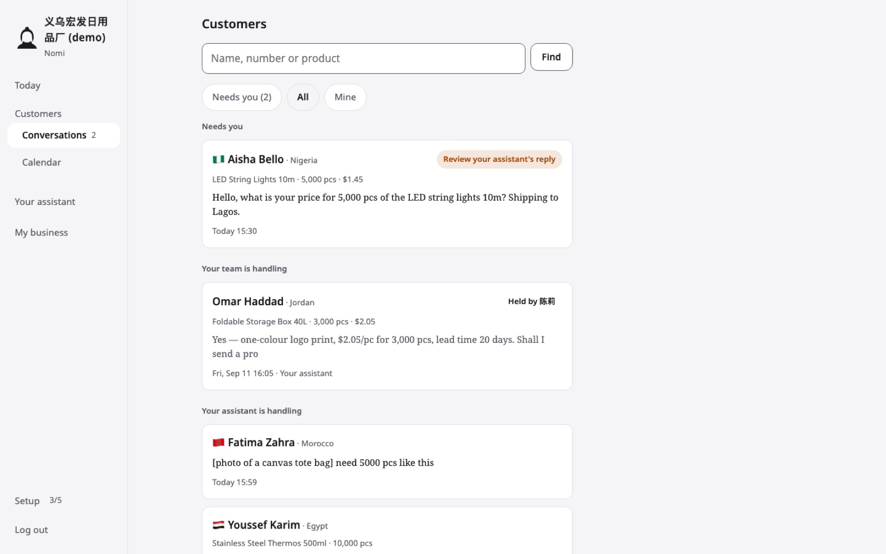
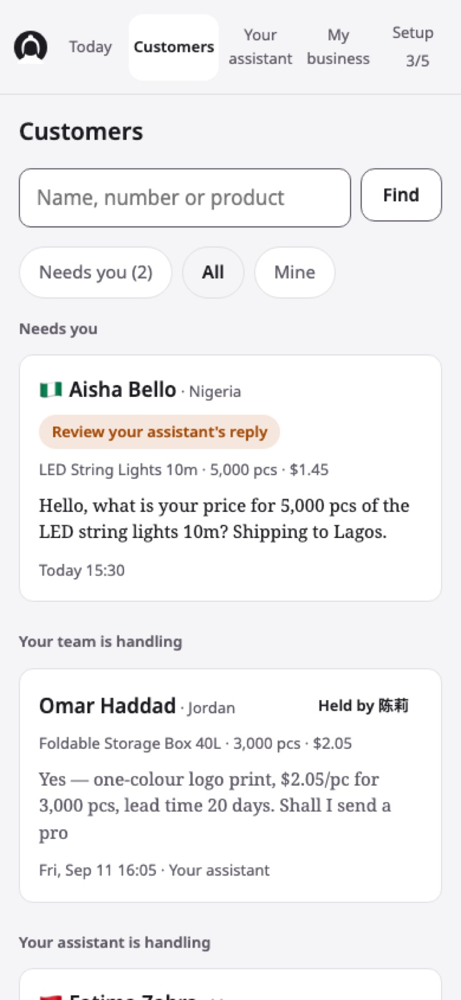
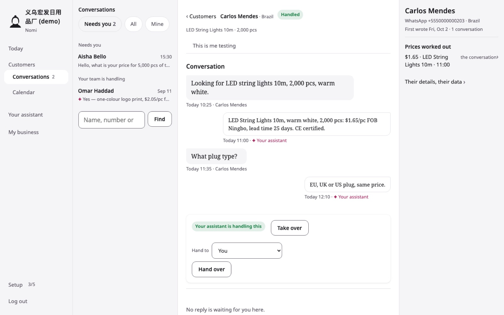
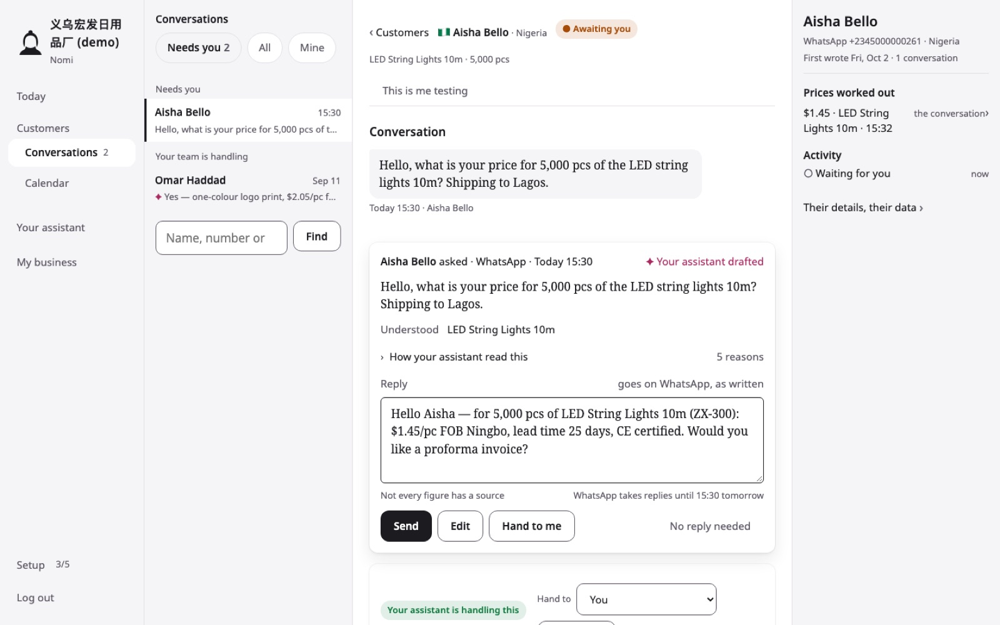
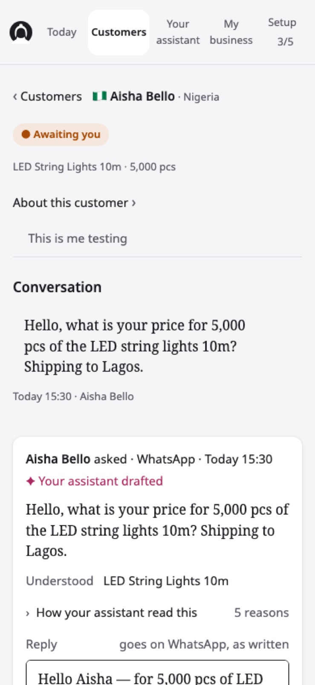
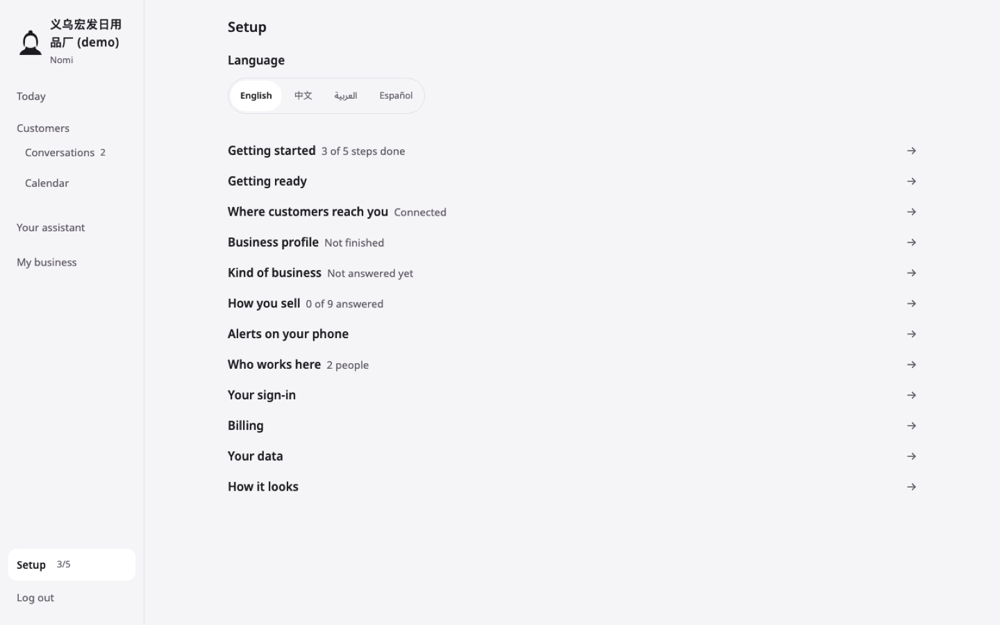
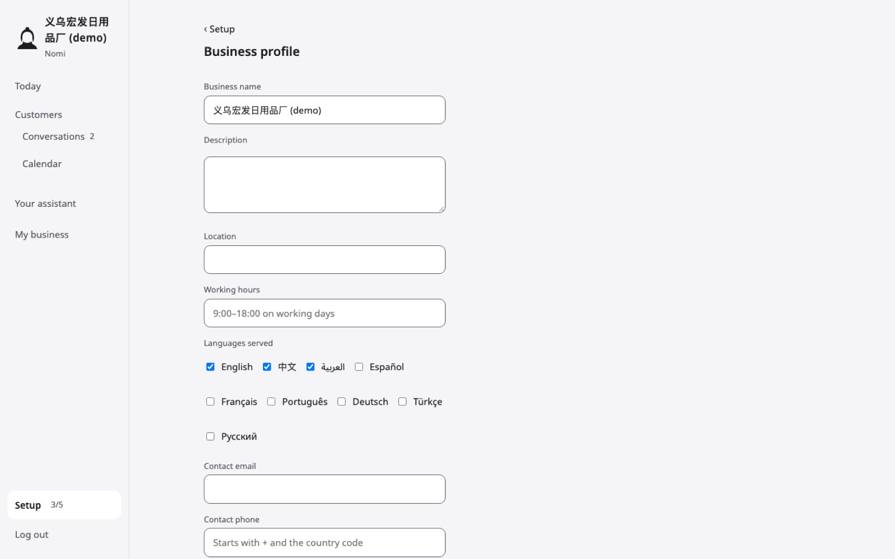
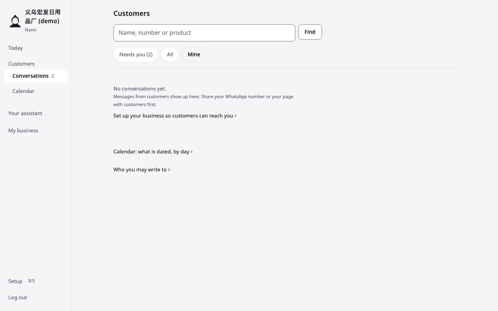

# Nomi — UI benchmark against seven inbox products

**Date:** 2026-10-02.

**Scope:** research only. This describes what other products do, what Nomi does, and the gap. It proposes no design and no fix.

**The complaint it tests:** Nomi "looks like text typed into a Word document — no density, no hierarchy, no colour doing any work, no motion; the inbox does not feel like an inbox; the settings feel thrown together."

**Products studied:**
- The five named: **Front**, **Intercom**, **Crisp**, **Linear**, **Missive**.
- Two added as comparable:
  - **Help Scout**, a small-team inbox whose public product tour is a snapshot of the real app with its real CSS;
  - **respond.io**, the closest WhatsApp-first small-business inbox.
- SAP and Sage X3 were not used.

**How:**
- **The seven products:**
  - Public pages only: marketing pages, product tours that need no form, help-centre and documentation screenshots, changelogs, demo videos and GIFs.
  - Nothing was signed into, and no form was typed into.
  - Four researchers captured pages in a headless browser at **1440×900 (a laptop)** and at phone size. I checked key claims in Chrome.
- **Nomi:**
  - Measured the same way, on a local copy of `origin/main` (`4fa90d3`) with the demo workspace: 71 conversations and one waiting draft, signed in as the owner.
  - Measured at 1440×900 and 390×844.

**Basis of each number:**
- **[measured]**: read from the DOM or CSS, or pixel-measured on a 1:1 render or video frame.
- **[screenshot]**: estimated from a help-centre image, with the scaling method in the notes.
- **[docs]**: the vendor's own documentation.
- **[video]**: frames of a vendor clip.

**Limits:**
- Most competitors' real apps need an account, so their row heights are estimates. The exceptions are Crisp (a 1:1 app render), Help Scout (the tour), Linear (live HTML on its homepage) and Missive (1:1 video frames).
- Motion inside their apps (opening a conversation, sending) is mostly **not visible without an account**. Where that is so, the report says it.

**Screenshots:** `docs/ui-benchmark/` keeps **Nomi's own screenshots only**. The 32 screenshots of the other products that the measurements were taken from were removed from the repository on 2026-10-02: they are other companies' copyrighted images, and this repository is public. They were never committed. Every figure keeps its basis tag and the vendor's source page is listed under "Sources and method".

---

## The gap in numbers

All at a 1440×900 laptop screen unless marked.

| | Linear | Front | Missive | Intercom | Help Scout | Crisp | respond.io | **Nomi** |
|---|---|---|---|---|---|---|---|---|
| **Conversations fully on screen** | ≈20 issue rows; ≈14 inbox rows | ≈8–9 (≈19 one-line) | ≈9 | ≈11–12 | ≈11 | ≈9.6 | ≈8 | **3** [measured] |
| **Row height** | 40 px (issue), ≈58 px (inbox) | ≈87–92 px (41 px one-line) | 91 px | ≈66 px | 58 px [measured] | 83 px [measured] | ≈98–102 px | **122–176 px, typically 149** |
| **Lines per row** | 1 (issue), 2 (inbox) | 3 | 3 | 2 | 2 | 2 | 3 | **4**, and the message itself wraps to 2–3 |
| **Avatar on the row** | yes (inbox) | 16 px author avatar | 16 px + channel badge | ≈24 px | ≈24 px | 40 px + flag | ≈32 px + channel badge | **none** (an emoji flag on some rows) |
| **Unread / needs-you signal** | indigo dot + brighter text | indigo dot + semibold | dot + bold + pale tint | bold + darker | bold = needs reply | colour circle + tint | bold + blue count | **none recorded**; group heading + amber text pill on one row |
| **Where the time sits** | right column | line 1, right | line 1, right | last line, right | own column | none / line 1 | line 1, right | **its own 4th line, bottom left** |
| **Screen at 1440 px** | sidebar · list · item · properties | rail · sidebar · list · thread · rail | sidebar · list · thread · rail | rail · nav · list · thread · details | folders · table (thread replaces the list) | nav · list · thread · profile | 6 columns | **list page:** one 602 px column, ≈510 px empty to its right. **Conversation page:** 300 · 632 · 300 |
| **Base text in the list** | 12–13 px | ≈13 px | ≈15 px | ≈13 px | 13 px | 14 px | 14 px | 13 px meta, **15 px serif message**, 17 px name |
| **Text colours in the inbox** | 4 greys + status hues | grey ramp + 1 indigo + AI purple | grey + 1 blue + orange | black/grey + orange + AI gradient | 5 greys/blues + AI purple | grey + Crisp blue + states | grey + blue/orange/green + AI purple | **3** (ink, grey, one amber); **1 of 424** text elements coloured [measured] |
| **AI draft shown as** | dashed chip; hover → reasons → "Accept" | "Suggested reply" card in the thread | assistant panel; approve & send from it | grey ghost text in the reply box; Tab / Esc | streaming panel → "Insert"; or a "Draft" card | Copilot panel → "Add to composer" | "Drafted by AI Assist" in the composer | **a 447 px sticky card** with Send / Edit / Hand to me / No reply needed |
| **Mark of AI text** | sparkle, dashed outline | purple sparkle (reserved) | lightning glyph | peach→pink gradient | purple/violet gradient (reserved) | "AI" badge + Sources | purple (reserved) | **magenta ✦** (used by 1 CSS rule) |
| **Settings** | separate mode; grouped nav; 60 px rows in cards | grouped nav + icons + search | 3 columns + search; card of rows | grouped nav + search; two-column cards | grouped nav; centred card; label left / toggle right | accordion groups + icons + search; autosave | grouped nav; toggle cards | **12 ungrouped 44 px rows; each page one column of stacked fields** |
| **Hover** | 0 ms tint | — | — | — | 100 ms tint, actions fade in 160 ms | 100 ms | 200 ms | **no transition anywhere** |
| **Things that appear** | 160 ms popover, 180 ms dialog | ≈150–210 ms | list reflow ≈200–230 ms, undo toast ≈100–130 ms | "no spinners" (cuts) | 250 ms draft fade, 300 ms collapse | 150 ms popups | 225 ms dialogs | **nothing animates**. 3 motion tokens defined (120/200/300 ms), **0 used** [measured] |
| **Loading** | "Thinking…" sweep, timers | "Thinking" shimmer + Stop | ✓ step lines, spinner | inline "Thinking…" | pulsing dot, streaming text | skeletons, spinners | skeletons, dots | **none**: whole-page reloads; one sentence in Practice |
| **Phone** | native apps, ≈9–10 rows | native, ≈6 rows | native, ≈8 rows | native, ≈7 rows (frozen) | native only, ≈5–6 rows | native, ≈7 rows | native, ≈7 rows | **web page, 2 rows** fully visible [measured] |
| **Arabic owner UI** | none shown (English) | no; RTL in the composer only | no (English only) | no (5 Latin languages) | none shown; its docs warn RTL is unreliable | iOS app only | yes, full mirror (with bidi bugs) | **yes**: en/zh/ar/es, mirrored, figures isolated |

---

## Read this first — the ten biggest gaps

1. **Density: Nomi shows 3 conversations where they show 8–20.**
   - **Rows:** each Nomi row is a 149 px white card with four stacked lines. The customer's whole message is set as a 15 px serif paragraph that wraps.
   - **Space above the list:** the page spends 227 px on a title, a search box and tabs before the first row.
   - **Phone:** 2 rows fit.
   - **Them:** the densest product here fits a row in 40 px (Linear), and the airiest in about 100 px (respond.io).
2. **An inbox row in Nomi carries no state you can scan.**
   - **Nomi:** no avatar, no unread mark, no time in the corner, no state glyph. The only signal is an amber text pill on rows that need the owner. Every other row is identical grey-on-white.
   - **Them:** every product puts *who*, *when* and *what state* at fixed positions — avatar left, time top-right, state glyph or dot.
3. **The list and the conversation do not share the screen where it matters.**
   - **Nomi's Customers page:** one 602 px column, with about 510 px of a laptop screen left blank.
   - **Nomi's conversation page:** has a list pane, but it shows only the current tab: 2 rows on the demo, and not even the conversation that is open.
   - **Them:** keep a full list beside the open conversation (Front, Missive, Crisp, Intercom, respond.io, Linear), or let one key move to the next (Help Scout).
4. **The draft card is the heaviest object on the page and still the least clear.**
   - **Size:** 447 px tall on a laptop and 575 px on a phone, sticky over the transcript. It repeats the customer's message and carries four controls.
   - **Them:** keep the AI's text in the reply box (Intercom, respond.io, Crisp) or in one compact card with one accept action (Front, Linear, Help Scout). The AI mark is reserved and unmistakable.
5. **There is no motion at all.**
   - **Nomi:** 88 KB of CSS, zero `transition` rules. Three motion tokens are defined and never used. The only thing that moves is the phone nav compacting on scroll.
   - **Them:** every product animates the things that appear (menus, dialogs, drafts, toasts) in 100–250 ms, and keeps hover instant or close to it.
6. **There is no colour doing work.**
   - **Nomi:** in the inbox, 1 of 424 text elements has colour. The assistant's magenta exists in one CSS rule. State colours exist as tokens but appear as words in pills.
   - **Them:** spend colour on a small set of fixed jobs — one accent for the primary action and selection, one reserved hue for AI, status glyph colours — and back each with a shape.
7. **There is no hierarchy inside a row or a page.**
   - **Nomi:** sizes are 13 / 15 / 17 / 20 px and three colours, so nearly everything is either "grey small" or "black larger". The serif message is the loudest thing on the row, louder than the name.
   - **Them:** use one or two sizes per screen and three or four steps of grey or weight (Linear: four greys; Help Scout: five text colours, three weights).
8. **Settings are a list of links and then a form.**
   - **The Setup hub:** 12 identical 44 px rows with no groups, no icons and no section headings.
   - **A settings page:** one 389 px column of label-above-input fields (16 on Business profile) with two separate Save buttons, and 700 px of blank screen beside it.
   - **Them:** group settings (3–11 named groups, with icons), put each row as label and description left and control right inside a card, show the current value on the row, and offer settings search.
9. **Empty, loading and error states are sentences, not states.**
   - **Nomi:** no skeletons, no spinners, no inline errors. A failed form is a separate page that loses what was typed. Empty states are one grey line, and one of them is wrong ("No conversations yet" on a workspace with 71).
   - **Them:** stream or shimmer while the AI works, undo instead of confirm (Missive), and show errors inline in the thread (Intercom, Help Scout).
10. **Phone is where Nomi's owner lives, and it is Nomi's weakest surface.**
    - **Them:** every competitor ships a native phone app with a bottom tab bar, 5–10 rows per screen, swipe actions and bottom sheets.
    - **Nomi:** a web page with a five-word top nav that wraps, 2 rows per screen, and a draft card taller than the screen.

What Nomi has that none of them has is in §9. What not to copy is in §10.

---

## 1 · The inbox (Nomi: Customers, `/app/inbox`)

### What they do

**Row anatomy is the same idea everywhere:** an avatar on the left, the name on line 1 with the time right-aligned, a one-line truncated preview, and a state mark at a fixed position.

- **Linear**
  - **Issue rows:** 40 px, one line [measured]. A fixed 72 px ID column, so every title starts at the same x. Status and priority are glyphs coded by shape *and* colour.
  - **Inbox rows:** ≈58 px, two lines. The avatar carries a small badge for the type of event. An indigo dot marks unread, and read rows dim, so the list visibly empties as you work [screenshot].
  - Group headers: 36 px, with a count.
  - Hover tints a row in 0 ms [measured].
- **Front**
  - **Rows:** three lines, ≈87–92 px: sender + time; subject; author avatar + grey preview + tag chips. A one-line mode at ≈41 px shows ≈19 rows [measured from @2x help images and the public tour].
  - **Unread:** a 6 px indigo dot plus semibold; no tint, so it survives greyscale.
  - **States as navigation:** Open / Later / Done in the sidebar, with Snoozed / Waiting tabs.
- **Missive**
  - **Rows:** three lines at a 91 px pitch, with sticky day dividers ("Today", "Yesterday") [measured, 1:1 video frame].
  - **Unread:** dot + semibold + a pale blue tint. The tint is ≈6 % darker than white and vanishes in greyscale; the dot and weight survive.
  - **Selected:** the row is solid blue with white text.
- **Intercom**
  - **Rows:** two lines, ≈66 px. The preview is prefixed by the speaker when it is not the customer ("Paula: …"), and an arrow replaces the avatar when the last word was the team's.
  - **Unread:** bold and dark; read rows are regular grey [screenshot].
- **Help Scout**
  - **Rows:** 58 px [measured]: name 14/700, subject 13/700, preview 13/400 grey, a bold "Waiting" column ("4 hrs"), and pastel tag pills.
  - **Bold means "needs a reply";** a closed conversation gets a grey row.
  - **Hover:** three quick actions fade in at the row's end (160 ms).
  - **Empty folders** ("Drafts", "Later") are hidden until something is in them.
- **Crisp**
  - **Rows:** two lines at 83 px [measured on a 1:1 render]: a 40 px avatar with a flag badge, name 14 px bold + "› assigned person", one-line preview, and a 20 px state circle at the right.
  - **Sort order:** by state, then recency.
- **respond.io**
  - **Rows:** three lines, ≈100 px: avatar + channel badge; name + time; a direction arrow (↗ we wrote last / ↙ they did) + preview; a stage pill + assignee mini-avatar.
  - **"Unreplied"** is a toggle.

**How the list and the conversation share the screen:**
- Front, Missive, Crisp, Intercom, respond.io and the Linear inbox keep the list (≈280–380 px) beside the open conversation at all times.
- Help Scout opens a conversation in place of the list, and J/K or a swipe moves to the next one.

*Described from the vendor's own screenshot (not kept in the repository):* *Crisp at 1440×900, 1:1 (≈10 rows, avatars, state circles). Missive at 1280×696, 1:1 (3-line rows, day divider, unread dot and tint).*

*Described from the vendor's own screenshot (not kept in the repository):* *Help Scout's list (58 px rows, bold = needs reply, "Waiting" column). Linear's 40 px issue rows under 36 px group headers.*

### What Nomi does [measured]

- **Layout:**
  - The Customers page is a single column of white cards, x = 328–930 inside a 1040 px main column. The right ≈510 px of a 1440 laptop is empty.
  - Above the first row: the h1 "Customers", a full-width search box, three pill tabs and a 13 px grey group heading. **The first row starts 227 px down** (299 px on a phone).
- **Row (`a.buyer`), four stacked lines:**
  1. Flag emoji + **name 17/700** + "· Nigeria" 13 px grey. On one row only, an amber pill "Review your assistant's reply" 13/600 at the right.
  2. Product line, 13 px grey: "LED String Lights 10m · 5,000 pcs · $1.45".
  3. **The customer's last message in full, 15 px serif**, wrapping to 2 lines (laptop) or 3 (phone).
  4. **The time, 13 px grey, on its own line**: "Today 15:30" or "Fri, Sep 11 16:05 · Your assistant".
- **Row size:**
  - 122–176 px, typically 149 px; 16 px gaps; 12 px radius; 1 px border.
  - **3 rows fully on a 1440×900 screen, 2 on a phone.** 50 rows make the page **8,730 px** tall (9,030 px on a phone).
- **Signals:**
  - **No unread state exists** (the database does not record "seen").
  - "Needs you" is a group heading. One row carries an amber pill; the "held by" row carries **bold black text with no pill** ("Held by 陈莉").
  - No avatar, no channel mark, no time in a fixed corner, no state glyph.
- **The conversation page's list pane** (from 1100 px) has the closest thing to an inbox row: 62 px, name + time on line 1, a one-line preview. **But it shows only the current tab**: 2 rows on "Needs you", and not the conversation that is open (Carlos Mendes is open; the pane lists Aisha and Omar).

 

*Nomi, Customers › All, at 1440×900 and at 390×844. Three and two conversations.*

### The gap

- **Rows:**
  - **Where they have a dense two- or three-line row, Nomi has a card that holds a paragraph.** The customer's message is the biggest block of text on the row, set in a serif. Everyone else shows one grey line of it and truncates.
  - **Where they put the time top-right on line 1, Nomi puts it alone on line 4.** The eye has to read a whole card to learn when.
  - **Where they show who with an avatar and a channel badge, Nomi shows a flag emoji on some rows and nothing on others.**
  - **Where they mark unread or waiting with a dot plus weight, Nomi has nothing for unread** and a text pill for waiting. Rows the assistant handles carry no mark at all, except "· Your assistant" appended to the time.
- **States:** "held by a person" is bold black text; "needs you" is an amber pill; "handled" is nothing. Three states in three unrelated styles, none of them a glyph.
- **Use of the screen:**
  - On a laptop, Nomi leaves a third of the screen blank beside a list it shows only 3 rows of.
  - Every competitor here fills the width with the list *and* the conversation, or a table.
- **Navigation:** Nomi's full list and its conversation are two separate pages. Moving from one customer to the next means going back to the list.

---

## 2 · A conversation (Nomi: `/app/inbox/:id`)

### What they do

- **Message grouping and time:**
  - Missive puts a centred time divider where a gap occurs.
  - Crisp, respond.io and Missive have day dividers (pills such as "Today").
  - Linear and Intercom give each entry a relative time ("4min", "2mo").
  - **Events** (assigned, tag added, AI action) are one quiet centred or indented grey line naming the cause, with inline chips (Front, Missive, respond.io, Linear). Linear joins them with a thin timeline line.
- **Who is speaking:**
  - **The sides:**
    - Chat-style products (Crisp, Intercom, respond.io) put the customer left and the team right, each with an avatar outside the bubble.
    - Card-style products (Front, Help Scout, Missive e-mail) put every message in one column as a card: avatar, bold name, grey address, time at the right.
  - **Internal notes are always a different object:** yellow cards (Intercom, Crisp, Help Scout), grey chat bubbles between white cards (Front, Missive).
  - **A thread's type** is marked by a coloured left bar **plus** a text pill: "Note", "Draft", "Forward", "Scheduled" (Help Scout) [measured].
- **Delivery and errors are inline:** "✓✓ Read" / "Sent via whatsapp" under the bubble (Crisp), ticks and a red "!" with the platform's error on hover (respond.io), a yellow error note in the thread (Intercom).

*Described from the vendor's own screenshot (not kept in the repository):* *Missive (cards, time dividers, event lines with chips, undo toast). Front at laptop size (AI summary line, suggested-reply card, comments as bubbles).*

### What Nomi does [measured]

- **Header:**
  - "‹ Customers", flag + name 15/400 (the h1), "· Nigeria", and a state pill ("Awaiting you", "Handled").
  - Then a grey product line.
  - Then the ghost button "This is me testing".
  - Then an h2 "Conversation".
- **Messages:**
  - The customer's messages are serif 17 px in a grey bubble on the left; the assistant's are white bordered bubbles on the right.
  - **No avatars.**
  - **Every message has its own caption line under it** ("Today 10:25 · Carlos Mendes"; "Today 11:00 · ✦ Your assistant" in magenta).
  - No day dividers, no grouping of consecutive messages, no delivery ticks.
- **Panes:** at 1440 px, list 300 · conversation 632 · customer panel 300.
- **Length:** the longest seeded thread is 4 messages.

*Nomi, a conversation the assistant handled. The list pane shows 2 other customers, not this one.*

### The gap

- **Sender identity:** where they identify the sender with an avatar and a name once per group, Nomi repeats a caption line under every message and shows no faces.
- **Time:** where they mark a day once with a divider, Nomi writes "Today" on every message.
- **Events:** where they show events as one quiet line, Nomi has none in the thread. The state lives in a pill in the header and a separate "Your assistant is handling this · Take over · Hand to · Hand over" card, which takes 200 px under the thread.
- **The header:** stacks five separate lines (back link + name + pill, product line, "This is me testing", rule, "Conversation") before the first message. Front and Missive put the title, state and actions in one bar.
- **Delivery:** Nomi shows no delivery state at all (sent, delivered, read, failed) on the owner's or the assistant's messages.

---

## 3 · The AI-drafted reply (Nomi: the draft card)

### What they do

There are four patterns. All of them make the AI's text unmistakable and approval one action.

1. **The draft lives in the reply box.**
   - **Intercom:** a suggested reply appears as **grey ghost text in the composer**, under a thin banner with "Reject · Esc" and "Insert into composer · Tab". Typing dismisses it. Send stays grey until the box has text [screenshot, docs].
   - **respond.io:** AI Assist fills the composer under a "Drafted by AI Assist" header with 👍/👎 and quotes the message being answered. 👎 regenerates; Enter sends. While an AI agent is handling the conversation, **the composer is replaced by a callout and a purple "Takeover" button**.
2. **One draft card in the thread.**
   - **Front:** a "Suggested reply" card with a purple sparkle tile, "To: …", the reply, **"Sources (2)"**, and a one-line caveat; 👍 👎 · Discard · Take over in its header. No one-click send.
   - **Help Scout:** pre-generated drafts are a **blue-bar "Draft" card with an "Edit" button**. Its newer design collapses the draft to **one line under the customer's message** that expands to a card with Edit | Discard [screenshot, marketing].
3. **Propose, then accept.**
   - **Linear's Triage Intelligence:** a suggestion is a **chip with a dashed outline**; applied, it gets a ✓.
   - Hovering opens **2–3 reason bullets**, one "Accept suggestion" button and a thumbs-down. The full reasoning is one step further away, never in the way.
4. **Streaming in a panel, then Insert.**
   - **Help Scout:** the "Draft with AI" panel shows a pulsing purple dot, then text streaming in over ≈5–6 s with a gradient border. A pill **"Insert"** fades in (250 ms) [measured, video]. Every refined version keeps its own Insert.
   - **Missive:** lets the owner **approve and send from the assistant panel, and checks the text has not changed since approval**.

**One colour is reserved for AI and used for nothing else:**
- purple sparkle (Front);
- purple / blue→violet gradient (Help Scout);
- purple (respond.io);
- peach→pink gradient (Intercom);
- "AI Answer · Sources ›" footer (Crisp).

*Described from the vendor's own screenshot (not kept in the repository):* *Intercom: the suggestion as grey text in the reply box, Tab / Esc. Front: one "Suggested reply" card with Sources and a caveat.*

*Described from the vendor's own screenshot (not kept in the repository):* *Help Scout: draft versions, each with Insert. Linear: dashed = proposed, a popover of reasons, one Accept. respond.io: "Drafted by AI Assist" in the composer.*

### What Nomi does [measured]

- **Placement:** the draft is a separate **sticky card**, 447 px tall on a 1440×900 screen (top at y = 349, so the transcript above it gets about 120 px). On a phone it is **575 px tall**, starting 538 px down a 1,519 px page.
- **Contents, top to bottom:**
  1. "Aisha Bello asked · WhatsApp · Today 15:30" and, in magenta, "✦ Your assistant drafted".
  2. **The customer's message again, in full** (it is already in the transcript above).
  3. "Understood  LED String Lights 10m".
  4. A disclosure "› How your assistant read this · 5 reasons".
  5. A label row "Reply / goes on WhatsApp, as written".
  6. The editable reply, serif, in a 4-line box.
  7. Two grey 13 px captions: "Not every figure has a source" and "WhatsApp takes replies until 15:30 tomorrow".
  8. Controls: **Send** (black), **Edit** (looks like a button, only focuses the box), **Hand to me**, and the text button **No reply needed**.
- **Then a second card:** "Your assistant is handling this" (green pill) · Hand to [You ▾] · Hand over. It contradicts the header's "Awaiting you".

 

*Nomi's draft card at 1440×900 and on a phone (the card is taller than the screen).*

### The gap

- **Size and duplication:** where Intercom shows a draft in the space a reply already occupies, Nomi builds a 447 px structure. It repeats the customer's message, adds a label row, two captions and a reasons drawer, and puts it over the transcript.
- **The AI mark:**
  - Where Front, Help Scout and respond.io **reserve one colour for AI and use it consistently**, Nomi's magenta ✦ appears in one CSS rule.
  - The same page also uses green ("handling this"), amber ("Awaiting you") and black (Send), so the AI mark is one small glyph among four colours.
- **Reasons:**
  - Where Linear shows **2–3 plain reasons on demand**, Nomi lists five number-checks ("300 — no source found" for the model number "ZX-300").
  - Where Front shows **"Sources (2)"** as a link, Nomi shows a grey caption, "Not every figure has a source", with no way to see which figure.
- **Approval:**
  - Where approval is **one action** (Tab; Insert; Accept; Send), Nomi offers four buttons of three styles. One of them ("Edit") does nothing visible.
  - Where respond.io replaces the composer with **one "Takeover" callout** while the AI is handling, Nomi shows both a "Hand to me" button and a separate hand-over card.
- **Feedback:** no product here marks a draft as "drafted" and then gives no feedback on the send. Nomi's Send reloads the whole page; there is no confirmation in place, no undo and no "sent ✓" on the message.

---

## 4 · Settings (Nomi: Setup `/app/settings` and its pages)

### What they do

- **Navigation — grouped, with icons, and usually searchable:**
  - **Linear:** a separate settings mode with its own nav in four groups (Account, Features, Administration, Your teams).
  - **Front:** groups such as General, Resources, Automation, each item with an outline icon, plus a settings **search modal**.
  - **Intercom:** 11 groups that expand in place, with a search field.
  - **Missive:** three columns (categories, sub-sections with a search box, content).
  - **Help Scout:** 4 small grey group labels (General, Workspace, Automations, Advanced).
  - **Crisp:** 8 accordion groups with icons, plus breadcrumb + search.
  - **respond.io:** grouped headings with icon items.
- **Page body — rows, not paragraphs:**
  - **Linear:** settings sit in **rounded cards of ≈60 px rows**, with a 13 px label + 12 px grey description on the left and the control on the right (toggle, select, text button). Drill-in rows show **the current value in grey** ("3 members", "Off") with a chevron.
  - **Help Scout:** a centred ≈700 px card. Section title 18 px + one grey line + "Learn more"; label left / toggle right. **Choices are radio cards** with an icon and a two-line explanation. A **sticky Save stays disabled until something changes**.
  - **Missive:** one white card of rows per section, with the key in grey and the value in bold in an inline select.
  - **Intercom:** two-column cards (title + 2–4 lines of description left, control right), Save top-right.
  - **Crisp:** autosaves and shows an "Automatically Saved" badge.

*Described from the vendor's own screenshot (not kept in the repository):* *Linear: 60 px rows in cards, label + description left, control right. Help Scout: grouped nav, centred card, radio cards, Save that waits for a change.*

*Described from the vendor's own screenshot (not kept in the repository):* *Missive: settings search and one card of rows. Linear: drill-in rows that show the current value.*

### What Nomi does [measured]

- **The Setup hub:**
  - A language switch, then **12 rows of 44 px, all the same**: bold 17 px label, grey state ("3 of 5 steps done", "Not finished", "Connected"), and "→" at the far right of a 992 px-wide row.
  - No groups, no section headings, no icons.
  - A developer component gallery ("How it looks") sits in the list as if it were a setting.
- **A settings page (Business profile):**
  - **One column of 16 label-above-input fields, 389 px wide**, labels 13 px grey, browser-default blue checkboxes, **two separate "Save" buttons** that each save half the page.
  - The page is 1,540 px tall, and **≈700 px of the laptop screen beside it is empty**.
  - Other pages repeat the pattern with different label sizes (13 px muted on closures and forbidden words, 15–17 px dark elsewhere; see UI-AUDIT §1).
- **Page titles:** most of these pages are titled "Setup · …" in the browser tab.

 

*Nomi's Setup hub (12 identical rows) and Business profile (one column of fields).*

### The gap

- **Grouping:** where they group settings into 3–11 named sections with icons, Nomi lists 12 unrelated rows with equal weight. "Billing" sits between "Your sign-in" and "Your data", and "How it looks" between them and nothing.
- **Row layout:**
  - Where they put a **label + one-line description on the left and the control on the right**, inside a card, Nomi stacks the label above a full-width field. There is no description.
  - Where Linear shows **the current value on the drill-in row**, Nomi shows a state on some rows only ("Connected", "Not finished") and nothing on others ("Billing", "Your data").
- **Saving:** where Help Scout keeps **one Save disabled until a change** (and Crisp autosaves), Nomi has two Saves per page. Neither shows whether anything changed.
- **Search:** where they offer settings search (Front, Intercom, Missive, Crisp), Nomi has none.
- **Use of the screen:** where their settings content sits in a 640–700 px card centred in the page, Nomi's sits as a 389 px column hard against the rail.

---

## 5 · Empty, loading and error states

### What they do

- **Empty:**
  - **Missive:** one large grey glyph (≈96 px) and the mailbox name, nothing else.
  - **Help Scout and Linear:** hide empty folders and groups entirely.
  - **Intercom:** shows "0 Open" with nothing under it, and a "Pull conversation" pill when the list runs low.
  - **Crisp:** keeps illustration components.
  - **The Copilot panels** (Intercom, Front) open with 3–4 capability rows and the input ready.
- **Loading:**
  - **AI work is always shown in place:**
    - "Thinking…" with a light sweep (Linear 2 s; Front ≈1.4 s) and a Stop link (Front);
    - a pulsing purple dot and streaming text (Help Scout);
    - "✓ step" lines (Missive);
    - a running mm:ss timer (Linear).
  - **Lists:** Crisp and respond.io ship skeleton loaders. Intercom says its inbox has no loading screens at all.
- **Errors and undo:**
  - **Missive:** replaces confirmations with an **undo toast** that appears in ≈100–130 ms after archive or assign.
  - **Help Scout:** **holds a reply** when the customer wrote again before it was sent, and shows the held reply with a red bar, a "Collision" pill and Edit / Send.
  - **Intercom:** shows delivery failures as a **yellow note in the thread** with the provider's raw error and a "What is this?" line.
  - **Crisp:** toasts carry a 7 s countdown bar.

*Described from the vendor's own screenshot (not kept in the repository):* *Missive's empty state. Help Scout's held ("collision") reply, inline in the thread.*

### What Nomi does

- **Empty:**
  - One grey line and a link, with no glyph.
  - On the "Mine" tab it is wrong ("No conversations yet… Share your WhatsApp number" in a workspace with 71).
  - The search-with-no-results state is a sentence and a link.
- **Loading:**
  - None. Every action reloads the whole page.
  - While the assistant drafts in Practice, the only sign is the sentence "Sent. Your assistant's reply appears here when it is ready." There is no indicator, no progress and no end.
  - Open pages poll every 20 s and show one quiet text line when something changed.
- **Errors:**
  - A failed form is a separate page ("Nothing was added", "Nothing was read") that loses what was typed.
  - A missing product or conversation is a bare heading and one word-link.
  - Destructive actions ask with the browser's own `confirm()` dialog, not undo.
- **Icons:** Nomi ships no icon set. Emoji stand in (📱 🧪 💬 💰 and flags).

*Nomi's "Mine" empty state on a workspace with 71 conversations.*

### The gap

- **Empty:** where they show emptiness with a glyph, a name or by hiding the empty thing, Nomi writes a sentence, and sometimes the wrong one.
- **Loading:** where they show the AI working in place (a dot, a shimmer, streaming text, step lines), Nomi shows a static sentence that never resolves.
- **Undo:** where Missive offers undo for 5–30 s, Nomi asks "Are you sure?" in the browser's own dialog.
- **Errors:** where Intercom and Help Scout put the error *in the thread at the message it concerns*, Nomi sends the owner to another page.

---

## 6 · Type, spacing and colour

### What they do

- **Type:**
  - **One working size, and hierarchy from weight and grey:**
    - Linear works at 12–13 px with weights 400/510/590, and only the issue title (20 px) is larger;
    - Help Scout at 13 px with 400/500/700 and five text colours;
    - Front and Intercom at ≈13 px;
    - Crisp and respond.io at 14 px;
    - Missive is the airiest at 15 px, with a large, light 28 px conversation title.
  - **Fonts:** a grotesque sans everywhere (Inter, Aktiv Grotesk, a Crisp custom face, SF Pro).
- **Greys:**
  - **Linear: four text greys at 18.7 / 13.6 / 6.1 / 3.5 : 1 contrast.** The brightest is used 7 times in the census; the middle two carry the text (239 and 187 uses).
  - Help Scout: body #314351, secondary #556575, tertiary #7E8E9E, accent #304DDB.
- **Spacing:** a 4 px rhythm, with 8 px between elements (Linear's census: 8 px ×215, 4 px ×198) [measured].
- **Colour has fixed jobs:**
  - one accent for the primary action, the selection and links (Front indigo, Missive blue, Help Scout #304DDB, Crisp #1972F5, Intercom black + orange);
  - **one hue reserved for AI** (purple or a gradient);
  - status glyphs with shape + colour (Linear rings, Intercom ticket pies);
  - pastel tag chips (Front, Help Scout);
  - photos or initials avatars.
  - Chrome is near-white or grey.

### What Nomi does [measured]

- **Fonts:** Noto Sans for the interface and **Noto Serif for anything a customer or the assistant said**.
- **Sizes:**
  - Scale 13 / 15 / 17 / 20 / 26 / 34; weights 400 / 600 / 700.
  - In the inbox, **272 of 424 text elements are 13 px grey**; names are 17/700, messages 15 px serif.
- **Colours:**
  - **Three text colours** in the inbox: ink #1C1B1F, grey #5E5A66 (305 uses), and amber #A64C08 (**1 use**).
  - Backgrounds: white cards on #F5F4F6.
  - State tokens exist (ok green, waiting amber, warn red, assistant magenta #A82860). The assistant colour is referenced **once** in 88 KB of CSS.
- **Spacing:** tokens 4/8/12/16/24/32/48; cards with 12 px radius and 16 px gaps.
- **Today and Setup:** **0 coloured text elements** on either page.

### The gap

- **Hierarchy:**
  - Where they get hierarchy from three or four greys and two weights at one size, Nomi uses size jumps (13 → 15 → 17) and a typeface change (sans → serif) inside a single row.
  - The result is the "typed document" look. Every row is a heading, a caption, a paragraph and a caption.
- **Colour:**
  - Where they give colour **fixed jobs** (accent = act or selected; AI hue = AI; glyph colour = state), Nomi's colour mostly sits unused in tokens.
  - On the pages measured, only pills and the ✦ carry it. Nothing on Today or Setup has colour.
- **Avatars and tags:** where avatars and tag chips put colour into the list (Front, Help Scout, Crisp), Nomi has neither.

---

## 7 · Motion

### What they do

**Measured where the CSS was reachable; otherwise from video:**

- **Linear** [measured]:
  - **Hover is instant (0 ms) by design** (`--speed-highlightFadeIn: 0s`).
  - Link colour 100 ms; buttons 160 ms.
  - **Popovers 160 ms** (fade + scale 0.9→1); **dialogs 180 ms** (fade + scale 0.95→1).
  - Toasts 400 ms; the AI "Thinking…" sweep 2 s.
  - `prefers-reduced-motion` respected.
- **Help Scout** [measured]:
  - Row hover 100 ms; quick actions fade in 160 ms.
  - Sidebar labels 200 ms after a 200 ms delay.
  - Collapsible sections 300 ms; the AI draft block fades in 250 ms.
- **Crisp** [measured, app base CSS]:
  - Buttons and tabs 100 ms linear; tooltips 150 ms after 100–250 ms.
  - Popups fade 150 ms, then rise 150 ms after 75 ms.
  - Page boxes fade-in-up 400 ms; skeleton scan 3.5 s.
- **Missive** [video]:
  - Opening a conversation is **instant (≤66 ms)**.
  - Archiving reflows the list over **≈200–230 ms** ease-out; the undo toast appears in ≈100–130 ms.
- **Front** [video]:
  - Sidebar collapse ≈140–210 ms.
  - Accept / Discard fade in ≈150–210 ms under AI text.
  - The "Thinking" shimmer ≈1.4 s per sweep.
- **respond.io** [measured, Vuetify]:
  - The Material curve at 200–300 ms; dialogs 225 ms in / 125 ms out; click ripple.
- **Intercom:** claims no spinners and no loading screens. Its AI rewrite swaps text with a cut.

**The common rule:** navigation and hover are instant or ≤100 ms. Things that appear (menus, dialogs, drafts, toasts) take 150–250 ms. Only "the AI is working" loops.

### What Nomi does [measured]

- **Transitions:** **zero `transition` declarations** in the 88 KB stylesheet.
- **Tokens:** `--motion-fast: 120ms`, `--motion-normal: 200ms` and `--motion-max: 300ms` are defined and **referenced nowhere**.
- **The only motion in the product:** the phone nav compacting as the page scrolls (two `@keyframes` on a CSS scroll timeline).
- **Hover:** 17 `:hover` rules change colour instantly.
- **Opening a conversation, sending, approving, handing over:** each is a full page reload. The page lands at `#latest`.

### The gap

- **Things that appear:** where every product animates them in 150–250 ms and keeps navigation instant, Nomi has no animation and slow navigation (a full reload per action).
- **The draft:** where the AI's draft streams in, fades in, or shimmers while it is written, Nomi's appears only after a reload, and only if the owner reloads.

---

## 8 · Keyboard and phone

### What they do

- **Keyboard:**
  - Every desktop product has J/K or ↑/↓ to move between conversations, single-key reply / archive / snooze, ⌘↵ to send, and a ⌘K palette.
  - Linear prints the key on every menu row.
  - Help Scout prints "R" and "N" on its Reply and Note buttons.
- **Phone — all seven ship native apps:**
  - **Bottom tab bars:** Front's floating pill bar, Crisp's 4 icons, respond.io's 4 labels, Linear's customisable bar.
  - **Rows per screen:** ≈6 (Front), ≈7 (Crisp, respond.io, Intercom), ≈8 (Missive), ≈9–10 (Linear).
  - **Swipe actions:** archive, snooze, read; multi-stage in Missive.
  - **Bottom sheets** for pickers. Linear's snooze sheet shows each option's resolved time.
  - **AI on the phone:** respond.io opens AI Assist as a **bottom sheet with "Insert"**. Help Scout and Intercom have **no AI drafts on the phone at all**.

*Described from the vendor's own screenshot (not kept in the repository):* *Front's phone inbox (pill header, status chips, pill tab bar). respond.io's phone inbox, conversation and composer. Linear's phone inbox with swipe actions.*

### What Nomi does

- **Keyboard:** none. Nomi's one script polls for changes; it handles no keys.
- **Phone:**
  - **The nav:** a top bar of five text items that wrap ("Your / assistant", "My / business", "Setup / 3/5"). It compacts on scroll. There is no bottom bar.
  - **The list:** 2 conversations per screen.
  - **The draft card:** taller than the screen.
  - No swipe, no sheets.
  - It is installable as a web app (a manifest and a service worker).

### The gap

- **Rows:** where their phone inbox shows 6–10 conversations with one-thumb actions, Nomi shows 2 and needs scrolling to reach Send.
- **The draft:** where respond.io shows the AI draft as a bottom sheet with one "Insert", Nomi puts a 575 px card in the page flow.

---

## 9 · Where Nomi is already ahead (fact, not consolation)

- **Arabic and Chinese owner interface.** Nomi's whole owner UI is in en / zh / ar / es, mirrored for Arabic, with figures isolated so numbers do not reorder.
  - **Of the seven:** only respond.io offers an Arabic interface across its product (Crisp's is on iOS only), and respond.io's own 2022 screenshots show "PM 3:09" and English fragments inside Arabic lines.
  - **The rest:**
    - Front and Missive are English-only and do right-to-left in the composer only.
    - Intercom's inbox comes in five Latin languages.
    - Crisp has Arabic only on iOS.
    - Help Scout's docs warn of unexpected behaviour with right-to-left languages, and its summaries are always English.
  - AI translation lists in Front and Intercom leave Arabic out.
- **The draft is already there.** Nomi's assistant drafts before the owner opens the conversation. Front, Intercom, Help Scout and Crisp mostly make the agent *ask* (open a panel, press a key, wait 1–6 s).
- **Typeface coverage.** Noto Sans / Serif cover Latin, Chinese and Arabic. Inter (Linear, respond.io) and Aktiv Grotesk (Help Scout) have no Arabic or CJK, so those scripts fall back to system fonts.

These do not offset the gaps above. They are the parts the gaps sit on top of.

---

## 10 · What NOT to copy

Nomi has **one owner, no team, no pipeline**, low volume, and must work **in Arabic and Chinese at phone width**. Against that:

- **Team machinery.** None of this exists for one owner:
  - assignee pills and avatars on rows;
  - Mine / Unassigned / Assigned / team inboxes;
  - round-robin and routing;
  - @mentions, internal comment threads, "teammates viewing" presence;
  - shared drafts "editable by everyone in Sales";
  - "Take over" meaning *take it from a colleague*;
  - the "Chat with your team…" composer;
  - the collision presence triangles.

  (Help Scout's collision *hold* — pausing a reply because the customer wrote again — is not team machinery; it is Nomi's stale-draft case.)
- **Pipeline vocabulary:**
  - lifecycle stages (New Lead → Hot Lead → Paying), ticket IDs, priority bars;
  - SLA columns, Open / Pending / Resolved triads, Open / Later / Done queues;
  - Linear's 7-state rings.

  Nomi's question per customer is three-valued (needs you / the assistant has it / closed).
- **Four- to six-column desktop layouts.** They need ≥1440 px and still show 8–12 rows; Nomi's owner is on a phone.
- **Keyboard-first speed:**
  - J/K, single letters, ⌘K, "G then I", Tab-to-accept, letter chips on buttons.
  - Single letters mean nothing on an Arabic or Chinese keyboard layout, and a thumb has no Tab key.
- **Hover-only affordances:** Linear's reasons-and-Accept popover and Help Scout's hover quick actions do not exist on a phone.
- **12–13 px working text, negative letter-spacing, dark-first themes and a 3.5 : 1 grey** (Linear):
  - Arabic at 12 px is barely legible, and Chinese is cramped.
  - Letter-spacing breaks Arabic joining.
  - Owners read outdoors.
- **Background tint as the only state** (Missive's unread blue is ≈6 % darker than white, its snoozed cream ≈2 %; Crisp's red-vs-blue circles). It fails in greyscale and in sunlight.
- **A second chat with the AI** (Copilot sidebars with slash commands, skills, session tabs, model names such as "Claude Sonnet 4.6", "Thought for 14 seconds"). Separately, Nomi's owner copy never names the AI or a model.
- **The word "AI" in owner-facing labels** ("Generated by AI", "AI can make mistakes", "Front AI identified"). Nomi's owner copy forbids it by rule; only the customer-facing disclosure may say it.
- **Free-text prompting to refine a draft** (Help Scout's "How would you like to improve this draft?", Intercom's tone menu, respond.io's four English tones). They assume an English-fluent agent, and the tone labels do not map onto Arabic or Chinese registers.
- **Autopilot with no review mode** (Front) and autosave everywhere (Crisp). Nomi's money and go-live settings are deliberate, confirmed owner acts.
- **Native-app conventions taken literally** (swipe direction meaning, platform sheets). Nomi is one server-rendered web page, and in Arabic every swipe direction mirrors.

---

## Screenshot index (`docs/ui-benchmark/`)

Nomi's own screenshots only; the third-party screenshots were removed (see the note at the top).

| File | Shows |
|---|---|
| `nomi-inbox-all-laptop.jpg`, `nomi-inbox-all-phone.jpg` | Nomi Customers › All: 3 and 2 conversations on screen |
| `nomi-conversation-thread-laptop.jpg` | Nomi conversation: per-message captions, no avatars, hand-over card |
| `nomi-conversation-draft-laptop.jpg`, `nomi-conversation-draft-phone.jpg` | Nomi draft card, 447 px / 575 px |
| `nomi-setup-laptop.jpg`, `nomi-settings-profile-laptop.jpg` | Nomi Setup hub and Business profile |
| `nomi-inbox-mine-empty-laptop.jpg` | Nomi "Mine" empty state |

---

## Sources and method

- **Per-product notes** (with every URL, the basis of each figure, and the full "do not copy" lists): `scratchpad/bench/notes/{front,missive,intercom,helpscout,crisp,respondio,linear}.md` in this session's scratchpad. Not in the repository.
- **Main public sources:**
  - **Linear:** linear.app (live-HTML mocks, `:root` tokens, motion census), linear.app/docs (inbox, triage, triage-intelligence, account-preferences, peek), linear.app/changelog, linear.app/now (redesign writing).
  - **Front:** front.com/product-tour (public Navattic tour), help.front.com articles 2189, 4848832, 3889728, 2033, 4907072, 3737408, 2164, 2404, 2003.
  - **Missive:** missiveapp.com (home tour video, played in the page), missiveapp.com/docs (interface, conversations, shortcuts, AI), changelog 11.20–11.35.
  - **Intercom:** intercom.com/helpdesk/inbox, intercom.com/help articles on Copilot, AI features, the inbox, Command-K, translations, delivery errors, priority, the mobile app.
  - **Help Scout:** the public product tour (capture.navattic.com, opened from helpscout.com/inbox), docs.helpscout.com articles 1570, 1513, 1505, 419, 69, 11, 99, 1429, 1572, 1292, 1600.
  - **Crisp:** crisp.chat (hero app render 2880×1800), help.crisp.chat (inbox, Copilot, ordering, languages, shortcuts), the app's public login page stylesheet (read only), the app-store pages.
  - **respond.io:** respond.io, respond.io/help (inbox, AI Assist, AI Prompts, mobile app, workspace settings), respond.canny.io changelog (Arabic, mobile AI Assist, command palette), the app's public login page stylesheet (read only).
- **Nomi:**
  - **Pages:** `scratchpad/bench/nomi-measure.mjs` and `nomi-rows.mjs` against a local `origin/main` (`4fa90d3`) seeded with `tools/seed-usability.mjs`, signed in with the local test access code.
  - **CSS:** read from `/assets/app.4ab375d801678fd0.css`.

---

## Appendix · Prompts and instructions ignored

Nothing was installed, updated or signed into. Logged:

- **Session harness:**
  - MCP connectors asked for authorisation: claude.ai Figma, Riverside, Shopify; plugin:data amplitude, amplitude-eu, atlassian, bigquery, hex.
  - plugin:data:definite failed to connect.
  - The Supabase connector's instructions suggested installing an agent skill with `npx skills add …`.
  - The /watch hook asked for a GROQ or OpenAI key.
  - None was acted on.
- **Vendor pages:**
  - "Log in", "Sign up", "Start free trial", "Book a demo", "Download the app" buttons everywhere: not clicked.
  - Front's and Help Scout's chat widgets: not used.
  - Front's Navattic tour urged full screen: ignored.
- **Text addressed to AI agents:** every Missive docs page (in its Markdown form) ends with an "Agent Instructions" block telling AI agents to query the docs through an `?ask=` parameter. Treated as page content and ignored.
- **Consent banners:**
  - Help Scout's: answered "More choices", all optional purposes left unticked.
  - Missive's only offers "I understand": left open.
- **Downloads:** opening one Intercom marketing image URL directly made the headless browser start a download, which the capture script aborted. Nothing was saved, and the image was screenshotted on its page instead. Some Crisp help images are served as downloads and were screenshotted in place, not downloaded.
- **Not opened:** one search result was a spam-injected URL on a docs search.
